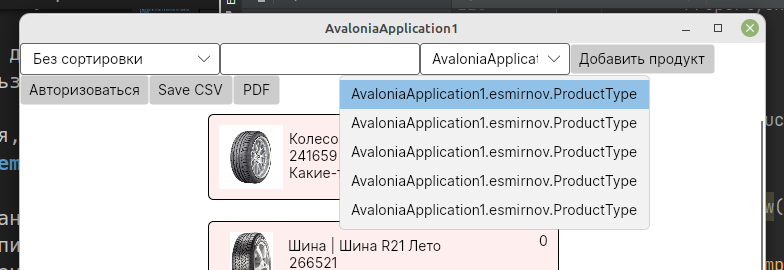

# Замечания по итогам и предисловие для следующих поколений

- лабораторные работы проводятся на локальном сервере колледжа (недоступны из дома);
- адрес сервера в локальной сети (**mysql**): `192.168.3.32`;
- адрес git-сервера (**gogs**): `192.168.3.32:3000`;

Лаборатроные работы проводятся по заданиям демо-экзаменов предыдущих лет с оценкой по критериям демо-экзамена.

## На что обратить внимание

1. Типы связей в диаграмме прецедентов стандартизованы (их всего 4). Не надо рисовать что попало. В задании не акцентировано, но диаграмма прецедентов делается для **всей** предметной области.

1. На сервере **mysql** кодировка баз по-умолчанию *latin*, перед созданием своих таблиц поменяйте на *utb8mb4* (либо при создании таблиц указывайте эту кодировку).

1. Часто встречается задача типа "продукт может иметь связанные продукты". Это классическая связь *многие-ко-многим*, т.е. у продукта может быть много связанных продуктов и у связанного продукта может быть много родителей (продуктов, к которым он привязан). Решается добавлением таблицы связей, внешние ключи которой (например, *parent_product_id* и *child_product_id*) ссылаются на одну и ту же таблицу продукции.

1. При клике кнопкой мыши на визуальный объект параметр *sender* в обработчике указывает на объект по которому кликнули. Если это элемент списка (**ListBox**), то можно явно приводить к нужному типу, а если просто кнопка ("массовая смена продукции", "удаление продукции" и т.п.), то для получения экземпляра объекта вы должны использовать не *sender*, а нужный объект (например, **ProductListBox**), причём сначала убедиться, что в списке есть выделенный элемент (**SelectedItem**).

1. У **ListBox**-а два очень похожих по названию свойства: *SelectedItem* (активный элемент списка) и _SelectedItem**s**_ (несколько активных элементов списка, если разрешен мультивыбор).

1. Учитесь работать с GIT: отладили кусок кода - сделали коммит. Если время вышло, а проект "не собирается", то просто откатываем изменения на последний рабочий коммит и его публикуем.

1. Выпадающие списки (**ComboBox**) и поля с автозаполнением (**AutoCompleteBox**). С ними может быть связано два типа проблем:

    * в выпадающем списке показывает не содержимое поля из базы, а название класса:

        

        Проблема в том, что компонент **ComboBox** рассчитан на показ списка **строк** и при выводе элемента другого типа использует метод *ToString*. Соответственно, исправить это просто - переопределить метод *ToString* в нашем классе:

        ```cs
        public override string ToString() {
            return Title;
        }
        ```

        У компонента **AutoCompleteBox** проблема та же, просто он показывает не весь список, а только те элементы, которые похожи на вводимую строку и тут накладывается и вторая проблема - сравнение объектов. 

    * если к такому списку "привязано" поле в форме редактирования, то не показывает текущее значение.

        Проблема в том, что напрямую в C# сравниваются только **скалярные** типы (целое, строка и т.п.). А при сравнении объектов используется метод *Equals*, который, по-умолчанию, сравнивает уникальные идентификаторы объектов.

        Решение то же - переопределить метод, в котором сравнивать идентификаторы (можно и названия, но сравнение целых работает быстрее):

        ```cs
        public override bool Equals(object obj)
        {
            return (obj != null) && 
               (obj is ProductType) && 
               (this.Id == (obj as ProductType).Id);
        }
        ```

    Выше был "правильный" вариант, но можно упростить задачу и в списке выводить строки. Для этого выбирать не целиком объект **ProductType**, а только его название:

    ```cs
    public List<string> productTypeStringList { get; set; }

    ...

    productTypeStringList = context.ProductTypes
        .Select(pt => pt.TitleType)
        .ToList();
    ```

    Вывод списка и поиск совпадений будет работать автоматически без дополнительных телодвижений. Но, естественно, есть и ложка дёгтя: когда мы захотим сохранить объект (например, **Product** из лекций) у нас не будет полной информации о типе продукции (мы же выбирали только названия, а поля `id` у нас нет). Придётся искать в словаре типов по названию.

1. Удаление записей, на которые есть ссылки из других таблиц (продукция, по которой были продажи; активности, которым назначено жюри)

    Прежде чем удалять основной объект, нужно удалить связанные объекты (конечно, если это допускается логикой задачи). Для массового удаления есть метод **RemoveRange**:

    ```cs
    context.ProductMaterials.RemoveRange(
        context.ProductMaterials.Where(pm => pm.ProductId == currentProduct.Id)
    );
    ```

    можно делать и через RAW запросы:

    ```cs
    context.Database
        .ExecuteSqlRaw($"DELETE FROM ProductMaterial WHERE ProductId={currentProduct.Id}");

    // также можно удалить и сам продукт
    context.Database
        .ExecuteSqlRaw($"DELETE FROM Product WHERE Id={currentProduct.Id}");
    ```

1. Достаточно часто видел ситуацию, когда в окне редактирования продукции пытаются привязать данные из словаря, но данных нет.

    Это может получиться потому, что на предыдущем окне при получении списка продукции не были получены связанные данные.

    **EntityFramework** сам за вас не думает, что вы ему сказали выбрать, то и получите:

    ```cs
    productList = context.Products
        .ToList();
    ```

    В этом варианте будет выбраны данные только из таблицы **Product**. Чтобы добавить данные в свойство *ProductType* (это виртуальное свойство, что означает, что данные находятся в связанной таблице), нужно добавит метод *Include*

    ```cs
    productList = context.Products
        .Include(p => p.ProductType)
        .ToList();
    ```

    Но злоупотреблять включениями не надо, если связанные данные не нужны на главном окне, то лучше их отдельным запросом подтянуть в окне редактирования. Для этого можно в конструктор окна редактирования передавать не объект целиком, а его `id`:

    ```cs
    currentProduct = context.Products
        .Where(p => p.Id == editProductId)
        .Include(p => p.ProductType)
        .SingleOrDefault();
    ```

1. Dapper

   Как показал опыт, **EntityFramework** очень громоздкий и не всегда понятный.

   Есть более легковесные альтернативы, например **Dapper**. Это микро-фреймворк, который тоже может результат SQL-запроса поместить в модель, но при этом модель мы должны "нарисовать" сами и знать SQL-синтаксис.

   * Установка

        Через **NuGet** или в консоли установить пакеты: **MySqlConnector** и **Dapper**

        ```
        dotnet add package MySqlConnector
        dotnet add package Dapper
        ```

    * В приложении прописать строку подключения (где-нибудь в глобальном статическом классе)

        ```cs
        static string connectionString = "Server=kolei.ru; User ID=esmirnov; Password=111103; Database=esmirnov";
        ```

    * Создать модели для нужных таблиц (мне лень все поля переписывать, смысл должен быть понятен).

        ```cs
        public class Product
        {
            public int ID { get; set; }
            public string Title { get; set; }
            
            public override string ToString() {
                return Title;
            }
        }
        ```

    * Чтение данных:

        ```cs
        public List<Product> productList { get; set; }

        ...

        using (MySqlConnection db = new MySqlConnection(connectionString))
        {
             productList = db.Query<Product>(
                "SELECT ID,Title FROM Product")
                .ToList();
        }
        ```

        То есть мы считываем данные сразу в список продукции. Обратите внимание, названия полей в БД должны соответствовать свойствам модели. В этом ничего страшного нет, названия полей можно поменять при выборке используя конструкцию `AS`, например: `SELECT id AS ID FROM Product`.

    * Получение одной записи (здесь и далее непроверенный код из гугла)

        ```cs
        db.Query<User>(
            "SELECT * FROM Users WHERE Id = @id", new { id })
            .FirstOrDefault();
        ```

        Тут видно, как выполнять запросы с параметрами, вторым параметром в методе **Query** передаётся объект с параметрами, которые заменяют одноименные литералы в тексте запроса.

        Естественно, в качестве такого объекта может быть экземпляр соответствующей модели (см. следующий запрос)

    * Добавление записи в таблицу (в этом и последующих запросах результат не нужен, поэтому используется метод **Execute**)

        ```cs
        db.Execute(
            "INSERT INTO Users (Name, Age) VALUES(@Name, @Age)", 
            user);
        ```

        Здесь данные для запроса беруться сразу из модели (*user* это экземпляр класса **User**)

    * Редактирование записи:

        ```cs
        db.Execute(
            "UPDATE Users SET Name = @Name, Age = @Age WHERE Id = @Id", 
            user);
        ```

    * Удаление записи:

        ```cs
        db.Execute(
            "DELETE FROM Users WHERE Id = @id", 
            new { id });
        ```

    **Итого:** с одной стороны нужно вручную создавать модели, с другой не нужно делать реконструирование при смене структуры и сам код более "прозрачный".

    Для того, чтобы получить связанные данные, достаточно добавить связанные поля в модель и выбрать их в запросе.

    Например, мы хотим в продукте получать сразу название **типа** продукции:

    ```cs
    // в модели добавляем свойство 
    public string TypeTitle { get; set; }

    // при запросе получаем его
    productList = db.Query<Product>(
            "SELECT p.ID, p.Title, pt.TitleType AS TypeTitle 
            FROM Product p, ProductType pt 
            WHERE p.ProductTypeID=pt.ID")
        .ToList();
    ```

    Получается, что у нас модель **Product** уже не совсем соответствует таблице, зато мы получаем все нужные данные одним запросом.