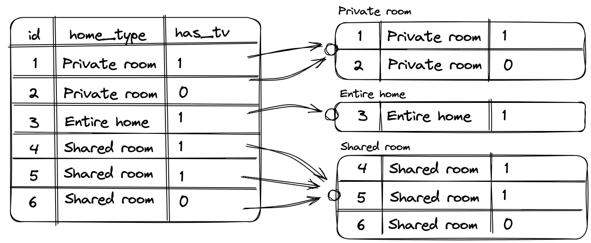
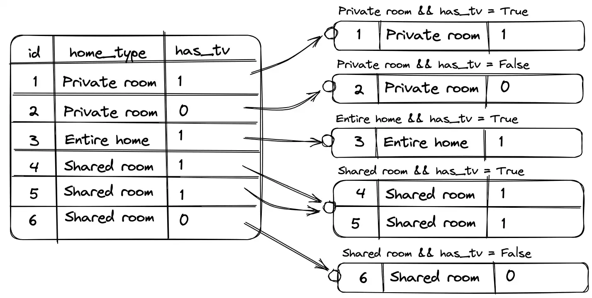
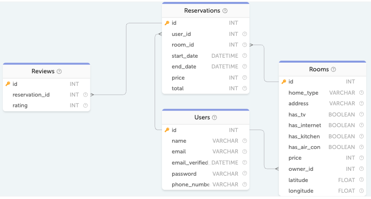
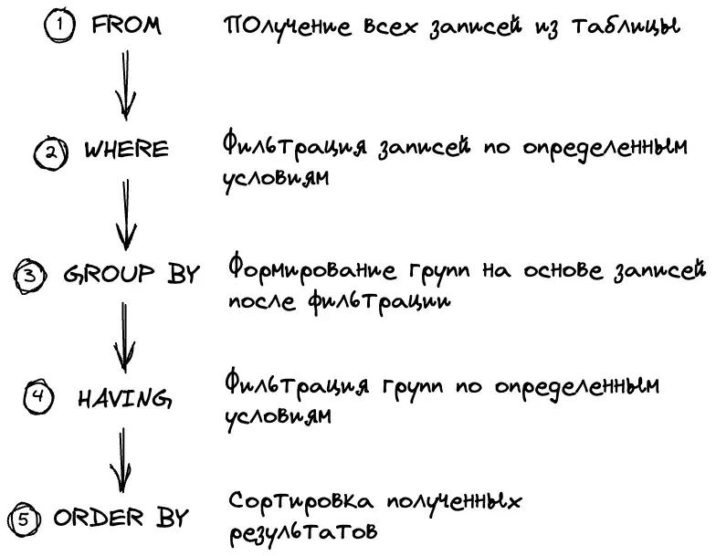
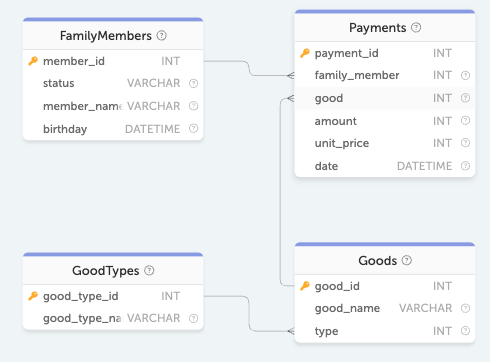
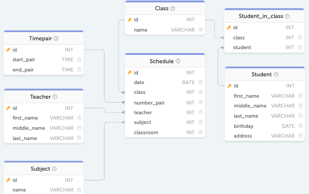

Предыдущая лекция | &nbsp; | Следующая лекция
:----------------:|:----------:|:----------------:
[Основы SQL](./sql_for_beginner.md) | [Содержание](../readme.md#проектирование-баз-данных) | [Создание ER-диаграммы](./5_1_1_1_erd_workbench.md)

#  Группировка, агрегатные функции, JOIN-ы

## Группировка, оператор GROUP BY

>Взято [отсюда](https://sql-academy.org/ru/guide/groupping)

Давайте выполним запрос:

```sql
SELECT id, home_type, has_tv, price 
FROM Rooms;
```

id  |	home_type   |	has_tv  |	price
:--:|---------------|:---------:|:-------:
1   |	Private room    |	1   |	149
2   |	Entire home/apt |	0   |	225
3   |   Private room    |	1   |	150
4   |	Entire home/apt |   1   |	89
5   |	Entire home/apt |	0   |	80

Так мы получили информацию по каждому сдаваемому жилому помещению. А что если мы хотим получить информацию не о каждой записи отдельно, а о группах, которые они образуют?

Например, такими группами могут выступать записи, разбитые по типу жилья:

* Shared room (аренда комнаты на несколько человек)
* Private room (аренда целой комнаты)
* Entire home/apt (аренда целой квартиры)

Эти группы включают разные записи в таблице и, соответственно, обладают разными характеристиками, которые нам могут быть весьма полезны.

Такой полезной информацией о группах может быть:

* средняя стоимость аренды комнаты или целого жилого помещения
* количество сдаваемых жилых помещений каждого типа

Для ответов на все эти и многие другие вопросы есть оператор `GROUP BY`.

### Общая структура запроса с GROUP BY

```sql
SELECT [литералы, агрегатные_функции, поля_группировки]
FROM имя_таблицы
GROUP BY поля_группировки;
```

Для того, чтобы записи у нас образовали группы по типу жилья, мы должны после `GROUP BY` указать `home_type`, т.е. поле, по которому будет происходить группировка.

```sql
SELECT home_type FROM Rooms
GROUP BY home_type
```

<table>
<th>home_type</th>
<tr><td>Private room</td></tr>
<tr><td>Entire home/apt</td></tr>
<tr><td>Shared room</td></tr>
</table>

>Следует иметь в виду, что для `GROUP BY` все значения `NULL` трактуются как равные, т.е. при группировке по полю, содержащему NULL-значения, все такие строки попадут в одну группу

При использовании оператора `GROUP BY` мы перешли от работы с отдельными записями на работу с образовавшимися группами. В связи с этим мы не можем просто вывести любое поле из записи (например, `has_tv` или `price`), как мы это могли делать раньше. Так как в каждой группе может быть несколько записей и в каждой из них в этом поле может быть разное значение.

При использовании `GROUP BY` мы можем выводить только:

* литералы, т.е. указанное явным образом фиксированные значения.

    Мы можем их выводить, так как это фиксированные значения, которые ни от чего не зависят.

    Например,

    ```sql
    SELECT home_type, 'literal' 
    FROM Rooms
    GROUP BY home_type
    ```

    home_type   |	literal
    ------------|-----------
    Private room    |	literal
    Entire home/apt |	literal
    Shared room |	literal

* результаты агрегатных функций, т.е. вычисленные значения на основании набора значений.

    Более детальную информацию об агрегатных функциях мы затронем ниже. Но для примера рассмотрим агрегатную функцию `AVG`.

    Функция `AVG` принимает в качестве аргумента название поля, по которому мы хотим вычислить среднее значение для каждой группы.

    ```sql
    SELECT 
        home_type, 
        AVG(price) as avg_price 
    FROM Rooms
    GROUP BY home_type
    ```

    home_type   |	avg_price
    ------------|-------------:
    Private room    |	89.4286
    Entire home/apt |	148.6667
    Shared room     |	40

    Так выполненный запрос сначала разбивает все записи из таблицы `Rooms` на три группы, опираясь на поле `home_type`. Далее, для каждой группы суммирует все значения, взятые из поля `price` у каждой записи, входящей в текущую группу, и затем полученный результат делится на количество записей в данной группе.

* поля группировки.

    Мы можем их выводить, так как в рамках одной группы поля, по которым осуществлялась группировка, одинаковые.

### Группировка по 2 и более полям

Мы уже рассмотрели как записи в таблице группируются по одному полю. Для дополнительной иллюстрации это выглядит примерно так, когда поле группировки `home_type`:



При группировке по двум и более полям принцип остается такой же, только теперь образовавшиеся группы дополнительно разбиваются на более мелкие группы в зависимости от второго поля группировки.

Пример группировки по `home_type` и `has_tv`:



## Агрегатные функции

Выше мы обсудили, что при использовании оператора `GROUP BY` мы можем использовать агрегатные функции. Давайте поговорим о них подробнее.

>Агрегатная функция – это функция, которая выполняет вычисление на наборе значений и возвращает одиночное значение.

Например, запрос с использованием агрегатной функции `AVG` может выглядеть так:

```sql
SELECT 
    home_type, 
    AVG(price) as avg_price 
FROM Rooms
GROUP BY home_type
```

home_type   |	avg_price
------------|------------:
Private room    |	89.4286
Entire home/apt |	148.6667
Shared room     |	40

### Описание агрегатных функций

* `SUM(поле_таблицы)` - Возвращает сумму значений
* `AVG(поле_таблицы)` - Возвращает среднее значение
* `COUNT(поле_таблицы | *)` - Возвращает количество записей
* `MIN(поле_таблицы)` - Возвращает минимальное значение
* `MAX(поле_таблицы)` - Возвращает максимальное значение
* `GROUP_CONCAT` - Возвращает строку, содержащую значения поля в группе, разделенные запятой (или другим разделителем)

    Полный синтаксис функции:

    ```
    GROUP_CONCAT (
        [DISTINCT] expr 
        [
            ORDER BY {col_name | expr} [ASC | DESC] 
            [,col_name | expr] ...
        ] 
        [SEPARATOR str_val]
    )
    ```

    ,где:

    - `DISTINCT expr` - выражение (поле или функция)
    - `ORDER BY` - не обязательная сортировка значений
    - `SEPARATOR <символ - разделитель значений>` - не обязательный разделитель (по-умолчанию запятая)

    Например:

    ```sql
    SELECT 
        age, 
        GROUP_CONCAT(name SEPARATOR '-') as name 
    FROM employees 
    GROUP BY age
    ```

    Вернет примерно такое:

    age | name
    ----|-------
    23	| user1-user2-user3
    24	| user4-user5
    25	| user6

>Агрегатные функции применяются для значений, не равных `NULL`. Исключением является функция `COUNT(*)` (она считает количество записей в группе).

### Примеры

<!-- TODO вставить большую картинку -->

* Найдём количество каждого вида жилья и отсортируем полученный список по убыванию:

    ```sql
    SELECT 
        home_type, 
        COUNT(*) as amount 
    FROM Rooms
    GROUP BY home_type
    ORDER BY amount DESC
    ```

    home_type   |	amount
    ------------|---:
    Private room    |	28
    Entire home/apt |	21
    Shared room     |	1

* Для каждого жилого помещения найдём самую позднюю дату выезда (поле `end_date`)

    ```sql
    SELECT 
        room_id, 
        MAX(end_date) AS last_end_date 
    FROM Reservations
    GROUP BY room_id
    ```

    room_id |	last_end_date
    :------:|---
    1   |	2019-02-04T12:00:00.000Z
    2   |	2020-03-23T09:00:00.000Z
    13  |	2020-04-21T10:00:00.000Z
    16  |	2019-06-24T10:00:00.000Z


## Оператор HAVING

Мы уже рассматривали запрос получения средней стоимости аренды жилых помещений в зависимости от типа жилья:



```sql
SELECT 
    home_type, 
    AVG(price) as avg_price 
FROM Rooms
GROUP BY home_type
```

home_type   |	avg_price
------------|------------:
Private room    |	89.4286
Entire home/apt |	148.6667
Shared room     |	40

Давайте доработаем этот запрос таким образом, чтобы в итоговой выборке отображались только те группы, чья средняя стоимость больше `50`.

Обладая предыдущим опытом, есть большой соблазн попытаться использовать для этих целей оператор `WHERE`. Но при попытке выполнить такой запрос СУБД неминуемо выдаст ошибку, указав, что мы некорректно используем синтаксис `WHERE avg_price > 50`.

```sql
SELECT 
    home_type, 
    AVG(price) as avg_price 
FROM Rooms
GROUP BY home_type
WHERE avg_price > 50
```

Говоря наперёд, для фильтрации групп мы должны использовать оператор `HAVING` (который применяется к готовой выборке):

```sql
SELECT 
    home_type, 
    AVG(price) as avg_price 
FROM Rooms
GROUP BY home_type
HAVING avg_price > 50
```

home_type   |	avg_price
------------|---:
Private room    |	89.4286
Entire home/apt |	148.6667

### Порядок выполнения SQL запроса

Но почему же мы не могли использовать WHERE, и зачем нужен отдельный оператор для этой цели? Все дело в порядке выполнения SQL запроса.



Наш первый запрос был неверный, потому что мы пытались использовать поле `avg_price` у образовавшихся групп ещё до их образования, так как выполнение оператора `WHERE` предшествует группировке.

То есть оператор `WHERE` в момент его исполнения ничего не знает о последующей группировке, он работает только с записями из таблицы. Так мы, например, с его помощью можем отфильтровать записи таблицы `Rooms` по цене до применения группировки и лишь затем вычислить среднюю стоимость групп оставшегося жилья:

```sql
SELECT 
    home_type, 
    AVG(price) as avg_price 
FROM Rooms
WHERE price > 50
GROUP BY home_type
```

home_type   |	avg_price
------------|---:
Private room    |	96.875
Entire home/apt |	148.6667

>Но, если присмотреться к результату, то видно, что средняя цена получилась завышенной. И это очевидно, так как мы просто выкинули низкие цены.

### Пример использования HAVING

Для примера давайте получим минимальную стоимость каждого типа жилья c телевизором. При этом нас интересуют только типы жилья, содержащие как минимум пять жилых помещений, относящихся к ним.

Чтобы получить такой результат, мы должны:

* Сначала получить все данные из таблицы

    ```sql
    SELECT ... FROM Rooms;
    ```

* Затем выбрать из всех записей таблицы `Room` только интересующие нас, т.е. только жильё с телевизором

    ```sql
    SELECT ... FROM Rooms
    WHERE has_tv = True
    ```

* Затем сгруппировать данные записи о жилых помещениях по их типу

    ```sql
    SELECT ... FROM Rooms
    WHERE has_tv = True
    GROUP BY home_type
    ```

* После этого отфильтровать полученные группы по условию. Нас интересуют группы, имеющие как минимум 5 представителей

    ```sql
    SELECT ... FROM Rooms
    WHERE has_tv = True
    GROUP BY home_type
    HAVING COUNT(*) >= 5
    ```

* И под конец посмотреть, что нас просят в задании и, соответственно, добавить вывод необходимой информации. В нашем случае, нам необходимо вывести название типа жилья и его минимальную стоимость.

    ```sql
    SELECT 
        home_type, 
        MIN(price) as min_price 
    FROM Rooms
    WHERE has_tv = True
    GROUP BY home_type
    HAVING COUNT(*) >= 5;
    ```

## Многотабличные запросы, JOIN

### Многотабличные запросы

В предыдущих статьях описывалась работа только с одной таблицей базы данных. В реальности же очень часто приходится делать выборку из нескольких таблиц, каким-то образом объединяя их. В данной статье вы узнаете основные способы соединения таблиц.

Например, если мы хотим получить информацию о тратах на покупки, мы можем её получить следующим образом:

```sql
SELECT 
    family_member, 
    amount * unit_price AS price 
FROM Payments
```

family_member   |	price
:---:|---:
1   |	2000
2   |	2100
3   |	100
4   |	350

В поле `family_member` полученной выборки отображаются идентификаторы записей из таблицы `Payments`, но для нас они мало что значат.

Вместо этих идентификаторов было бы гораздо нагляднее выводить имена тех, кто покупал (поле `member_name` из таблицы `FamilyMember`). Ровно для этого и существует объединение таблиц и оператор `JOIN`.



### Общая структура многотабличного запроса

```sql
SELECT поля_таблиц
FROM таблица_1
[INNER] | [[LEFT | RIGHT | FULL][OUTER]] JOIN таблица_2
    ON условие_соединения
[[INNER] | [[LEFT | RIGHT | FULL][OUTER]] JOIN таблица_n
    ON условие_соединения]
```

Как можно увидеть по структуре, соединение бывает:

* внутренним `INNER` (по умолчанию)
* внешним `OUTER`, при этом внешнее соединение делится на левое `LEFT`, правое `RIGHT` и полное `FULL`

С более подробными деталями, чем отличается внутреннее соединение от внешнего и как они работают, мы познакомимся в следующих статьях.

Пока нам достаточно лишь знать, что для вышеописанного примера с запросом на покупки нам понадобится именно запрос с внутренним соединением, который будет выглядеть следующим образом:

```sql
SELECT 
    family_member, 
    member_name, 
    amount * unit_price AS price 
FROM Payments
JOIN FamilyMembers
    ON Payments.family_member = FamilyMembers.member_id
```

family_member   |	member_name |	price
:---:|---|---:
1   |	Headley Quincey |	2000
2   |	Flavia Quincey  |	2100
3   |	Andie Quincey   |	100
4   |	Lela Quincey    |	350

В данном запросе мы сопоставляем записи из таблицы `Payments` и записи из таблицы `FamilyMembers`.

Чтобы сопоставление работало, мы указываем как именно записи из двух разных таблиц должны находить друг друга. Это условие указывается после `ON`:

```sql
ON Payments.family_member = FamilyMembers.member_id
```

В нашем случае поле `family_member` указывает на идентификатор в таблице `FamilyMembers` и таким образом помогает однозначному сопоставлению.

>В большинстве случаев условием соединения является равенство столбцов таблиц (таблица_1.поле = таблица_2.поле), однако точно так же можно использовать и другие операторы сравнения.

### Вывод всех столбцов из таблицы в многотабличном запросе

Ранее, когда все запросы выполнялись на одной таблице, было достаточно указать символ `*`, чтобы вывести все поля из этой таблицы. Теперь же, когда таблиц может быть несколько, `*` будет означать "вывести все столбцы из таблиц, перечисленных в выражении `FROM`".

В некоторых случаях нам может понадобиться вывести столбцы, принадлежащие только какой-то конкретной таблице. Например, дано соединение таблиц `Payments` и `FamilyMembers`, и в итоговую выборку необходимо вывести только поля из таблицы `FamilyMembers`. Как это сделать? Всё очень просто! Необходимо перед символом `*` добавить название таблицы:

```sql
SELECT FamilyMembers.* 
FROM Payments
JOIN FamilyMembers
    ON Payments.family_member = FamilyMembers.member_id
```

Таким же образом можно вывести все столбцы из нескольких таблиц:

```sql
SELECT Payments.*, FamilyMembers.* 
FROM Payments
JOIN FamilyMembers
    ON Payments.family_member = FamilyMembers.member_id
```

>В данном случае вместо `Payments.*`, `FamilyMembers.*` можно использовать `*`, т.к. в `FROM` перечислены только эти две таблицы. Вывод будет одинаков в обоих случаях.

А что, если нужно вывести **несколько столбцов из одной таблицы и все из другой**? Это тоже возможно! Выведем поля `payment_id` и `family_member` из `Payments`, а также все поля из `FamilyMembers`:

```sql
SELECT 
    payment_id, 
    family_member, 
    FamilyMembers.* 
FROM Payments
JOIN FamilyMembers
    ON Payments.family_member = FamilyMembers.member_id
```

### Псевдонимы для таблиц

При работе с большими многотабличными запросами рекомендуется использовать псевдонимы (алиасы) для таблиц. Это не только улучшает читаемость кода, но и помогает избежать ошибок в сложных запросах.

Псевдонимы задаются после имени таблицы с помощью ключевого слова `AS`:

```sql
SELECT id, name
FROM Passenger AS pass
```

Теперь обращаться к столбцам таблицы можно через псевдоним:

```sql
SELECT pass.id, pass.name
FROM Passenger AS pass
```

>Ключевое слово AS является не обязательным, как и у псевдонимов столбцов.

Рассмотрим пример запроса с несколькими таблицами. Допустим, нам нужно вывести идентификаторы и имена пассажиров, которые хотя бы раз совершали перелёт:

```sql
SELECT
    pass.id,
    pass.name
FROM Passenger AS pass
JOIN Pass_in_trip AS pit
    ON pit.passenger = pass.id
```

В этом примере таблицам `Passenger` и `Pass_in_trip` присваиваются псевдонимы `pass` и `pit`, соответственно, а дальше используются для вывода столбцов из этих таблиц. Обратите внимание, что в обеих таблицах есть поле с одинаковым названием – `id`. Если вы не укажете из какой таблицы его нужно брать, то СУБД сделает это за вас и отдаст значение из последней таблицы в цепочке `JOIN`. В данном случае это `Pass_in_trip`.

При использовании псевдонимов всегда руководствуйтесь следующими простыми правилами, и тогда ваши запросы будут лаконичными и понятными:

* Используйте логичные сокращения (например, первые буквы названия таблицы)
* Избегайте слишком коротких (однобуквенных) или неочевидных псевдонимов

## Внешнее соединение OUTER JOIN

Внешнее соединение может быть трёх типов: левое (`LEFT`), правое (`RIGHT`) и полное (`FULL`) (MySQL не поддерживает полное соединение).

Главным отличием внешнего соединения от внутреннего является то, что оно обязательно возвращает все строки одной (`LEFT`, `RIGHT`) или двух таблиц (`FULL`).

### Внешнее левое соединение (LEFT OUTER JOIN)

Соединение, которое возвращает все значения из левой таблицы, соединённые с соответствующими значениями из правой таблицы, если они удовлетворяют условию соединения, или заменяет их на `NULL` в обратном случае.

Для примера получим из базы данных расписание звонков, объединённых с соответствующими занятиями в расписании занятий.



Данные в таблице Timepair (расписание звонков):

id  |	start_pair  |	end_pair
:---:|----|---
1   |	08:30:00    |	09:15:00
2   |	09:20:00    |	10:05:00
3   |	10:15:00    |	11:00:00

Данные в таблице Schedule (расписание занятий):

id  |	date    |	class   |	number_pair |	teacher |	subject |	classroom
:---:|---|:---:|:-:|:-:|:-:|:-:
1   |	2019-09-01T00:00:00.000Z    |	9   |	1   |	11  |	1   |	47
2   |	2019-09-01T00:00:00.000Z    |	9   |	2   |	8   |	2   |	13
3   |	2019-09-01T00:00:00.000Z    |	9   |	3   |	4   |	3   |	13
4   |	2019-09-02T00:00:00.000Z    |	9   |	1   |	4   |	3   |	13

```sql
SELECT 
    Timepair.id 'timepair.id', 
    start_pair, 
    end_pair,
    Schedule.id 'schedule.id', 
    date, 
    class, 
    number_pair, 
    teacher, 
    subject, 
    classroom
FROM Timepair
LEFT JOIN Schedule 
    ON Schedule.number_pair = Timepair.id;
```

timepair.id | start_pair | end_pair | schedule.id | date | class | number_pair | teacher | subject | classroom
:-:|--|--|:-:|--|:-:|:-:|:-:|:-:|:-:
1 | 08:30:00 | 09:15:00 | 35 | 2019-09-04T00:00:00.000Z | 8 | 1 | 1 | 11 | 4
1 | 08:30:00 | 09:15:00 | 32 | 2019-09-03T00:00:00.000Z | 8 | 1 | 10 | 10 | 40
1 | 08:30:00 | 09:15:00 | 21 | 2019-08-30T00:00:00.000Z | 8 | 1 | 7 | 9 | 53
6 | 13:40:00 | 14:25:00 | `<NULL>` | `<NULL>` | `<NULL>` | `<NULL>` | `<NULL>` | `<NULL>` | `<NULL>`

В выборку попали все строки из левой таблицы, дополненные данными о занятиях. Примечательно, что в конце таблицы есть строки с полями, заполненными `NULL`. Это те строки, для которых не нашлось соответствующих занятий, однако они присутствуют в левой таблице, поэтому тоже были выведены.

### Внешнее правое соединение (RIGHT OUTER JOIN)

Соединение, которое возвращает все значения из правой таблицы, соединённые с соответствующими значениями из левой таблицы, если они удовлетворяют условию соединения, или заменяет их на `NULL` в обратном случае.

### Эмуляция полного соединения в MySQL

Поскольку MySQL не поддерживает `FULL OUTER JOIN`, его можно эмулировать с помощью `UNION ALL`:

```sql
SELECT *
FROM левая_таблица
LEFT JOIN правая_таблица
   ON правая_таблица.ключ = левая_таблица.ключ

UNION ALL

SELECT *
FROM левая_таблица
RIGHT JOIN правая_таблица
ON правая_таблица.ключ = левая_таблица.ключ
 WHERE левая_таблица.ключ IS NULL
```

---

# Задание на дом

Найти и решить по 5 задач на SQL-академии с группировками и JOIN-ами

Предыдущая лекция | &nbsp; | Следующая лекция
:----------------:|:----------:|:----------------:
[Основы SQL](./sql_for_beginner.md) | [Содержание](../readme.md#проектирование-баз-данных) | [Создание ER-диаграммы](./5_1_1_1_erd_workbench.md)