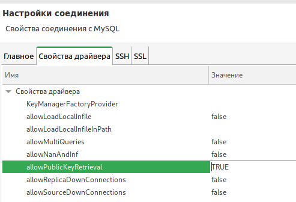
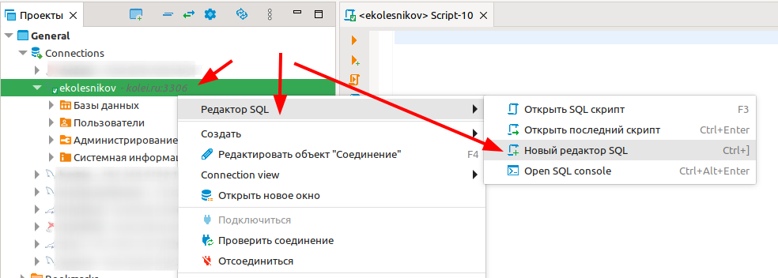

# Подключение к СУБД. Создание скрипта создания БД.

## Подключение к СУБД (Используя dBeaver)

**dBeaver** - кроссплатформенный бесплатный менеджер баз данных (список поддерживаемых БД большой, есть и *MySQL* и *MSSQL*)

### Создание подключения

В списке проектов открываем пункт **General** и в контекстном меню пункта **Connections** выбираем **Создать -> Соединение**

В открывшемся окне выберите тип соедиения (используемую БД)

У меня на сервере установлена `mysql  Ver 14.14 Distrib 5.7.39, for Linux (x86_64)`, поэтому выбираем MySQL. Если у вас другой тип БД, то выбираете соответсвующий.

В настройках соединения указываем доменное имя (**kolei.ru**) или IP сервера, название базы данных (не обязательно), имя пользователя (выдаст преподаватель или сами знаете какие в вашей БД) и пароль (необязательно, но тогда придётся вводить при каждом подключении).

>Имя пользователя  = `первая буква имени` + `фамилия`, т.е. для "Евгений Колесников" получится `ekolesnikov` (могут быть исключения)
>Пароль = ДДММГГ вашего дня рождения. Например, для 18 сентября 2023 года получится `180923`

Затем нажимаете **тест соединения** и, если всё введено правильно, и соединение устанавливается то жмёте **Готово**

В списке соединений появится созданое соединение, название состоит из имени базы и имени сервера и имеющиеся базы данных (у вас пока список БД будет пустой).

Если при **тесте соединения** выдаст ошибку "Public Key Retrieval is not allowed", то во вкладке "свойства драйвера" установите значение свойства **allowPublicKeyRetrieval** в **true**

### Создание базы данных

Откройте новый редактор SQL для своего подключения: в контекстном меню подключения выберите *Редактор SQl -> Новый редактор SQL*

В созданном окне введите DDL срипт, сгенерированный из вашей ER-модели в программе MySQL Workbench

## Создание DDL-скрипта по ER-модели

В меню программы MySQL Workbench выберите раздел "Файл - Экспорт - Forward Engineer SQL CREATE Script..."

В настройках экспорта поставьте галочку у параметра "Omit shema qualifier in object names" (по умолчанию в скрипте к каждой таблице дописывается название модели, этот параметр убирает название модели)

Полученный скрипт скопируйте и вставьте в редактор SQL из предыдущего раздела и выполните его. Проверьте логи, там не должно быть ошибок.

>Можно из MySQL Workbench напрямую писать в БД, для этого выполните команду "Database - Forward Engineer"

## Задание

В репозиторий добавьте текст DDL-скрипта

