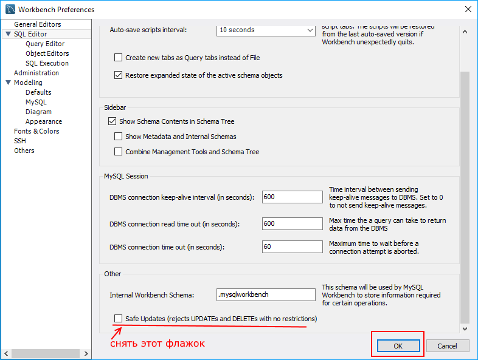
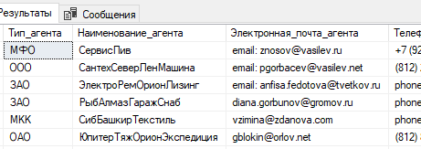
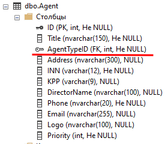
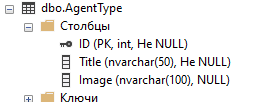

<table style="width: 100%;"><tr><td style="width: 40%;">
<a href="../articles/5_1_1_1_erd_workbench.md">Создание ER-диаграммы в среде MySQL Workbench
</a></td><td style="width: 20%;">
<a href="../readme.md">Содержание
</a></td><td style="width: 40%;">
<a href="../articles/sql_import.md">Создание базы данных. Импорт данных.
</a></td><tr></table>

# Основы SQL (синтаксис MySQL)

<!-- добавтить count и функции работы со временем (between) -->

**Structured Query Language (SQL)** — язык структурированных запросов, с помощью него пишутся специальные запросы (SQL инструкции) к базе данных с целью получения этих данных из базы и для манипулирования этими данными.

С точки зрения реализации язык SQL представляет собой набор операторов, которые делятся на определенные группы и у каждой группы есть свое назначение. В сокращенном виде эти группы называются **DDL**, **DML**, **DCL** и **TCL**:

* **Data Definition Language (DDL)** – это группа операторов **определения** данных. Другими словами, с помощью операторов, входящих в эту группы, мы определяем структуру базы данных и работаем с объектами этой базы, т.е. создаем, изменяем и удаляем их.

    В эту группу входят следующие операторы:

    * **CREATE** – используется для создания объектов базы данных;
    * **ALTER** – используется для изменения объектов базы данных;
    * **DROP** – используется для удаления объектов базы данных.

* **Data Manipulation Language (DML)** – это группа операторов для манипуляции данными. С помощью этих операторов мы можем добавлять, изменять, удалять и выгружать данные из базы, т.е. манипулировать ими.

    В эту группу входят самые распространённые операторы языка SQL:

    * **SELECT** – осуществляет выборку данных;
    * **INSERT** – добавляет новые данные;
    * **UPDATE** – изменяет существующие данные;
    * **DELETE** – удаляет данные.

* **Data Control Language (DCL)** – группа операторов определения доступа к данным. Иными словами, это операторы для управления разрешениями, с помощью них мы можем разрешать или запрещать выполнение определенных операций над объектами базы данных.

* **Transaction Control Language (TCL)** – группа операторов для управления транзакциями. Транзакция – это команда или блок команд (инструкций), которые успешно завершаются как единое целое, при этом в базе данных все внесенные изменения фиксируются на постоянной основе или отменяются, т.е. все изменения, внесенные любой командой, входящей в транзакцию, будут отменены.

## Базовый синтаксис SQL команды SELECT

Одна из основных функций SQL — получение данных из СУБД. Для построения всевозможных запросов к базе данных используется оператор **SELECT**. Он позволяет выполнять сложные проверки и обработку данных.

Общая структура запроса:

```sql
SELECT [DISTINCT | ALL] поля_таблиц 
    [FROM список_таблиц] 
    [WHERE условия_на_ограничения_строк]
    [GROUP BY условия_группировки]
    [HAVING условия_на_ограничения_строк_после_группировки]
    [ORDER BY порядок_сортировки [ASC | DESC]]
    [LIMIT ограничение_количества_записей]
```

В описанной структуре запроса необязательные параметры указаны в квадратных скобках.

Параметры оператора

* **DISTINCT** используется для исключения повторяющихся строк из результата
* **ALL** (по умолчанию) используется для получения всех данных, в том числе и повторений
* **FROM** перечисляет используемые в запросе таблицы из базы данных
* **WHERE** — это условный оператор, который используется для ограничения строк по какому-либо условию
* **GROUP BY** используется для группировки строк
* **HAVING** применяется после группировки строк для фильтрации по значениям агрегатных функций
* **ORDER BY** используется для сортировки. У него есть два параметра:
* **ASC** (по умолчанию) используется для сортировки по возрастанию
* **DESC** — по убыванию
* **LIMIT** используется для ограничения количества строк для вывода

### SQL-псевдонимы

Псевдонимы используются для представления столбцов или таблиц с именем отличным от оригинального. Это может быть полезно для улучшения читабельности имён и создания более короткого наименования столбца или таблицы.

Например, если в вашей таблице есть столбец **goodTypeId**, вы можете переименовать его просто в **id**, для того, чтобы сделать его более коротким и удобным в использовании в будущем.

Для создания псевдонимов используется оператор AS:

```sql
SELECT 
    goodTypeId AS id 
FROM 
    GoodTypes;
```

### Примеры использования

Вы можете выводить любые строки и числа (литералы) вместо столбцов:

```sql
SELECT 
    "Hello world", 1;
```

Для того, чтобы вывести **все данные** из таблицы **Company**, вы можете использовать символ «*», который буквально означает «все столбцы»:

```sql
SELECT 
    * 
FROM 
    Company;
```

Вы можете вывести любой столбец, определённый в таблице, например, townTo из таблицы Trip:

```sql
SELECT 
    townTo 
FROM 
    Trip;
```

Также вы можете вывести несколько столбцов. Для этого их нужно перечислить через запятую:

```sql
SELECT 
    memberName, `status`
FROM 
    FamilyMembers;
```

>Поле **status** подсвечивается как зарезервированное слово SQL - экранируем его обратными кавычками.

### Distinct - выбор уникальных значений

Иногда возникают ситуации, в которых нужно получить только уникальные записи. Для этого вы можете использовать **DISTINCT**. Например, выведем список городов без повторений, в которые летали самолеты:

```sql
SELECT 
    DISTINCT townTo 
FROM 
    Trip;
```

Эта конструкция используется для формирования словарей, примеры рассмотрим в главе про команду **INSERT**

### Условный оператор WHERE

Ситуация, когда требуется сделать выборку по определенному условию, встречается очень часто. Для этого в операторе **SELECT** существует параметр **WHERE**, после которого следует условие для ограничения строк. Если запись удовлетворяет этому условию, то попадает в результат, иначе отбрасывается.

Общая структура запроса с оператором WHERE

```sql
SELECT поля_таблиц 
    FROM список_таблиц 
    WHERE условия_на_ограничения_строк
        [логический_оператор другое_условия_на_ограничения_строк];
```

В описанной структуре запроса необязательные параметры указаны в квадратных скобках.

В условном операторе применяются операторы сравнения, специальные и логические операторы.

#### Операторы сравнения

Операторы сравнения служат для сравнения 2 выражений, их результатом может являться **ИСТИНА (1)**, **ЛОЖЬ (0)** и **NULL**.

>Результат сравнения с NULL является NULL. Исключением является оператор эквивалентности.

Оператор | Описание
:--:|---
`=` | Оператор равенство
`<=>` | Оператор эквивалентность<br/>Аналогичный оператору равенства, с одним лишь исключением: в отличие от него, оператор эквивалентности вернет ИСТИНУ при сравнении NULL `<=>` NULL
`<>`<br/>или<br/>`!=` | Оператор неравенство
`<` | Оператор меньше
`<=` | Оператор меньше или равно
`>` | Оператор больше
`>=` | Оператор больше или равно

#### Специальные операторы

1. `IS [NOT] NULL` — позволяет узнать равно (не равно) ли проверяемое значение NULL.

    Для примера выведем всех членов семьи, у которых статус в семье не равен NULL:

    ```sql
    SELECT 
        * 
    FROM 
        FamilyMembers
    WHERE 
        `status` IS NOT NULL;
    ```

2. `[NOT] BETWEEN min AND max` — позволяет узнать расположено ли проверяемое значение столбца в интервале между **min** и **max**.

    Выведем все данные о покупках с ценой от 100 до 500 рублей из таблицы Payments:

    ```sql
    SELECT 
        * 
    FROM 
        Payments
    WHERE 
        unitPrice BETWEEN 100 AND 500;
    ```

3. `[NOT] IN` — позволяет узнать входит (не входит) ли проверяемое значение столбца в список определённых значений.

    Выведем имена членов семьи, чей статус равен «father» или «mother»:

    ```sql
    SELECT 
        memberName 
    FROM 
        FamilyMembers
    WHERE 
        `status` IN ('father', 'mother');
    ```

4. `[NOT] LIKE шаблон [ESCAPE символ]` — позволяет узнать соответствует ли строка определённому шаблону. **ESCAPE символ** - это так называемый трафаретный символ, вместо которого может быть что один (`_`) или несколько (`%`) любых символов.

    Например, выведем всех людей с фамилией «Quincey»:

    ```sql
    SELECT 
        memberName 
    FROM 
        FamilyMembers
    WHERE 
        memberName LIKE '% Quincey';
    ```

#### Трафаретные символы

В шаблоне разрешается использовать два трафаретных символа:

* символ подчеркивания (`_`), который можно применять вместо любого единичного символа в проверяемом значении
* символ процента (`%`) заменяет последовательность любых символов (число символов в последовательности может быть от 0 и более) в проверяемом значении.

Шаблон | Описание
:--:|--
never`%` | Сопоставляется любым строкам, начинающимся на «never».
`%`ing | Сопоставляется любым строкам, заканчивающимся на «ing».
`_`ing | Сопоставляется строкам, имеющим длину 4 символа, при этом 3 последних обязательно должны быть «ing». Например, слова «sing» и «wing».

#### ESCAPE-символ

ESCAPE-символ используется для экранирования трафаретных символов. В случае если вам нужно найти строки, содержащие проценты (а процент — это зарезервированный символ), вы можете использовать ESCAPE-символ.

Например, вы хотите получить идентификаторы задач, прогресс которых равен `3%`:

```sql
SELECT 
    jobId 
FROM 
    Jobs
WHERE 
    progress LIKE '3!%' 
ESCAPE '!';
```

Если бы мы не экранировали трафаретный символ, то в выборку попало бы всё, что начинается на 3.

#### Логические операторы

Логические операторы необходимы для связывания нескольких условий ограничения строк.

* Оператор NOT — меняет значение специального оператора на противоположный
* Оператор OR — общее значение выражения истинно, если хотя бы одно из них истинно
* Оператор AND — общее значение выражения истинно, если они оба истинны
* Оператор XOR — общее значение выражения истинно, если один и только один аргумент является истинным

Выведем все полёты, которые были совершены на самолёте «Boeing», но, при этом, вылет был не из Лондона:

```sql
SELECT 
    * 
FROM 
    Trip
WHERE 
    plane = 'Boeing' AND NOT townFrom = 'London';
```

### Выборка сводных данных (из двух и более таблиц)

При формировании сводной выборки данные беруться из нескольких таблиц. В операторе **FROM** исходные таблицы перечисляются через запятую. Также им могут быть присвоены алиасы. Синтаксис запроса выглядит следующийм образом:

```sql
SELECT 
    [ALIAS | TABLE].Название_поля1, [ALIAS | TABLE].Название_поля2,...
FROM
    Table1 [ALIAS],
    Table2 [ALIAS]
...    
```

При выборке сводных таблиц нужно учитывать, что исходные таблицы перемножаются. Т.е. если на входе у нас были таблицы:

id | name
:-:|--
1 | Иванов
2 | Петров

id | name | phone
:-:|------|-----
1 | Иванов | 322223
2 | Петров | 111111

То при простом запросе без условий

```sql
SELECT a.*, b.*
FROM 
    Table1 a, Table2 b
```

Получим примерно следующее:

id | name  | id2 | name2  | phone
:-:|-------|:---:|--------|------
1  | Иванов| 1   | Иванов | 322223
1  | Иванов| 2   | Петров | 111111
2  | Петров| 1   | Иванов | 322223
2  | Петров| 2   | Петров | 111111

Чтобы выбрать уникальные значения, нам нужно использовать оператор **WHERE** для связи этих таблиц

```sql
SELECT a.*, b.phone
FROM 
    Table1 a, Table2 b
WHERE
    a.name=b.name    
```

id | name  | phone
:-:|-------|------
1  | Иванов| 322223
2  | Петров| 111111

>Сводные выборки нам понадобятся при импорте данных в базу. Сначала вы выделяете из таблиц импорта словари. А потом из таблиц импорта и словарей формируете запрос `INSERT ... SELECT` для записи данных в основную таблицу.

### Вложенные SQL запросы

Вложенный запрос — это запрос на выборку, который используется внутри инструкции SELECT, INSERT, UPDATE или DELETE или внутри другого вложенного запроса. Подзапрос может быть использован везде, где разрешены выражения.

Пример структуры вложенного запроса

```sql
SELECT поля_таблиц 
    FROM список_таблиц 
    WHERE конкретное_поле IN (
        SELECT поле_таблицы FROM таблица
    )
```

Здесь, `SELECT поля_таблиц FROM список_таблиц WHERE конкретное_поле IN (...)` — внешний запрос, а `SELECT поле_таблицы FROM таблица` — вложенный (внутренний) запрос.

Каждый вложенный запрос, в свою очередь, может содержать один или несколько вложенных запросов. Количество вложенных запросов в инструкции не ограничено.

Подзапрос может содержать все стандартные инструкции, разрешённые для использования в обычном SQL-запросе: DISTINCT, GROUP BY, LIMIT, ORDER BY, объединения таблиц, запросов и т.д.

Подзапрос может возвращать скаляр (одно значение), одну строку, один столбец или таблицу (одну или несколько строк из одного или нескольких столбцов). Они называются скалярными, столбцовыми, строковыми и табличными подзапросами.

#### Подзапрос как скалярный операнд

Скалярный подзапрос — запрос, возвращающий единственное скалярное значение (строку, число и т.д.).

Следующий простейший запрос демонстрирует вывод единственного значения (названия компании). В таком виде он не имеет большого смысла, однако ваши запросы могут быть намного сложнее.

```sql
SELECT (
    SELECT 
        name 
    FROM 
        company 
    LIMIT 1
);
```

Таким же образом можно использовать скалярные подзапросы для фильтрации строк с помощью WHERE, используя операторы сравнения.

```sql
SELECT 
    * 
FROM 
    FamilyMembers 
WHERE 
    birthDay = (
        SELECT 
            MAX(birthDay) 
        FROM 
            FamilyMembers
    );
```

С помощью данного запроса возможно получить самого старшего члена семьи. Здесь используется подзапрос для получения максимальной даты рождения, которая затем используется для фильтрации строк.

#### Подзапросы с ANY, IN, ALL

**ANY** — ключевое слово, которое должно следовать за операцией сравнения (>, <, <>, = и т.д.), возвращающее TRUE, если хотя бы одно из значений столбца подзапроса удовлетворяет обозначенному условию.

```sql
SELECT поля_таблицы_1 
    FROM таблица_1 
    WHERE поле_таблицы_1 <= ANY (SELECT поле_таблицы_2 FROM таблица_2);
```

**ALL** — ключевое слово, которое должно следовать за операцией сравнения, возвращающее TRUE, если все значения столбца подзапроса удовлетворяет обозначенному условию.

```sql
SELECT поля_таблицы_1 
    FROM таблица_1 
    WHERE поле_таблицы_1 > ALL (SELECT поле_таблицы_2 FROM таблица_2);
```

**IN** — ключевое слово, являющееся псевдонимом ключевому слову **ANY** с оператором сравнения = (эквивалентность), либо <> ALL для NOT IN. Например, следующие запросы равнозначны:

```sql
...
WHERE поле_таблицы_1 = ANY (SELECT поле_таблицы_2 FROM таблица_2);
```

```sql
...
WHERE поле_таблицы_1 IN (SELECT поле_таблицы_2 FROM таблица_2);
```

#### Строковые подзапросы

Строковый подзапрос — это подзапрос, возвращающий единственную строку с более чем одной колонкой. Например, следующий запрос получает в подзапросе единственную строку, после чего по порядку попарно сравнивает полученные значения со значениями во внешнем запросе.

```sql
SELECT поля_таблицы_1 
    FROM таблица_1
    WHERE (первое_поле_таблицы_1, второе_поле_таблицы_1) = 
    (
        SELECT первое_поле_таблицы_2, второе_поле_таблицы_2 
        FROM таблица_2 
        WHERE id = 10
    );
```

Данную конструкцию удобно использовать для замены логических операторов. Так, следующие два запроса полностью эквивалентны:

```sql
SELECT поля_таблицы_1 
    FROM таблица_1 
    WHERE (первое_поле_таблицы_1, второе_поле_таблицы_1) = (1, 1);

SELECT поля_таблицы_1 
    FROM таблица_1 
    WHERE первое_поле_таблицы_1 = 1 AND второе_поле_таблицы_1 = 1;
```

#### Связанные подзапросы

Связанным подзапросом является подзапрос, который содержит ссылку на таблицу, которая была объявлена во внешнем запросе. Здесь вложенный запрос ссылается на внешюю таблицу "таблица_1":

```sql
SELECT поля_таблицы_1 FROM таблица_1
    WHERE поле_таблицы_1 IN 
    (
        SELECT поле_таблицы_2 FROM таблица_2
        WHERE таблица_2.поле_таблицы_2 = таблица_1.поле_таблицы_1
    );
```

#### Подзапросы как производные таблицы

Производная таблица — выражение, которое генерирует временную таблицу в предложении **FROM**, которая работает так же, как и обычные таблицы, которые вы указываете через запятую. Так выглядит общий синтаксис запроса с использованием производных таблиц:

```sql
SELECT поля_таблицы_1 
    FROM (подзапрос) [AS] псевдоним_производной_таблицы
```

Обратите внимание на то, что для производной таблицы обязательно должен указываться её псевдоним, для того, чтобы имелась возможность обратиться к ней в других частях запроса.

#### Обработка вложенных запросов

Вложенные подзапросы обрабатываются «снизу вверх». То есть сначала обрабатывается вложенный запрос самого нижнего уровня. Далее значения, полученные по результату его выполнения, передаются и используются при реализации подзапроса более высокого уровня и т.д.

## Добавление данных, оператор INSERT

Для добавления новых записей в таблицу предназначен оператор **INSERT**.

Общая структура запроса с оператором **INSERT**

```sql
INSERT INTO имя_таблицы [(поле_таблицы, ...)]
    VALUES (значение_поля_таблицы, ...)
    | SELECT поле_таблицы, ... FROM имя_таблицы ...
```

>В описанной структуре запроса необязательные параметры указаны в квадратных скобках. Вертикальной чертой обозначен альтернативный синтаксис.

>Список полей таблицы не обязателен, но только если заполняются все имеющиеся поля. Можно не заполнять не обязательные поля, но в этом случае список нужно указывать и порядок полей должен соответсвовать значениям.

Значения можно вставлять перечислением с помощью слова **VALUES**, перечислив их в круглых скобках через запятую или c помощью оператора **SELECT**. Таким образом, добавить новые записей можно следующими способами:

```sql
INSERT INTO Goods (goodId, goodName, `type`)
    VALUES (5, 'Table', 2);
```

```sql
-- заполняются все поля в таблице
INSERT INTO Goods 
    VALUES (5, 'Table', 2);
```

```SQL
INSERT INTO Goods 
    SELECT 
        goodId, goodName, `type`
    FROM 
        Goods 
    where 
        `type` = 2;
```

### Первичный ключ при добавлении новой записи

Следует помнить, что первичный ключ таблицы является уникальным значением и добавление уже существующего значения приведет к ошибке.

При добавлении новой записи с уникальными индексами выбор такого уникального значения может оказаться непростой задачей. Решением может быть дополнительный запрос, направленный на выявление максимального значения первичного ключа для генерации нового уникального значения.

```sql
INSERT INTO Goods 
    SELECT 
        COUNT(*) + 1, 'Table', 2 
    FROM 
        Goods;
```

В SQL введен механизм его автоматической генерации. Для этого достаточно снабдить первичный ключ goodId атрибутом **AUTO_INCREMENT**. Тогда при создании новой записи в качестве значения goodId достаточно передать **NULL** или **0** — поле автоматически получит значение, равное максимальному значению столбца goodId, плюс единица.

```sql
CREATE TABLE Goods (
	goodId INT NOT NULL AUTO_INCREMENT
	...
);
```

```sql
INSERT INTO Goods 
    VALUES (NULL, 'Table', 2);
```

## Редактирование данных, команда UPDATE

Команда **UPDATE** применяется для обновления уже имеющихся строк. Она имеет следующий формальный синтаксис:

```sql
UPDATE имя_таблицы
    SET столбец1 = значение1, столбец2 = значение2, ... столбецN = значениеN
    [WHERE условие_обновления]
```

Например, увеличим у всех товаров цену на 3000:

```sql
UPDATE Products
SET Price = Price + 3000;
```

Однако при выполнении данного запроса в MySQL Workbench мы можем столкнуться с ошибкой "You are using safe update..."

Ошибка говорит о том, что мы находимся в *безопасном режиме*. И чтобы его отключить, в **MySQL Workbench** надо перейти в меню **Edit -> Preferences** и в открывшемся окне перейти к пункту **SQL Editor**:



В открывшейся вкладке в самом низу надо снять флажок с поля "Safe Updates (reject UPDATEs and DELETEs with no restrictions)" и затем сохранить изменения, нажав на кнопку OK. После этого надо переподключиться к серверу.

Используем выражение **WHERE** и изменим название производителя с "Samsung" на "Samsung Inc.":

```sql
UPDATE Products
    SET Manufacturer = 'Samsung Inc.'
    WHERE Manufacturer = 'Samsung';
```

Также можно обновлять сразу несколько столбцов:

```sql
UPDATE Products
    SET Manufacturer = 'Samsung',
        ProductCount = ProductCount + 3
    WHERE Manufacturer = 'Samsung Inc.';
```

При обновлении вместо конкретных значений и выражений мы можем использовать ключевые слова **DEFAULT** и **NULL** для установки соответственно значения по умолчанию или NULL:

```sql
UPDATE Products
    SET ProductCount= DEFAULT
    WHERE Manufacturer = 'Huawei';
```    

## Удаление данных, команда DELETE

Команда **DELETE** удаляет данные из БД. Она имеет следующий формальный синтаксис:

```sql
DELETE FROM имя_таблицы
    [WHERE условие_удаления]
```

Например, удалим строки, у которых производитель - Huawei:

```sql
DELETE FROM Products
    WHERE Manufacturer='Huawei';
```

Или удалим все товары, производителем которых является Apple и которые имеют цену меньше 60000:

```sql
DELETE FROM Products
    WHERE Manufacturer='Apple' AND Price < 60000;
```

Если необходимо вовсе удалить все строки вне зависимости от условия, то условие можно не указывать:

```sql
DELETE FROM Products;
```

<!--
## Импорт данных (старые скрины из MSSQL)

Теперь, зная синткасис команд INSERT и SELECT, можем разобраться как создать из исходного набора данных словари и загрузить данные в БД с учетом внешних ключей

Допустим есть список агентов (данные полученные от заказчика в виде CSV-файла), у которых есть поля название, тип и т.д. (далее по тексту я её называю *таблица импорта*)



В структуре БД поле "тип агента" создано как внешний ключ на таблицу типов






### Заполнение словарей

Для добавления "типов агентов" в таблицу **AgentType** мы будем использовать альтернативный синтаксис `INSERT ... SELECT` 

1. Пишем инструкцию **SELECT**, которая выбирает уникальные записи из *таблицы импорта*:

    ```sql
    SELECT 
        DISTINCT Тип_агента
    FROM
        agents_import
    ```

    1. Ключевое слово **DISTINCT** относится только к тому полю, перед которым написано. В нашем случае выбирает уникальные названия типов агентов. 
    2. Откуда брать поле **Image** в предметной области не написано и в исходных данных его нет. Но т.к. в целевой таблице это поле не обязательное, то можно его пропустить

    Этот запрос можно выполнить отдельно, чтобы проверить что получится

2. После отладки запроса **SELECT** перед ним допишем запрос **INSERT**:

    ```sql
    INSERT INTO AgentType (Title)
    SELECT 
        DISTINCT Тип_агента 
    FROM
        agents_import
    ```

    1. Поле **ID** можно пропустить, оно автоинкрементное и создастся само
    2. Количество и порядок вставляемых полей `(Title)` должно быть равным количеству выбираемых полей `(Тип_агента)`
       
    Если в таблице есть обязательные поля, а нам неоткуда взять для них данные, то мы можем в **SELECT** вставить фиксированные значения (в примере пустая строка): 

        ```sql
        INSERT INTO AgentType (Title, Image)
        SELECT 
            DISTINCT Тип_агента, ''
        --                       ^^ 
        FROM
            agents_import
        ```

### Заполнение основной таблицы

1. Тоже сначала пишем **SELECT** запрос, чтобы проверить те ли данные получаются

    * напоминаю, что порядок и количество выбираемых и вставляемых полей должны быть одинаковыми

    * в поле **AgentTypeID** мы должны вставить ID соответсвующей записи из таблицы **AgentType**, поэтому выборка у нас из двух таблиц и чтобы не писать перед каждым полем полные названия таблиц мы присваиваем им алиасы

    ```sql
    SELECT 
        asi.Наименование_агента, 
        att.ID, 
        asi.Юридический_адрес, 
        asi.ИНН, 
        asi.КПП, 
        asi.Директор, 
        asi.Телефон_агента, 
        asi.Электронная_почта_агента, 
        asi.Логотип_агента, 
        asi.Приоритет
    FROM 
        agents_import asi, 
        AgentType att
    WHERE 
        asi.Тип_агента=att.Title
    ```

    Т.е. мы выбираем перечисленные поля из таблицы **agents_import** и добавляем к ним ID агента у которого совпадает название.

    При выборке из нескольких таблиц исходные данные перемножаются. Т.е. если мы не заполним перед этой выборкой словарь, то `100 * 0 = пустая выборка`.

    Если же мы не укажем условие **WHERE**, то выберутся, к примеру, `100 * 10 = 1000` записей (каждый агент будет в каждой категории). Поэтому важно, чтобы условие **WHERE** выбирало **уникальные** значения.  

    Естественно, количество внешних ключей в таблице может быть больше одного, в таком случае в секции **FROM** перечисляем все используемые словари и в секции **WHERE** перечисляем условия для всех таблиц объединив их логическим выражением **AND**

        ```sql
        ...
        WHERE
            a.Name=b.Name AND a.Title=c.Title AND a.Price=d.Price ...
        ``` 

    где алиасы b, c, d - словарные таблицы, а алиас "а" - *таблица импорта*

2. Написав и проверив работу выборки (она должна возвращать столько же записей, сколько в *таблице импорта*) дописываем команду вставки данных:

    ```sql
    INSERT INTO Agent (Title, AgentTypeID, Address, INN, KPP, DirectorName, Phone, Email, Logo, Priority)
    SELECT 
        asi.Наименование_агента, 
        att.ID, 
        asi.Юридический_адрес, 
        asi.ИНН, 
        asi.КПП, 
        asi.Директор, 
        asi.Телефон_агента, 
        asi.Электронная_почта_агента, 
        asi.Логотип_агента, 
        asi.Приоритет
    FROM 
        agents_import asi, 
        AgentType att
    WHERE 
        asi.Тип_агента=att.Title
    ```
-->

<table style="width: 100%;"><tr><td style="width: 40%;">
<a href="../articles/5_1_1_1_erd_workbench.md">Создание ER-диаграммы в среде MySQL Workbench
</a></td><td style="width: 20%;">
<a href="../readme.md">Содержание
</a></td><td style="width: 40%;">
<a href="../articles/sql_view.md">Представления (View)
</a></td><tr></table>