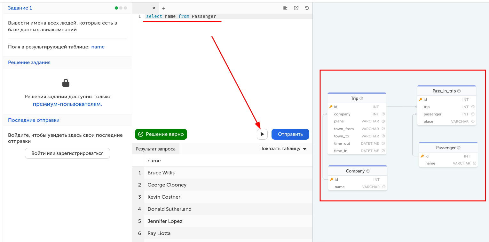

Предыдущая лекция | &nbsp; | Следующая лекция
:----------------:|:----------:|:----------------:
[Словарь данных](./5_1_1_1_data_dictionary.md) | [Содержание](../readme.md#проектирование-баз-данных) | [Группировка, агрегатные функции, JOIN-ы](./sql_advanced.md)

# Основы SQL (синтаксис MySQL)

* [Определение. Группы операторов](#определение-группы-операторов)
* [Data Manipulation Language (DML)](#data-manipulation-language-dml)
* [Data Definition Language (DDL)](#data-definition-language-ddl)

<!-- добавтить count и функции работы со временем (between) -->

## Определение. Группы операторов

**Structured Query Language (SQL)** — язык структурированных запросов, с помощью него пишутся специальные запросы (SQL инструкции) к базе данных с целью получения этих данных из базы и для манипулирования этими данными.

С точки зрения реализации язык SQL представляет собой набор операторов, которые делятся на определенные группы и у каждой группы есть свое назначение. В сокращенном виде эти группы называются **DDL**, **DML**, **DCL** и **TCL**:

* **Data Definition Language (DDL)** – это группа операторов **определения** данных. Другими словами, с помощью операторов, входящих в эту группы, мы определяем структуру базы данных и работаем с объектами этой базы, т.е. создаем, изменяем и удаляем их.

    В эту группу входят следующие операторы:

    * **CREATE** – используется для создания объектов базы данных;
    * **ALTER** – используется для изменения объектов базы данных;
    * **DROP** – используется для удаления объектов базы данных.

* **Data Manipulation Language (DML)** – это группа операторов для манипуляции данными. С помощью этих операторов мы можем добавлять, изменять, удалять и выгружать данные из базы, т.е. манипулировать ими.

    В эту группу входят самые распространённые операторы языка SQL:

    * **SELECT** – осуществляет выборку данных;
    * **INSERT** – добавляет новые данные;
    * **UPDATE** – изменяет существующие данные;
    * **DELETE** – удаляет данные.

* **Data Control Language (DCL)** – группа операторов определения доступа к данным. Иными словами, это операторы для управления разрешениями, с помощью них мы можем разрешать или запрещать выполнение определенных операций над объектами базы данных.

* **Transaction Control Language (TCL)** – группа операторов для управления транзакциями. Транзакция – это команда или блок команд (инструкций), которые успешно завершаются как единое целое, при этом в базе данных все внесенные изменения фиксируются на постоянной основе или отменяются, т.е. все изменения, внесенные любой командой, входящей в транзакцию, будут отменены.

## Ключевое слово USE

В одной СУБД может быть создано несколько баз данных. При выполнении SQL команд мы можем либо указывать нужную БД в команде, либо предварительно указать какая база будет использоваться для комад

```sql
USE db_name;
```

## Data Manipulation Language (DML)

### Базовый синтаксис SQL команды SELECT

Одна из основных функций SQL — получение данных из СУБД. Для построения всевозможных запросов к базе данных используется оператор **SELECT**. Он позволяет выполнять сложные проверки и обработку данных.

Общая структура запроса:

```sql
SELECT [DISTINCT | ALL] поля_таблиц | функция | литерал
    [FROM список_таблиц] 
    [WHERE условия_на_ограничения_строк]
    [GROUP BY условия_группировки]
    [HAVING условия_на_ограничения_строк_после_группировки]
    [ORDER BY порядок_сортировки [ASC | DESC]]
    [LIMIT ограничение_количества_записей]
```

В описанной структуре запроса необязательные параметры указаны в квадратных скобках.

Параметры оператора

* **DISTINCT** используется для исключения повторяющихся строк из результата
* **ALL** (по умолчанию) используется для получения всех данных, в том числе и повторений
* **FROM** перечисляет используемые в запросе таблицы из базы данных
* **WHERE** — это условный оператор, который используется для ограничения строк по какому-либо условию
* **GROUP BY** используется для группировки строк
* **HAVING** применяется после группировки строк для фильтрации по значениям агрегатных функций
* **ORDER BY** используется для сортировки. У него есть два параметра:
    * **ASC** (по умолчанию) используется для сортировки по возрастанию
    * **DESC** — по убыванию
* **LIMIT** используется для ограничения количества строк для вывода

#### SQL-псевдонимы

Псевдонимы используются для представления столбцов или таблиц с именем отличным от оригинального. Это может быть полезно для улучшения читабельности имён и создания более короткого наименования столбца или таблицы.

Например, если в вашей таблице есть столбец **goodTypeId**, вы можете переименовать его просто в **id**, для того, чтобы сделать его более коротким и удобным в использовании в будущем.

Для создания псевдонимов используется оператор `AS`:

```sql
SELECT 
    goodTypeId AS id 
FROM 
    GoodTypes;
```

#### Примеры использования

Вы можете выводить любые строки и числа (литералы) вместо столбцов:

```sql
SELECT 
    "Hello world", 1;
```

Для того, чтобы вывести **все данные** из таблицы **Company**, вы можете использовать символ «*», который буквально означает «все столбцы»:

```sql
SELECT 
    * 
FROM 
    Company;
```

Вы можете вывести любой столбец, определённый в таблице, например, townTo из таблицы Trip:

```sql
SELECT 
    townTo 
FROM 
    Trip;
```

Также вы можете вывести несколько столбцов. Для этого их нужно перечислить через запятую:

```sql
SELECT 
    memberName, `status`
FROM 
    FamilyMembers;
```

>Поле **status** подсвечивается как зарезервированное слово SQL - экранируем его обратными кавычками.

#### Distinct - выбор уникальных значений

Иногда возникают ситуации, в которых нужно получить только уникальные записи. Для этого вы можете использовать **DISTINCT**. Например, выведем список городов без повторений, в которые летали самолеты:

```sql
SELECT 
    DISTINCT townTo 
FROM 
    Trip;
```

Эта конструкция используется для формирования словарей, примеры рассмотрим в главе про команду **INSERT**

#### Условный оператор WHERE

Ситуация, когда требуется сделать выборку по определенному условию, встречается очень часто. Для этого в операторе **SELECT** существует параметр **WHERE**, после которого следует условие для ограничения строк. Если запись удовлетворяет этому условию, то попадает в результат, иначе отбрасывается.

Общая структура запроса с оператором WHERE

```sql
SELECT поля_таблиц 
    FROM список_таблиц 
    WHERE условия_на_ограничения_строк
        [логический_оператор другое_условия_на_ограничения_строк];
```

В условном операторе применяются операторы сравнения, специальные и логические операторы.

#### Операторы сравнения

Операторы сравнения служат для сравнения 2 выражений, их результатом может являться **ИСТИНА (1)**, **ЛОЖЬ (0)** и **NULL**.

>Результат сравнения с NULL является NULL. Исключением является оператор эквивалентности.

Оператор | Описание
:--:|---
`=` | Оператор равенство
`<=>` | Оператор эквивалентность<br/>Аналогичный оператору равенства, с одним лишь исключением: в отличие от него, оператор эквивалентности вернет ИСТИНУ при сравнении NULL `<=>` NULL
`<>`<br/>или<br/>`!=` | Оператор неравенство
`<` | Оператор меньше
`<=` | Оператор меньше или равно
`>` | Оператор больше
`>=` | Оператор больше или равно

#### Специальные операторы

1. `IS [NOT] NULL` — позволяет узнать равно (не равно) ли проверяемое значение NULL.

    Для примера выведем всех членов семьи, у которых статус в семье не равен NULL:

    ```sql
    SELECT 
        * 
    FROM 
        FamilyMembers
    WHERE 
        `status` IS NOT NULL;
    ```

2. `[NOT] BETWEEN min AND max` — позволяет узнать расположено ли проверяемое значение столбца в интервале между **min** и **max**.

    Выведем все данные о покупках с ценой от 100 до 500 рублей из таблицы Payments:

    ```sql
    SELECT 
        * 
    FROM 
        Payments
    WHERE 
        unitPrice BETWEEN 100 AND 500;
    ```

3. `[NOT] IN` — позволяет узнать входит (не входит) ли проверяемое значение столбца в список определённых значений.

    Выведем имена членов семьи, чей статус равен «father» или «mother»:

    ```sql
    SELECT 
        memberName 
    FROM 
        FamilyMembers
    WHERE 
        `status` IN ('father', 'mother');
    ```

4. `[NOT] LIKE шаблон [ESCAPE символ]` — позволяет узнать соответствует ли строка определённому шаблону. **ESCAPE символ** - это так называемый трафаретный символ, вместо которого может быть что один (`_`) или несколько (`%`) любых символов.

    Например, выведем всех людей с фамилией «Quincey»:

    ```sql
    SELECT 
        memberName 
    FROM 
        FamilyMembers
    WHERE 
        memberName LIKE '% Quincey';
    ```

#### Трафаретные символы

В шаблоне разрешается использовать два трафаретных символа:

* символ подчеркивания (`_`), который можно применять вместо любого единичного символа в проверяемом значении
* символ процента (`%`) заменяет последовательность любых символов (число символов в последовательности может быть от 0 и более) в проверяемом значении.

Шаблон | Описание
:--:|--
never`%` | Сопоставляется любым строкам, начинающимся на «never».
`%`ing | Сопоставляется любым строкам, заканчивающимся на «ing».
`_`ing | Сопоставляется строкам, имеющим длину 4 символа, при этом 3 последних обязательно должны быть «ing». Например, слова «sing» и «wing».

#### ESCAPE-символ

ESCAPE-символ используется для экранирования трафаретных символов. В случае если вам нужно найти строки, содержащие проценты (а процент — это зарезервированный символ), вы можете использовать ESCAPE-символ.

Например, вы хотите получить идентификаторы задач, прогресс которых равен `3%`:

```sql
SELECT 
    jobId 
FROM 
    Jobs
WHERE 
    progress LIKE '3!%' 
ESCAPE '!';
```

Если бы мы не экранировали трафаретный символ, то в выборку попало бы всё, что начинается на 3.

#### Логические операторы

Логические операторы необходимы для связывания нескольких условий ограничения строк.

* Оператор **NOT** — меняет значение специального оператора на противоположный
* Оператор **OR** — общее значение выражения истинно, если хотя бы одно из них истинно
* Оператор **AND** — общее значение выражения истинно, если они оба истинны
* Оператор **XOR** — общее значение выражения истинно, если один и только один аргумент является истинным

Выведем все полёты, которые были совершены на самолёте «Boeing», но, при этом, вылет был не из Лондона:

```sql
SELECT 
    * 
FROM 
    Trip
WHERE 
    plane = 'Boeing' AND NOT townFrom = 'London';
```

#### Выборка сводных данных (из двух и более таблиц)

При формировании сводной выборки данные беруться из нескольких таблиц. В операторе **FROM** исходные таблицы перечисляются через запятую. Также им могут быть присвоены алиасы. Синтаксис запроса выглядит следующийм образом:

```sql
SELECT 
    [ALIAS | TABLE].Название_поля1, [ALIAS | TABLE].Название_поля2,...
FROM
    Table1 [ALIAS],
    Table2 [ALIAS]
...    
```

При выборке сводных таблиц нужно учитывать, что исходные таблицы перемножаются. Т.е. если на входе у нас были таблицы:

id | name
:-:|--
1 | Иванов
2 | Петров

id | name | phone
:-:|------|-----
1 | Иванов | 322223
2 | Петров | 111111

То при простом запросе без условий

```sql
SELECT a.*, b.*
FROM 
    Table1 a, Table2 b
```

Получим примерно следующее:

id | name  | id2 | name2  | phone
:-:|-------|:---:|--------|------
1  | Иванов| 1   | Иванов | 322223
1  | Иванов| 2   | Петров | 111111
2  | Петров| 1   | Иванов | 322223
2  | Петров| 2   | Петров | 111111

Чтобы выбрать уникальные значения, нам нужно использовать оператор **WHERE** для связи этих таблиц

```sql
SELECT a.*, b.phone
FROM 
    Table1 a, Table2 b
WHERE
    a.name=b.name    
```

id | name  | phone
:-:|-------|------
1  | Иванов| 322223
2  | Петров| 111111

>Сводные выборки нам понадобятся при импорте данных в базу.

#### Вложенные SQL запросы

Вложенный запрос — это запрос на выборку, который используется внутри инструкции SELECT, INSERT, UPDATE или DELETE или внутри другого вложенного запроса. Подзапрос может быть использован везде, где разрешены выражения.

Пример структуры вложенного запроса

```sql
SELECT поля_таблиц 
    FROM список_таблиц 
    WHERE конкретное_поле IN (
        SELECT поле_таблицы FROM таблица
    )
```

Здесь, `SELECT поля_таблиц FROM список_таблиц WHERE конкретное_поле IN (...)` — внешний запрос, а `SELECT поле_таблицы FROM таблица` — вложенный (внутренний) запрос.

Каждый вложенный запрос, в свою очередь, может содержать один или несколько вложенных запросов. Количество вложенных запросов в инструкции не ограничено.

Подзапрос может содержать все стандартные инструкции, разрешённые для использования в обычном SQL-запросе: DISTINCT, GROUP BY, LIMIT, ORDER BY, объединения таблиц, запросов и т.д.

Подзапрос может возвращать скаляр (одно значение), одну строку, один столбец или таблицу (одну или несколько строк из одного или нескольких столбцов). Они называются скалярными, столбцовыми, строковыми и табличными подзапросами.

#### Подзапрос как скалярный операнд

Скалярный подзапрос — запрос, возвращающий единственное скалярное значение (строку, число и т.д.).

Следующий простейший запрос демонстрирует вывод единственного значения (названия компании). В таком виде он не имеет большого смысла, однако ваши запросы могут быть намного сложнее.

```sql
SELECT (
    SELECT 
        name 
    FROM 
        company 
    LIMIT 1
);
```

Таким же образом можно использовать скалярные подзапросы для фильтрации строк с помощью WHERE, используя операторы сравнения.

```sql
SELECT 
    * 
FROM 
    FamilyMembers 
WHERE 
    birthDay = (
        SELECT 
            MAX(birthDay) 
        FROM 
            FamilyMembers
    );
```

С помощью данного запроса возможно получить самого младшего члена семьи. Здесь используется подзапрос для получения максимальной даты рождения, которая затем используется для фильтрации строк.

#### Подзапросы с ANY, IN, ALL

**ANY** — ключевое слово, которое должно следовать за операцией сравнения (>, <, <>, = и т.д.), возвращающее TRUE, если хотя бы одно из значений столбца подзапроса удовлетворяет обозначенному условию.

```sql
SELECT поля_таблицы_1 
    FROM таблица_1 
    WHERE поле_таблицы_1 <= ANY (SELECT поле_таблицы_2 FROM таблица_2);
```

**ALL** — ключевое слово, которое должно следовать за операцией сравнения, возвращающее TRUE, если все значения столбца подзапроса удовлетворяет обозначенному условию.

```sql
SELECT поля_таблицы_1 
    FROM таблица_1 
    WHERE поле_таблицы_1 > ALL (SELECT поле_таблицы_2 FROM таблица_2);
```

**IN** — ключевое слово, являющееся псевдонимом ключевому слову **ANY** с оператором сравнения = (эквивалентность), либо <> ALL для NOT IN. Например, следующие запросы равнозначны:

```sql
...
WHERE поле_таблицы_1 = ANY (SELECT поле_таблицы_2 FROM таблица_2);
```

```sql
...
WHERE поле_таблицы_1 IN (SELECT поле_таблицы_2 FROM таблица_2);
```

#### Строковые подзапросы

Строковый подзапрос — это подзапрос, возвращающий единственную строку с более чем одной колонкой. Например, следующий запрос получает в подзапросе единственную строку, после чего по порядку попарно сравнивает полученные значения со значениями во внешнем запросе.

```sql
SELECT поля_таблицы_1 
    FROM таблица_1
    WHERE (первое_поле_таблицы_1, второе_поле_таблицы_1) = 
    (
        SELECT первое_поле_таблицы_2, второе_поле_таблицы_2 
        FROM таблица_2 
        WHERE id = 10
    );
```

Данную конструкцию удобно использовать для замены логических операторов. Так, следующие два запроса полностью эквивалентны:

```sql
SELECT поля_таблицы_1 
    FROM таблица_1 
    WHERE (первое_поле_таблицы_1, второе_поле_таблицы_1) = (1, 1);

SELECT поля_таблицы_1 
    FROM таблица_1 
    WHERE первое_поле_таблицы_1 = 1 AND второе_поле_таблицы_1 = 1;
```

#### Связанные подзапросы

Связанным подзапросом является подзапрос, который содержит ссылку на таблицу, которая была объявлена во внешнем запросе. Здесь вложенный запрос ссылается на внешюю таблицу "таблица_1":

```sql
SELECT поля_таблицы_1 FROM таблица_1
    WHERE поле_таблицы_1 IN 
    (
        SELECT поле_таблицы_2 FROM таблица_2
        WHERE таблица_2.поле_таблицы_2 = таблица_1.поле_таблицы_1
    );
```

#### Подзапросы как производные таблицы

Производная таблица — выражение, которое генерирует временную таблицу в предложении **FROM**, которая работает так же, как и обычные таблицы, которые вы указываете через запятую. Так выглядит общий синтаксис запроса с использованием производных таблиц:

```sql
SELECT поля_таблицы_1 
    FROM (подзапрос) AS псевдоним_производной_таблицы
```

Обратите внимание на то, что для производной таблицы обязательно должен указываться её псевдоним, для того, чтобы имелась возможность обратиться к ней в других частях запроса.

#### Обработка вложенных запросов

Вложенные подзапросы обрабатываются «снизу вверх». То есть сначала обрабатывается вложенный запрос самого нижнего уровня. Далее значения, полученные по результату его выполнения, передаются и используются при реализации подзапроса более высокого уровня и т.д.

### Добавление данных, оператор INSERT

Для добавления новых записей в таблицу предназначен оператор **INSERT**.

Общая структура запроса с оператором **INSERT**

```sql
INSERT INTO имя_таблицы [(поле_таблицы, ...)]
    VALUES (значение_поля_таблицы, ...)
    | SELECT поле_таблицы, ... FROM имя_таблицы ...
```

>В описанной структуре запроса необязательные параметры указаны в квадратных скобках. Вертикальной чертой обозначен альтернативный синтаксис.

>Список полей таблицы не обязателен, но только если заполняются все имеющиеся поля. Можно не заполнять не обязательные поля, но в этом случае список нужно указывать и порядок полей должен соответсвовать значениям.

Значения можно вставлять перечислением с помощью слова **VALUES**, перечислив их в круглых скобках через запятую или c помощью оператора **SELECT**. Таким образом, добавить новые записей можно следующими способами:

```sql
INSERT INTO Goods (goodId, goodName, `type`)
    VALUES (5, 'Table', 2), (6, 'Table2', 1);
```

```sql
-- заполняются все поля в таблице
INSERT INTO Goods 
    VALUES (5, 'Table', 2);
```

```SQL
INSERT INTO Goods 
    SELECT 
        goodId, goodName, `type`
    FROM 
        Goods 
    where 
        `type` = 2;
```

#### Первичный ключ при добавлении новой записи

Следует помнить, что первичный ключ таблицы является уникальным значением и добавление уже существующего значения приведет к ошибке.

При добавлении новой записи с уникальными индексами выбор такого уникального значения может оказаться непростой задачей. Решением может быть дополнительный запрос, направленный на выявление максимального значения первичного ключа для генерации нового уникального значения.

```sql
INSERT INTO Goods 
    SELECT 
        COUNT(*) + 1, 'Table', 2 
    FROM 
        Goods;
```

В SQL введен механизм его автоматической генерации. Для этого достаточно снабдить первичный ключ goodId атрибутом **AUTO_INCREMENT**. Тогда при создании новой записи в качестве значения goodId достаточно передать **NULL** или **0** — поле автоматически получит значение, равное максимальному значению столбца goodId, плюс единица.

```sql
CREATE TABLE Goods (
	goodId INT NOT NULL AUTO_INCREMENT
	...
);
```

```sql
INSERT INTO Goods 
    VALUES (NULL, 'Table', 2);
```

### Редактирование данных, команда UPDATE

Команда **UPDATE** применяется для обновления уже имеющихся строк. Она имеет следующий формальный синтаксис:

```sql
UPDATE имя_таблицы
    SET столбец1 = значение1, столбец2 = значение2, ... столбецN = значениеN
    [WHERE условие_обновления]
```

Например, увеличим у всех товаров цену на 3000:

```sql
UPDATE Products
SET Price = Price + 3000;
```

Однако при выполнении данного запроса в MySQL Workbench мы можем столкнуться с ошибкой "You are using safe update..."

Ошибка говорит о том, что мы находимся в *безопасном режиме*. И чтобы его отключить, в **MySQL Workbench** надо перейти в меню **Edit -> Preferences** и в открывшемся окне перейти к пункту **SQL Editor**:


В открывшейся вкладке в самом низу надо снять флажок с поля "Safe Updates (reject UPDATEs and DELETEs with no restrictions)" и затем сохранить изменения, нажав на кнопку OK. После этого надо переподключиться к серверу.

Используем выражение **WHERE** и изменим название производителя с "Samsung" на "Samsung Inc.":

```sql
UPDATE Products
    SET Manufacturer = 'Samsung Inc.'
    WHERE Manufacturer = 'Samsung';
```

Также можно обновлять сразу несколько столбцов:

```sql
UPDATE Products
    SET Manufacturer = 'Samsung',
        ProductCount = ProductCount + 3
    WHERE Manufacturer = 'Samsung Inc.';
```

При обновлении вместо конкретных значений и выражений мы можем использовать ключевые слова **DEFAULT** и **NULL** для установки соответственно значения по умолчанию или NULL:

```sql
UPDATE Products
    SET ProductCount= DEFAULT
    WHERE Manufacturer = 'Huawei';
```    

### Удаление данных, команда DELETE

Команда **DELETE** удаляет данные из БД. Она имеет следующий формальный синтаксис:

```sql
DELETE FROM имя_таблицы
    [WHERE условие_удаления]
```

Например, удалим строки, у которых производитель - Huawei:

```sql
DELETE FROM Products
    WHERE Manufacturer='Huawei';
```

Или удалим все товары, производителем которых является Apple и которые имеют цену меньше 60000:

```sql
DELETE FROM Products
    WHERE Manufacturer='Apple' AND Price < 60000;
```

Если необходимо вовсе удалить все строки вне зависимости от условия, то условие можно не указывать:

```sql
DELETE FROM Products;
```

## Data Definition Language (DDL)

**Data Definition Language (DDL)** – это группа операторов **определения** данных. Другими словами, с помощью операторов, входящих в эту группы, мы определяем структуру базы данных и работаем с объектами этой базы, т.е. создаем, изменяем и удаляем их.

В эту группу входят следующие операторы:

* CREATE – используется для создания объектов базы данных;
* ALTER – используется для изменения объектов базы данных;
* DROP – используется для удаления объектов базы данных.

>В MySQL регистронезависимый синтаксис, ключевые слова дальше написаны КАПСОМ только для читабельности.

### CREATE DATABASE - создание базы данных

```sql
CREATE DATABASE [IF NOT EXISTS] db_name
```

Оператор `CREATE DATABASE` создает базу данных с указанным именем. Если база данных уже существует и не указан ключевой параметр `IF NOT EXISTS`, то возникает ошибка выполнения команды.

Если в названии базы данных присутствуют пробелы или название совпадает с ключевым словом SQL, то название можно экранировать символами обратной кавычки (подобное экранирование применяется и к названиям других сущностей и атрибутов): 

```
CREATE DATABASE `database` 
```

### DROP DATABASE - удаление базы данных

```
DROP DATABASE [IF EXISTS] db_name
```

Оператор `DROP DATABASE` удаляет все таблицы в указанной базе данных (строго говоря не только таблицы, а все имеющиеся объекты) и саму базу.

### CREATE TABLE - создание таблицы

```
CREATE [TEMPORARY] TABLE [IF NOT EXISTS] tbl_name [(create_definition,...)]
[table_options]
```

* `TEMPORARY` - Будет создана временная таблица. Временная таблица автоматически удаляется по завершении соединения, а её имя действительно только в течение данного соединения. Это означает, что в двух разных соединениях могут использоваться временные таблицы с одинаковыми именами без конфликта друг с другом или с существующей таблицей с тем же именем (существующая таблица скрыта, пока не удалена временная таблица).

* `tbl_name` - Название таблицы.

    Имя таблицы может быть указано как `db_name.tbl_name`. Эта форма записи работает независимо от того, является ли указанная база данных текущей.

* `(create_definition, ...)` описывает набор создаваемых сущностей (столбцы, индексы и т.д.):

    * колонка (столбец)

        синтаксис:

        ```
        col_name col_type [NOT NULL | NULL] [DEFAULT default_value] [AUTO_INCREMENT]
            [PRIMARY KEY]
        ```

        * `col_name` - название;

        * `col_type` - тип данных;

            * TINYINT[(length)] [UNSIGNED] [ZEROFILL]
            * INT[(length)] [UNSIGNED] [ZEROFILL]
            * INTEGER[(length)] [UNSIGNED] [ZEROFILL]
            * DOUBLE[(length,decimals)] [UNSIGNED] [ZEROFILL]
            * FLOAT[(length,decimals)] [UNSIGNED] [ZEROFILL]
            * DECIMAL(length,decimals) [UNSIGNED] [ZEROFILL]
            * CHAR(length) [BINARY]
            * VARCHAR(length) [BINARY]
            * DATE
            * TIME
            * TIMESTAMP
            * DATETIME
            * TEXT
            * ENUM(value1,value2,value3,...)
            * SET(value1,value2,value3,...)

        * `NOT NULL | NULL` - обязательность (по-умолчанию `NULL`);

        * `DEFAULT default_value` - значение по-умолчанию;

        * `AUTO_INCREMENT` - целочисленный столбец может иметь дополнительный атрибут AUTO_INCREMENT. При записи величины NULL (рекомендуется) или 0 в столбец AUTO_INCREMENT данный столбец устанавливается в значение `value+1`, где `value` представляет собой наибольшее для этого столбца значение в таблице на момент записи. Последовательность AUTO_INCREMENT начинается с `1`.

        * `PRIMARY KEY` - представляет собой уникальный ключ KEY (KEY является синонимом для INDEX). Столбец с данным ключом должен быть определен как `NOT NULL`. В MySQL этот ключ называется PRIMARY (первичный). Таблица может иметь только один первичный ключ PRIMARY KEY (То есть если мы хотим создать составной первичный ключ, то надо создавать его отдельной сущностью). 

        например:

        ```sql
        CREATE TABLE `test` (
            `id` int(11) NOT NULL AUTO_INCREMENT PRIMARY KEY
        )
        ```

    * первичный ключ (подразумевается составной, хотя никто не мешает использовать и одну колонку) 
    
        синтаксис:

        ```
        PRIMARY KEY (index_col_name,...)
        ```

        Например, аналог предыдущего запроса

        ```sql
        CREATE TABLE `test` (
            `id` int(11) NOT NULL AUTO_INCREMENT,
            PRIMARY KEY (`id`)
        )
        ```

    * индекс (альтернативный ключ)
    
        синтаксис:

        ```
        KEY [index_name] (index_col_name,...)
        ```

        или

        ```
        INDEX [index_name] (index_col_name,...)
        ```

        или   
        
        ```
        UNIQUE [INDEX] [index_name] (index_col_name,...)
        ```

        * `index_name` - название индекса

        * `index_col_name` - название колонки (колонок), входящей в ключ индекса: `col_name [(length)]`. Содержимое колонки может быть обрезано по длине `length` 

        Ключ `UNIQUE` может иметь только различающиеся значения. При попытке добавить новую строку с ключом, совпадающим с существующей строкой, возникает ошибка выполнения команды.

    * внешний ключ

        синтаксис:

        ```
        [CONSTRAINT index_name] FOREIGN KEY (index_col_name,...)
            REFERENCES главная_таблица (столбец_главной_таблицы,...)
            [ON DELETE reference_option]
            [ON UPDATE reference_option]
        ```

        * `(index_col_name,...)` - список полей, являющихся частью составного ключа (чаще всего просто одно поле). Должен соответствовать списку полей главной таблицы в выражении `REFERENCES`.
        * `главная_таблица` - название таблицы, с которой устанавливается связь
        * `(столбец_главной_таблицы,...)` - поля главной таблицы, по которым устанавливается связь

        Внешние ключи позволяют установить связи между таблицами. Внешний ключ устанавливается для столбцов из зависимой, подчиненной таблицы, и указывает на один из столбцов из главной таблицы. Как правило, внешний ключ указывает на первичный ключ из связанной главной таблицы.

        Для создания ограничения внешнего ключа после `FOREIGN KEY` указывается столбец таблицы, который будет представляет внешний ключ. А после ключевого слова `REFERENCES` указывается имя связанной таблицы, а затем в скобках имя связанного столбца, на который будет указывать внешний ключ.

        С помощью выражений `ON DELETE` и `ON UPDATE` можно установить действия, которые выполняются соответственно при удалении и изменении связанной строки из главной таблицы. В качестве действия могут использоваться следующие опции:

        * `CASCADE`: автоматически удаляет или изменяет строки из зависимой таблицы при удалении или изменении связанных строк в главной таблице.

        * `SET NULL`: при удалении или обновлении связанной строки из главной таблицы устанавливает для столбца внешнего ключа значение NULL. (В этом случае столбец внешнего ключа должен поддерживать установку NULL)

        * `RESTRICT`: отклоняет удаление или изменение строк в главной таблице при наличии связанных строк в зависимой таблице.

        * `NO ACTION`: то же самое, что и `RESTRICT` - действие по-умолчанию.

        * `SET DEFAULT`: при удалении связанной строки из главной таблицы устанавливает для столбца внешнего ключа значение по умолчанию, которое задается с помощью атрибуты DEFAULT. Несмотря на то, что данная опция в принципе доступна, однако движок InnoDB не поддерживает данное выражение.

        Например:

        ```sql
        -- таблица "склад"
        CREATE TABLE `Warehouse` (
            `id` int(11) NOT NULL AUTO_INCREMENT PRIMARY KEY,
            `title` varchar(100) DEFAULT NULL,
            `quantity` int(11) DEFAULT NULL,
        )

        -- таблица "продажи"
        CREATE TABLE `Sales` (
            `id` int(11) NOT NULL AUTO_INCREMENT PRIMARY KEY,
            `warehouse_id` int(11) DEFAULT NULL,
            `quantity` int(11) DEFAULT NULL,
            CONSTRAINT `FK_sales_warehouse` 
                FOREIGN KEY (`warehouse_id`) 
                REFERENCES `warehouse` (`id`)
        )
        ```

* `table_options` - тут можно настроить тип таблицы, кодировку символов, параметры автоинкремента. Но обычно эти параметры не трогают и они наследуются от аналогичных параметров базы данных.

### ALTER TABLE - изменение структуры таблицы

```
ALTER [IGNORE] TABLE tbl_name alter_spec [, alter_spec ...]
```

Оператор `ALTER TABLE` обеспечивает возможность изменять структуру существующей таблицы. Например, можно добавлять или удалять столбцы, создавать или уничтожать индексы или переименовывать столбцы либо саму таблицу.

Оператор `ALTER TABLE` во время работы создает временную копию исходной таблицы. Требуемое изменение выполняется на копии, затем исходная таблица удаляется, а новая переименовывается. Так делается для того, чтобы в новую таблицу автоматически попадали все обновления кроме неудавшихся. 

* Опция `IGNORE` управляет работой `ALTER TABLE` при наличии дубликатов уникальных ключей в новой таблице. Если опция `IGNORE` не задана, то для данной копии процесс прерывается и происходит откат назад. Если `IGNORE` указывается, тогда для строк с дубликатами уникальных ключей остается только первая строка, а остальные удаляются.

* `alter_spec` - что меняется

    * добавление новой колонки
    
        ```
        ADD [COLUMN] create_definition [FIRST | AFTER column_name ]
        ```

        В `create_definition` используется тот же синтаксис, что и при создании таблицы.

        По-умолчанию столбец добавляется в конец списка столбцов, но с помощью модификаторов `FIRST` и  `AFTER` можно разместить столбец в начале списка или после какого-то имеющегося столбца.

    * добавление первичного ключа
    
        ```
        ADD PRIMARY KEY (index_col_name,...)
        ```

    * добавление внешнего ключа

        ```
        ADD [CONSTRAINT symbol] FOREIGN KEY (index_col_name,...)
            REFERENCES главная_таблица (столбец_главной_таблицы,...)
            [ON DELETE reference_option]
            [ON UPDATE reference_option]    
        ```

        Например:

        ```sql
        -- добавление внешнего ключа в таблицу "продажи"
        ALTER TABLE `sales`
            ADD CONSTRAINT `FK_sales_warehouse` 
            FOREIGN KEY (`warehouse_id`) 
            REFERENCES `warehouse` (`id`);
        ```

    * изменение существующей колонки

        ```
        ALTER [COLUMN] col_name [create_definition] {SET DEFAULT literal | DROP DEFAULT}    
        ```

        В целом параметры те же что и при создании, единствено отличается синтаксис добавления или удаления значения по-умолчанию.

    * удаление колонки
    
        ```
        DROP [COLUMN] col_name
        ```

    * удаление первичного ключа
    
        ```
        DROP PRIMARY KEY
        ```
    * удаление индекса (в том числе внешнего ключа)
    
        ```
        DROP INDEX index_name
        ```

---

## Задание

Прорешать несколько задач из [SQL Академии](https://sql-academy.org/ru/trainer). Количество не менее 5-ти, на троечку лёгкие, на четверку средние, на пятерку сложные. 

Результаты опубликовать в репозитории (скрины со сложностью задачи, текстом запроса и результатом. ERD не включать)

Пример:



В верхней части пишете текст запроса, в нижней видите результат. Справа есть ERD для базы данных.

Предыдущая лекция | &nbsp; | Следующая лекция
:----------------:|:----------:|:----------------:
[Словарь данных](./5_1_1_1_data_dictionary.md) | [Содержание](../readme.md#проектирование-баз-данных) | [Группировка, агрегатные функции, JOIN-ы](./sql_advanced.md)
