<table style="width: 100%;"><tr><td style="width: 40%;">
<a href="../articles/sql_for_beginner.md">Основы SQL
</a></td><td style="width: 20%;">
<a href="../readme.md">Содержание
</a></td><td style="width: 40%;">
<a href="../articles/cs_mysql_connection3.md">Создание подключения к БД MySQL. Получение данных с сервера.
</a></td><tr></table>

# Восстановление базы данных из скрипта. 

>Мы получаем скрипты для генерации структуры БД либо в задании на демо-экзамене, либо формируем из ER-диаграммы. Создание самой БД мы не рассматриваем (ни на демо-экзамене, ни на моем сервере у вас нет на это прав), но там ничего сложного и при желании вы можете установить локальную БД дома и с ней делать что угодно.

## Подключение к базе данных (MySQL)

Прежде чем что-то сделать с базой данных нужно к ней подключиться:

### Используя MySQL Workbench

1. Запустите программу *MySQL Workbench*

2. На стартовом окне программы кликните по значку "+"

    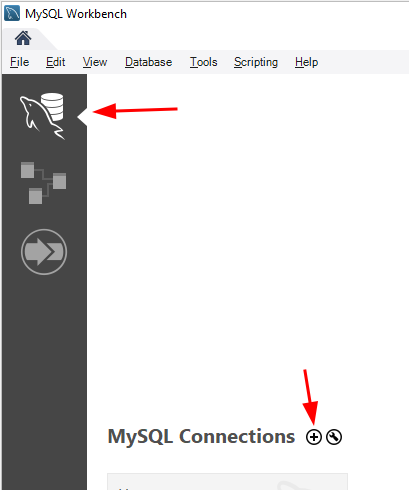

3. В параметрах подключения заполните поля:

    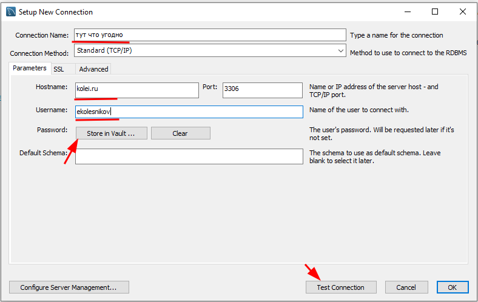

    * *Connection name* - название подключения. Тут может быть что угодно, но лучше указать свой логин (см. ниже)
    * *Host name* - IP-адрес или доменное имя сервера. В рамках лабораторных работ мы будем работать на удаленном сервере **kolei.ru**, на демо-экзамене будет сервер в локальной сети.
    * *Username* - имя пользователя. Присваивается преподавателем. 
    * *Store in vault* - открывает окно для ввода и СОХРАНЕНИЯ пароля. Дома можете настроить, чтобы каждый раз не вводить пароль, но в классе лучше не использовать.
    * *Test connection* - тест соединения. Программа запросит пароль и попытается подключиться к серверу используя введенные параметры. Если все параметры введены правильно, то появится окно подтверждения.

        

        Если при попытке подключения ругается на сертификат, то перейдите в закладку **Advanced** и в блоке **Others** напишите строку `useSSL=0`

    * В окне настроек соединения жмите "OK"

#### Формирование DDL-скрипта по диаграмме

1. Окройте EER-диаграмму
2. Переименуйте (правый клик мышкой) базу данных в соответствии со своим *Username* (см. выше)

    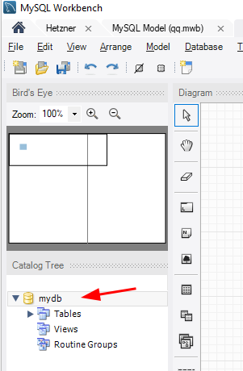

3. Сформируйте скрипт для создания БД: **File** -> **Export** -> **Forward Engineer SQL CREATE Script**. В окнах настроек и объектов пока всё оставляем по-умолчанию. Скопируйте скрипт в буфер обмена.
4. Откройте ранее созданное подключение к БД. Обычно при открытии БД одновременно открывается окно **Query** (запросы). Если его нет, но откройте новое:

    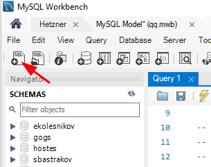

5. Вставьте в окно запросов скрипт из буфера обмена и закомментируйте строку с созданием схемы (у вас нет прав на создание новых схем)

    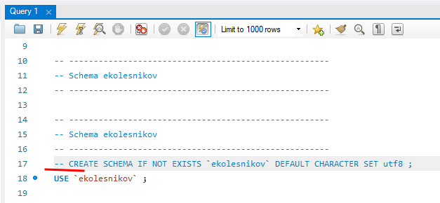

6. Выполните скрипт

    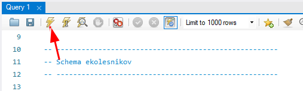

7. Если всё нормально, то будут созданы все таблицы и связи, которые вы описали в EER

    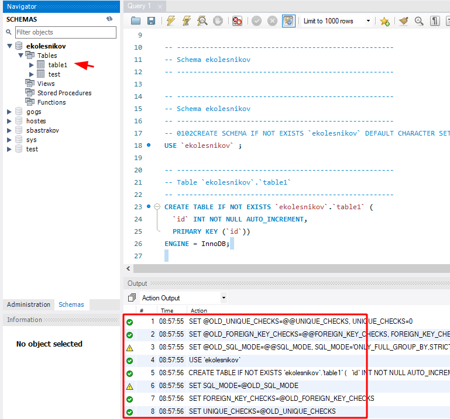


>На демо-экзамене в ресурсах будет аналогичный файл скрипта базы данных, но в нём не укзана база данных. Нужно в начале скрипта вписать команду `use <название вашей базы>;`

### Используя dBeaver

**dBeaver** - кроссплатформенный бесплатный менеджер баз данных (список поддерживаемых БД большой, есть и MySQL и MSSQL)

#### Создание подключения

В списке проектов открываем пункт **General** и в контекстном меню пункта **Connections** выбираем **Создать -> Соединение**

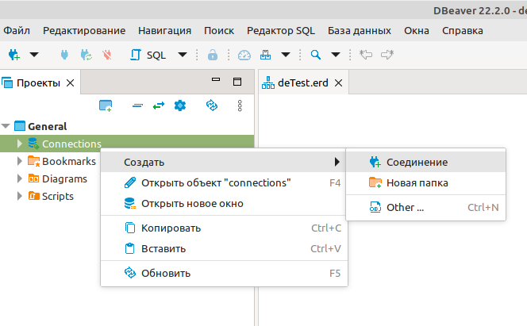

В открывшемся окне выберите тип соедиения (используемую БД)

У меня на сервере установлена `mysql  Ver 14.14 Distrib 5.7.39, for Linux (x86_64)`, поэтому выбираем MySQL. Если у вас другой тип БД, то выбираете соответсвующий.

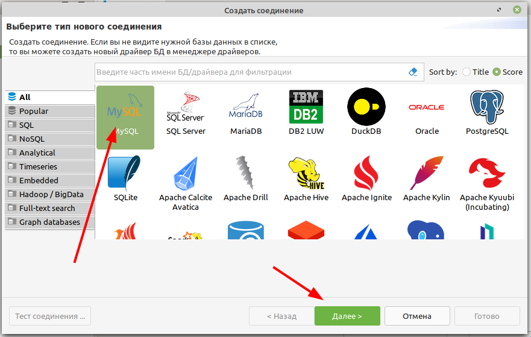

В настройках соединения указываем доменное имя или IP сервера, название базы данных и имя пользователя (выдаст преподаватель или сами знаете какие в вашей БД), пароль.

Затем нажимаете **тест соединения** и, если всё введено правильно, и соединение устанавливается то жмёте **Готово**

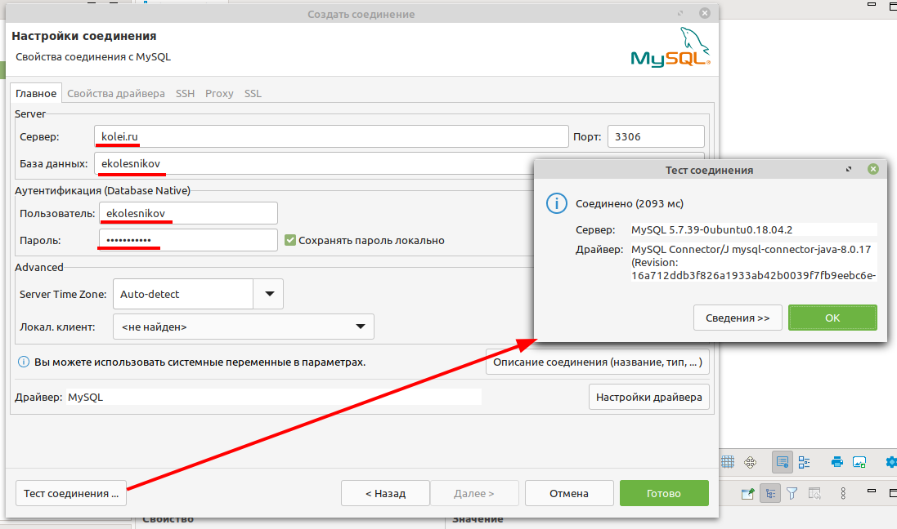

В списке соединений появится созданое соединение, название состоит из имени базы и имени сервера и имеющиеся базы данных.

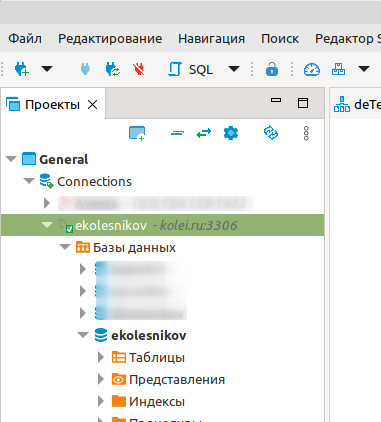

# Импорт данных.

Стандартом *де-факто* для импорта/экспорта данных является формат CSV.

## Что такое CSV-файлы

Формат CSV используют, чтобы хранить таблицы в текстовых файлах. Данные очень часто упаковывают именно в таблицы, поэтому CSV-файлы очень популярны.

CSV расшифровывается как comma-separated values — «значения, разделенные запятыми». Но разделителями столбцов в CSV-файле могут служить и точки с запятой, и знаки табуляции. Это все равно будет CSV-файл.

У CSV куча плюсов перед тем же форматом Excel: текстовые файлы просты как пуговица, открываются быстро, читаются на любом устройстве и в любой среде без дополнительных инструментов.

Из-за своих преимуществ CSV — сверхпопулярный формат обмена данными, хотя ему уже лет 40. CSV используют прикладные промышленные программы, в него выгружают данные из баз.

Одна беда — текстового редактора для работы с CSV мало. Еще ничего, если таблица простая: в первом поле ID одной длины, во втором дата одного формата, а в третьем какой-нибудь адрес. Но когда поля разной длины и их больше трех, начинаются мучения.

Еще хуже с анализом данных — попробуй «Блокнотом» хотя бы сложить все числа в столбце. Я уж не говорю о красивых графиках.

Поэтому CSV-файлы анализируют и редактируют в Excel и аналогах: Open Office, LibreOffice и прочих.

## Как Excel портит данные: из классики

Все бы ничего, но Excel, едва открыв CSV-файл, начинает свои лукавые выкрутасы. Он без спроса меняет данные так, что те приходят в негодность. Причем делает это совершенно незаметно. Из-за этого в свое время мы схватили ворох проблем.

Большинство казусов связано с тем, что программа без спроса преобразует строки с набором цифр в числа.

**Округляет**. Например, в исходной ячейке два телефона хранятся через запятую без пробелов: «5235834,5235835». Что сделает Excel? Лихо превратит номера́ в одно число и округлит до двух цифр после запятой: «5235834,52». Так мы потеряем второй телефон.

**Приводит к экспоненциальной форме**. Excel заботливо преобразует «123456789012345» в число «1,2E+15». Исходное значение потеряем напрочь.

Проблема актуальна для длинных, символов по пятнадцать, цифровых строк. Например, КЛАДР-кодов (это такой государственный идентификатор адресного объекта: го́рода, у́лицы, до́ма).

**Удаляет лидирующие плюсы**. Excel считает, что плюс в начале строки с цифрами — совершенно лишний символ. Мол, и так ясно, что число положительное, коль перед ним не стоит минус. Поэтому лидирующий плюс в номере «+74955235834» будет отброшен за ненадобностью — получится «74955235834». (В реальности номер пострадает еще сильнее, но для наглядности обойдусь плюсом).

Потеря плюса критична, например, если данные пойдут в стороннюю систему, а та при импорте жестко проверяет формат.

**Разбивает по три цифры**. Цифровую строку длиннее трех символов Excel, добрая душа, аккуратно разберет. Например, «8 495 5235834» превратит в «84 955 235 834».

Форматирование важно как минимум для телефонных номеров: пробелы отделяют коды страны и города от остального номера и друг от друга. Excel запросто нарушает правильное членение телефона.

**Удаляет лидирующие нули**. Строку «00523446» Excel превратит в «523446».
А в ИНН, например, первые две цифры — это код региона. Для Республики Алтай он начинается с нуля — «04». Без нуля смысл номера исказится, а проверку формата ИНН вообще не пройдет.

**Меняет даты под локальные настройки**. Excel с удовольствием исправит номер дома «1/2» на «01.фев». Потому что Windows подсказал, что в таком виде вам удобнее считывать даты.

## Побеждаем порчу данных правильным импортом

Если серьезно, в бедах виноват не Excel целиком, а неочевидный способ импорта данных в программу.

По умолчанию Excel применяет к данным в загруженном CSV-файле тип «General» — общий. Из-за него программа распознает цифровые строки как числа. Такой порядок можно победить, используя встроенный инструмент импорта.

**Запускаем** встроенный в Excel механизм импорта.

**Выбирем** CSV-файл с данными, открывается диалог. В диалоге кликем на тип файла Delimited (с разделителями). Кодировка — та, что в файле, обычно определяется автоматом. Если первая строка файла — шапка, отмечем «My Data Has Headers».

**Переходим** ко второму шагу диалога. Выбираем разделитель полей (обычно это запятая). Отключаем «Treat consecutive delimiters as one», а «Text qualifier» выставляем в «{none}». (Text qualifier — это символ начала и конца текста. Если разделитель в CSV — запятая, то text qualifier нужен, чтобы отличать запятые внутри текста от запятых-разделителей.)

На третьем шаге выбираем формат полей, ради него все и затевалось. Для всех столбцов выставляем тип «Text». Кстати, если кликнуть на первую колонку, зажать шифт и кликнуть на последнюю, выделятся сразу все столбцы. Удобно.

Дальше Excel спросит, куда вставлять данные из CSV — можно просто нажать «OK», и данные появятся в открытом листе.

**Но! Если мы планируем экспортировать данные в CSV из Excel, придется сделать еще кое-что.**

После импорта нужно принудительно привести все-все ячейки на листе к формату «Text». Иначе новые поля приобретут все тот же тип «General».

* Нажимаем два раза Ctrl+A, Excel выбирает все ячейки на листе;
* кликаем правой кнопкой мыши;
* выбираем в контекстном меню «Format Cells»;
* в открывшемся диалоге выбираем слева тип данных «Text».

## Разбор импорта данных на примере прошлогоднего демо-экзамена

>Файлы, используемые в этом разборе, лежат в каталоге [data](/data) этого репозитория (`variant1.zip` и `variant2.zip`)

### Создание таблиц из скрипта

1. Откройте [соединение](#подключение-к-базе-данных) с БД

2. Откройте вкладку SQL-скрипта, если её ещё нет

    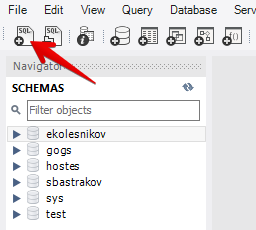

3. Скопируйте в буфер обмена содержимое файла `my.sql` (на демо-экзамене в ресурсах будет два файла: `my.sql` для *MySQL* и `ms.sql` для *MSSQL*) и вставьте его во вкладку SQL-скрипта, открытую в предыдущем пункте.

4. Добавьте в начало скрипта команду `USE <название вашей базы данных>;` (обращаю внимание, в MySQL команды должны завершаться точкой с запятой) и выполните скрипт (кликните по значку молнии)

    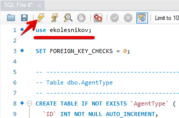

    После выполнения скрипта в вашей БД должны появиться новые таблицы (пустые)

    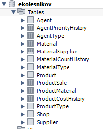

### Импорт данных

В ресурсах у нас есть три файла для импорта:

* `materials_short_k_import.txt`
* `products_k_import.csv`
* `productmaterial_k_import.xlsx`

>При реальной разработке вам придется самостоятельно разбираться в какую таблицу импортировать данные, но в рамках демо-экзамена имена импортируемых файлов обычно соответсвуют таблицам БД

#### Импорт материалов 

Процесс импорта состоит из нескольких этапов:

- [подготовка данных](#подготовка-данных)
- [импорт во временную таблицу](#импорт-во-временную-таблицу)
- перенос данных из временной таблицы в нужную таблицу(ы)

##### Подготовка данных

1. Открываем *Excel*

2. Открываем или импортируем файл с исходными данными

    >Файл материалов у нас в формате *TXT*. Такой формат напрямую из Excel открыть нельзя - загружайте через *импорт данных* (в разных версиях Excel меню может называться по-разному)
    >
    >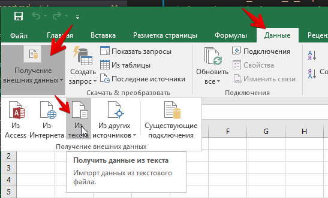

    * Выберите файл для импорта

        В мастере импорта на первом шаге выберите правильную кодировку (в предварительном просмотре должен быть читаемый текст) и поставьте, если нужно, *галочку* "мои данные содержат заголовки"

        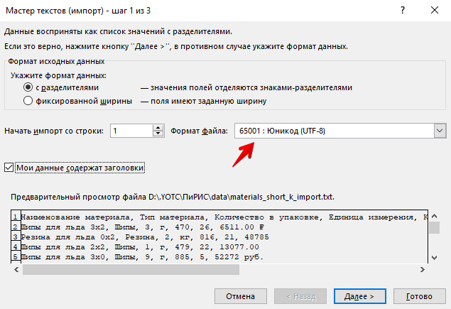

    * Выберите разделитель (обычно используется запятая или точка с запятой, но могут втретиться и более экзотические символы)

        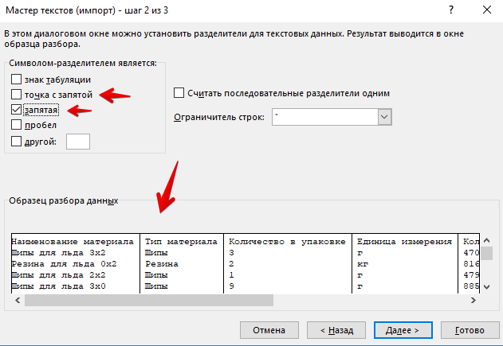

3. Правка данных

    После импорта данных смотрим всё-ли нормально с данными (Смотрим на структуру БД и просто включаем логику). В этой таблице в колонке "стоимость" явно лишние слова "руб." и "рублей"

    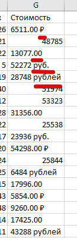

    * выделяем редактируемую колонку 

        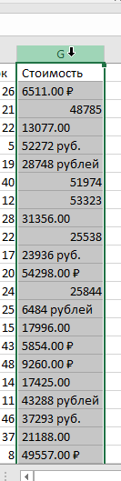

    * открываем диалог "Найти и заменить" (`Ctrl+F`)

        и вырезаем всё лишнее

        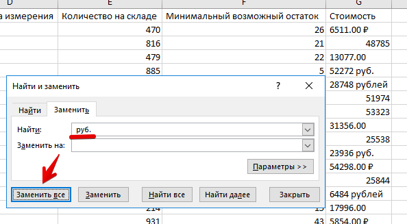

    * меняем формат ячейки на "числовой"

        Видим, что некоторые строки не распознались как числа. 

        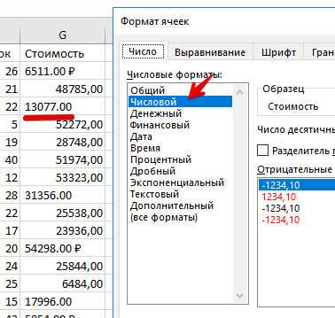

        Дело в том, что в русской локали разделителем разрядов является запятая, а в исходном файле резделитель точка - меняем точки на запятые

    * в одном из демо-экзаменов в базе названия картинок с расширением `.jpg`, а реальные файлы были с расширением `.jpeg` - обращайте внимание, в Excel-e это исправить проще, чем в базе

4. Экспорт данных

    MySQL может импортировать данные только в *CSV*-формате. Файл либо "сохраняем как", либо "экспортируем"

    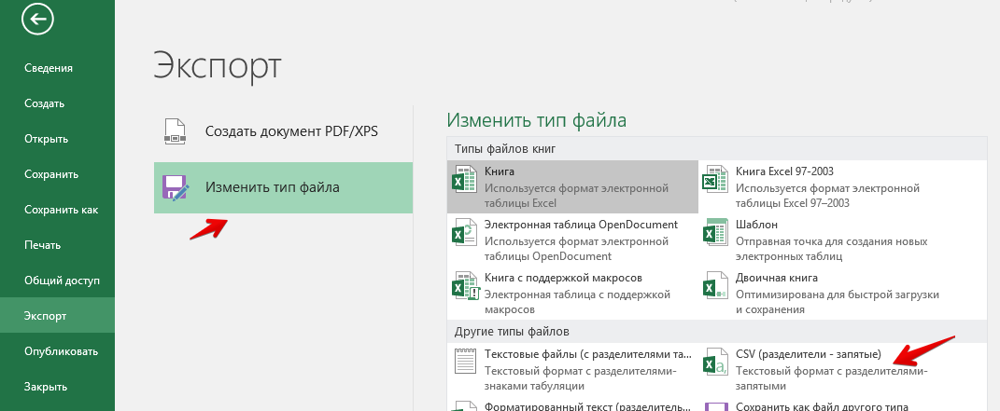

    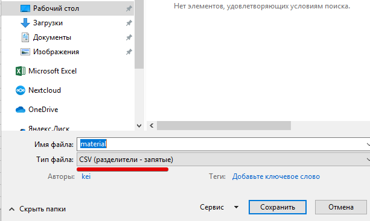


##### Проверка кодировки

>**ВАЖНО!!!** Кодировка импортируемых данных должна быть такой же, как кодировка базы данных (сейчас практически везде используется UTF-8)

**Excel** экспортирует текстовые данные в кодировке **ANSI** (1251)

Для перекодировки файла можно воспользоваться программой **Notepad++** - она будет на демо-экзамене

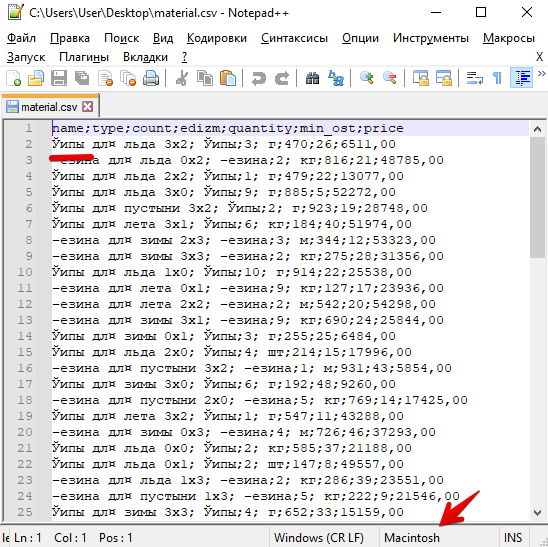

1. Обращаем внимание на кодировку файла. У меня, например, с какого-то перепугу решило что **Macintosh**.

    

    Меняем на "Windows-1251"

    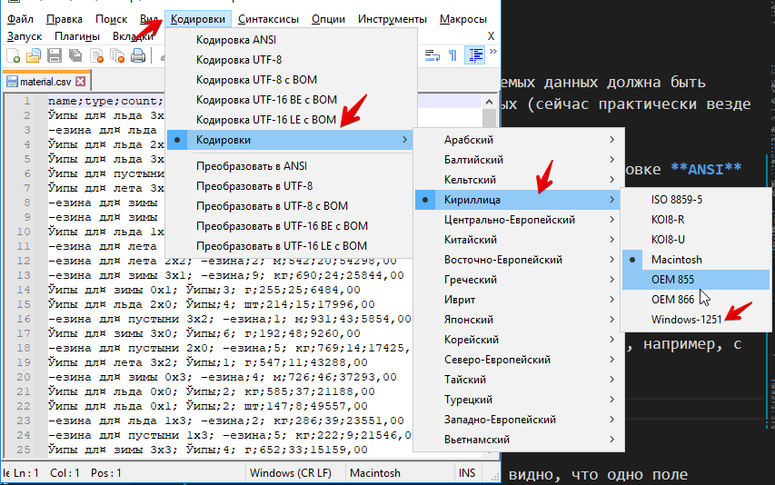

2. Кодировка теперь нормальная, но по содержимому видно, что у некоторых столбцов есть лидирующий пробел. Это не есть хорошо. 

    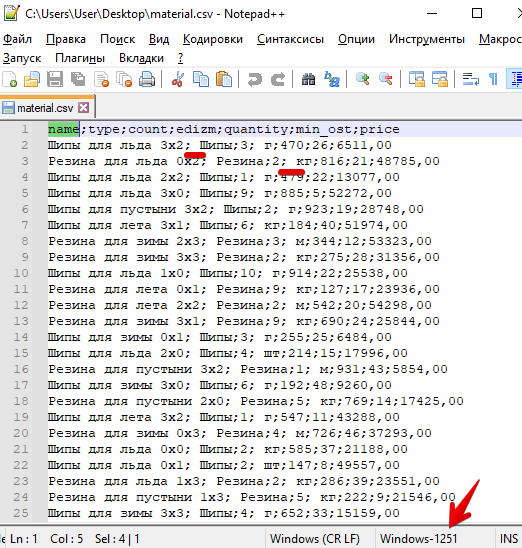

    Сдесь же в **Notepad++** заменим `"; "` на `";"`

    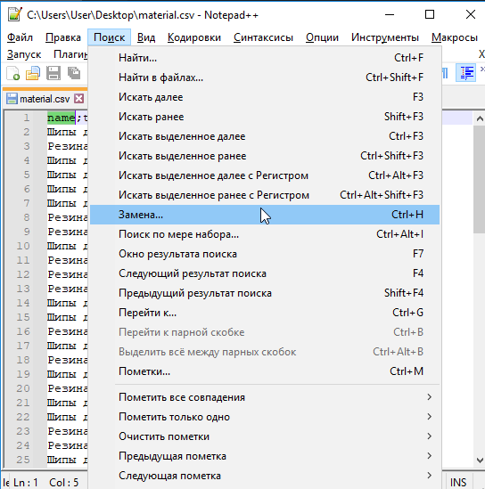

3. Если визуально всё нормально, то меняем кодировку файла на **UTF-8**

    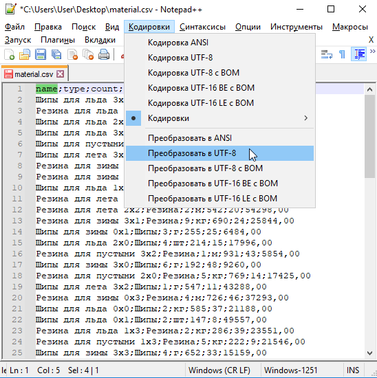

    и сохраняем файл

##### Импорт во временную таблицу

В контекстном меню базы данных запускаем "мастер импорта данных"

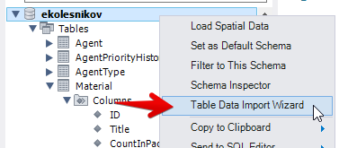

Импортируем в новую таблицу с уникальным именем

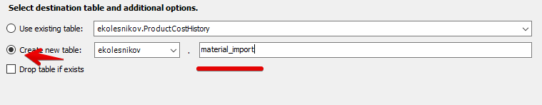

Смотрим, всё ли правильно определилось. Судя по тому, что цену как число не распознало MySQL по-умолчанию ждёт точку в качестве разделителя. 

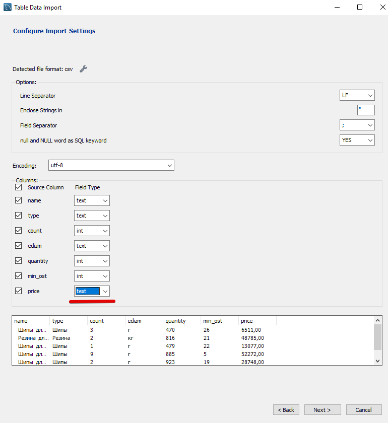

Меняем тип поля на *double* и в появившемся поле "Decimal Separator" пишем запятую.

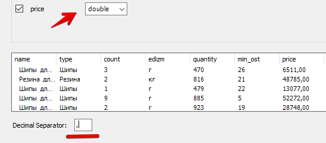

После импорта открываем таблицу и смотрим всё-ли нормально

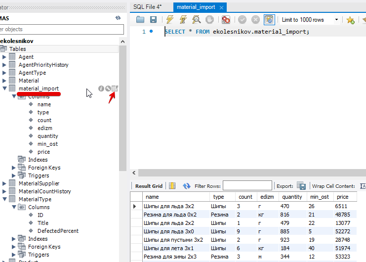

##### перенос данных из временной таблицы в нужную таблицу(ы)

По структуре таблицы **Material** видно, что одно поле словарное (*MaterialTypeID*)

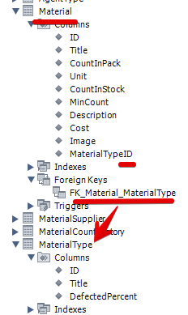

т.е. нам сначала нужно заполнить таблицу **MaterialType** уникальными значениями типов материалов. 

>Вспомиаем, что для выбора уникальных значений используется ключевое слово **DISTINCT**

Но, кроме названия метериала (*Title*) в таблице **MaterialType** есть ещё какой-то *DefectedPercent*. Смотрим структуру данных:

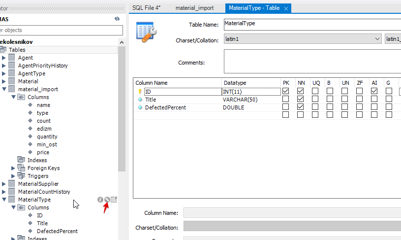

и видим, что поле это обязательное. 

Но в исходных данных у нас никаких "дефектных процентов" нет...

Тут есть два варианта:

* добавить фиксированное значение, взятое "с потолка"
* отменить обязательность этого поля (NN = Not NULL)

Мы будем использовать первый вариант.

1. Открываем окно с SQL-запросами (возможно оно ещё открыто после импорта структуры базы)

2. Пишем запрос для вставки уникальных значений типов материалов из временной таблицы. 

    Современные клиенты СУБД позволяют облегчить написание этих запросов:

    * в контекстном меню таблицы **MaterialType** выбираем "Send to SQL Editor" -> "Insert Statement"

        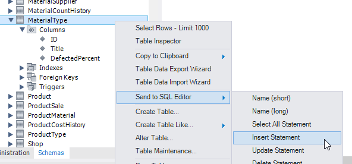

        В акивное окно SQL-запросов вставится следующий запрос:

        ```sql
        INSERT INTO `ekolesnikov`.`MaterialType`
            (`ID`,
            `Title`,
            `DefectedPercent`)
        VALUES
            (<{ID: }>,
            <{Title: }>,
            <{DefectedPercent: }>);
        ```

        т.е. у нас уже указана база и таблица, и перечислены все поля этой таблицы.

    * Из запроса удаляем поле **ID** (оно автоинкрементное и само заполнится при вставке) и выражение **VALUES...** (мы будем вставлять не фиксированные значения, а результат выборки из другой таблицы)

        Должен остаться такой текст (курсор оставляем после текста запроса)

        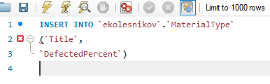

    * теперь аналогично из контекстного меню таблицы **material_import** выбираем "Send to SQL Editor" -> "Select All Statement"

        ```sql
        INSERT INTO `ekolesnikov`.`MaterialType`
            (`Title`,
            `DefectedPercent`)
        SELECT 
            `material_import`.`name`,
            `material_import`.`type`,
            `material_import`.`count`,
            `material_import`.`edizm`,
            `material_import`.`quantity`,
            `material_import`.`min_ost`,
            `material_import`.`price`
        FROM 
            `ekolesnikov`.`material_import`;
        ```

    * Количество и порядок выбираемых полей должны соответствовать вставляемым полям, перечисленным в круглых скобках запроса **INSERT**. Редактируем **SELECT** запрос:

        ```sql
        INSERT INTO `ekolesnikov`.`MaterialType`
            (`Title`,
            `DefectedPercent`)
        SELECT 
            DISTINCT `material_import`.`type`, 
            0
        FROM 
            `ekolesnikov`.`material_import`;
        ```

        т.е. мы убрали все поля, кроме *type* (тип материала), поставили перед ним ключевое слово **DISTINCT** (выбирать только уникальные) и для поля *DefectedPercent* записали константу "0"

        После выполнения получившегося запроса смотрим что загрузилось в целевую таблицу (MaterialType):

        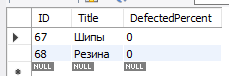

        Всё нормально, переходим к следующему этапу.

3. Пишем запрос для вставки данных в таблицу материалов (**Material**) с учётом словарного поля *MaterialTypeID*

    * очищаем окно SQL-запроса, вставляем в него "Insert Statement" для таблицы **Material** и вырезаем лишнее

        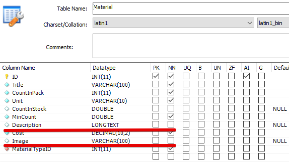

        Вырезаем поле *ID* (автоинкермент), поля *Description* и *Image* (в исходных данных их нет и поля не обязательные)

        ```sql
        INSERT INTO `ekolesnikov`.`Material`
            (`Title`,
            `CountInPack`,
            `Unit`,
            `CountInStock`,
            `MinCount`,
            `Cost`,
            `MaterialTypeID`)
        ```

    * Вставляем "Select All Statement" из таблицы **material_import**    

        ```sql
        INSERT INTO `ekolesnikov`.`Material`
            (`Title`,
            `CountInPack`,
            `Unit`,
            `CountInStock`,
            `MinCount`,
            `Cost`,
            `MaterialTypeID`)
        SELECT 
            `material_import`.`name`,
            `material_import`.`type`,
            `material_import`.`count`,
            `material_import`.`edizm`,
            `material_import`.`quantity`,
            `material_import`.`min_ost`,
            `material_import`.`price`
        FROM 
            `ekolesnikov`.`material_import`;
        ```

        Вспоминаем, что порядок и количество полей должны совпадать и редактируем запрос:

        ```sql
        INSERT INTO `ekolesnikov`.`Material`
            (`Title`,
            `CountInPack`,
            `Unit`,
            `CountInStock`,
            `MinCount`,
            `Cost`,
            `MaterialTypeID`)
        SELECT `material_import`.`name`,
            `material_import`.`count`,
            `material_import`.`edizm`,
            `material_import`.`quantity`,
            `material_import`.`min_ost`,
            `material_import`.`price`,
            MaterialType.ID
        FROM 
            `ekolesnikov`.`material_import`, 
            `ekolesnikov`.MaterialType
        WHERE 
            `material_import`.`type`=MaterialType.Title;
        ```

        Для получения идентификатора типа материала (`MaterialType.ID`) мы добавили в запрос таблицу **MaterialType** (в секцию FROM) 

        И связали исходные таблицы по названию типа (секция WHERE)

        После выполнения получившегося запроса в окне **Output** должно появиться сообщение:

        ```
        50 row(s) affected Records: 50  Duplicates: 0  Warnings: 0	0.047 sec
        ```

Самостоятельно загрузите данные из файлов `products_k_import.csv` и `productmaterial_k_import.xlsx`

<table style="width: 100%;"><tr><td style="width: 40%;">
<a href="../articles/sql_for_beginner.md">Основы SQL
</a></td><td style="width: 20%;">
<a href="../readme.md">Содержание
</a></td><td style="width: 40%;">
<a href="../articles/cs_mysql_connection3.md">Создание подключения к БД MySQL. Получение данных с сервера.
</a></td><tr></table>
