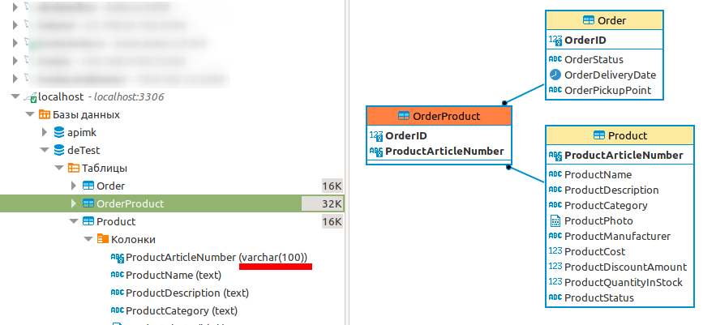
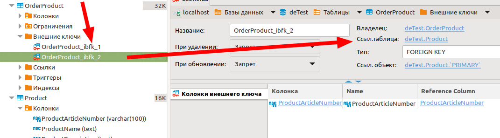
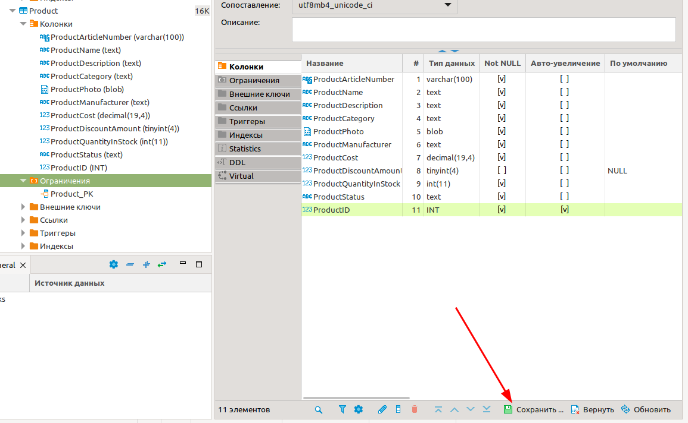
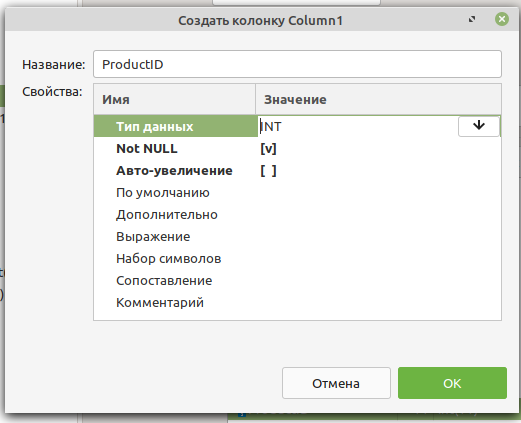
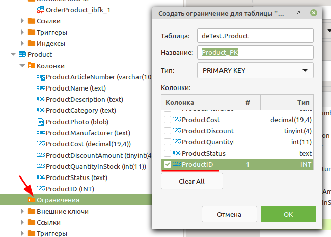
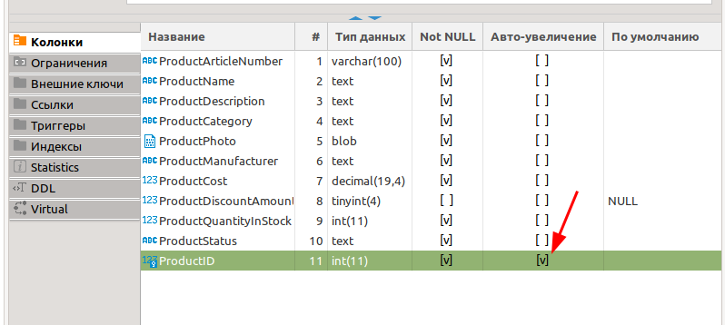
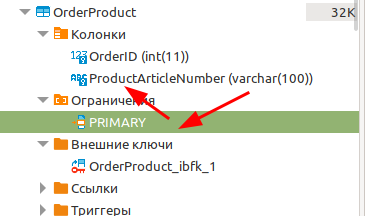
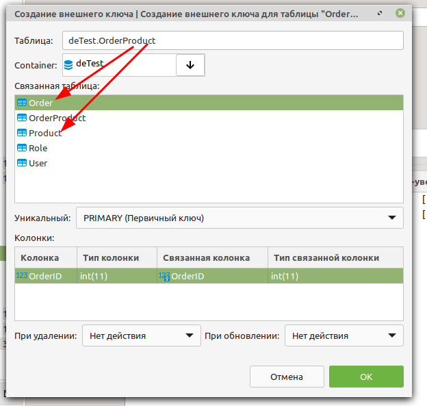

<table style="width: 100%;"><tr><td style="width: 40%;">
<a href="../articles/sql_import.md">Восстановление базы данных из скрипта. 
</a></td><td style="width: 20%;">
<a href="../readme.md">Содержание
</a></td><td style="width: 40%;">
<a href="../articles/sql_view.md">Представления (View)
</a></td><tr></table>

# Импорт данных (вариант 22).

>Разбор импорта данных из задания 22 года [variant22.zip](../data/variant22.zip)

>Эта лекция написана с использованием программы **dBeaver**, т.к. я не нашёл как в в **MySQL Workbench** визуально добавить внешний ключ.

## Текст задания

>Для восстановления таблиц в созданную базу данных воспользуйтесь
предоставленным скриптом (ms.sql или my.sql в зависимости от выбранной СУБД). В процессе разработки приложения Вы **должны доработать эту базу данных**, обеспечив хранение всех данных, которые предоставил Вам заказчик. Для этого вам необходимо будет
**добавить необходимые сущности, атрибуты и связи**.

В файле импорта удалите или закомментируйте команду создания БД (напоминаю, что прав на **DDL** у вас нет). В команде **use** укажите название вашей БД.

```sql
-- create database trade;
use ekolesnikov;
```

Дальше желательно проверить скрипт на использование ключевых слов **SQL** в именах сущностей или атрибутов (в этом скрипте используется зарезервированное слово **Order**). Такие слова нужно экранировать (заключить в обрантые кавычки: ``` `Order` ```) либо сразу запустить скрипт и править ошибки по мере выявления (тут придётся комментировать уже выполненные части скрипта)


После разворачивания структуры нужно визуально убедиться, что она соответсвует **3НФ**.

## Проверка структуры



Например, в таблице **Product** первичным ключём сделан *Артикульный номер* с типом **строка**. Нужно добавить синтетический первичный ключ **ProductID** и переделать связь с ним из таблицы **OrderProduct**.

Нам нужно: удалить существующую связь, добавить синтетический первичный ключ, создать новую связь с новым первичным ключём.

1. Удалим связь с продукцией из таблицы связей **OrderProduct** (иначе мы не сможем удалить существующий первичный ключ)

    

    У таблицы **OrderProduct** два внешних ключа и неочевидные названия связей. Открываем связи и смотрим на какую таблицу они ссылаются. Нам нужно удалить ту, которая ссылается на таблицу **Product** (ключ не удаляется, если таблица открыта для просмотра). 

1. В таблице **Product** удалите первичный ключ (он находится во вкладке *Ограничения*)

1. Сохраните изменения

    

1. В таблицу **Product** добавьте новую колонку (в контекстном меню *Колонки -> Создать объект колонка*), пока не включая авто инкемент (иначе потом невозможно создать первичный ключ).

    


    В контекстном меню *Ограничения -> Создать объект оганичения* добавить первичный ключ на созданное поле

    

    Сохраните изменения

    Добавьте авто инкремент и снова сохраните

    

1. В таблице **OrderProduct** удалите поле *ProductArticleNumber*, ограничения и внешние ключи (поле не даёт удалять, пока есть ограничение, ограниение не даёт удалять пока есть внешний ключ...).

    

1. Создайте поле **ProductID** и добавьте внешние ключи для полей **OrderID** и **ProductID**

    


Получилось очень сложно, проще всё это поправить в скрипте ДО его выполнения (и даже не нужно особенно знать синтаксис **SQL** - в скрипте уже все команды написаны).

## Проверка исходных данных

Для импорта у нас есть 4 файла: `user_import.xlsx`,  `Заказ_import.xlsx`, `Пункты выдачи_import.xlsx` и `Товар_import\Товар_import_Столовые приборы.xlsx`

Чтобы определиться, в каком порядке их импортировать, нужно читать задание. Там сказано, что сначала нужно показать окно авторизации, а затем список продукции. Таким образом, первыми мы будем импортировать `user_import.xlsx` и `Товар_import\Товар_import_Столовые приборы.xlsx`

* `user_import.xlsx` - в этом файле нужно разбить ФИО на составные части. И в **excel** и в **SQL** есть методы разбиения строки на части, но конкретно здесь проще выделить руками (10 строк).

* `Товар_import_Столовые приборы.xlsx`

    - в структуре БД нет полей для "Единица измерения", "Размер максимально возможной скидки", "Поставщик"

    - Поля "Категория", "Производитель" и "Поставщик" должны быть словарями

# Задание

* исправить скрипт создания БД (создать недостающие таблицы и связи) и выполнить его

    >Переименуйте таблицы, которые у вас уже есть в БД

* импортировать данные из файлов `user_import.xlsx` и `Товар_import_Столовые приборы.xlsx`

<table style="width: 100%;"><tr><td style="width: 40%;">
<a href="../articles/sql_import.md">Восстановление базы данных из скрипта. 
</a></td><td style="width: 20%;">
<a href="../readme.md">Содержание
</a></td><td style="width: 40%;">
<a href="../articles/sql_view.md">Представления (View)
</a></td><tr></table>
