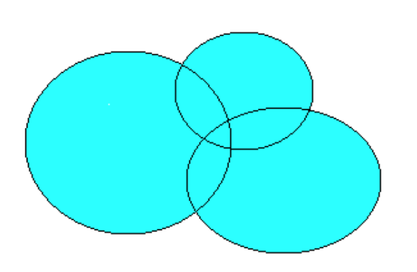

# Реализация тестов для прошлых чемпионатов

## Чемпионат 2022 года

### Подсистема "Расчета количества базовых станций"

В отдельной библиотеке классов реализуйте алгоритм расчета количества базовых станций (далее  - **БС**).
 
На сегодняшний день базовые станции по всему городу арендуются компанией **ТНС**. В связи с ростом количества абонентов руководство компании приняло решение о постепенной установке собственных базовых станций.
 
В 2022 году планируется закупка необходимого оборудования для Адмиралтейского и Василеостровского района Санкт-Петербурга. 

Количество базовых станций может быть рассчитано как на основании площади предполагаемой зоны обслуживания, так и на основании радиуса (в км). Также в качестве входных данных необходимо использовать площадь покрытия базовой станции и радиусы трех любых базовых станций (включая основную базовую).

Расчет радиуса зоны обслуживания R₀, км производится по формуле:

**`R₀ = √(s/π)`**, где **s** - площадь района обслуживания

Сота - площадь, покрываемая одним приемопередатчиком (базовой станцией) сети сотовой связи.

Число сот L можно определить по формуле:

**`L = K * (R₀ / R)²`**,  где:
- R - радиус покрытия базовой станции, 
- К - коэффициент застройки. 

Радиус покрытия базовой станции вы должны рассчитать на основе площади (**S**) покрытия базовой станции, выразив **R**  из формулы **`S = πR²`**.

Коэффициенты застройки:
* Плотная городская застройка **`К = 1,21`**
* Средняя городская застройка (малые города, новые жилые комплексы) **`К = 0,9`**
* Сельская застройка **`К = 0,47`**

Количество базовых станций рассчитайте по формуле: 
**`n = L / C`**, где 
- **n** - количество базовых станций, 
- **C** - количество базовых станций в одном кластере. 

Обратите внимание, что при расчете количестве базовых станций по району значение **L** - среднее арифметическое по всем **БС**.
 
Кластер состоит из **С** базовых станций, работающих в разных диапазонах частот. **С** - аддитивная (суммирующая) составляющая, равная:

**`С = D₁⁵/² + D₂³/² + D₃¹/²`**, где D₁, D₂, D₃ - диаметры 3-х любых базовых станций с разной частотой, в порядке убывания, то есть - D₁ - наибольший диаметр, D₃ - наименьший диаметр. 

Не забывайте, что **`D = 2R`**. 

На рисунке пример расположения базовых станций.
 

 
При расчете количества базовых станций необходимо использовать показания хэндовера по указанным районам.
 
Хэндовер (Handover) – процедура передачи активного соединения между сотами. Хэндовер позволяет абонентам не быть привязанным к какой-либо географической точке и дает возможность передвигаться в пределах сети оператора без разрыва соединения.

Для каждого района с помощью соответствующего метода в API можно получить значение хэндовера.

*Обратитесь к документации по работе с API в ресурсах. Так же в ресурсах изучите допустимые значения хэндовера.*

Если средние показания хэндовера меньше допустимых значений хотя бы по одной из базовых станций, то используется формула  **`n = L / C * 1,4`**.

Рассчитайте **n** общее для всех районов, и для каждого района отдельно. 

### Тестирование

Для выполнения процедуры тестирования созданной библиотеки вам необходимо создать отдельный проект модульных тестов.

В рамках проекта разработайте тесты, максимально полно покрывающие функционал методов. Ничего страшного, если ваши методы работают не совсем идеально и тесты могут быть не пройдены в связи с этим - в данном модуле это не так важно.

Обратите внимание, что имена тестов должны отражать их суть, т.е. вместо *TestMethod1()* тест следует назвать, например, *BaseStations_OverHandover()* для тестирования случая превышения показателя хэндовера.

Чтобы проверить работу своей библиотеки необходимо подготовить 10 unit-тестов.
