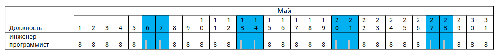

# Разработка библиотеки по расчету заработной платы

Разработайте библиотеку, которая позволит рассчитать заработную плату сотрудников.

Необходимо обязательно следовать правилам именования библиотек, классов и методов в них. В случае ошибок в рамках именования ваша работа не может быть проверена и ваш результат не будет зачтен. Классы и методы должны содержать модификатор `public` (если это реализуемо в рамках платформы), чтобы внешние приложения могли получить к ним доступ. 

По трудовому законодательству базовый объем рабочей недели составляет 40 часов и рассчитывается как 5 рабочих дней по 8 часов. Для работников предполагается премирование за сверхурочную работу.

## Алгоритм расчета премии:

* за каждый переработанный час в рабочие дни (учитываются только рабочие дни)  работнику оплачиваются сверхурочные в размере 2 процентов от оклада,
* работа по выходным также премируется, процент премии рассчитывается пропорционально указанному выше алгоритму - за отработанный час 2 процента от оклада, при расчете отработанных часов на выходных не учитываются недоработки в будни. То есть даже если сотрудник отработал в будни 26 часов, что меньше базового объема работы на 14 часов, работа в выходные будет оплачиваться как премиальные, а не как доработка 14 часов до базового объема недельной работы;
* максимальный процент премии в месяц составляет 60 процентов от оклада,
* при превышении максимального процента время переносится на отгулы в соотношении 8 часов = 1 отгул, не целая часть от деления количества часов на количество дней отгулов обнуляется и не переносится на следующий месяц;
* если задача завершена раньше крайнего срока исполнения, то исполнитель получает премию 2 процента от оклада, расчет ведется по каждой выполняемой задаче сотрудника;
* если сотрудник брал больничный, то базовый объем часов считается не за календарную неделю, а за отработанные дни из расчета 8 часов в день,
* в случае болезни сотрудник получает пособие по больничному листу, размер которого определяется как средняя оплата за 1 рабочий день по предыдущему месяцу работы, умноженному на количество дней больничного листа, и выплачивается в месяц закрытия больничного листа. Если есть данные про предыдущему месяцу работы, то расчет ведется по среднему значению оплаты, если сотрудник только устроился на работу и данных по предыдущему месяцу работы нет, то среднее значение оплаты за 1 рабочий день принимается за 400 руб.

## Штрафы:

На работника начисляются штрафы за невыполненную в срок задачу, за каждый рабочий день просрочки 1 процент от оклада. При этом размер штрафов не может снизить общую сумму выплат меньше минимального размера оплаты труда – 16 242 рубля. Сумма штрафов на следующий месяц не переносится.

## Вход: 

* табель учета рабочего времени одного конкретного сотрудника (пример табелей разных сотрудников есть в [Timesheets.xlsx](../data/Timesheets.xlsx)),
* отчет по просроченным задачам (пример отчета можно найти [ReportOnOverdueTasks.xlsx](../data/ReportOnOverdueTasks.xlsx)),
* оклад сотрудника (список сотрудников с окладами содержится в [EmployeeSalary.xlsx](../data/EmployeeSalary.xlsx)).

## Выход:

Cписок заработной платы по конкретному сотруднику (сумма выплат за месяц, общая выплата/премия/штрафы/выплаты по листу нетрудоспособности/отгулы).

## Требования к именованиям и форматам
 
&nbsp; | C# | Java | Python
-------|----|------|--------
Библиотека классов | SalaryAccountingLib.dll | SalaryAccountingLib.jar | SalaryAccountingLib
Название класса | Salary | Salary | Salary
Название метода | CalculationSalary() | CalculationSalary() | CalculationSalary()
Статичность метода | да | да | да
Входящие обязательные параметры | `List<WorkingDay> workingDays`,<br/>`List<Task> tasks`,<br/>`double salary` | `List<WorkingDay> workingDays`,<br/>`List<Task> tasks`,<br/>`double salary` | `workingDays: List[WorkingDay]`,<br/>`tasks: List[task]`,<br/>`salary: float`<br/>
Возвращаемые параметры | `double[]` | `doublel[]` | `List[float]`

### Класс Models/Employee

C#:

```cs
public class Employee
{
    [JsonPropertyName("Position")]
    public string Position { get; set; }
    [JsonPropertyName("Salary")]
    public double Salary { get; set; }
    [JsonPropertyName("Tasks")]
    public List<TaskDTO> Tasks { get; set; }
    [JsonPropertyName("WorkingDays")]
    public List<WorkingDay> WorkingDays { get; set; }
}
```

Java:

```java
public class Employee
{
    @JsonSetter("Position")
    public String Position ;
    @JsonSetter("Salary")
    public double Salary ;
    @JsonSetter("Tasks")
    public List<TaskDTO> Tasks ;
    @JsonSetter("WorkingDays")
    public List<WorkingDay> WorkingDays ;
}
```

Python:

```py
@dataclass
class employee:
    Position: str
    Salary: int
    WorkingDays: List[WorkingDay]
    Tasks: List[TaskDTO]

    @staticmethod
    def from_dict(obj: Any) -> 'Employee':
        _Position = str(obj.get("Position"))
        _Salary = int(obj.get("Salary"))
        _WorkingDays = [WorkingDay.from_dict(y) for y in obj.get("WorkingDays")]
        _Tasks = [TaskDTO.from_dict(y) for y in obj.get("TasksDTO")]
        return employee(_Position, _Salary, _WorkingDays, _Tasks)
```

### Перечисление Models/StatusDay

C#:

```cs
public enum StatusDay
{
    Working,// Рабочий день
    PreWorking,// Праздничный день
    SickLeave,// Больничный
    DisrespectfulSash,// Отсутвие по неуважительной причине
    Holiday// Отпуск
}
```

Java:

```java
@JsonFormat(shape = JsonFormat.Shape.NUMBER)
public enum StatusDay{
    Working,            // Рабочий день
    PreWorking,         // Предпраздничный день
    SickLeave,          // Больничный
    DisrespectfulSash,  // Отсутвие по неуважительной причине
    Holiday;           // Отпуск или выходной нерабочий день
}
```

Python:

```py
class StatusDay(IntEnum):
    Working = 0
    PreWorking = 1
    SickLeave = 2
    DisrespectfulSash = 3
    Holiday = 4
```

### Класс Models/TaskDTO:

C#:

```cs
public class TaskDTO
{
    [JsonPropertyName("FullTitle")]
    public string FullTitle { get; set; }
    [JsonPropertyName("Deadline")]
    public DateTime Deadline { get; set; }
    [JsonPropertyName("FinishActualTime")]
    public DateTime FinishActualTime { get; set; }
}
```

Java:

```java
public class TaskDTO {
    @JsonSetter("FullTitle")
    public String FullTitle ;
    @JsonSetter("Deadline")
    public LocalDateTime Deadline ;
    @JsonSetter("FinishActualTime")
    public LocalDateTime  FinishActualTime ;
}
```

Python:

```py
@dataclass
class TaskDTO:
    FullTitle: str
    Deadline: str
    СompletionDate: str

    @staticmethod
    def from_dict(obj: Any) -> 'TaskDTO':
        _FullTitle = str(obj.get("FullTitle"))
        _Deadline = str(obj.get("Deadline"))
        _СompletionDate = str(obj.get("СompletionDate"))
        return TaskDTO(_FullTitle, _Deadline, _СompletionDate)
```

### Класс Models/WorkingDay:

C#:

```cs
public class WorkingDay
{
    [JsonPropertyName("Date")]
    public DateOnly Date { get; set; }
    private int hours;
    [JsonPropertyName("Value")]
    public string Hours
    {
        get =>  hours.ToString();
        set => hours = (value!="б" )?Convert.ToInt32(value):-1;
    }
    [JsonPropertyName("Status")]
    public StatusDay Status { get; set; }
}
```

Java:

```java
public class WorkingDay {
    @JsonSetter("Date")
    public java.util.Date Date;
    private int hours;
    @JsonSetter("Value")
    public String Hours;
    @JsonSetter("Status")
    public StatusDay Status;
    public String getHours() {
        if (Status == StatusDay.Working|| Status == StatusDay.PreWorking)
        {
            return ""+hours;
        }
        else {
            return ""+0;
        }
    }
    public void setHours(String value) {
        if (Status == StatusDay.Working && value!="б" || Status == StatusDay.PreWorking && value!="б")
        {
            hours = Integer.parseInt(value);
        }
        else if (value=="б")
        {
            hours = -1;
        }
        else
        {
            hours = 0;
        }
    }
}
```

Python:

```py
@dataclass
class WorkingDay:
    Date: str
    Status: StatusDay
    Value: str

    @staticmethod
    def from_dict(obj: Any) -> 'WorkingDay':
        _Date = str(obj.get("Date"))
        _Status = int(obj.get("Status"))
        _Value = str(obj.get("Value"))
        return WorkingDay(_Date, _Status, _Value)
```


### Пример:

Если для некоторой должности `X`, месячная оплата труда которой составляет 100000 руб. за 160 рабочих часов и месячный табель рабочего времени соответствует табл. 1. и выполненные задачи в табл. 2.



ЗП по табелю = 625 руб * 184 = 115 000 руб, где 625 руб - стоимость 1 часа (100 000/160)

Исполнитель | Задача | Дедлайн | Дата завершения задачи
------------|--------|---------|-----------------------
Инженер-программист | Ввод связанных документов Заявки, Приказы, Экзаменационные ведомости, Протоколы | 14.05.2023 0:00 | 31.05.2023 0:00

При нарушении сроков выполнения хотя бы одной задачи сотрудник лишается премии, даже при выполнении других задач вовремя. 

Так как задача не была выполнена в срок, то:

```
Штраф = (Дата завершения задачи - Дедлайн - Выходные/Праздничные дни) * (оклад * 1%) = (31 - 14 - 4) * (100 000 руб * 0,01) = 13 000 руб.

ЗП с учетом доплат и взысканий  = ЗП по табелю + Премия - Штраф = 102 000 руб.
```

Метод должен вернуть массив следующих значений:

```
[ЗП с учетом доплат и взысканий, Премия, Штрафы, Выплаты по листу нетрудоспособности, Отгулы ] = [102000, 0, 13000, 0, 0]
```

## Разработка библиотеки

Разработайте библиотеку для расчета заработной платы сотрудников с учетом выполненных задач в срок, больничных листов, окладов и прочих факторов. 
Необходимо обязательно следовать правилам именования библиотек, классов и методов в них. В случае ошибок в рамках именования ваша работа не может быть проверена и ваш результат не будет зачтен. Классы и методы должны содержать модификатор `public` (если это реализуемо в рамках платформы), чтобы внешние приложения могли получить к ним доступ. 

Описание входных/выходных параметров, методику и примеры расчета, а также тестовые данные для тестирования библиотеки можно найти в ресурсах к заданию.

## Модульное тестирование 

Реализуйте 5 unit-тестов для библиотеки по расчету заработной платы сотрудников, функционал которой описан выше. Важно, чтобы тестовые данные предусматривали различные ситуации: 

1. наличие премии за выход на праздниках и выходные дни;
1. наличие штрафа  за просроченные задачи;
1. наличие больничного листа для сотрудника, отработавшего более 3-х месяцев;
1. наличие больничного листа для нового сотрудника, отработавшего меньше месяца;
1. превышение общей суммы штрафов суммы возможной выплаты.
