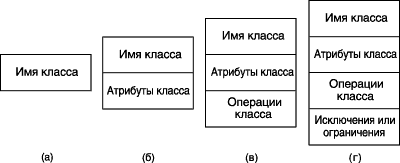
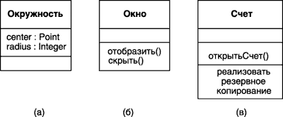
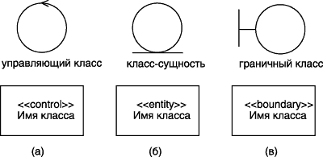
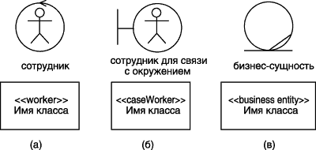
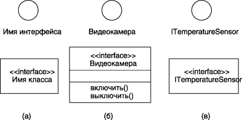
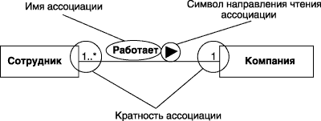
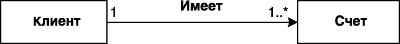
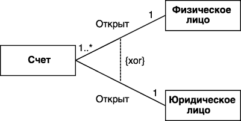
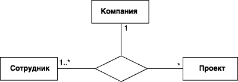

# Диаграмма классов

<!-- https://intuit.ru/studies/courses/32/32/lecture/1008 -->

Центральное место в методологии ООАП занимает разработка логической модели системы в виде диаграммы классов. **Диаграмма классов** отражает, в частности, различные взаимосвязи между отдельными сущностями предметной области, такими как объекты и подсистемы, а также описывает их внутреннюю структуру и типы отношений. На данной диаграмме не указывается информация о временных аспектах функционирования системы. С этой точки зрения диаграмма классов может служить дальнейшим развитием концептуальной модели проектируемой системы

Диаграмма классов (class diagram) — диаграмма языка UML, на которой представлена совокупность декларативных или статических элементов модели, таких как классы с атрибутами и операциями, а также связывающие их отношения.

Диаграмма классов предназначена для представления статической структуры модели системы в терминологии классов объектно-ориентированного программирования. При этом диаграмма классов может содержать интерфейсы, пакеты, отношения и даже отдельные экземпляры классификаторов, такие как объекты и связи. Когда говорят о данной диаграмме, имеют в виду статическую структурную модель проектируемой системы, т.е. графическое представление таких структурных взаимосвязей логической модели системы, которые не зависят от времени.

## Класс

Класс (class) — абстрактное описание множества однородных объектов, имеющих одинаковые атрибуты, операции и отношения с объектами других классов.

Графически класс в нотации языка UML изображается в виде прямоугольника, который дополнительно может быть разделен горизонтальными линиями на разделы или секции. В этих секциях могут указываться имя класса, атрибуты и операции класса.



На начальных этапах разработки диаграммы отдельные классы могут обозначаться простым прямоугольником, в котором должно быть указано имя соответствующего класса (а). По мере проработки отдельных компонентов диаграммы описание классов дополняется атрибутами (б) и операциями (в). Четвертая секция (г) не обязательна и служит для размещения дополнительной информации справочного характера, например, об исключениях или ограничениях класса, сведения о разработчике или языке реализации. Предполагается, что окончательный вариант диаграммы содержит наиболее полное описание классов, которые состоят из трех или четырех секций.

Даже если секции атрибутов и операций пусты, в обозначении класса они должны быть выделены горизонтальной линией, с тем чтобы отличить класс от других элементов языка UML. 

Примеры графического изображения конкретных классов:



В первом случае для класса **Окружность** (а) указаны только его атрибуты – точка на координатной плоскости, которая определяет расположение ее центра и длина радиуса окружности. Для класса **Окно** (б) указаны только его операции, при этом секция его атрибутов оставлена пустой. Для класса **Счет** (в) дополнительно изображена четвертая секция, в которой указано требование – реализовать резервное копирование объектов этого класса.

## Имя класса

Имя класса должно быть уникальным в пределах пакета, который может содержать одну или несколько диаграмм классов. Имя указывается в самой верхней секции прямоугольника, поэтому она часто называется секцией имени класса. В дополнение к общему правилу именования элементов языка UML, имя класса записывается по центру секции имени полужирным шрифтом и должно начинаться с заглавной буквы. Рекомендуется в качестве имен классов использовать существительные, записанные по практическим соображениям без пробелов. Необходимо помнить, что имена классов образуют словарь предметной области при ООАП.

В секции имени класса могут также находиться стереотипы или ссылки на стандартные шаблоны, от которых образован данный класс и, соответственно, от которых он наследует атрибуты и операции. В этой секции может также приводиться информация о разработчике данного класса и статус состояния разработки. Здесь также могут записываться и другие общие свойства этого класса, имеющие отношение к другим классам диаграммы или стандартным элементам языка UML.

Класс может иметь или не иметь экземпляров или объектов. В зависимости от этого в языке UML различают конкретные и абстрактные классы.

**Конкретный класс** — класс, на основе которого могут быть непосредственно созданы экземпляры или объекты.

Рассмотренные выше обозначения относятся к конкретным классам. От них следует отличать абстрактные классы.

**Абстрактный класс** (abstract class) — класс, который не имеет экземпляров или объектов.

Для обозначения имени абстрактного класса используется наклонный шрифт (курсив). В языке UML принято общее соглашение о том, что любой текст, относящийся к абстрактному элементу, записывается курсивом. Это имеет принципиальное значение, поскольку является семантическим аспектом описания абстрактных элементов языка UML.

В некоторых случаях необходимо явно указать, к какому пакету относится тот или иной класс. Для этой цели используется специальный символ разделитель – двойное двоеточие - `(::)`. Синтаксис строки имени класса в этом случае будет следующий: `<Имя пакета>::<Имя класса>`. Другими словами, перед именем класса должно быть явно указано имя пакета, к которому его следует отнести. Например, если определен пакет с именем **Банк**, то класс **Счет** в этом банке может быть записан в виде: **Банк::Счет**.

## Атрибуты класса

Атрибут (attribute) — содержательная характеристика класса, описывающая множество значений, которые могут принимать отдельные объекты этого класса.

Атрибут класса служит для представления отдельного свойства или признака, который является общим для всех объектов данного класса. Атрибуты класса записываются во второй сверху секции прямоугольника класса. Эту секцию часто называют секцией атрибутов.

В языке UML принята определенная стандартизация записи атрибутов класса, которая подчиняется некоторым синтаксическим правилам. Каждому атрибуту класса соответствует отдельная строка текста, которая состоит из квантора видимости атрибута, имени атрибута, его кратности, типа значений атрибута и, возможно, его исходного значения. Общий формат записи отдельного атрибута класса следующий:

`<квантор видимости> <имя атрибута> [кратность] :
<тип атрибута> = <исходное значение> {строка-свойство}`.

* **Видимость** (visibility) — качественная характеристика описания элементов класса, характеризующая потенциальную возможность других объектов модели оказывать влияние на отдельные аспекты поведения данного класса.

    Видимость в языке UML специфицируется с помощью квантора видимости (visibility), который может принимать одно из 4-х возможных значений и отображаться при помощи специальных символов.

    * Символ " **+** " – обозначает атрибут с областью видимости типа общедоступный (**public**). Атрибут с этой областью видимости доступен или виден из любого другого класса пакета, в котором определена диаграмма.
    * Символ " **#** " – обозначает атрибут с областью видимости типа защищенный ( **protected** ). Атрибут с этой областью видимости недоступен или не виден для всех классов, за исключением подклассов данного класса.
    * Символ " **-** " – обозначает атрибут с областью видимости типа закрытый (**private**). Атрибут с этой областью видимости недоступен или не виден для всех классов без исключения.
    * И, наконец, символ " **~** " - обозначает атрибут с областью видимости типа пакетный (**package**). Атрибут с этой областью видимости недоступен или не виден для всех классов за пределами пакета, в котором определен класс -владелец данного атрибута.

    Квантор видимости может быть опущен. Его отсутствие означает, что видимость атрибута не указывается. Эта ситуация отличается от принятых по умолчанию соглашений в традиционных языках программирования, когда отсутствие квантора видимости трактуется как **public** или **private**. Однако вместо условных графических обозначений можно записывать соответствующее ключевое слово: **public**, **protected**, **private**, **package**.

* **Имя атрибута** представляет собой строку текста, которая используется в качестве идентификатора соответствующего атрибута и поэтому должна быть уникальной в пределах данного класса. Имя атрибута - единственный обязательный элемент синтаксического обозначения атрибута, должно начинаться со строчной (малой) буквы и не должно содержать пробелов.

* **Кратность** (multiplicity) — спецификация области значений допустимой мощности, которой могут обладать соответствующие множества.

    Кратность атрибута характеризует общее количество конкретных атрибутов данного типа, входящих в состав отдельного класса. В общем случае кратность записывается в форме строки текста из цифр в квадратных скобках после имени соответствующего атрибута, при этом цифры разделяются двумя точками: [нижняя граница .. верхняя граница], где нижняя и верхняя границы положительные целые числа. Каждая такая пара служит для обозначения отдельного замкнутого интервала целых чисел, у которого нижняя (верхняя) граница равна значению нижней границы (верхней). В качестве верхней границы может использоваться специальный символ " __*__ " (звездочка), который означает произвольное положительное целое число, т.е. неограниченное сверху значение кратности соответствующего атрибута.

    Интервалов кратности для отдельного атрибута может быть несколько. В этом случае их совместное использование соответствует теоретико-множественному объединению соответствующих интервалов. Значения кратности из интервала следуют в монотонно возрастающем порядке без пропуска отдельных чисел, лежащих между нижней и верхней границами. При этом придерживаются следующего правила: соответствующие нижние и верхние границы интервалов включаются в значение кратности.

    Если в качестве кратности указывается единственное число, то кратность атрибута принимается равной данному числу. Если же указывается единственный знак " __*__ ", то это означает, что кратность атрибута может быть произвольным положительным целым числом или нулем. В языке UML кратность широко используется также для задания ролей ассоциаций, составных объектов и значений атрибутов. Если кратность атрибута не указана, то по умолчанию в языке UML принимается ее значение равное [1..1], т.е. в точности 1.

* **Тип атрибута** представляет собой выражение, семантика которого определяется некоторым типом данных, определенным в пакете Типы данных языка UML или самим разработчиком. В нотации UML тип атрибута иногда определяется в зависимости от языка программирования, который предполагается использовать для реализации данной модели. В простейшем случае тип атрибута указывается строкой текста, имеющей осмысленное значение в пределах пакета или модели, к которым относится рассматриваемый класс.

* **Исходное значение** служит для задания начального значения соответствующего атрибута в момент создания отдельного экземпляра класса. Здесь необходимо придерживаться правила принадлежности значения типу конкретного атрибута. Если исходное значение не указано, то значение соответствующего атрибута не определено на момент создания нового экземпляра класса. С другой стороны, конструктор объекта может переопределять исходное значение в процессе выполнения программы, если в этом возникает необходимость.

При задании атрибутов могут быть использованы дополнительные синтаксические конструкции — это подчеркивание строки атрибута, пояснительный текст в фигурных скобках и косая черта перед именем атрибута. Подчеркивание строки атрибута означает, что соответствующий атрибут общий для всех объектов данного класса, т.е. его значение у всех создаваемых объектов одинаковое (аналог ключевого слова static в некоторых языках программирования).

Пояснительный текст в фигурных скобках может означать две различные конструкции. Если в этой строке имеется знак равенства, то вся запись Строка-свойство служит для указания дополнительных свойств атрибута, которые могут характеризовать особенности изменения значений атрибута в ходе выполнения программы. Фигурные скобки как раз и обозначают фиксированное значение соответствующего атрибута для класса в целом, которое должны принимать все вновь создаваемые экземпляры класса без исключения. Это значение принимается за исходное значение атрибута, которое не может быть переопределено в последующем. Отсутствие строки-свойства по умолчанию трактуется так, что значение соответствующего атрибута может быть изменено в программе.

Знак " / " перед именем атрибута указывает на то, что данный атрибут является производным от некоторого другого атрибута этого же класса.

Производный атрибут (derived element) — атрибут класса, значение которого для отдельных объектов может быть вычислено посредством значений других атрибутов этого же объекта.

## Операции класса

Операция (operation) - это сервис, предоставляемый каждым экземпляром или объектом класса по требованию своих клиентов, в качестве которых могут выступать другие объекты, в том числе и экземпляры данного класса .

Операции класса записываются в третьей сверху секции прямоугольника класса, которую часто называют секцией операций. Совокупность операций характеризует функциональный аспект поведения всех объектов данного класса. Запись операций класса в языке UML также стандартизована и подчиняется определенным синтаксическим правилам. При этом каждой операции класса соответствует отдельная строка, которая состоит из квантора видимости операции, имени операции, выражения типа возвращаемого операцией значения и, возможно, строка-свойство данной операции. Общий формат записи отдельной операции класса следующий:

`<квантор видимости> <имя операции>(список параметров):<выражение типа возвращаемого значения>{строка-свойство}`

**Квантор видимости**, как и в случае атрибутов класса, может принимать одно из четырех возможных значений и, соответственно, отображается при помощи специального символа либо ключевого слова. Символ " + " обозначает операцию с областью видимости типа общедоступный ( public ). Символ " # " обозначает операцию с областью видимости типа защищенный ( protected ). Символ " - " используется для обозначения операции с областью видимости типа закрытый ( private ). И, наконец, символ " ~ " используется для обозначения операции с областью видимости типа пакетный ( package ).

Квантор видимости для операции может быть опущен. В этом случае его отсутствие просто означает, что видимость операции не указывается. Вместо условных графических обозначений также можно записывать соответствующее ключевое слово: public, protected, private, package.

**Имя операции** представляет собой строку текста, которая используется в качестве идентификатора соответствующей операции и поэтому должна быть уникальной в пределах данного класса. Имя операции - единственный обязательный элемент синтаксического обозначения операции, должно начинаться со строчной (малой) буквы, и, как правило, записываться без пробелов.

**Список параметров** является перечнем разделенных запятой формальных параметров, каждый из которых, в свою очередь, может быть представлен в следующем виде:

```
<направление параметра> <имя параметра>:
 <выражение типа> = 
     <значение параметра по умолчанию>
```

*Параметр* (parameter) — спецификация переменной операции, которая может быть изменена, передана или возвращена.

Параметр может включать имя, тип, направление и значение по умолчанию. Направление параметра — есть одно из ключевых слов in, out или inout со значением in по умолчанию, в случае если вид параметра не указывается. Имя параметра есть идентификатор соответствующего формального параметра, при записи которого следуют правилам задания имен атрибутов. Выражение типа является спецификацией типа данных для допустимых значений соответствующего формального параметра. Наконец, значение по умолчанию в общем случае представляет собой некоторое конкретное значение для этого формального параметра.

**Выражение типа возвращаемого значения** также указывает на тип данных значения, которое возвращается объектом после выполнения соответствующей операции. Две точки и выражение типа возвращаемого значения могут быть опущены, если операция не возвращает никакого значения. Для указания нескольких возвращаемых значений данный элемент спецификации операции может быть записан в виде списка отдельных выражений.

Операция с областью действия на весь класс показывается подчеркиванием имени и строки выражения типа. В этом случае под областью действия операции понимаются все объекты этого класса. В этом случае вся строка записи операции подчеркивается.

**Строка-свойство** служит для указания значений свойств, которые могут быть применены к данной операции. Строка-свойство может отсутствовать, если свойства не специфицированы.

Список формальных параметров и тип возвращаемого значения не обязателен. Квантор видимости атрибутов и операций может быть указан в виде специального значка или символа, которые используются для графического представления моделей в инструментальном средстве. Еще раз следует напомнить, что имена операций, так же как атрибутов и параметров, записываются со строчной (малой) буквы, а их типы параметров — с заглавной (большой) буквы. При этом обязательной частью строки записи операции является наличие имени операции и круглых скобок.

# Расширение языка UML для построения моделей программного обеспечения и бизнес-систем

Одним из несомненных достоинств языка UML является наличие механизмов расширения, которые позволяют ввести в рассмотрение дополнительные графические обозначения, ориентированные для решения задач из определенной предметной области. Язык UML содержит два специальных расширения: профиль для процесса разработки программного обеспечения (The UML Profile for Software Development Processes) и профиль для бизнес-моделирования (The UML Profile for Business Modeling).

В рамках первого из них предложено три специальных графических примитива, которые могут быть использованы для уточнения семантики отдельных классов при построении различных диаграмм:

* **Управляющий класс** (control class) — класс, отвечающий за координацию действий других классов. На каждой диаграмме классов должен быть хотя бы один управляющий класс, причем количество посылаемых объектам управляющего класса сообщений мало, по сравнению с числом рассылаемых ими. Управляющий класс отвечает за координацию действий других классов. У каждой диаграммы классов должен быть хотя бы один управляющий класс, контролирующий последовательность выполнения действий этого варианта использования. Как правило, данный класс является активным и инициирует рассылку множества сообщений другим классам модели. Кроме специального обозначения управляющий класс может быть изображен в форме прямоугольника класса со стереотипом `<<control>>`.
* **Класс -сущность** (entity class) — пассивный класс, информация о котором должна храниться постоянно и не уничтожаться с выключением системы. Класс -сущность содержит информацию, которая должна храниться постоянно и не уничтожается с уничтожением объектов данного класса или прекращением работы моделируемой системы, связанные с выключением системы или завершением программы. Как правило, этот класс соответствует отдельной таблице базы данных. В этом случае его атрибуты являются полями таблицы, а операции – присоединенными или хранимыми процедурами. Этот класс пассивный и лишь принимает сообщения от других классов модели. Класс -сущность может быть изображен также стандартным образом в форме прямоугольника класса со стереотипом `<<entity>>`.
* **Граничный класс** (boundary class) — класс, который располагается на границе системы с внешней средой и непосредственно взаимодействует с актерами, но является составной частью системы. Граничный класс может быть изображен также стандартным образом в форме прямоугольника класса со стереотипом `<<boundary>>`.




В рамках второго профиля также предложено три специальных графических примитива, которые могут быть использованы для уточнения семантики отдельных классов при построении моделей бизнес-систем:

* **Сотрудник** (business worker) — класс, служащий на диаграмме классов для представления любого сотрудника, который является элементом бизнес-системы и взаимодействует с другими сотрудниками при реализации бизнес-процесса. Этот класс также может быть изображен в форме прямоугольника класса со стереотипом `<<worker>>` или `<<internalWorker>>`.
* **Сотрудник для связи с окружением** (caseworker) – класс, служащий для представления в бизнес-системе такого сотрудника, который, являясь элементом бизнес-системы, непосредственно взаимодействует с актерами (бизнес-актерами) при реализации бизнес-процесса. Этот класс также может быть изображен в форме прямоугольника класса со стереотипом `<<caseWorker>>`.
* **Бизнес-сущность** (business entity) — специальный случай класса -сущности, который также не инициирует никаких сообщений. Этот класс служит для сохранения информации о результатах выполнения бизнес-процесса в моделируемой бизнес-системе или организации. Этот класс также может быть изображен в форме прямоугольника класса со стереотипом `<<business entity>>`.



## Интерфейс

Интерфейс (interface) — именованное множество операций, которые характеризуют поведение отдельного элемента модели.

Интерфейс в контексте языка UML является специальным случаем класса, у которого имеются операции, но отсутствуют атрибуты. Для обозначения интерфейса используется специальный графический символ окружность или стандартный способ – прямоугольник класса со стереотипом `<<interface>>`.

На диаграмме классов интерфейс изображается в виде маленького круга, рядом с которым записывается его имя. В качестве имени может использоваться существительное, которое характеризует соответствующую информацию или сервис, например, " **Датчик температуры** ", " **Форма ввода** ", " **Сирена** ", " **Видеокамера** ". С учетом языка реализации модели имя интерфейса, как и имена других классов, рекомендуется записывать на английском и начинать с заглавной буквы I, например, **ITemperatureSensor**, **IsecureInformation**.



Интерфейсы на диаграмме служат для спецификации таких элементов модели, которые видимы извне, но их внутренняя структура остается скрытой от клиентов. Интерфейсы не могут содержать ни атрибутов, ни состояний, ни направленных ассоциаций. Они содержат только операции без указания особенностей их реализации. Формально интерфейс не только отделяет спецификацию операций системы от их реализации, но и определяет общие границы проектируемой системы. В последующем интерфейс может быть уточнен явным указанием тех операций, которые специфицируют отдельный аспект поведения системы. Графическое изображение интерфейсов в форме окружности могут использоваться и на других типах канонических диаграмм, например, диаграммах компонентов и развертывания.

# Отношения и их графическое изображение на диаграмме классов

Кроме внутреннего устройства классов важную роль при разработке проектируемой системы имеют различные отношения между классами, которые также могут быть изображены на диаграмме классов. Совокупность допустимых типов таких отношений строго фиксирована в языке UML и определяется самой семантикой этих отношений. Базовые отношения, изображаемые на диаграммах классов:

* Отношение ассоциации (association relationship)
* Отношение обобщения (generalization relationship)
* Отношение агрегации (aggregation relationship)
* Отношение композиции (composition relationship)

Каждое из этих отношений имеет собственное графическое представление, которое отражает семантический характер взаимосвязи между объектами соответствующих классов.

## Отношение ассоциации

**Ассоциация** (association) - семантическое отношение между двумя и более классами, которое специфицирует характер связи между соответствующими экземплярами этих классов.

**Отношение ассоциации** соответствует наличию произвольного отношения или взаимосвязи между классами. Данное отношение, как уже отмечалось в лекции 3, обозначается сплошной линией со стрелкой или без нее и с дополнительными символами, которые характеризуют специальные свойства ассоциации. Ассоциации рассматривались при изучении элементов диаграммы вариантов использования, применительно к диаграммам классов, тем не менее, семантика этого типа отношений значительно шире. В качестве дополнительных специальных символов могут использоваться имя ассоциации, символ навигации, а также имена и кратность классов-ролей ассоциации.

**Имя ассоциации** - необязательный элемент ее обозначения. Однако если оно задано, то записывается с заглавной буквы рядом с линией ассоциации. Отдельные классы ассоциации могут играть определенную роль в соответствующем отношении, на что явно указывает имя концевых точек ассоциации на диаграмме.

Наиболее простой случай данного отношения - **бинарная ассоциация** (binary association), которая служит для представления произвольного отношения между двумя классами. Она связывает в точности два различных класса и может быть ненаправленным (симметричным) или направленным отношением. Частный случай бинарной ассоциации - рефлексивная ассоциация, которая связывает класс с самим собой. Ненаправленная бинарная ассоциация изображается линией без стрелки. Для нее на диаграмме может быть указан порядок чтения классов с использованием значка в форме треугольника рядом с именем данной ассоциации.

В качестве простого примера ненаправленной бинарной ассоциации можно рассмотреть отношение между двумя классами - классом **Компания** и классом **Сотрудник**. Они связаны между собой бинарной ассоциацией **Работает**, имя которой указано на рисунке рядом с линией ассоциации. Для данного отношения определен следующий порядок чтения следования классов - сотрудник работает в компании.



Направленная бинарная ассоциация изображается сплошной линией с простой стрелкой на одной из ее концевых точек. Направление этой стрелки указывает на то, какой класс является первым, а какой - вторым.

В качестве простого примера направленной бинарной ассоциации можно рассмотреть отношение между двумя классами - классом **Клиент** и классом **Счет**. Они связаны между собой бинарной ассоциацией с именем **Имеет**, для которой определен порядок следования классов. Это означает, что конкретный объект класса **Клиент** всегда должен указываться первым при рассмотрении взаимосвязи с объектом класса **Счет**. Другими словами, эти объекты классов образуют кортеж элементов, например, `<клиент, счет_1, счет_2,…, счет_n>`.



Частный случай отношения ассоциации - так называемая исключающая ассоциация (Xor-association). Семантика данной ассоциации указывает на то, что из нескольких потенциально возможных вариантов данной ассоциации в каждый момент времени может использоваться только один. На диаграмме классов исключающая ассоциация изображается пунктирной линией, соединяющей две и более ассоциации, рядом с которой записывается ограничение в форме строки текста в фигурных скобках: {xor}.



Тернарная ассоциация связывает отношением три класса. Ассоциация более высокой арности называется n-арной ассоциацией.

**n-арная ассоциация (n-ary association) - ассоциация между тремя и большим числом классов**.

Каждый экземпляр такой ассоциации представляет собой упорядоченный набор (кортеж), содержащий n экземпляров из соответствующих классов. Такая ассоциация связывает отношением более чем три класса, при этом класс может участвовать в ассоциации более чем один раз. Каждый экземпляр n-арной ассоциации представляет собой n-арный кортеж, состоящий из объектов соответствующих классов. В этом контексте бинарная ассоциация является частным случаем n-арной ассоциации, когда значение **n=2**, но имеет собственное обозначение. Бинарная ассоциация - это специальный случай n-арной ассоциации.

Графически n-арная ассоциация обозначается ромбом, от которого ведут линии к символам классов данной ассоциации. Сам же ромб соединяется с символами классов сплошными линиями. Обычно линии проводятся от вершин ромба или от середины его сторон. Имя n-арной ассоциации записывается рядом с ромбом соответствующей ассоциации. Однако порядок классов в n-арной ассоциации, в отличие от порядка множеств в отношении, на диаграмме не фиксируется.

В качестве примера тернарной ассоциации можно рассмотреть отношение между тремя классами: **Сотрудник**, **Компания** и **Проект**. Данная ассоциация указывает на наличие отношения между этими тремя классами, которое может представлять информацию о проектах, реализуемых в компании, и о сотрудниках, участвующих в выполнении отдельных проектов.



Класс может быть присоединен к линии ассоциации пунктирной линией. Это означает, что данный класс обеспечивает поддержку свойств соответствующей n-арной ассоциации, а сама n-арная ассоциация имеет атрибуты, операции и/или ассоциации. Другими словами, такая ассоциация является классом с соответствующим обозначением в виде прямоугольника и самостоятельным элементом языка UML - ассоциативным классом (Association Class).

**Класс ассоциация (association class) - модельный элемент, который одновременно является ассоциацией и классом. Ассоциация класс может рассматриваться как ассоциация, которая обладает свойствами класса, или как класс, имеющий также свойства ассоциации**.

Как уже упоминалось, отдельный класс в ассоциации может играть определенную роль в данной ассоциации. Эта роль может быть явно специфицирована на диаграмме классов. С этой целью в языке UML вводится в рассмотрение специальный элемент - концевая точка ассоциации или конец ассоциации (Association End), который графически соответствует точке соединения линии ассоциации с отдельным классом.

**Конец ассоциации (association end) - концевая точка ассоциации, которая связывает ассоциацию с классификатором**.

Конец ассоциации - часть ассоциации, но не класса. Каждая ассоциация может иметь два или больше концов ассоциации. Наиболее важные свойства ассоциации указываются на диаграмме рядом с этими элементами ассоциации и должны перемещаться вместе с ними. Одним из таких дополнительных обозначений является имя роли отдельного класса, входящего в ассоциацию.

**Роль (role) - имеющее имя специфическое поведение некоторой сущности, рассматриваемой в определенном контексте. Роль может быть статической или динамической**.

Имя роли представляет собой строку текста рядом с концом ассоциации для соответствующего класса. Она указывает на специфическую роль, которую играет класс, являющийся концом рассматриваемой ассоциации. Имя роли не обязательный элемент обозначений и может отсутствовать на диаграмме.

Следующий элемент обозначений - **кратность ассоциации**. Кратность относится к концам ассоциации и обозначается в виде интервала целых чисел, аналогично кратности атрибутов и операций классов, но без прямых скобок. Этот интервал записывается рядом с концом соответствующей ассоциации и означает потенциальное число отдельных экземпляров класса, которые могут иметь место, когда остальные экземпляры или объекты классов фиксированы.

Так, для примера кратность " **1** " для класса **Компания** означает, что каждый сотрудник может работать только в одной компании. **Кратность** " **1..*** " для класса **Сотрудник** означает, что в каждой компании могут работать несколько сотрудников, общее число которых заранее неизвестно и ничем не ограничено. Вместо кратности " __1..*__ " нельзя записать только символ " __*__ ", поскольку последний означает кратность " __0..*__ ". Для данного примера это означало бы, что отдельные компании могут совсем не иметь сотрудников в своем штате. Такая кратность приемлема в ситуациях, когда в компании вообще не выполняется никаких проектов.

Имя ассоциации рассматривается в качестве отдельного атрибута у соответствующих классов ассоциаций и может быть указано на диаграмме явным способом в определенной секции прямоугольника класса.

Ассоциация является наиболее общей формой отношения в языке UML. Все другие типы рассматриваемых отношений можно считать частным случаем данного отношения. Однако важность выделения специфических семантических свойств и дополнительных характеристик для других типов отношений обусловливают необходимость их самостоятельного изучения при построении диаграмм классов. Поскольку эти отношения имеют специальные обозначения и относятся к базовым понятиям языка UML, следует перейти к их последовательному рассмотрению.