# Назначение и состав диаграммы классов

>Особенности задания атрибутов, методов и отношений между классами будут иллюстрироваться с учетом специфики (синтаксиса и семантики) языка программирования Java (постепенно буду переводить на C#).

Графически класс отображается в виде прямоугольника, который может быть разделен горизонтальными линиями на секции. В этих секциях указывается имя, атрибуты (свойства) и операции (методы).

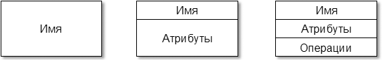

Секция атрибутов выделяется горизонтальной линией, даже если у класса отсутствуют атрибуты (характерно для классов-интерфейсов). На следующем рисунке приведен пример определения интерфейса, выполняющего доступ к характеристикам отрезка пути с однородными уровнями допускаемой скорости.

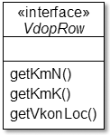

С точки зрения структурного подхода, атрибуты – это переменные, а методы – это функции, описанные в теле класса. Они могут быть доступны или не доступны для изменения (атрибуты) или выполнения (методы) внешними объектами.

Обязательным элементом обозначения класса на диаграмме является его имя. Оно должно быть уникальным в пределах пространства имён (namespace). Если класс является абстрактным, то его имя пишется *курсивом*. **Абстрактный класс** – это класс, на основе которого нельзя создать объекты. Такие классы используются в качестве шаблона для дочерних классов при наследовании.

В секции имени класса может быть указан стереотип (например, "entity", "boundary", "interface" и т.п.).

Во второй секции каждому атрибуту соответствует отдельная строка со следующей спецификацией:

`[видимость] [/] имя [: тип [‘[‘кратность‘]‘] [ = исходное значение]] [‘{‘модификаторы’}’]`.

Квадратные скобки означают, что соответствующий элемент спецификации может отсутствовать. Таким образом, при описании обязательным является только имя атрибута.

**Видимость** (англ. visibility) характеризует возможность чтения и модификации значения атрибута объекта описываемого класса, из объектов других классов. Модификация значения возможна лишь при условии, что атрибут не является константой. Видимость отображается с помощью следующих символов:

- "+" – общедоступный атрибут (англ. public) – доступен для чтения и модификации из объектов любого класса;

- "#" – защищенный атрибут (англ. protected) – доступен только объектам описываемого класса и его потомкам при наследовании;

- "–" – закрытый атрибут (англ. private) – доступен только объектам описываемого класса;

- "~" – пакетный атрибут (англ. package) – доступен только объектам классов, входящих в тот же пакет.

**Символ "/"** перед именем атрибута указывает на то, что он является производным (т.е. его значение вычисляется из значений других атрибутов или ассоциаций).

**Имя** (англ. name) атрибута представляет собой строку текста, которая используется для его идентификации. Оно должно быть уникальным в пределах класса.

**Тип** (англ. type) атрибута выбирается исходя из семантики значений, которые должны храниться в атрибуте, и, как правило, возможностей целевого языка программирования по представлению этих значений. Он соответствует одному из стандартных типов, определенных в этом языке (например, String, Boolean, Integer, Color и т. д.) или имени класса, на объект которого в этом атрибуте будет храниться ссылка. Во втором случае класс, имя которого указано в качестве типа, должен быть определен на диаграмме или в модели.

**Кратность** (англ. multiplicity) атрибута характеризует количество значений, которые можно хранить в атрибуте. Если кратность атрибута не указана, то по умолчанию принимается ее значение, равное 1, т. е. атрибут является атомарным. Такой вариант допускает и отсутствие значения в атрибуте (null). Для атрибута, представляющего собой массив, множество, список и т. п., требуется указание кратности, которая записывается после типа в квадратных скобках. Варианты указания кратности, имеющие смысл, могут быть следующие:

- `[0..*] или [*]` – количество хранимых значений может принимать любое положительное целое число, большее или равное 0. Такой вариант задания кратности характерен для множеств, списков и других атрибутов, допускающих добавление или удаление элементов;

- `[0..<число>]` – количество хранимых значений, может быть не более указанного числа. Данный вариант применяется при описании массивов фиксированного размера. При этом не обязательно, чтобы все элементы массива имели конкретные значения;

- `[0..<число>] [0..<число>]` – применяется при описании двумерных массивов. Аналогичным образом можно описать трехмерные, четырехмерные и т.д. массивы.

**Исходное значение** (англ. default value) служит для задания некоторого начального значения атрибута в момент создания отдельного экземпляра класса (объекта).

**Mодификатор** (англ. modifier) описывает особенности реализации атрибута, например:

- {final} / {readOnly} – атрибут является константой, т.е. доступен только для чтения;

- {static} – атрибут при выполнении программы в конкретный момент времени будет иметь одно и то же значение для всех объектов класса;

- {transient} – атрибут и его значение при записи объекта в БД или файл (сериализации объекта) не должны запоминаться;

- {redefines <имя атрибута родительского класса>} – атрибут переопределяет (заменяет) атрибут родительского класса;

- {id} – значение атрибута используется в качестве идентификатора объекта класса;

- {unique} или {nonunique} – значения неатомарного атрибута должны быть уникальны или допускаются повторы значений;

- {ordered} или {unordered} – значения неатомарного атрибута должны быть отсортированы или могут содержаться в произвольном порядке;

- {seq} / {sequence} – значения неатомарного атрибута хранятся упорядочено (к ним можно обращаться по индексу или выполнять перебор в соответствии с порядком их добавления в список/массив/множество) и могут повторяться.

Допускается указывать несколько модификаторов через запятую. Например, {unique, ordered} означает, что элементы массива должны быть уникальны и следовать в строго определенном порядке (например, по возрастанию значений).

В следующей таблице приведены примеры указания спецификации атрибутов и соответствующий им код программы, автоматически генерируемый Case-средством для языка Java.

Спецификация атрибута в UML | Генерируемый код для языка Java
---|---
`+` name : String	| public String name;
`+` pi : double = 3.1415 {final, static} | public final static double pi = 3.1415;
– coordinateXY : int[][] = {{1, 1}, {2, 4}, {3, 9}} | private int[][] coordinateXY = {{1, 1}, {2, 4},{3, 9}};
`#` visible : boolean = true | protected boolean visible = true;
– connect : ConnectDB = null; | private ConnectDB connect = null;

В Java типы, указанные с прописной буквы, называются примитивными (например, double или boolean). Значения атрибутов такого типа непосредственно хранится в объекте. Типы, указанные с заглавной буквы, называются ссылочными (например, String или ConnectDB). В атрибуте такого типа хранится ссылка на объект, созданный на базе соответствующего класса.

В третьей секции указывается перечень методов класса. Можно выделить шесть основных типов методов:

- конструктор – метод, создающий и инициализирующий объект. В Java имя конструктора совпадает с именем класса;

- деструктор – метод, уничтожающий объект. В некоторых языках программирования (в частности в Java) определение деструкторов не требуется, так как очистка памяти от неиспользуемых объектов (сборка мусора) выполняется автоматически;

- модификатор – метод, который изменяет состояние объекта (значения атрибутов). Имена модификаторов начинаются, как правило, со слова set (англ. – установить). Например, установить атрибуту Name новое значение setName(newName : String);

- селектор – метод, который может только считывать значения атрибутов объекта, но не изменяет их. Имена селекторов начинаются, как правило, со слов get (англ. – получить) или is при возврате логического результата. Например, считать значение атрибута Name – getName() или определить видимость на экране элемента графического интерфейса – isVisible();

- итератор – метод, позволяющий организовать доступ к элементам объекта. Например, для объекта, представляющего собой множество Set или список List, это могут быть методы перехода к первому элементу first(), следующему next(), предыдущему previous() и т. п.;

- событие – метод, запускаемый на выполнение автоматически при соблюдении определенных условий.

Тип метода при построении диаграммы классов, как правило, указывается с помощью стереотипа.

Каждому методу соответствует отдельная строка со следующей спецификацией:

`[видимость] имя ([список параметров]) [: тип] [‘{‘свойства’}’]`.

**Видимость и имя** метода задаются по тем же правилам, что и для атрибутов класса.

Список параметров является перечнем разделенных запятой параметров метода, каждый из которых может быть представлен в следующем виде:

`имя : тип [‘[‘кратность‘]‘] [ = значение по умолчанию] [‘{‘строка-свойство’}’]`.

**Имя и кратность** параметра задаются по тем же правилам, что и для атрибутов класса.

**Тип параметра** – тип значений, которые может принимать параметр.

**Значение по умолчанию** – значение, которое передается в метод, если при вызове метода данный параметр не определен.

**Тип метода** – тип результата, возвращаемого методом. Если тип не указан, то метод не возвращает никакого результата (в языках программирования такие методы, как правило, обозначаются модификатором void).

**Свойства** служат для указания специфических свойств метода, например:

- {native} – реализация метода зависит от платформы (операционной системы);

- {abstract} – метод в описываемом классе не имеет тела. Код метода должен быть определен в дочерних классах;

- {sequential} – метод допускает только последовательный вызов. Парралельный вызов операции может вызвать сбой программы;

- {guarded} – метод автоматически блокируется (ждет очереди) до завершения других вызовов (экземпляров) метода;

- {concurrent} – допускается параллельное (одновременное) выполнение нескольких вызовов (экземпляров) метода;

- {query} – метод не меняет состояние системы. Как правило, в языках программирования имена таких методов начинаются на get или is;

- {redefines <имя метода родительского класса>} – метод переопределяет (заменяет) метод родительского класса;

- {unique} или {nonunique} – возвращает множество значений без или с повторами;

- {ordered} или {unordered} – возвращает отсортированное или неотсортированное множество значений;

- {seq} / {sequence} – возвращает упорядоченное множество значений.

В следующей таблице приведены примеры указания спецификации методов и соответствующий им код программы, автоматически генерируемый Case-средством для языка Java.

Спецификация метода в UML | Генерируемый код для языка Java
---|---
"constructor" + TextFieldInt(value : int, length : int, alligment : int, fontField : Font) | public TextFieldInt(int value, int length, int alligment, Font fontField) { }
`+ saveData()` | public void saveData() {return;}
`+ isVisible() : boolean` | public boolean isVisible() {return false;}
`# init(text : String, icon : Icon)` | protected void init(String text, Icon icon) {return;}

В Java методы, не возвращающие результата, обозначаются с помощью модификатора void. Для остальных методов обязательно должен указываться тип возвращаемого результата. Исключение составляют конструкторы, для которых тип результата не указывается, а возвращаемое значение является ссылкой на объект, который был создан при вызове конструктора.

**Отношения**, которые можно устанавливать между классами, и их смысловая нагрузка (семантика) были рассмотрены в подразделе по диаграммам классов анализа. Далее иллюстрируется связь между графическим отображением классов и отношений на диаграммах и исходными текстами программ. Современные Case-средства при разработке классов, как правило, работают в режиме синхронизации диаграмм и исходных текстов. Т. е. если меняется диаграмма классов, то это приводит к автоматической корректировке текста программы и наоборот.

**Отношение ассоциации** означает наличие атрибута, в котором будет храниться ссылка (ссылки) на объект (объекты) класса, в сторону которого направлена стрелка ассоциации.

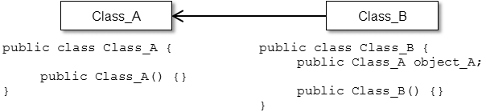

Графический символ класса Class_A преобразуется в строки определения самого класса "public class Class_A" и его конструктора "public Class_A() {}". Аналогично для Class_B. Ассоциация от Class_B в сторону Class_A преобразуется в строку "public Class_A object_A;", описывающую атрибут object_A, в котором будет храниться ссылка на объект класса Class_A. Ввиду отсутствия указания кратности отношения, она по умолчанию принимается равной 1. На следуюшей рисунке приведен пример двунаправленной ассоциации кратностью более 1.

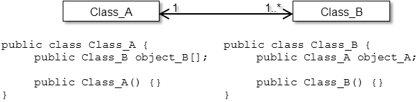

Наличие двунаправленной ассоциации или ассоциации без стрелок свидетельствует о наличии в обоих классах атрибутов, содержащих ссылки на объекты. Кратность более 1 подразумевает хранение не одной, а нескольких ссылок. Таким образом, один объект класса Class_A будет связан с несколькими объектами класса Class_B. Ссылки на эти объекты будут храниться в массиве object_B[]. Современные Case-средства позволяют вместо массива указывать другие варианты хранения набора объектов, такие как множества, списки, хешированные таблицы и т.д.

Явное указание отсутствия ссылок на объекты другого класса может задаваться значком "х".

**Отношения агрегации и композиции** являются частными случаями ассоциации. В связи с этим интерпретация этих отношений с точки зрения текста программы совпадает с рассмотренной выше. В "объекте–целом", даже при отсутствии стрелки на стороне "объекта–части", будет храниться ссылка на него.

Отношение обобщения в тексте программы на языке Java показывается ключевым словом "extends" (англ. – расширяет) в дочернем классе.

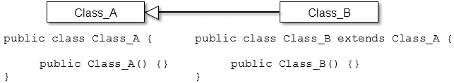

**Отношение зависимости** не приводит к автоматической генерации кода программы, но свидетельствует об обращении из объекта зависимого класса к атрибутам, методам или непосредственно к объектам независимого класса. Данное отношение в Case-средстве может автоматически отображаться на диаграмме при обратном проектировании или при синхронизации диаграммы и текста программы.

На следующем рисунке показан условный пример, свидетельствующий о наличии зависимости класса Class_B от класса Class_A. В строке "public obrabotka(Class_A object_A)" используется ссылка на объект класса Class_A. В строке "String name = object_A.name;" выполняется обращение к атрибуту объекта класса Class_A. В строке "int age = object_A.getAge();" выполняется обращение к методу объекта класса Class_A.

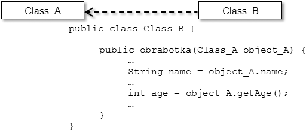

При одновременном наличии между классами отношений ассоциации и зависимости на диаграмме отображается ассоциация как более сильная связь.

**Отношение реализации** - дополнительное отношение на диаграмме классов по сравнению с диаграммой классов анализа, которое отображается только между классами и интерфейсами. В тексте на языке Java данное отношение обозначается ключевым словом "implements" (англ. – реализует).

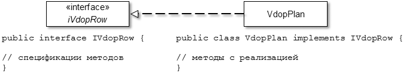

Внешний вид отношения подчеркивает тот факт, что оно сочетает в себе особенности обобщения (наследования) и зависимости.

Для отображения интерфейса в UML имеется также другой способ отображения - в виде кружка, который связывается ассоциацией с реализующим его классом. Класс, который использует (англ. use) интерфейс, связывается с ним или ассоциацией с полукругом на конце или зависимостью с соответствующим стереотипом (В Visio такой способ не реализован, поэтому его использовать не будем).

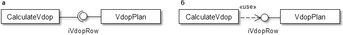

На диаграммах разного типа, в том числе и на диаграмме классов, для показа специфики связей, поведения или взаимодействия могут отображаться объекты. Вид объекта аналогичен классу, но при этом его имя должно быть подчеркнуто и, как правило, приведены атрибуты и их значения, вызвавшие необходимость отображения объекта на диаграмме.

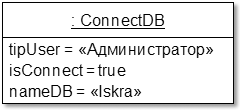

 

## Правила и рекомендации по разработке диаграмм классов

При разработке диаграммы следует придерживаться следующих правил и рекомендаций.

1. За основу диаграммы классов при ее разработке берется диаграмма классов анализа.

2. Для классов должны быть определены и специфицированы все атрибуты и методы. Их спецификация, как правило, выполняется с учетом выбранного языка программирования.

3. При определении методов рекомендуется использовать сообщения с ранее разработанных диаграмм последовательности и коммуникации.

4. Детальное проектирование граничных классов, как правило, не требуется. Большинство современных средств разработки поддерживает визуальную разработку интерфейса системы – меню, диалоговых форм, элементов диалоговых окон, панелей инструментов и т. д. В качестве исходных данных для их проектирования служат прототипы пользовательских интерфейсов. В связи с этим при проектировании таких классов основное внимание следует уделять особенностям отображения информации и специфичным операциям, которые возникают при диалоге пользователя с системой. Граничные классы, определяющие интерфейс взаимодействия с другими системами, требуют детального проектирования.

5. Для проектирования классов-сущностей можно применять подходы, используемые при проектировании БД, особенно в том случае, если данные будут храниться в таблицах БД. Если представление данных в БД и классах отличается друг от друга и в качестве хранилища информации будет применяться реляционная база данных, то рекомендуется разработать отдельную диаграмму классов, описывающую состав и структуру БД. Современные Case-средства позволяют разрабатывать такие диаграммы и синхронизировать их с БД.

6. Несмотря на то, что каждому объекту при выполнении программы автоматически назначается уникальный идентификатор, рекомендуется для классов-сущностей явно определять атрибуты, хранящие значения первичного ключа.

7. В отличие от реляционных БД поощряется использование в классах многозначных атрибутов в виде массивов, множеств, списков и т. д.

8. Управляющие классы следует проектировать только в случаях крайней необходимости – управления сложным взаимодействием объектов, реализации сложной бизнес-логики и вычислений, контроля целостности объектов и т. п. В противном случае функциональность этого класса лучше распределить между соответствующими граничными классами и классами-сущностями.

9. Для атрибутов рекомендуется назначать видимость private (закрытый) или protected (защищенный). Если требуется чтение значения такого атрибута из объектов других классов, то следует предусмотреть для него get-метод, а если возможность установки нового значения – set-метод.

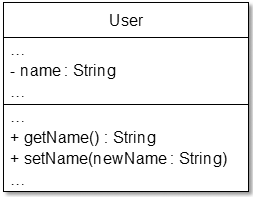

10. Для методов видимость public (общедоступный) следует устанавливать только в случае крайней необходимости.

11. Ввиду большого количества классов в системе рекомендуется диаграммы классов разрабатывать отдельно для каждого пакета. По умолчанию Case-средства поддерживают именно такой подход проектирования, хотя и допускают разработку диаграмм, на которых присутствуют классы из разных пакетов.

12. При проектировании диаграммы и отдельных классов рекомендуется пользоваться шаблонами проектирования.

 

## Пример построения диаграммы классов

На следующем рисунке показан фрагмент диаграммы классов.

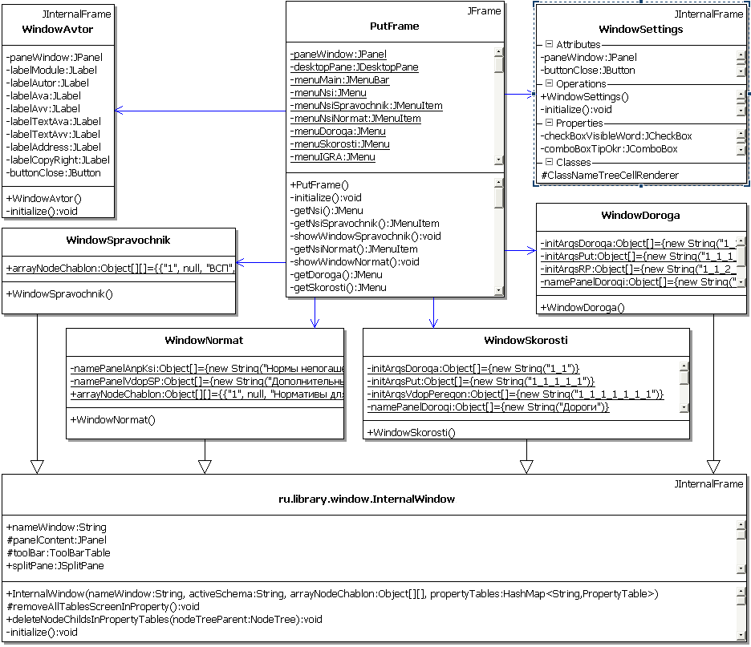

Данная диаграмма отражает структуру классов и связи между ними для пакета ru.iskraPUT.window системы ИСКРА-ПУТЬ. В диаграмму также включен класс InternalWindow из пакета ru.library.window, на базе которого определена половина классов пакета ru.iskraPUT.window. В правом верхнем углу части классов показаны стандартные классы языка Java, на основе которых они определены путем наследования.

Класс PutFame представляет собой главное окно программы, из которого вызываются внутренние диалоговые окна (классы, имя которых начинается на "Window"). Объект данного класса содержит ссылки на объекты, представляющие соответствующие окна, в связи с чем между ними на диаграмме показаны ассоциации.

В Together Architect при выборе класса на диаграмме отображается заголовок каждой секции. Так, для класса WindowSetting показаны:

- Attributes (англ. – атрибуты) – секция атрибутов;

- Operations (англ. – операции) – секция операций;

- Properties (англ. – свойства) – секция свойств. Под свойствами понимаются атрибуты, для которых возможно чтение с помощью общедоступного (public) get-метода. Например, значение закрытого атрибута checkBoxVisibleWord можно считать с помощью открытого метода getCheckBoxVisibleWord();

- Classes (англ. – классы) – секция внутренних классов, т. е. классов, определенных внутри рассматриваемого.

Статичные атрибуты (static) на диаграмме подчеркнуты.