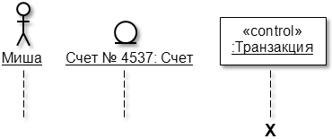
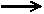
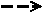
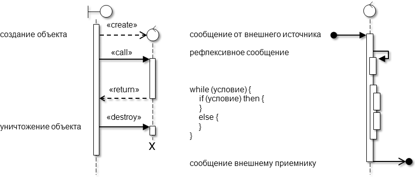
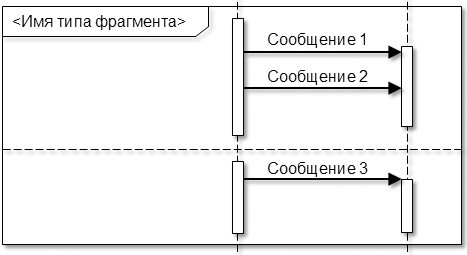
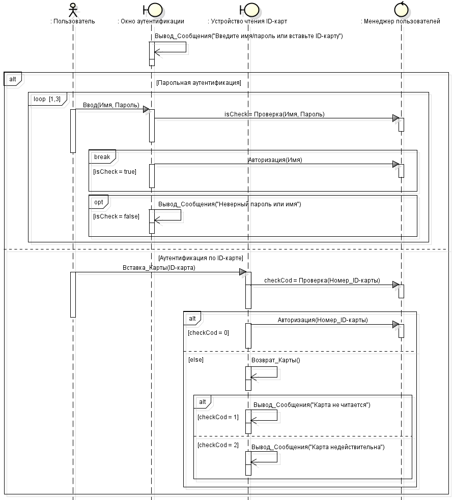
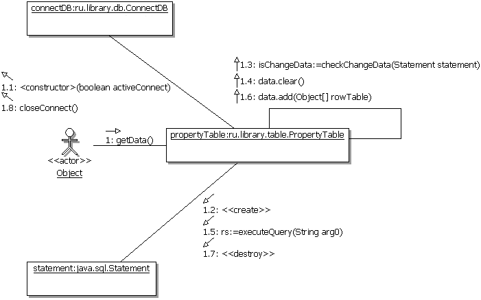
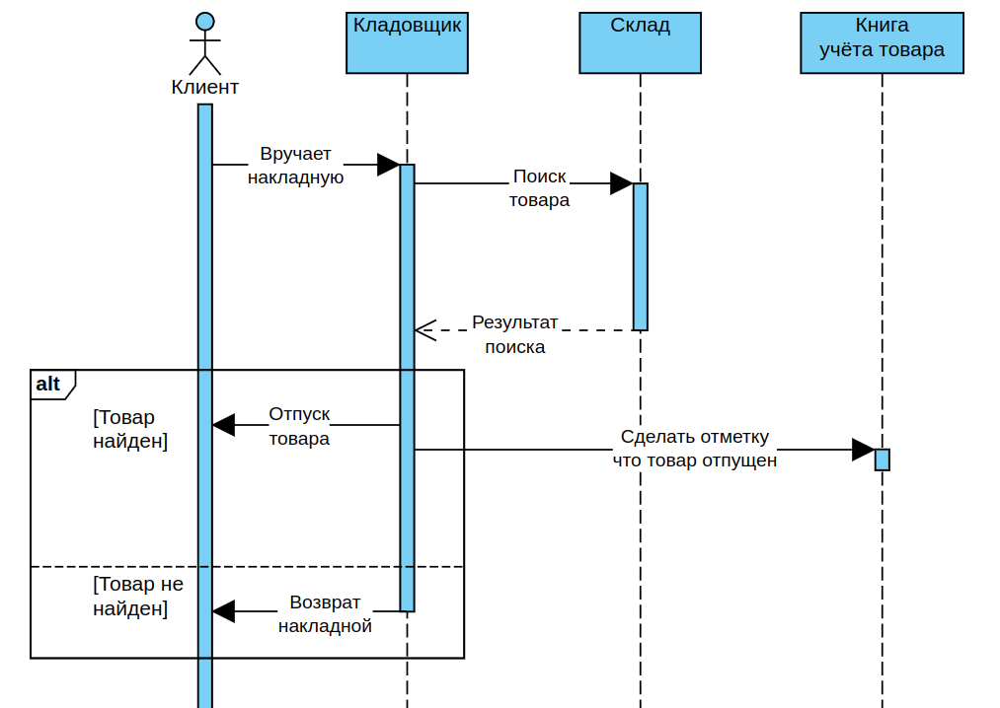

# Диаграммы взаимодействия (последовательности и коммуникации)

## Общие сведения о диаграммах взаимодействия

Реализация отдельного варианта использования требует участия и взаимодействия определенных экземпляров актеров и классов. Наиболее подходящий инструмент для описания такого взаимодействия – это диаграммы последовательности и коммуникации, которые, по сути, отображают одну и ту же информацию. В связи с этим большинство Case-средств позволяет после построения одной из диаграмм автоматически получить другую, а также выполнять синхронизацию этих диаграмм между собой.

Общими элементами диаграмм являются:

- экземпляры актеров и объекты, участвующие во взаимодействии;
- сообщения, передаваемые между экземплярами актеров и объектами.

Экземпляры сущностей отображаются стандартно (экземпляр актера – человечком, экземпляр класса (объект) – прямоугольником или графическим стереотипом класса анализа). В то же время следует помнить, что экземпляр – это конкретная реализация соответствующей сущности (актера, класса, узла и т. д.). Чтобы учесть этот нюанс на диаграммах, имя экземпляра подчеркивается и может обозначаться следующими способами.

Способ обозначения | Характеристика | Пример
-------------------|----------------|--------
Имя объекта`:`Имя класса | Полное обозначение. | Вася`:`Программист
`:`Имя класса | Анонимный объект. | `:`Программист
Имя объекта | Предполагается, что имя класса известно. | Вася
Имя объекта`:` | Объект-сирота. | Считается, что имя класса неизвестно.	Вася`:`

Для объектов, кроме имени, могут указываться также некоторые важные для взаимодействия атрибуты и их значения.

Взаимодействие между экземплярами актеров и объектами моделируется посредством передачи сообщений. Сообщение (англ. message) – это спецификация факта передачи информации между сущностями с ожиданием выполнения определенных действий со стороны принимающей сущности. Сущность, отправляющую сообщение, называют клиентом, а принимающую – сервером. Таким образом, сообщения не только передают некоторую информацию, но и требуют или предполагают выполнения сервером определенных действий или передачу (возврат) клиенту необходимой информации. Если принимающей сообщение сущностью является объект, то оно представляет собой операцию (метод) объекта-сервера. Прием сообщения обычно трактуется, как возникновение события на сервере. Сообщения изображаются стрелкой с обязательным указанием направления (остриё стрелки указывает на принимающую сторону) и спецификации.

Ниже рассматриваются особенности построения диаграмм взаимодействия.

## Назначение и состав диаграммы последовательности

**Диаграмма последовательности (sequence diagram)** наглядно отображает временной аспект взаимодействия. Она имеет два измерения. Одно измерение (слева-направо) указывает на порядок вовлечения экземпляров сущностей во взаимодействие. Крайним слева на диаграмме отображается экземпляр актера или объект, который является инициатором взаимодействия. Правее отображается другой экземпляр сущности, который непосредственно взаимодействует с первым и т.д. Второе измерение (сверху-вниз) указывает на порядок обмена сообщениями. Начальному моменту времени соответствует самая верхняя часть диаграммы. Масштаб на оси времени не указывается, поскольку диаграмма отображает лишь временную упорядоченность взаимодействия типа «раньше-позже».

На диаграмме последовательности отображается ряд специфичных элементов, которые отсутствуют на диаграмме коммуникации.

1. **Линия жизни** (англ. lifeline) отображается штриховой вертикальной линией, соединенной с соответствующим экземпляром сущности. Линия жизни служит для обозначения периода времени, в течение которого экземпляр может потенциально участвовать во взаимодействии. Если он существует в течение всего взаимодействия, то и его линия жизни должна продолжаться от самой верхней части диаграммы до самой нижней.

    Не обязательно создавать все объекты в начальный момент времени. Отдельные объекты в системе могут создаваться по мере необходимости, существенно экономя ресурсы системы и повышая ее производительность. В этом случае объект изображается не в верхней части диаграммы, а в том месте, где он создается. Для обозначения факта уничтожения объекта в UML используется специальный символ **X**. Как правило, уничтожаются объекты, созданные на основе граничных и управляющих классов. Экземпляры актеров и объекты классов сущностей остаются в системе после окончания взаимодействия.

    

2. Как было отмечено выше, взаимодействие между экземплярами моделируется через обмен **сообщениями**. Сообщения могут быть следующих видов:

     – синхронное сообщение (англ. synchronous message). Клиент посылает сообщение серверу и **ждёт**, пока тот примет и обработает сообщение. Как правило, один объект передает синхронное сообщение второму, второй – третьему и т.д., образуя вложенный поток сообщений. В любом случае клиент, инициирующий поток сообщений, должен дождаться его завершения, т.е. возврата управления. Это самый распространенный тип сообщений;

     – асинхронное сообщение (англ. asynchronous message). Клиент посылает сообщение серверу и, не дожидаясь ответа, продолжает выполнять следующие операции;

     – возвращающее сообщение (англ. reply message), обозначающее возврат значения или управления от сервера обратно клиенту. Стрелки этого вида зачастую отсутствуют на диаграммах, поскольку неявно предполагается их существование после окончания процесса выполнения операции.

    В отдельных случаях объект может посылать сообщения самому себе (вызывать собственные методы), инициируя так называемые **рефлексивные** сообщения.

    Сообщения, получаемые от внешнего источника (англ. found message) и передаваемые внешнему приемнику (англ. lost message), должны, соответственно, начинаться и заканчиваться закрашенным кружком.

    UML регламентирует также два часто встречаемых вида сообщений - на создание и уничтожение объектов. Первое отображается как возвращающее сообщение со стереотипом «create», второе - как синхронное сообщение со стереотипом «destroy». После получения сообщения на уничтожение объекта его линия жизни заканчивается символом X.

    Каждое сообщение должно иметь имя по одному из следующих вариантов:

    - произвольная строка текста. Применяется на начальных стадиях проектирования или концептуальных диаграммах;
    - указание стереотипа для некоторых стандартных действий:
        * «create» (англ. – создать) – возвращающее сообщение, требующее создания объекта;
        * «destroy» (англ. – уничтожить) – синхронное сообщение с требованием уничтожить соответствующий объект;
        * «call» (англ. – вызвать) – синхронное сообщение, требующее выполнения операции принимающего объекта;
        * «send» (англ. – послать) – асинхронное сообщение, обозначающее посылку сигнала серверу;
        * «return» (англ. – возвратить) или «reply» (англ. – ответить)– возвращающее сообщение;
    - указание спецификации вызываемого метода объекта-получателя в формате:

        `[переменная =] имя([список параметров]) [:возвращаемое значение]`.

    **Переменная** - переменная или атрибут объекта-отправителя, которому будет присвоен результат вызываемого метода.

    **Имя сообщения** (обязательный параметр) – имя вызываемого метода объекта-получателя.

    **Список аргументов** – список аргументов, разделенных запятыми и передаваемых для выполнения метода.

    **Возвращаемое значение** – константа или имя переменной, являющиеся результатом вызываемого метода.

3. Отправка и прием сообщений сопровождаются активностью объектов. Для явного выделения этого факта, на диаграмме можно использовать **фокус управления** (англ. focus of control). Он изображается в форме вытянутого узкого прямоугольника, верхняя сторона которого обозначает начало получения фокуса управления объекта (начало активности), а нижняя сторона – окончание фокуса управления (окончание активности). Условные операторы, циклы, рекурсия и вызов собственных методов (отправка рефлексивных сообщений) инициируют вложенные потоки управления у одного и того же объекта, что можно отобразить на диаграмме с помощью вложенных фокусов управления.

    

4. Для моделирования особенностей взаимодействия (условных операторов, циклов и т.п.) вместо вложенных фокусов управления лучше использовать **фрагменты** (англ. fragments). Фрагмент отображается прямоугольной рамкой вокруг сообщения (группы сообщений) с указанием в левом верхнем углу типа фрагмента.

    

    UML определяет следующие типы фрагментов:

    - alt (alternatives) - вызовы альтернативных сообщений (выполнение взаимоисключающих операций). Альтернативные сообщения (группы сообщений) отделяются друг от друга горизонтальными штриховыми линиями. Используется для моделирования условного оператора (if-then-else) и операторов выбора (case или switch);

    - opt (option) - вызов дополнительного сообщения (группы сообщений) при некотором условии. Аналогичен фрагменту с типом «alt» для случая, когда используется сокращенный условный оператор (if-then);

    - par (parallel) - параллельная обработка сообщений. Параллельно обрабатываемые сообщения (группы сообщений) отделяются друг от друга горизонтальными штриховыми линиями;

    - loop - циклическая обработка сообщений. Используется для моделирования циклов;

    - break - досрочное прерывание обработки сообщений при некотором условии. Используется как составная часть других фрагментов (как правило, «loop»);

    - critical - эксклюзивно обрабатываемое сообщение (группа сообщений). Используется как составная часть других фрагментов (как правило, «par»). Подразумевает приостановку обработки любых сообщений в более общем фрагменте на время обработки сообщений внутри подфрагмента «critical»;

    - neg (negative) - сообщение или событие, сгенерированное в результате невозможности обработки другого принятого сообщения. Например, если при запросе пароля getPassword() истекло время на его ввод, то вместо возврата пароля будет сгенерировано сообщение «время вышло» (англ. «timeout»);

    - assert (assertion) - сообщение (группа сообщений), выполняемое после предварительной проверки некоторого условия. Если условие отрицательно, то сообщение не посылается. В программировании такой прием часто используется для локализации ошибок;

    - strict - строгая последовательная обработка сообщений. Последовательно обрабатываемые сообщения (группы сообщений) отделяются друг от друга горизонтальными штриховыми линиями и обрабатываются строго по очереди сверху-вниз;

    - seq (sequencing) - нестрогая последовательная обработка сообщений. Сообщения (группы сообщений) отделяются друг от друга горизонтальными штриховыми линиями и могут обрабатываться в произвольном порядке за исключением сообщений, принимаемых одним объектом;

    - ignore - игнорирование сообщений. После слова «ignore» в фигурных скобках перечисляются сообщения, возникновение которых во фрагменте потенциально возможно наряду с явно отображенными и которые должны быть проигнорированы;

    - consider - игнорирование других сообщений. После слова «consider» в фигурных скобках перечисляются сообщения, которые явно отображены во фрагменте, а также возникновение которых во фрагменте потенциально возможно наряду с явно отображенными. Остальные потенциально возможные сообщения должны быть проигнорированы;

    - ref (reference) - ссылка на часть взаимодействия, определенную в другом месте (на другой диаграмме). Данный элемент подобен предопределенным процессам на блок-схемах или скрытым составным состояниям на диаграммах автоматов.

## Назначение и состав диаграммы коммуникации

В отличие от диаграммы последовательности на диаграмме коммуникации основное внимание уделяется структуре взаимодействия. Помимо общих элементов (экземпляров актеров, объектов и сообщений) между участниками взаимодействия отображаются ненаправленные ассоциации, над которыми указываются передаваемые ими сообщениями. Другой отличительной особенностью является использование в спецификации сообщений нумерации, отражающей порядок их выполнения.

Проектировщикам диаграмма коммуникации может дать богатый материал о распределении обязанностей между объектами. Так, например, если диаграмма напоминает форму звезды, то можно сделать вывод, что система сильно зависит от центрального объекта. В этом случае стоит подумать о более равномерном распределении обязанностей между участниками взаимодействия. Или, наоборот, если в системе хранится и обрабатывается конфиденциальная информация, то большинство сообщений должно проходить через ядро безопасности – классы, отвечающие за идентификацию, аутентификацию и, возможно, шифрование / расшифрование данных.

## Рекомендации по разработке диаграмм взаимодействия

При разработке диаграмм следует придерживаться следующих правил и рекомендаций.

1. Для выбранного варианта использования необходимо перенести с диаграммы классов анализа все участвующие в нем классы, а с диаграммы вариантов использования – актеров.

2. На диаграмме коммуникации между классами следует отобразить ассоциации, перенесенные с диаграммы классов анализа, а также добавить ассоциации, связывающие актеров с граничными классами.

3. Для отображения основного и альтернативного потоков событий (наборов сообщений) в рамках варианта использования следует использовать фрагмент с типом «alt».

4. На стадии анализа имена сообщениям можно давать произвольно (например, «Записать данные о клиенте») или в виде стереотипов. В дальнейшем (в модели проектирования) имена сообщений должны соответствовать методам классов.

5. Имена сущностей на диаграммах (экземпляры актеров и объекты) должны быть подчеркнуты и обозначены соответствующим образом.

6. На диаграммах последовательности символ уничтожения объектов следует задавать только для тех объектов, которые во время взаимодействия действительно уничтожаются. Экземпляры актеров и объекты классов сущностей (долгоживущая информация), как правило, существуют до начала и после окончания взаимодействия. Для них символ уничтожения не показывается. Объекты граничных и управляющих классов, напротив, в большинстве случаев создаются на момент взаимодействия и по его окончанию уничтожаются. В связи с этим для них требуется отображать символ уничтожения.

## Примеры построения диаграмм взаимодействия

На следующем рисунке с помощью диаграммы последовательности показано взаимодействие при выполнении процедуры идентификации/аутентификации пользователя, которая возможна двумя способами: путем ввода имени и пароля или с использованием ID-карты.

На следующих рисунках показаны диаграммы последовательности и коммуникации, показывающие процесс загрузки данных из таблицы с сервера БД в оперативную память клиента (кэширование). Диаграммы созданы методом обратного проектирования (реинжиниринга) на основе реального программного кода. На диаграмме последовательности некоторые программные конструкции отображены не с помощью фрагментов, а с помощью вложенных фокусов управления.

Пример диаграммы коммуникации

Табличные данные после загрузки заносятся в атрибут *data* объекта **propertyTable**, представляющий собой двумерный массив объектов `Object[][]`.

Во взаимодействии участвуют следующие объекты:

- Object – инициирует загрузку данных;
- propertyTable – хранит описание таблицы и ее полей, а также загруженные данные в атрибуте data;
- connectDB – отвечает за установку, поддержку и закрытие соединения с БД;
- statement – выполняет и возвращает результаты запросов к БД.

Инициировать загрузку могут объекты разных классов, поэтому объект **Object** не сопоставлен с каким-либо классом. Остальные объекты относятся к конкретным классам. После двоеточия у этих объектов показана вложенность по пакетам, а после последней точки – имя класса, экземпляром которого они являются.

Во взаимодействии следующая последовательность сообщений (вызова методов):

- Object инициирует загрузку данных getData();
- создается соединение с БД в виде объекта connectDB посредством вызова конструктора класса ConnectDB. Созданный объект запоминается в переменной connect;
- создается объект statement для выполнения запросов к БД и запоминается в переменной statement;
- посредством вызова метода checkChangeData() проверяется признак изменения данных на сервере. Если данные изменились, то;
    * из атрибута data объекта propertyTable удаляются старые данные clear();
    * выполняется запрос к БД executeQuere() и запрошенные данные запоминаются в переменной rs;
    * в цикле while() записи из переменной rs переносятся в атрибут data с помощью метода add();
- удаляется объект statement – на диаграмме указано стереотипное сообщение «destroy»;
- закрывается соединение с БД closeConnect().

В качестве иллюстрации правил построения диаграммы последовательности на ней показаны:

- два варианта создания объекта – с помощью конструктора `<constructor>()` для объекта connectDB и с помощью стереотипного сообщения «create» для объекта statement;
- два варианта уничтожения объекта – с помощью вызова деструктора closeConnect() для объекта connectDB и с помощью стереотипного сообщения «destroy» для объекта statement;
- два варианта вызова методов, возвращающих значения – вызов конструктора объекта connectDB с занесением результата (созданного объекта) в переменную connect с помощью двух сообщений и выполнением запроса к БД executeQuere() с занесением результата в переменную rs с помощью одного сообщения.

# Получение товара клиентом (задание с семинара)

>Постройте UML-диаграммы ПО, автоматизирующего процесс покупки товара в магазине отделочных материалов с отдельным складом. 
>
>Описание процесса: Продавец выписывает клиенту ордер, где указывает код товара, его наименование и количество. Клиент оплачивает в кассе стоимость товара. Для этого кассир должна найти в БД товар по его коду и подсчитать его стоимость. В результате клиент получает кассовый чек и накладную для получения товара на складе и едет на склад. **Там он вручает накладную кладовщику, который отыскивает товар по его коду и отпускает клиенту нужное его количество. После этого кладовщик делает отметку в книге учета товаров о том, что товар отпущен и его количество соответственно уменьшилось.**
>
>Необходимо построить:
>
>* диаграмму вариантов использования для всей системы;
>* диаграмму последовательности для процесса получения товара на складе;
>* диаграмму деятельности оплаты заказа

