# Диаграмма состояний

<!-- https://sites.google.com/site/anisimovkhv/learning/pris/lecture/tema12/tema12_3 -->

После создания одной или нескольких диаграмм вариантов использования системный аналитик с заказчиком определяют приоритетность проработки вариантов использования и детализируют их. Главная цель данной процедуры – поиск ответа на вопрос: «В процессе какого поведения система обеспечит необходимую функциональность?».

В UML имеется несколько видов диаграмм, позволяющих детализировать варианты использования, – это диаграммы поведения. В связи с этим могут использоваться разные способы детализации:

- с помощью диаграмм автоматов (состояния);
- с помощью диаграмм деятельности (аналог блок-схем);
- с помощью диаграмм взаимодействия (последовательности и коммуникации).

**Диаграммы автоматов** (англ. state machine) используются для описания поведения, реализуемого в рамках варианта использования, или поведения экземпляра сущности (класса, объекта, компонента, узла или системы в целом). Поведение моделируется через описание возможных состояний экземпляра сущности и переходов между ними на протяжении его жизненного цикла, начиная от создания и заканчивая уничтожением. Диаграмма автоматов представляет собой связный ориентированный граф, вершинами которого являются состояния, а дуги служат для обозначения переходов из состояния в состояние.

1. Под **состоянием** (англ. state) понимается ситуация в ходе жизни экземпляра сущности, когда эта ситуация удовлетворяет некоторому условию, экземпляр выполняет некоторые операции или ждет наступления некоторого события. Например, для объекта его состояние может быть задано в виде набора конкретных значений атрибутов, при этом изменение этих значений будет приводить к изменению состояния моделируемого объекта.

    В UML различают два вида операций: действие и деятельность. **Действие** (англ. action) – это атомарная операция, выполнение которой не может быть прервано, приводящая к смене состояния или возвращающая значение. Примерами действий служат операции создания или уничтожения объекта, расчет факториала и т.д. **Деятельность** (англ. activity) – это составная (неатомарная) операция, реализуемая экземпляром в конкретном состоянии, выполнение которой может быть прервано. В частности, под деятельностью можно понимать процедуры расчета допускаемых скоростей или шифрования данных.

    **Событие** (англ. event) – это спецификация существенного факта, который может произойти в конкретный момент времени. События могут быть внутренними или внешними. Внешние события передаются между системой и актерами (например, нажатие кнопки или посылка сигнала от датчика передвижений). Внутренние события передаются между объектами внутри системы. В UML можно моделировать следующие виды событий:

    - посылка сообщения (англ. message):
        * вызов (англ. call);
        * сигнал (англ. signal);
        * любое сообщение (англ. any receive);
    - событие времени (англ. time);
    - изменение состояния (англ. change).

    **Вызов** – спецификация факта посылки синхронного сообщения между объектами, предписывающего выполнение операции (действия или деятельности) объектом, которому посылается сообщение. Синхронность означает, что после посылки вызова объект-отправитель передает управление объекту-получателю и после выполнения последним операции получает управление обратно. Например, закрасить фигуру красным фоном fill(red) или рассчитать допускаемые скорости calculateVdop().

    **Сигнал** – спецификация факта посылки асинхронного сообщения между объектами. Исключения, которые поддерживаются в большинстве современных языков программирования, являются наиболее распространенным видом внутренних сигналов.

    **Событие времени** – спецификация факта, обозначающего наступление конкретного момента времени (англ. absolute time) или истечение определенного промежутка времени (англ. relative time). В UML данный факт обозначается с помощью ключевых слов «at» (например, at 9:00:00) и «after» (например, after 2 seconds).

    **Изменение состояния** – спецификация логического условия, соответствующего изменению состояния экземпляра сущности. В UML оно обозначается с помощью ключевого слова «when» (например, when A < B) или сторожевого условия (например, [A < B]).

    Состояние отображается в виде четырехугольника со скругленными углами, внутри которого обязательно записывается имя. Рекомендуется в качестве имени использовать глаголы в настоящем времени (звенит, печатает, ожидает) или причастия (занято, передано, получено).

    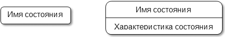

    Характеристика состояния может содержать описание выполняемых операций, перед которыми указывается одна из стандартных **меток**:

    - entry (англ. – вход) – действие при входе, выполняемое вне зависимости от того, по какому переходу был выполнен вход в состояние. Например, создать соединение с базой данных entry / createConnect();

    - exit (англ. – выход) – действие при выходе, выполняемое вне зависимости от того, по какому переходу был выполнен выход из состояния. Например, закрыть соединение с базой данных exit / closeConnect();

    - do (англ. – выполнять) – деятельность в состоянии. Находясь в состоянии, экземпляр сущности может бездействовать и ждать наступления некоторого события, а может выполнять длительную операцию. Например, рассчитать допускаемые скорости do / calculateVdop(). Допускается указывать несколько операций в виде отдельных строк, каждая из которых начинается с метки «do», или в виде одной строки, операции в которой отделены друг от друга точкой с запятой.

    Допускается определять в характеристике собственные метки. На следующем рисунке показан пример состояния с характеристикой.

    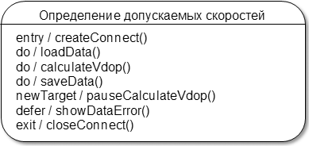

2. **Переход** (англ. transition) – отношение между двумя состояниями, показывающее возможный путь изменения состояния экземпляра сущности. Считается, что в состоянии экземпляр сущности находится продолжительное время, а переход выполняется мгновенно.

    Переход отображается в виде однонаправленной ассоциации между двумя состояниями. При смене состояний говорят, что переход срабатывает. До срабатывания перехода экземпляр сущности находится в состоянии, называемом **исходным**, а после его срабатывания – в **целевом**.

    Различают два вида переходов: **нетриггерный** и **триггерный**. Переход первого вида, называемый также переходом по завершении, срабатывает неявно, когда все основные операции (с метками entry, do и exit) в исходном состоянии успешно завершают свою работу. Данный вид перехода обозначается стрелкой без надписи. Для наступления триггерного перехода необходимо наступление некоторого события, которое записывается над стрелкой. В общем случае над стрелкой может быть записана строка текста вида **«событие [сторожевое условие] / действие»**. Указываемое действие представляет собой атомарную операцию, выполняемую сразу после срабатывания соответствующего перехода и до начала каких бы то ни было операций в целевом состоянии. Разрешается указывать не одно, а несколько обособленных действий, отделенных друг от друга точкой с запятой. Обязательное требование – все действия в списке должны четко различаться между собой и следовать в порядке их записи. Примеры спецификации переходов:

    - mouseClick() – нажатие кнопки мыши в момент, когда указатель находится над моделируемым объектом (например, над командной кнопкой, запускающей процедуру определения допускаемых скоростей);

    - mouseClick() / setFocus() – нажатие кнопки мыши с одновременным установлением фокуса на моделируемом объекте;

    - `mouseClick() [isEnabled()] / setFocus()` – нажатие кнопки мыши с одновременным установлением фокуса на моделируемом объекте при условии, что он доступен. В данном примере объект переходит в новое состояние только в том случае, если произойдет событие и сторожевое условие будет истинно. Вычисление истинности сторожевого условия происходит только после возникновения ассоциированного с ним события, инициирующего соответствующий переход. Если событие не произошло или сторожевое условие ложно, то переход не срабатывает, и действие, записанное через «/», не выполняется;

    - `at 14:00:00 или [getTime() = 14:00]` – текущее время на компьютере равно 14 часам;

    - при построении концептуальных диаграмм допускается обозначать переход произвольной строкой текста, характеризующей событие. Например, «столкновение» или «выход из строя».

    Переход может быть направлен в то же состояние, из которого он выходит. Такой переход называется **рефлексивным**. В отличие от внутренних переходов, при рефлексивном переходе выполняются внутренние действия, ассоциированные с метками entry и exit.

    На следующем рисунке показаны простой и рефлексивный переходы.

	     	
    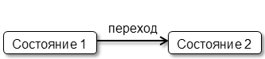

    Помимо **простых состояний** (англ. simple state), изображенных выше, на диаграмме могут отображаться **составные состояния** (англ. composite state), состоящие из вложенных в них **подсостояний** (англ. substate).

    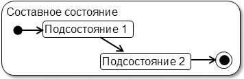

    Составное состояние, которое может использоваться в разных контекстах, в т.ч. и для разных диаграмм (автоматов), называются **подавтоматами** (англ. submachine state). Составное состояние может быть разбито на зоны (англ. regions), называемые также **параллельными подавтоматами** (англ. concurrent substates). Если на диаграмме имеется составное состояние с вложенными параллельными подавтоматами, то экземпляр сущности может одновременно находиться в нескольких подсостояниях, но не более чем по одному из каждого подавтомата. Если какой-либо из подавтоматов пришел в свое конечное состояние раньше других, то он должен ожидать, пока другие подавтоматы не придут в свои конечные состояния.

    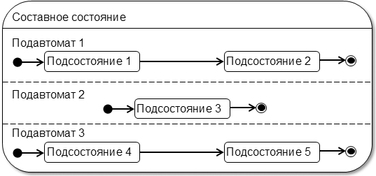

    В некоторых случаях бывает желательно скрыть внутреннюю структуру составного состояния в целях улучшения восприятия диаграммы. В подобной ситуации в правом нижнем углу указывается специальный символ, означающий, что структуру состояния можно посмотреть на отдельной диаграмме.

    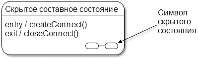

В UML также определено несколько **псевдосостояний** (англ. pseudostate), которые перечислены в следующей таблице.

Наименование | Обозначение | Назначение 
-------------|:-----------:|------------
Начальное (англ. initial) | 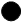 | Начальное состояние автомата, начальное подсостояние составного состояния или параллельного подавтомата. Из начального состояния могут только исходить переходы.	|
Конечное (англ. final) |  | Конечное состояние автомата, конечное подсостояние составного состояния или параллельного подавтомата. В конечное состояние могут только входить переходы. Примечание. В стандарте UML 2.5 считается состоянием, а не псевдосостоянием.

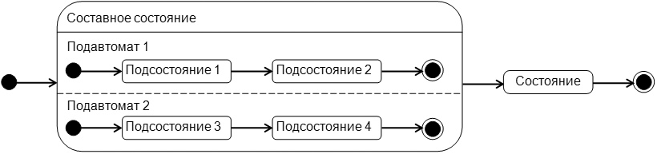

Наименование | Обозначение | Назначение 
-------------|:-----------:|------------
Немедленное завершение (англ. terminate) | 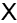 | Аналогично конечному состоянию, но подразумевает немедленное прекращение деятельности и уничтожение экземпляра сущности, для которой построен автомат.	 
Точка входа (англ. entry point)	| 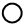 | Точка входа в автомат или составное состояние. Может быть несколько. Допускается крепление к границе составного состояния.	
Точка выхода (англ. exit point) | 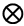 | Точка выхода из автомата или составного состояния. Может быть несколько. Допускается крепление к границе составного состояния.

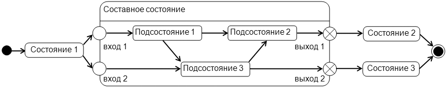

Наименование | Обозначение | Назначение 
-------------|:-----------:|------------
Ветвление (англ. fork) | 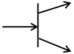 | Ветвление переходов в параллельные подавтоматы.	
Соединение (англ. join) | 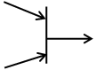 | Соединение переходов из параллельных подавтоматов. Выполняет функцию синхронизации выхода из параллельных подавтоматов составного состояния.

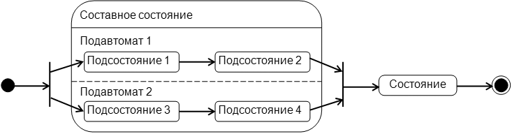

Наименование | Обозначение | Назначение 
-------------|:-----------:|------------
Перекресток (англ. junction) |  | Соединение и ветвление переходов для последовательных состояний. В случае ветвления для каждой исходящей из перехода ассоциации должно быть задано сторожевое условие.	

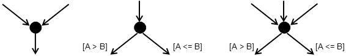

Наименование | Обозначение | Назначение 
-------------|:-----------:|------------
Выбор (англ. choice) | 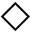 | Аналогично переходу, работающему на ветвление для последовательных состояний.	

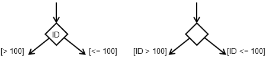

Наименование | Обозначение | Назначение 
-------------|:-----------:|------------
Поверхностное историческое (англ. shallow history) |  | Указывается внутри составного состояния и подразумевает запоминание текущей конфигурации составного состояния при выходе из него. Переход в историческое состояние восстанавливает запомненную конфигурацию составного состояния и продолжает работу составного состояния с того момента, когда его прервали в прошлый раз. Внутри составного состояния может быть только одно историческое состояние.	
Глубинное историческое (англ. deep history) |  | Аналогично поверхностному историческому состоянию, но распространяется на все уровни вложенности подсостояний.

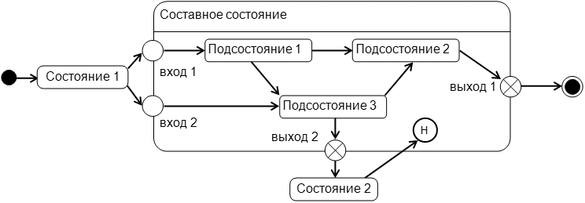

## Правила и рекомендации по разработке диаграмм автоматов

При разработке диаграмм автоматов следует придерживаться следующих правил и рекомендаций.

1. Наличие у экземпляра сущности нескольких состояний, отличающихся от простой схемы «исправен – неисправен» или «активен – неактивен», служит признаком необходимости построения диаграммы автоматов. При выделении состояний и переходов следует помнить, что длительность срабатывания переходов должна быть существенно меньшей, чем нахождение моделируемого объекта в соответствующих состояниях. Каждое из состояний должно характеризоваться определенной устойчивостью во времени. Так, на рисунке ниже при моделировании поведения технического устройства, в простейшем случае, можно выделить два или три состояния. При этом в одном случае ремонт показан в качестве перехода, т.е. считается, что занимает мало времени, а в другом – в качестве состояния, что больше соответствует реалиям жизни.

    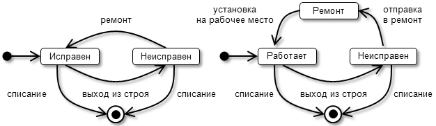

2. Автомат (диаграмма) обязательно должен начинаться знаком начального состояния и заканчиваться знаком конечного. Начальное состояние указывается только один раз, а конечных может быть несколько в целях минимизации пересечений переходов. Для подавтоматов рекомендуется придерживаться этого же правила или использовать точки входа / выхода. Допускается не указывать начальных / конечных состояний и точек входа / выхода для составных состояний или подавтоматов, когда начальное подсостояние (подсостояния) очевидны.

3. Для облегчения восприятия диаграммы рекомендуется использовать декомпозицию со скрытием составных состояний.

4. Диаграмма не должна содержать изолированных состояний и переходов. Переходы и их спецификация должны быть заданы таким образом, чтобы на графе каждое состояние было потенциально достижимо из начального и из любого состояния было потенциально достижимо конечное. На следующем рисунке из состояния 2 нет пути в конечное, а из начального состояния нет пути в состояние 3.

    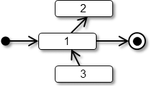

5. Триггерные переходы по условию на диаграмме можно показать тремя способами.

    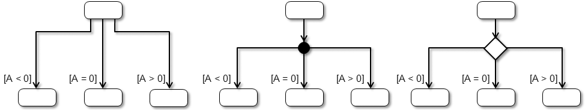

6. В каждый момент времени автомат или подавтомат должен находиться только в одном состоянии. Это означает, что спецификация переходов из одного состояния не должна допускать потенциальной возможности перехода в два и более состояний. На следующем рисунке приведены примеры фрагментов диаграмм с конфликтными переходами.

    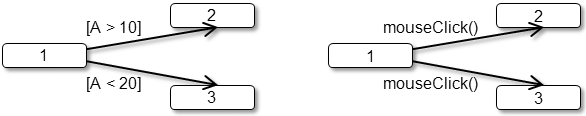

Исключением из этого правила является параллельный переход в подсостояния параллельных подавтоматов одного составного состояния.

## Примеры построения диаграмм автоматов

Детализация вариантов использования с помощью диаграмм автоматов позволяет более наглядно отобразить логику их реализации в системе (компоненте). С этой целью на диаграмме указывается основной и альтернативные потоки событий как последовательности состояний и переходов. Основной поток лучше отображать прямыми стрелками, а альтернативные – загнутыми.

Диаграмма на следующем рисунке, с одной стороны, описывает поведение, реализуемое в рамках варианта использования, а с другой стороны, может расцениваться как описание поведения компонента (подсистемы) или системы.

Узлы, входящие в состав системы и представляющие собой различные аппаратные устройства, как правило, характеризуются богатым набором состояний. Диаграммы автоматов являются удобным инструментом анализа, проектирования и реализации их поведения. Например, банкомат, сопряженный с информационной системой, может характеризоваться состояниями «инициализация», «ожидание», «прием карточки», «обработка банковской транзакции», «выдача наличных» и т. д.

Объекты, как и узлы, могут иметь множество состояний, что оправдывает моделирование их поведения с помощью диаграмм автоматов. Например, графический объект, отображаемый в окне программы, может иметь состояния: «инициализация», «отображен», «перемещается», «меняет размер», «скрыт», «мигает», «меняет фоновый рисунок» и т. д.

В рамках построения модели анализа, диаграммы автоматов являются удобным средством моделирования графического интерфейса программы и реакции его элементов на действия пользователя. Такие диаграммы, в дополнении к прототипам пользовательского интерфейса, позволяют лучше понять логику работы системы и приемы взаимодействия пользователей с ней.

Ниже показана контекстная диаграмма, моделирующая реакцию системы на выбор пользователем пунктов меню.

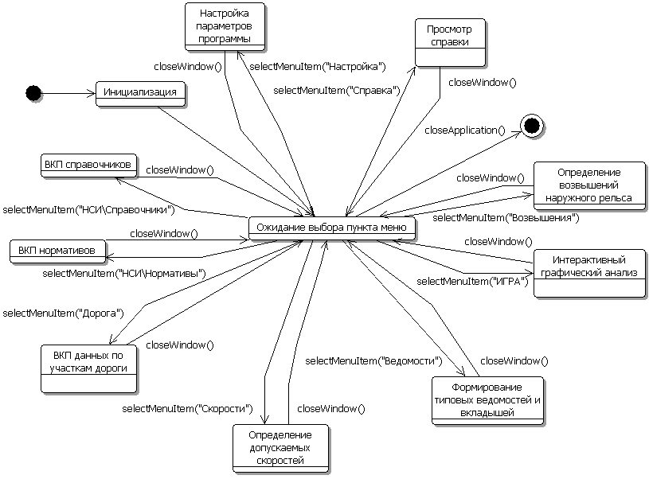

На диаграмме приняты следующие условные обозначения:

- ВКП – ввод, корректировка или просмотр данных;
- selectMenuItem() – выбор пункта меню;
- closeWindow() – закрытие окна;
- closeApplication() – закрытие программы.

При запуске программы вначале осуществляется ее инициализация (чтение текущих настроек и отображение основного окна программы). Далее программа автоматически (по нетриггерному переходу) оказывается в состоянии ожидания выбора пункта меню. После выбора пункта меню осуществляется отображение соответствующего диалогового окна на экране, выполнение необходимых действий (как правило, в интерактивном режиме) и закрытие окна с возвратом в исходное состояние.

На следующем рисунке показана диаграмма декомпозиции для составного состояния «ВКП нормативов».

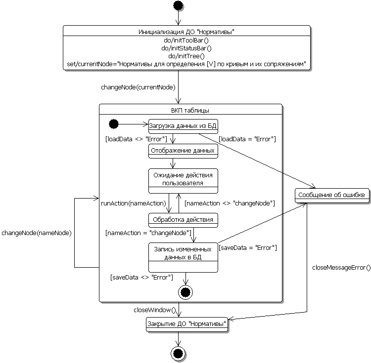

При выборе пункта меню «Нормативы» на экране отображается соответствующее диалоговое окно. В момент инициализации создаются панель инструментов initToolBar(), строка сообщений initStatusBar() и дерево с наименованиями таблиц в левой части диалогового окна initTree(). Исходным выбранным узлом дерева устанавливаются «Нормативы для определения [V] по кривым и их сопряжениям». При выборе узла дерева changeNode(), связанного с таблицей, система выполняет стандартные операции, начиная от загрузки данных, непосредственной обработки действий пользователя runAction() с таблицей или ее полями (редактирование значений, вставка новой записи, удаление записи, печать таблицы и т. д.) и заканчивая сохранением в базе всех измененных данных. Если в момент загрузки или записи данных возникает ошибка, то на экране отображается соответствующее сообщение. Закрытие окна «Нормативы» предусмотрено после закрытия сообщения об ошибке closeMessageError() или в результате стандартного действия пользователя closeWindow().

Для наглядного представления работы (поведения, реакции на действия пользователей) системы рекомендуется разработать и согласовать с заказчиком прототипы экранов и окон пользовательского интерфейса.
