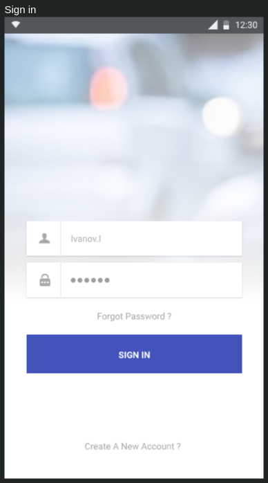

# Проект "Каршеринг"

## Техническое задание

>Сразу уточню: задание скомпилировано из нескольких демо-экзаменов, могут быть нестыковки.

Необходимо разработать web приложение.

>Дизайн только в виде скринов, фигмы нет.

Описание протокола API в формате OpenAPI (Swagger) доступно по ссылке:
https://carsharing.kolei.ru/swagger

1. Создайте проект. Настройте иконку приложения согласно макету.

1. Реализуйте экран `SignUp Screen` согласно макету:

        

    >**Обратите внимание!** В оригинальном задании был вход по e-mail, но в моем АПИ нужно по телефону

    * При нажатии на кнопку "Зарегистрироваться" необходимо проверять поля для ввода на пустоту, а также телефон на корректность (требования к телефону описаны в документации к API). При некорректном заполнении необходимо отобразить ошибку с помощью диалогового окна. Так же необходимо проверять равенство пароля и его повтора.

    * При корректном заполнении формы необходимо отправлять запрос регистрации на сервер. При получении ошибки от сервера ее необходимо отобразить с помощью диалогового окна. При успешной регистрации нужно автоматически осуществить авторизацию и перейти на `Main Screen`.

    * При нажатии на кнопку "У меня уже есть аккаунт" необходимо осуществлять переход на `SignIn Screen`. На скрине этой кнопки нет - добавьте.

    * при нажатии на ссылку "Оферта" необходимо открыть web-страничку с текстом оферты. Этой кнопки тоже нет, тоже добавьте сами.

1. Реализуйте экран `SignIn Screen` согласно макету:

        

    * При нажатии на кнопку "Войти" необходимо проверять поля для ввода на пустоту, а также телефон на корректность (требования к телефону описаны в документации к API). При некорректном заполнении необходимо отобразить ошибку с помощью диалогового окна. При корректном заполнении формы необходимо отправить на сервер соответствующий запрос.

    * При нажатии на кнопку "Регистрация" необходимо осуществлять переход на `SignUp Screen`.

    * При успешной авторизации необходимо осуществлять переход на экран `Main Screen` или `Profile Screen`, в зависимости от состояния пользователя (загружены ли права и другие необходимые документы). При получении ошибки от сервера необходимо отобразить её с помощью диалогового окна.

1. Реализуйте экран `Profile Screen` согласно макету:

    * На экране необходимо отобразить аватарку пользователя. Рамка вокруг аватарки должна быть разного цвета в зависимости от состояния профиля:
        - *желтый*: не загружены фотографии водительских прав или паспорта
        - *красный*: есть штрафы от ГИБДД или претензии от владельца каршеринга
        - *зелёный*: всё OK (активный профиль)

    * При нажатии на аватарку выбрать файл и  отправить его на сервер.

    * При нажатии на кнопки "Загрузить фото водительских прав" или "Загрузить файл паспорта" выбрать файл и выбранный файл отправить на сервер.

1. Реализуйте экран `Main Screen` согласно макету:

    

    * На экране необходимо отобразить карту с текущей позицией и маркерами автомобилей (список доступных автомобилей получить с сервера).

        Как работать с картой расписано в [лекции](./web_19.md)

    * при клике на маркер автомобиля показывать (во всплывающем окне) краткую информацию об автомобиле: марка автомобиля, фото, кнопки "забронировать" и "маршрут". Кнопка "забронировать" должна быть только у активного пользователя

        

    <!-- * при клике на кнопку "Забронировать" открыть окно `Booking Screen` -->

    * При нажатии на иконку профиля необходимо переходить на `Profile Screen`.

