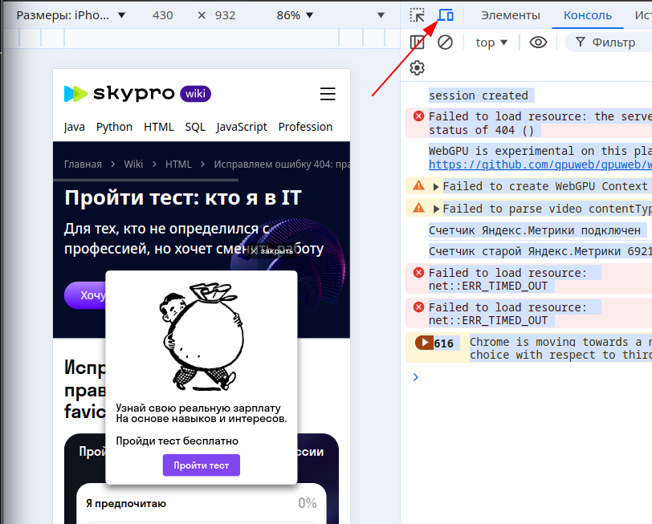

# Разработка мобильного приложения для управления коллекцией фильмов

>Задание переделано из задания демо-экзамена по разработке мобильных приложений. Чтобы вёрстка на сайте выглядела как для мобильного устройства нужно в "инструменте разработчика" в браузере "показать панель инструментов устройства":
>
>

Необходимо корректно обрабатывать запросы к серверу. В случае получения ошибки от сервера или отсутствия соединения с сетью Интернет необходимо отобразить соответствующий текст ошибки с помощью диалогового окна.

Необходимо следовать предложенному дизайну. Макеты приложения доступны по ссылке (launch screen делать не нужно):

https://www.figma.com/file/wwDCPGa4AyPXdeuFnKU95M/KOD1.4-Variant2

Описание протокола API доступно по ссылке:

https://swagger.kolei.ru?url=https://cinema.kolei.ru/swagger/cinema.yml

>Работа со swagger расписана в [старых лекциях](./f6_demo_1.md#запрос-регистрации-изучаем-работу-со-swagger)

При разработке приложения используйте возможности **SPA** (разные страницы, переходы между ними) и **pinia** (хранение данных об авторизации, возможно кеширование списка фильмов)

Необходимо реализовать следующий функционал:

1. Создайте проект. [Настройте иконку приложения согласно макету](https://sky.pro/wiki/html/ispravlyaem-oshibku-404-pravilniy-import-favicon-ico-v-vue-js/). 

1. Реализуйте экран `SignUp Screen` (регистрация) согласно макету:

    * При нажатии на кнопку "Зарегистрироваться" необходимо проверять поля для ввода на пустоту, а также `email` на корректность (требования к `email` описаны в документации к API). При некорректном заполнении необходимо отобразить ошибку с помощью диалогового окна или средствами валидации. Так же необходимо проверять равенство пароля и его повтора.

        Реализовать валидацию форм используя библиотеку [Vuelidate](https://vuelidate-next.netlify.app/) (реферат на эту тему в процессе написания)

    * При корректном заполнении формы необходимо отправлять запрос регистрации на сервер. При получении ошибки от сервера ее необходимо отобразить с помощью диалогового окна. При успешной регистрации нужно автоматически осуществить авторизацию и перейти на `Main Screen`.

    * При нажатии на кнопку "У меня уже есть аккаунт" необходимо осуществлять переход на `SignIn Screen`.

    * При первом запуске приложения должен отображаться `SignUp Screen`, при последующих - `SignIn Screen` (используйте [**localStorage**](./web_17.md#использование-localstorage-для-хранения-данных-при-перезапуске-приложения) для сохранения статуса входа). 

        Используйте [условную маршрутизацию](./web_16.md#условная-маршрутизация)

1. Реализуйте экран `SignIn Screen` (авторизация) согласно макету:

    * При нажатии на кнопку "Войти" необходимо проверять поля для ввода на пустоту, а также `email` на корректность (требования к `email` описаны в документации к API). При некорректном заполнении необходимо отобразить ошибку с помощью диалогового окна. При корректном заполнении формы необходимо отправить на сервер соответствующий запрос.

    * При нажатии на кнопку "Регистрация" необходимо осуществлять переход на `SignUp Screen`.

    * При успешной авторизации необходимо осуществлять переход на экран `Main Screen`. При получении ошибки от сервера необходимо отобразить ее с помощью диалогового окна.

1. Реализуйте экран `Main Screen` согласно макету:

    * На экране необходимо отобразить обложки фильмов из подборки «new» (информацию о фильмах необходимо запрашивать с сервера). Обложки должны быть отображены в виде карусели, необходимо реализовать возможность пролистывания с помощью жеста **swipe**.

        >Пример реализации карусели смотрите в [лекции "Карусель"](./web_18.md)

    * При пролистывании обложек название фильма в верхней части экрана должно меняться.

1. Реализуйте экран `Profile Screen` согласно макету:

    * Данные о пользователе необходимо запрашивать с сервера.

    * При нажатии на кнопку "Изменить" необходимо реализовать изменение аватара пользователя: 

        - Пользователь выбирает фотографию. 
        - Фотография отправляется на сервер.
        - В случае успеха аватар пользователя заменяется на новый, в случае ошибки она отображается с помощью диалогового окна.

    * При нажатии на кнопку "Выход" необходимо осуществлять переход на экран авторизации. 

    * При нажатии на кнопку «Обсуждения» необходимо переходить на экран "Chat List Screen".

1. Реализуйте экран "Chat List Screen" согласно макету:

    * Информацию необходимо запрашивать с сервера (запрос чатов пользователя). Если информация с сервера содержит дубли – их необходимо удалить. Если ваш пользователь еще не имеет чатов, сервер присылает пустой список, отправьте сообщение от текущего пользователя в чате с `id = 1` с помощью Swagger или Postman.

    * В подзаголовке ячейки необходимо отобразить последнее сообщение в соответствующем чате + имя его автора. Текст сообщения необходимо обрезать до двух строк.

    * Реализуйте отображение постеров к фильмам. Для получения постеров используйте подходящий запрос из API. Если постер для данного фильма нельзя получить из API - сгенерируйте абревиатуру по следующему правилу: если название фильма состоит и одного слова - необходимо взять первые две буквы слова; иначе - первые буквы первого и второго слова.

    * При нажатии на ячейку необходимо осуществлять переход на "Chat Screen" для выбранного фильма.

1. Реализуйте экран "Chat Screen" согласно макету:

    * Сообщения необходимо упорядочить от старых к новым сверху вниз. Для сегодняшних сообщений необходимо отобразить заголовок "Сегодня".

    * "Облако" сообщения должно растягиваться по содержимому.

    * Последовательно идущие сообщения одного автора необходимо группировать (расстояния между сообщениями должны быть меньше, как на макете).

    * Реализуйте блок отправки сообщения как на макете. При вводе сообщения поле для ввода должно растягиваться по вертикали.

    * При нажатии на кнопку "Отправить" необходимо отправить сообщение на сервер. При позитивном ответе от сервера необходимо отобразить сообщение в чате. При возникновении ошибки - отобразить ошибку с помощью диалогового окна.

    * Необходимо валидировать поле для ввода на пустоту. При отсутствии текста сообщения необходимо отобразить ошибку с помощью диалогового окна.

1. Реализуйте экран "Collections Screen" согласно макету (переход на экран из панели навигации в подвале):

    * При нажатии на иконку в правом верхнем углу необходимо переходить на экран Create Collection Screen.

    * На экране необходимо отображать созданные коллекции. **Информация о коллекциях должна храниться в памяти устройства (localStorage)**. Необходимо хранить название коллекции и иконку.

    * Реализуйте Swipe-to-delete для удаления коллекции, в том числе из памяти устройства.

1. Реализуйте экран "Create Collection Screen" согласно макету:

    * При открытии экрана в качестве иконки должно быть выбрано случайное изображение из коллекции иконок.

    * При нажатии на кнопку "Выбрать иконку" необходимо осуществлять переход на экран Icon Selection. Реализуйте данный экран в соответствии с макетом.

    * При нажатии на кнопку "Сохранить" необходимо сохранить новую коллекцию в памяти устройства и закрыть экран.

    * Необходимо проверять на пустоту поле для ввода названия коллекции. При отсутствии значения необходимо отобразить сообщение об ошибке.
