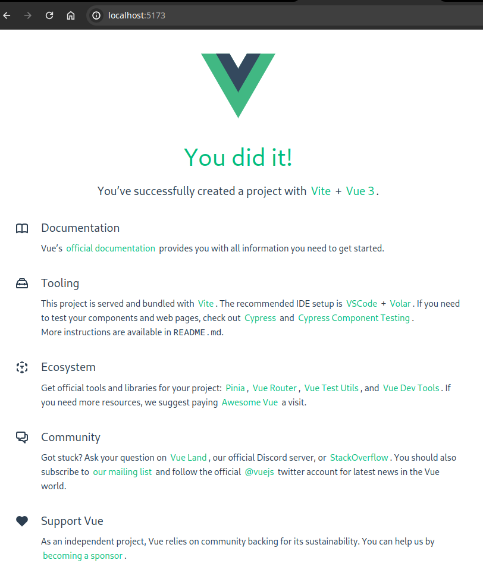
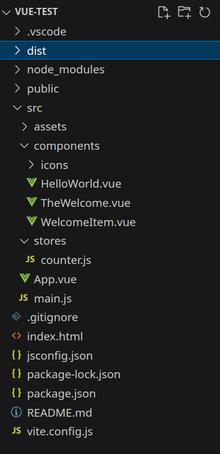

Предыдущая лекция | &nbsp; | Следующая лекция
:----------------:|:----------:|:----------------:
[Основы WEB-разработки](./web_basic.md) | [Содержание](../readme.md#практика-№2-разработка-web-приложений) | [Знакомство с VUE.js](./vue_intro.md)

# Знакомство с VUE.js

>Актуальная версия `vue 3`, её и будем дальше рассматривать.

Ссылка на [официальный сайт на русском](https://v3.ru.vuejs.org/)

* [Настройка окружения и создание приложения](#настройка-окружения-и-создание-приложения)
* [Деплой (создание и публикация готового приложения)](#деплой-создание-и-публикация-готового-приложения)
* [Структура проекта](#структура-проекта)
* [Выкидываем лишнее](#выкидываем-лишнее)

Исторически сложилось несколько вариантов проектов:

* **Options**: широко использовался в версии *vue2*, сейчас рекомендуется переход на **Composition**
* **Composition**: рекомендуемый вариант
* **Script setup**: вариант по-умолчанию, но мне он непривычен и использовать далее его не будем

## Настройка окружения и создание приложения

Для разработки на `vue.js` необходимо установить `node.js` (инструкцию по установке не пишу, их полно в интернете)

Для установки пакетов в `node.js` используется менеджер пакетов `npm` (устанавливается вместе с `node.js`)

Создание проекта начинается с команды:

```
npm create vue@latest
```

При выполнении `npm` запросит недостающий пакет - соглашаемся:

```
Need to install the following packages:
create-vue@3.9.2
Ok to proceed? (y)
```

Далее запросит имя проекта (при установке `vue.js` создаст одноименный подкаталог в текущем каталоге):

```
Vue.js - The Progressive JavaScript Framework

? Project name: › vue-project
```

При создании проекта инсталлятор запросит несколько параметров:

* добавить поддержку **TypeScript**: не надо
* добавить поддержку **JSX**: не надо
* добавить **Vue Router**: модуль для симуляции перехода по страницам сайта (для нашего тестового проекта не нужен, но в реальных многостраничных приложениях используйте)

    >Классические web-приложения в таких случаях запрашивают новую страницу у бекенда, а во `vue.js` содержимое генерится в браузере

* добавить **Pinia**: модуль для хранения состояния (очень полезен для обеспечения хранения данных между разными компонентами)
* **Vitest** - модульное тестирование, не надо
* **End-to-End Testing Solution** - интеграционное и функциональное тестирование
* **ESLint** - проверка синтаксиса при разработке. В реальной работе очень полезен, но нам пока не нужен.

```
? Add TypeScript? … No / Yes
? Add JSX Support? › No / Yes
? Add Vue Router for Single Page Application development? › No / Yes 
? Add Pinia for state management? › No / Yes    
? Add Vitest for Unit Testing? › No / Yes 
? Add an End-to-End Testing Solution? › - Use arrow-keys. Return to submit.
❯   No
    Cypress
    Nightwatch
    Playwright
? Add ESLint for code quality? › No / Yes    
```

После создания проекта нужно перейти в созданный каталого проекта и запустить команду `npm install` (эта команда скачивает необходимые зависимости)

```
Scaffolding project in /home/kei/temp/vue-test...

Done. Now run:

  cd vue-test
  npm install
  npm run dev
```  

Проект уже вполне рабочий. Запустить его можно выполнив команду `npm run dev` (при этом `vue.js` поднимает локальный сервер с поддержкой горячего обновления - меняя код сразу видим изменения в браузере)

```
VITE v5.1.1  ready in 277 ms

➜  Local:   http://localhost:5173/
➜  Network: use --host to expose
➜  press h + enter to show help
```

И открыв в браузере страницу `http://localhost:5173/` можно увидеть его содержимое:



## Деплой (создание и публикация готового приложения)

Для создания дистрибутива (набор **html** + **css** + **js** файлов, пригодных для выкладывания в прод) используется команда `npm run build`. При этом создается каталог `dist`, содержимое которого можно выкладывать на любой хостинг (сайт получается СТАТИЧЕСКИМ, т.е. никаких дополнительных программ, типа node.js, устанавливать на сервер не нужно - можно выложить даже на [Github Pages](https://pages.github.com/))

## Структура проекта



* `.vscode` - каталог с настройками **VSCode**, собственно к проекту не относится
* `dist` - каталог с дистрибутивом приложения, которое можно опубликовать. Появится после выполнения команды `npm run build`
* `node_modules` - каталог с установленными зависимостями. Появится после выполнения команды `npm install`
* `public` - каталог с динамическими ресурсами (картинки, загружаемые в рантайме)
* `src` - каталог с исходным кодом приложения
    - `assets` - статические ресурсы (картинки), включаемые в проект
    - `components` - компоненты (куски кода), здесь мы потом почистим
    - `stores` - менеджер состояний (**pinia**)
    - `App.vue` - точка входа в приложение, тоже позже разберем и почистим
    - `main.js` - код инициализации приложения
* `index.html` - шаблон страницы, сюда можно дописать стили и внешние js-библиотеки, но мы его трогать не будем
* `package.json` - настройи проекта и его зависимостей (отсюда их и берет команда `npm install`)

Ниже разберём подробнее содержимое

### index.html

Точка входа для браузера. Этот файл трогать пока не будем.

```html
<!DOCTYPE html>
<html lang="en">
  <head>
    <meta charset="UTF-8">
    <link 
        rel="icon" 
        href="/favicon.ico">
    <meta 
        name="viewport" 
        content="width=device-width, initial-scale=1.0">
    <title>Vite App</title>
  </head>
  <body>
    <div id="app"></div>
    <script 
        type="module" 
        src="/src/main.js">
    </script>
  </body>
</html>
```

Заголовок мы рассматривать не будем. Нас пока интересует только содержимое `<body>`

* `<div id="app"></div>` - тут описывается блок, вместо которого и будет нарисовано содержимое с помощью `vue.js`
* `<script type="module" src="/src/main.js"></script>` - скрипт, который инициализирует приложение при открытии страницы в браузере

### main.js

Инициализация приложения. Трогать пока тоже не будем.

```js
// добавление стилей
import './assets/main.css'

// ссылки на движок vue и хранилище pinia
import { createApp } from 'vue'
import { createPinia } from 'pinia'

// подключаем точку входа
import App from './App.vue'

// создаем приложение используя точку входа
const app = createApp(App)

// добавляем в приложение pinia
app.use(createPinia())

// монтируем созданное приложение в блок с id="app"
app.mount('#app')
```

### App.vue

Расширение `.vue` используется для так называемых **Single File Component** (компонент в одном файле). В таком формате в файле описываются и разметка (html) и логика (js) и стили (css)

* `<script>` - в этом теге содержится логика (**js**). В "рыбе", которую сгенерировал **vite** используется синтаксис *script setup*
* `<template>` - шаблон разметки **html**
* `<style>` - стили

Все блоки не обязательные.

```js
<script setup>
// импортируем компоненты, 
// которые будут использованы в этом файле
import HelloWorld from './components/HelloWorld.vue'
import TheWelcome from './components/TheWelcome.vue'
</script>

<template>
  <!-- заголовок --> 
  <header>
    

    <div class="wrapper">
      <!-- 
        выводим компонент HelloWorld, 
        передав параметр (props) msg -->

      <HelloWorld msg="You did it!" />
    </div>
  </header>

  <main>
    <!-- выводим компонент TheWelcome -->
    <TheWelcome />
  </main>
</template>

<style scoped>
header {
  line-height: 1.5;
}

.logo {
  display: block;
  margin: 0 auto 2rem;
}

@media (min-width: 1024px) {
  header {
    display: flex;
    place-items: center;
    padding-right: calc(var(--section-gap) / 2);
  }

  .logo {
    margin: 0 2rem 0 0;
  }

  header .wrapper {
    display: flex;
    place-items: flex-start;
    flex-wrap: wrap;
  }
}
</style>
```

## Выкидываем лишнее

На "рыбу" мы уже посмотрели, давайте выкинем лишнее:

1. В `App.vue` выкидываем компоненты и стили

    ```js
    <script>
    </script>

    <template>
    </template>
    ```

    Теги `<script>` и `<template>` оставляем, мы потом добавим туда свои компоненты

1. Удаляем все файлы и каталоги в каталоге `components` и файл `src/assets/logo.svg` 

