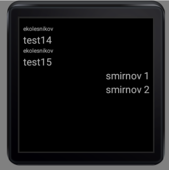

<table style="width: 100%;"><tr><td style="width: 40%;">
<a href="../articles/android_auth.md">Проект "база". Авторизация на сервере (Basic auth, token)
</a></td><td style="width: 20%;">
<a href="../readme.md">Содержание
</a></td><td style="width: 40%;">
<a href="../articles/wear_os.md">Wear OS
</a></td><tr></table>

# Wear OS

В принципе тот же андроид, только с немного урезанным функционалом (список отрезанных SDK легко гуглится). Но на нашем уровне разницы практически не заметно.

## Настройка

1. Установите эмулятор для часов (**будьте внимательны, не установите китайскую версию**)


2. Создайте проект:


## Проект "база"

Для часов корневым элементом разметки является **BoxInsetLayout** (начиная со 2-й версии). 

Внутри него расположен **FrameLayout** (это запоминать не нужно - приложение сразу таким и создаётся).

Свою разметку вы уже располагаете внутри **FrameLayout**

На **FutureSkills 2019** было задание залогиниться на часах и показать какую-то информацию с сервера. Реализуем это на нашем API:

1. Заставку пропущу, но тут вы и сами должны справиться

2. Экран авторизации (поля ввода и кнопки Login/Logout) рисуем прямо на экране **activity** (тут нет смысла в диалоге, экран слишком мелкий)

    Тут тоже сделайте сами. Отмечу только, что **activity** создается в меню ***New -> Wear -> Blank activity***

3. HTTP-запросы тоже рабтают как обычно - реализуйте login/logout по аналогии с прошлым заданием.

4. В **КОД**-е было что-то написано про обсуждение фильмов. То-ли форум, то-ли чат... Сделаем чат:

    API я доработал:

    ```
    ### отправка сообщения в чат
    POST {{url}}/chat
    Content-Type: application/json
    Token: {{token}}

    {"message":"test"}

    ### получение сообщений
    GET {{url}}/chat
    Token: {{token}}
    ```

    Для отображения списка есть свой элемент - **androidx.wear.widget.WearableRecyclerView** (позволяет прокручивать список механическим колесиком на часах и доскроливать крайние элементы до середины экрана, что очень удобно на круглых интерфейсах).

    ```kt
    wrc = findViewById(R.id.wrc)
    // wrc.setHasFixedSize(true)

    // этот параметр позволяет прокручивать 
    // крайние элементы списка на середину экрана 
    // (иначе на круглых часах можно не разглядеть содержимое)
    wrc.isEdgeItemsCenteringEnabled = true

    // менеждер тоже свой
    wrc.layoutManager = WearableLinearLayoutManager(this)

    // адаптер не отличается
    wrc.adapter = MyAdapter(chatList)
    ```

    Для периодического обновления сообщений в чате получение списка заверните в таймер:

    ```kt
    timer(period = 5000L, startAt = Date()){
        // тут вызвать GET /chat
    }
    ```

    Должно получиться что-то подобное (слева входящие сообщения с отправителем, справа ваши)

    

    Соответственно нужно добавить на экран EditText и кнопку отправить (в одной строке)


>Google не рекомендует пользоваться HTTP-запросами в приложении часов.
В носимой электронике большую роль играет энергоэффективность. А активное интернет-соединение будет быстро сажать батарею, и могут регулярно происходить разрывы связи. Ещё носимые устройства предполагают активную синхронизацию, которую тоже нужно реализовывать.
Все эти проблемы за нас любезно решает механизм обмена данными в Google Services под названием **«Data Layer»**.
>
>**Data Layer** помогает синхронизировать данные между всеми носимыми устройствами, привязанными к одному Google аккаунта пользователя. Он выбирает наиболее оптимальный маршрут для обмена данными (bluetooth, network) и реализует стабильную передачу. Это гарантирует, что сообщение дойдет до нужного девайса.
>
>

# Задание

Разработать приложение для **Wear OS** c несколькими экранами:

* заставка
* авторизация
* чат (приём и отправка сообщений)
