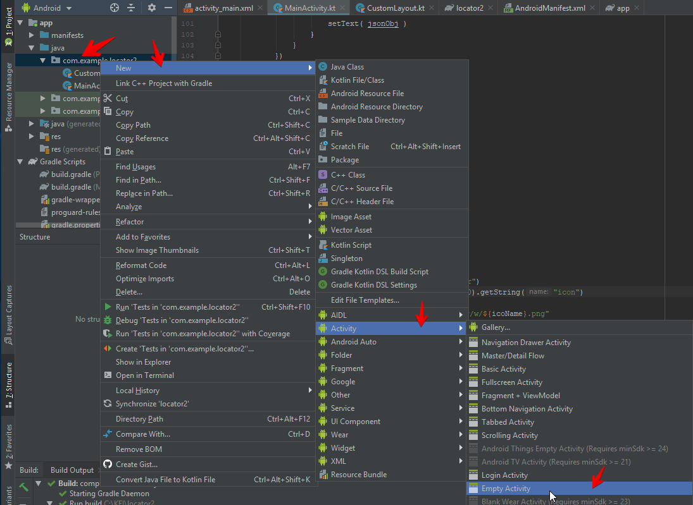
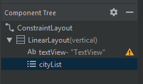
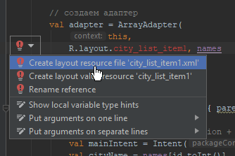
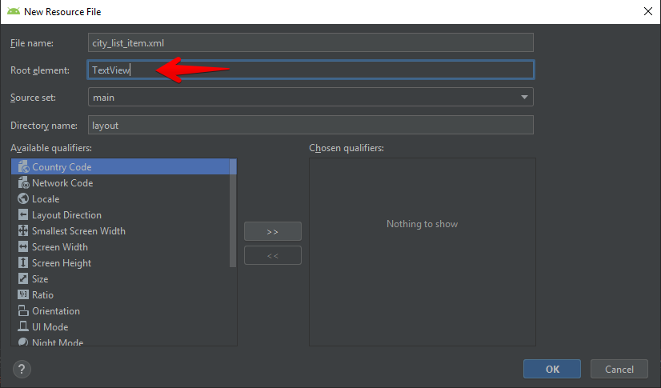

<table style="width: 100%;"><tr><td style="width: 40%;">
<a href="../articles/weather.md">Проект погода (начало): геолокация, http(s)-запросы, разбор json, ImageView.
</a></td><td style="width: 20%;">
<a href="../readme.md">Содержание
</a></td><td style="width: 40%;">
<a href="./navigation.md">Принципы навигации внутри и между андроид-приложениями
</a></td><tr></table>

# Проект погода (продолжение): SplashScreen (заставка). Выбор города. Выбор и отображение массива значений (почасовая, ежедневная). Разбор XML.

## Содержание

* [SplashScreen](#splashscreen)
* [Выбор города](#выбор-города)
* [Выделение лямбда-выражения в отдельную переменную](#выделение-лямбда-выражения-в-отдельную-переменную)
* [Получение и разбор массива данных. Вывод списка на экран.](#получение-и-разбор-массива-данных-Вывод-списка-на-экран)
* [Доработка SplashScrin-а](#Доработка-SplashScreen-а)
* [Вывод сообщений](#Вывод-сообщений)
* [Пример GET-запроса с обработкой ошибок](#пример-с-обработкой-ошибок)
* [Разбор XML](#Разбор-XML)

## SplashScreen

Если приложение долго грузится (запрос геолокации или "тяжёлых" данных из сети), то принято при запуске показывать заставку (SplashScreen).

Есть два варианта:

1. Рисуют дополнительную **activity** с заставкой и запускают её первой. 
2. Прямо на основной **activity** рисуют **ImageView** поверх всех элементов и скрывают её, когда необходимость в ней исчезает.

Рассмотрим второй вариант (при условии что у нас **ConstraintLayout**):

Я в качестве заставки буду показывать фон:

* первым элементом кладем **ImageView** с картинкой, задав ему режим растягивания на весь экран `android:scaleType="fitXY"` и Z-индекс `android:elevation="999dp"`

    ```xml
    <ImageView
        android:scaleType="fitXY"
        android:elevation="999dp"

        android:id="@+id/splash"
        android:layout_width="match_parent"
        android:layout_height="match_parent"
        app:layout_constraintBottom_toBottomOf="parent"
        app:layout_constraintEnd_toEndOf="parent"
        app:layout_constraintStart_toStartOf="parent"
        app:layout_constraintTop_toTopOf="parent"
        app:srcCompat="@drawable/splash" />
    ```

* в коде главного окна в момент, когда нужно убрать заставку меняем Z-индекс заставки

    ```kt
    val splash = findViewById<ImageView>(R.id.splash)
    splash.elevation = 0F
    ```

    >чтобы картинка нам не мешалась при разработке, мы можем в дизайнере оставить Z-индекс **0**, а в конструкторе окна задать **999F**

Тут надо помнить, что в вёрстке указываются **dp**, а в коде **float**

## Выбор города

>В принципе список можно вывести прямо в главном окне (на форму кинуть **ListView** и с помощью атрибута *elevation* поместить его поверх всех элементов), но в таком случае не будет реализован выход по кнопке *Назад*, что может сказаться на юзабилити. 

Поэтому, будем реализовывать "классический" вариант со списком в отдельном **activity**. Заодно научимся запускать дополнительные **activity** и получать от них ответ.

1. Создаем новую форму (**Activity**) с именем *CityListActivity*

    

2. На главное окно добавляем кнопу перехода на экран выбора города и обработчик для нее:

    ```kt
    startActivityForResult( 
        Intent(this, CityListActivity::class.java), 
        1)
    ```

    Здесь *startActivityForResult* - метод запуска нужной **activity**. 

    **Интент (Intent)** – это объект для обмена между *activity*, который абстрактно представляет собой **намерение** выполнить какое-либо действие. В основном интенты используются для запуска *activity*. Как только интент отправляется, его получает система Android, и считывает информацию в нем. Для открытия второго экрана, нам нужно создать и отправить объект **Intent** с указанием *activity*, которое нужно открыть. Затем вызвать метод *startActivity()* с передачей объекта **Intent**, который отправит это сообщение фреймворку Android, который откроет это активити.

3. На форму *CityListActivity* кидаем вертикальный **LinearLayout**, в него **TextView** (для заголовка "Выберите город") и **ListView**. **ListView** присваиваем id *cityList*

    


4. В классе *CityListActivity* 

    * создаем массив городов

        ```kt
        private var cityNames = arrayOf(
            "Moscow",
            "Yoshkar-Ola",
            "Kazan"
        )
        ```

    * в конструкторе получаем указатель на **ListView**

        ```kt
        cityListView = findViewById(R.id.cityList)
        ```

    * задаем для списка **ArrayAdapter**. **ArrayAdapter** связывает массив данных с шаблоном элемента списка.

        ```kt
        cityListView.adapter = ArrayAdapter(
            this,
            R.layout.city_list_item,
            cityNames
        )
        ```

        Android Studio покажет ошибку, что не знает что такое ``city_list_item`` - в контекстном меню добавляем реализацию:

        

        **Внимание!** RootElement поменять на TextView

        

        Созданный шаблон можно настроить (установить высоту, добавить границы...)

    * задаем обработчик клика по элементу списка

        ```kt
        cityListView.setOnItemClickListener { parent, view, position, id ->
            // получаем название города
            val cityName = cityNames[position]

            // запоминаем выбранное название города в параметрах
            val newIntent = Intent()
            newIntent.putExtra("cityName", cityName)
            setResult(RESULT_OK, newIntent)

            // заверщаем текущий activity
            finish();
        }
        ```

        **Передача информации между активити**

        На первом экране при возврате должно отображаться название выбранного города (и данные о погоде). Для этого первому *activity* требуется выбранное название города. Мы можем передать эту информацию в интенте, используя метод *putExtra()*. *Activity* может получить интент, который запустил его (или вернулся как результат вызова другого *activity*), и извлечь данные из этого интента.

5. В классе главного окна для получения результата выбора реализуем метод *onActivityResult*

    ```kt
    @SuppressLint("MissingSuperCall")
    override fun onActivityResult(requestCode: Int, resultCode: Int, data: Intent?) {
        if (data == null) {
            return
        }
        val name = data.getStringExtra("cityName")

        // тут запускаем http-запрос по имени города
        httpGet(
            "https://api.openweathermap.org/data/2.5/weather?q=${name}&appid=${appid}&lang=ru&units=metric", 
            callback)
    }
    ```

    >Метод *onActivityResult* гугл объявил устаревшим (deprecated), и в IDE он помечается как ошибка - надо в контекстном меню "More action..." выбрать "Supress: add...". Перед методом будет добавлена аннотация `@SuppressLint("MissingSuperCall")`.

>OpenWeather поддерживает [*геокодирование*](https://openweathermap.org/current), т.е. может найти координаты (и, соответственно, погоду по ним) по названию города:
>```
>https://api.openweathermap.org/data/2.5/weather?q={city name}&appid={API key}
>```
>где, *city_name* название города

## Выделение лямбда-выражения в отдельную переменную

Для обработки результатов мы результаты запроса обрабатывли в месте получения. 

Но теперь тот же код будет использоваться для получения погоды по городу. Поэтому имеет смысл обработку результата оформить отдельной лямбда-функцией:

```kt
// weatherCallback - свойство класса, объявляется в теле класса
private val weatherCallback: (response: Response?, error: Exception?)->Unit = {
    response, error ->
        try {
            // если в запросе получено исключение, то "выбрасываем" его
            if (error != null) throw error

            // если ответ получен, но код не 200, то тоже "выбрасываем" исключение
            if (!response!!.isSuccessful) throw Exception(response.message)

            // начинаем обработку ответа    

            val json = JSONObject(response.body!!.string())
            val wheather = json.getJSONArray("weather")
            val icoName = wheather.getJSONObject(0).getString("icon")

            // обращение к UI должно быть в контексте UiThread
            runOnUiThread {
                textView.text = json.getString("name")
            }

            httpGet("https://openweathermap.org/img/w/${icoName}.png")
            {response, error ->
                try {
                    // если в запросе получено исключение, то "выбрасываем" его
                    if (error != null) throw error

                    // если ответ получен, но код не 200, то тоже "выбрасываем" исключение
                    if (!response!!.isSuccessful) throw Exception(response.message)

                    runOnUiThread {
                        ico.setImageBitmap(
                            BitmapFactory
                                .decodeStream(
                                    response.body!!.byteStream()
                                )
                        )
                    }

                } catch (e: Exception) {
                    // любую ошибку показываем на экране
                    runOnUiThread {
                        AlertDialog.Builder(this)
                            .setTitle("Ошибка")
                            .setMessage(e.message)
                            .setPositiveButton("OK", null)
                            .create()
                            .show()
                    }
                }
            }
        } catch (e: Exception) {
            // любую ошибку показываем на экране
            runOnUiThread {
                AlertDialog.Builder(this)
                    .setTitle("Ошибка")
                    .setMessage(e.message)
                    .setPositiveButton("OK", null)
                    .create()
                    .show()
            }
        }
    }
}

...

// при запросе погоды используем переменную, объявленную выше
httpGet(
    "https://api.openweathermap.org/data/2.5/weather?lat=56.638372&lon=47.892991&appid=${appid}&lang=ru&units=metric", 
    weatherCallback)
```

## Получение и разбор массива данных. Вывод списка на экран.

Для начала определимся со структурой формы:

Всё окно разбито по вертикали на три блока (указаны стрелками на рисунке ниже)

* первый блок - детальная информация о выбранной погоде
* второй блок - горизонтальный список кратких данных о погоде
* третий блок - панель с кнопками (пока у нас там только "Поиск города", но может ещё что-то придумаем)


### Класс погода

Для хранения массива полученных данных нам нужно описать структуру элемента списка. Для этого в котлине есть **data class** - класс, который содержит только свойства.

Выглядит он примерно так (каждый класс жедательно заворачивать в отдельный файл)

```kt
data class Weather (
    val dt: Int,
    val mainTemp: Double,
    val mainHumidity: Int,
    val weatherIcon: String,
    val weatherDescription: String,
    val windSpeed: Double,
    val windDeg: Int,
    val dtTxt: String
    )
```

### Заполнение массива данных о погоде

С моим бесплатным аккаунтом на **openweathermap** кроме текущих данных можно запросить только список за 5 дней:

```
### Запрос погоды за 5 дней https://openweathermap.org/forecast5
GET https://api.openweathermap.org/data/2.5/forecast?lat={{lat}}&lon={{lon}}&appid={{token}}&lang=ru&units=metric
```

1. Объявим в классе главного окна массив данных о погоде

    ```kt
    private val weatherList = ArrayList<Weather>()
    ```

2. Получаем и заполняем массив 

    ```kt
    val url = "https://api.openweathermap.org/data/2.5/forecast?lat=${lat}&lon=${lon}&appid=${token}&lang=ru&units=metric"
    httpGet(url)
    {response, error ->
        try {
            // если в запросе получено исключение, то "выбрасываем" его
            if (error != null) throw error

            // если ответ получен, но код не 200, то тоже "выбрасываем" исключение
            if (!response!!.isSuccessful) throw Exception(response.message)            
            
            weatherList.clear()

            val json = JSONObject(response.body!!.string())
            val list = json.getJSONArray("list")

            // перебираем json массив
            for(i in 0 until list.length()){
                val item = list.getJSONObject(i)
                val weather = item.getJSONArray("weather").getJSONObject(0)

                // добавляем в список новый элемент
                weatherList.add(
                    Weather(
                        item.getInt("dt"),
                        item.getJSONObject("main").getDouble("temp"),
                        item.getJSONObject("main").getInt("humidity"),
                        weather.getString("icon"),
                        weather.getString("description"),
                        item.getJSONObject("wind").getDouble("speed"),
                        item.getJSONObject("wind").getInt("deg"),
                        item.getString("dt_txt")
                    )
                )
            }

            runOnUiThread {
                // уведомляем визуальный элемент, что данные изменились
                dailyInfoRecyclerView.adapter?.notifyDataSetChanged()
            }
        } catch (e: Exception) {
            // любую ошибку показываем на экране
            runOnUiThread {
                AlertDialog.Builder(this)
                    .setTitle("Ошибка")
                    .setMessage(e.message)
                    .setPositiveButton("OK", null)
                    .create()
                    .show()
            }
        }
    }
    ```

### Вывод списка (RecyclerView)

**RecyclerView** - рекомендованный способ вывода списков (с его помощью можно было теоретически заполнить и список городов, но он для этого слишком монструозный). Его особенность в том, что визуальные элементы списка существуют только при отображении на экране. При выходе за экран визуальный элемент удаляется, перед появлением создается заново. Таким образом экономится память.

Итак, на форме у нас уже лежит элемент **RecyclerView** (№2)

В класс главного окна добавим переменную для связи с элементом **RecyclerView**

```kt
private lateinit var dailyInfoRecyclerView: RecyclerView
```

Затем в конструкторе её инициализируем и назначаем *layoutManager* и *adapter*

```kt
dailyInfoRecyclerView = findViewById(R.id.dailyInfoRecyclerView)

// назначаем менеджер разметки
dailyInfoRecyclerView.layoutManager = LinearLayoutManager(
    this, 
    RecyclerView.HORIZONTAL, 
    false)

// создаем адаптер
val weatherAdapter = WeatherAdapter(
    weatherList, 
    this)

// при клике на элемент списка показать подробную информацию (сделайте сами)
weatherAdapter.setItemClickListener { weather ->
    Log.d("KEILOG", "Click on Weather item")
}

dailyInfoRecyclerView.adapter = weatherAdapter
```

Класс **WeatherAdapter** мы должны написать сами. Я положил его в [шпаргалки](../shpora/WeatherAdapter.kt).

Разметка для элемента списка (не полная)

```xml
<?xml version="1.0" encoding="utf-8"?>
<LinearLayout
    android:id="@+id/container"
    xmlns:android="http://schemas.android.com/apk/res/android"
    android:orientation="vertical"
    android:layout_width="100dp"
    android:layout_height="match_parent">

    <ImageView
        android:id="@+id/weather_icon"
        android:layout_width="match_parent"
        android:layout_height="100dp"/>

    <TextView
        android:layout_width="match_parent"
        android:layout_height="wrap_content"
        android:text="Температура"
        />
    <TextView
        android:id="@+id/weather_temp"
        android:layout_width="match_parent"
        android:layout_height="wrap_content"/>

</LinearLayout>
```

### Перфекционизм

Информация в **RecyclerView** может затеряться на ярком фоне. Чтобы этого не происходило можно либо задать для **RecyclerView** фон с заливкой каким-то цветом, либо, что-бы не полностью скрывать наш красивый фон, сделать этот фон полупрозрачным. 

Для задания полупрозрачности элемента используется тег **alpha**, но с ним тоже не всё хорошо - полупрозрачным становится и всё содержимое элемента.

Есть другой вариант: задать в качестве фона **drawable** ресурс, которому заливку указать с альфа-каналом:

```xml
<?xml version="1.0" encoding="utf-8"?>
<shape
    xmlns:android="http://schemas.android.com/apk/res/android">
    <solid
        android:color="#80FFFFFF"/>
</shape>
```

## Доработка SplashScreen-а

По разным причинам данные мы можем и не получить. Чтобы наша заставка вечно не висела на экране приделаем таймер.

* В конструктор добавляем таймер с обратным отсчётом, в параметрах которого указываем **макcимальное время ожидания** и **интервал** между тиками. На каждый тик срабатвает метод *onTick*, в котором мы можем принудительно закрыть таймер. Если за **макcимальное время ожидания** таймер не закроют в *onTick*, то сработает метод *onFinish* и таймер завершит свою работу.


    >На уровне класса нужно объявить переменные `counter=0` и `ready=false`

    ```kt
    object : CountDownTimer(5000,1000){
        override fun onTick(millisUntilFinished: Long) {
            // заставляем пялиться на нашу заставку как минимум 3 секунды
            counter++
            if(counter>3 && ready){
                // данные получены - скрываем заставку
                splash.elevation = 0F
                this.cancel()
            }
        }

        override fun onFinish(){
            splash.elevation = 0F
        }
    }.start()
    ```

    Не забудьте при получении данных установить `ready=true`. Хотя ничего страшного не произойдёт, если забудете - просто будут смотреть на заставку чуть подольше.

## Разбор XML

Маловероятно, мо может встретиться XML-формат в данных. Разберёмся с ним на примере погоды. В URL добавьте параметр `&mode=xml`.

Придёт примерно такой ответ:

```xml
<?xml version="1.0" encoding="UTF-8"?>
<weatherdata>
  <location>
    <name>Йошкар-Ола</name>
    <type></type>
    <country>RU</country>
    <timezone>10800</timezone>
    <location altitude="0" latitude="56.6384" longitude="47.893" geobase="geonames" geobaseid="466806"></location>
  </location>
  <credit></credit>
  <meta>
    <lastupdate></lastupdate>
    <calctime>0</calctime>
    <nextupdate></nextupdate>
  </meta>
  <sun rise="2021-11-16T04:30:05" set="2021-11-16T12:36:33"></sun>
  <forecast>
    <time from="2021-11-16T15:00:00" to="2021-11-16T18:00:00">
      <symbol number="600" name="небольшой снег" var="13n"></symbol>
      <precipitation probability="0.69" unit="3h" value="0.28" type="snow"></precipitation>
      <windDirection deg="275" code="W" name="West"></windDirection>
      <windSpeed mps="5.56" unit="m/s" name="Moderate breeze"></windSpeed>
      <windGust gust="13.37" unit="m/s"></windGust>
      <temperature unit="celsius" value="-1.58" min="-2.05" max="-1.58"></temperature>
      <feels_like value="-7.22" unit="celsius"></feels_like>
      <pressure unit="hPa" value="1015"></pressure>
      <humidity value="94" unit="%"></humidity>
      <clouds value="пасмурно" all="99" unit="%"></clouds>
      <visibility value="651"></visibility>
    </time>
    ...
  </forecast>
</weatherdata>
```

Для работы с XML в андроиде есть класс **XmlPullParser**. Разберём с его помощью ответ сервера.

**Во-первых**, создадим сам объект парсера:

```kt
val factory = XmlPullParserFactory.newInstance()
factory.isNamespaceAware = true
val parser = factory.newPullParser()
parser.setInput(StringReader(result))
...
```

А дальше идёт тупой перебор тегов в цикле:

```kt
while (parser.eventType != XmlPullParser.END_DOCUMENT) {
    when (parser.eventType) {
        XmlPullParser.START_TAG -> ...
        XmlPullParser.END_TAG -> ...
    }
    parser.next()
}
```

Т.е. пока не достигнем конца документа смотрим что у нас в текущем элементе:

* START_DOCUMENT – начало документа
* START_TAG – начало тега
* TEXT – содержимое элемента
* END_TAG – конец тега
* END_DOCUMENT – конец документа

Мы из всего этого многообразия будем использовать только начало и конец тега.

По началу тега мы смотрим в каком теге находимся и, при необходимости, считываем текст или атрибут в локальную переменную. А по концу тега создаём объект **Weather** из накопленных данных и записываем его в массив.

Пример (как обычно не полный, но достаточный для понимания):

>В переменных *topTag* и *subTag* я запоминаю текущую позицию в иерархии XML. В этом документе они в принципе не нужны, но для примера проверок сделал.

```kt
var cityName = ""
var topTag = ""
var subTag = ""
var dt_txt = ""
var description: String = ""
var icon: String = ""
while (parser.eventType != XmlPullParser.END_DOCUMENT) {
    when (parser.eventType) {
        XmlPullParser.START_TAG -> {
            when (parser.name) {
                // в качестве начальных тегов нам интересны "location" и "forecast"
                "location", "forecast" -> topTag = parser.name
                "name" -> {
                    // внутри "location" в теге "name" читаем название города
                    if(topTag=="location") cityName = parser.nextText()
                }
                "time" -> {
                    if (topTag=="forecast") {
                        // внутри "forecast" нам интересно содержимое "time"
                        subTag = parser.name
                        // и сразу считываем СТРОКОВУЮ дату
                        dt_txt = parser.getAttributeValue(null, "from").toString()
                    }
                }
                "symbol" -> {
                    if(subTag=="time"){
                        description = parser.getAttributeValue(null, "name").toString()
                        icon = parser.getAttributeValue(null, "var").toString()
                    }
                }
                // тут мне как обычно лень стало расписывать остальные теги
            }
        }
        XmlPullParser.END_TAG -> {
            when (parser.name) {
                "time" -> {
                    subTag = ""
                    // по закрытию тега "time" пишем погоду в массив
                    weatherList.add(
                        Weather(
                            0,
                            0.0,
                            0,
                            icon,
                            description,
                            0.0,
                            0,
                            dt_txt
                        )
                    )
                }
            }
        }
    }
    parser.next()
}
```

## Разбор даты

Форматы дат более менее [стандартизованы](https://developer.android.com/reference/java/time/format/DateTimeFormatter), но если под рукой нет интернета, то можно разобрать любую дату по [шаблону](https://developer.android.com/reference/java/time/format/DateTimeFormatter#patterns


Литерал | Значение
:------:|---------
y       | Год (2021, 21)
M       | Номер месяца (1..12)
d       | День месяца (1..31)
H       | Часы
m       | Минуты
s       | Секунды
''      | Любой литерал

```kt
// разбор простой MySQL даты, тут практически нет подводных камней
tempDate = LocalDateTime.parse(
    "2021-11-16 10:12:13", 
    DateTimeFormatter.ofPattern("y-M-d H:m:s")
)

// разбор ISO даты, нужно экранировать символ "Т" и обрезать лишнюю часть строки 
tempDate = LocalDateTime.parse(
    "2021-11-16T10:12:13Z".substring(0,19), 
    DateTimeFormatter.ofPattern("yyyy-MM-dd'T'HH:mm:ss")
)
```

# Задание

* вывести в элементы списка остальную информацию о погоде (формат XML)
* при обновлени списка и при клике на элемент списка выводить в верхнюю часть детальную информацию о погоде
* вставить алерты на все нештатные ситуации (не получены координаты, нет ответа от сервера...)
* завернуть всю работу с интернетом и разбором данных в исключительные ситуации (try..catch..) с выводом алертов

# Это интересно

https://habr.com/ru/company/true_engineering/blog/267497/

<table style="width: 100%;"><tr><td style="width: 40%;">
<a href="../articles/weather.md">Проект погода (начало): геолокация, http(s)-запросы, разбор json, ImageView.
</a></td><td style="width: 20%;">
<a href="../readme.md">Содержание
</a></td><td style="width: 40%;">
<a href="../articles/android_auth.md">Проект "база". Авторизация на сервере (Basic auth, token). POST-запросы. API.
</a></td><tr></table>