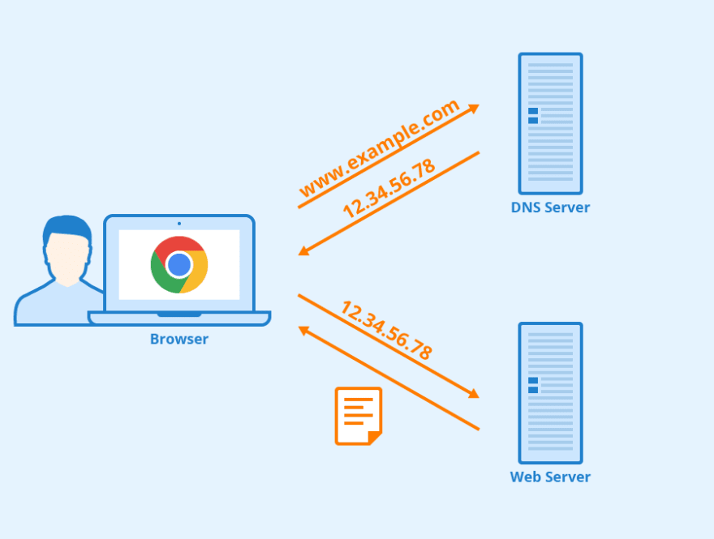
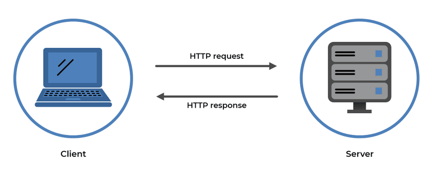
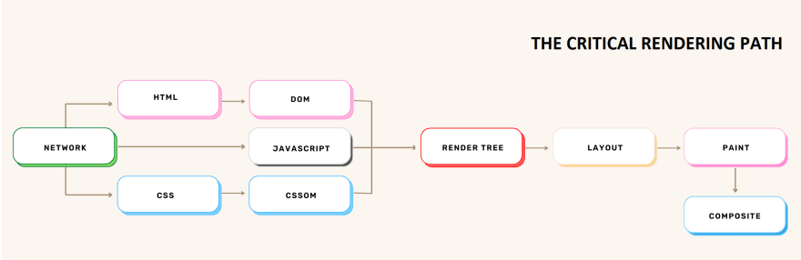
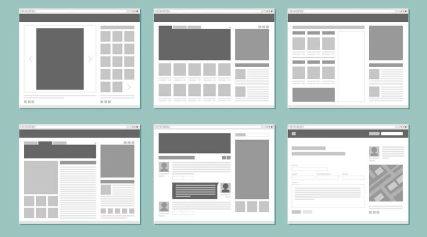
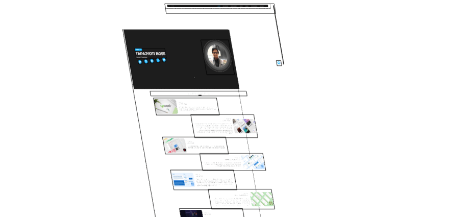

[К содержанию](../readme.md#введение-в-web-разработку)

# Intro

## Как работает веб-браузер

>Содрано [отсюда](https://habr.com/ru/articles/726292/)

### Навигация

Навигация - это первый шаг загрузки веб-страницы. Она происходит когда пользователь вводит URL в адресной строке или делает клик по ссылке.



**DNS-поиск**

Первый шаг - найти IP-адрес, где располагаются ресурсы. Это делается с помощью DNS-поиска.

>DNS (Domain Name System)-сервер - это сервер, который главным образом используются для сопоставления имени хоста веб-сайта (пр.: www.example.com) с соответствующим ему IP-адресом. Он содержит базу данных публичных IP-адресов и им соответствующих доменных имен.

Например если вы посетите страницу www.example.com, то DNS-сервер вернет вам ее IP-адрес (93.184.216.34).

>тут вырезан кусок про безопасное подключение, можете посмотреть в оригинале, если интересно

### Фетчинг ресурсов

После того как установлено TCP-соединение браузер может начать фетчинг (от англ. гл. to fetch - получать, загружать) ресурсов сервера.



#### HTTP-запрос

Если у вас уже есть опыт в веб-разработке, то вы наверняка встречали понятие HTTP-запросов.

HTTP-запросы используются для фетчинга ресурсов сервера. Для запросов необходимо указать URL и тип запроса (GET, POST, PUT, DELETE). Браузер также добавляет заголовки (headers) к запросу, что бы предоставить дополнительную информацию.

Первый запрос к серверу обычно является GET-запросом на получение HTML-файла.

#### HTTP-ответ

Затем сервер отвечает соответствующим HTTP-ответом. Ответ содержит код состояния (status code), заголовки (headers) и тело ответа (body).

### Парсинг HTML

Теперь начинается главная секция. После того как браузер получил HTML-файл он парсит (от англ. гл. to parse - разбирать, анализировать) его для создания DOM (Document Object Model)-дерева.

Это делается при помощи движка браузера, который является его ядром (Пр.: Gecko для Firefox, Webkit для Safari, Blink для Chrome и т.д.).

Вот пример HTML-файла:

```html
<!DOCTYPE html>
<html>
  <head>
    <title>Page Title</title>
  </head>
  <body>
    <p>Hello World!</p>
  </body>
</html>
```

#### Строительство DOM-дерева

**DOM-дерево** - это древовидная структура данных, которая представляет собой ноды (от англ. node - узел) в HTML-документе.

**Заметка**: если для страницы требуются какие-либо внешние ресурсы, то они будут обработаны следующим образом:

1. Не блокирующие ресурсы загружаются параллельно (Пр.: картинки)
1. Отложенные ресурсы загружаются параллельно, но выполняются после того как будет построено DOM-дерево. Пр.: скрипты с атрибутом defer и CSS-файлы.
1. Блокирующие ресурсы загружаются и выполняются последовательно. Пр.: скрипты БЕЗ атрибута defer.

### Парсинг CSS

После того как DOM-дерево построено, браузер парсит CSS-файлы для создания CSSOM (CSS Object Model).

Этот процесс аналогичен построению DOM-дерева.

### Выполнение JavaScript

Как упоминалось ранее, если у страницы есть блокирующий скрипт, то он будет загружен и обработан незамедлительно, в то время как строительство DOM-дерева будет отложено, либо же скрипт будет загружен и выполнен после того, как DOM-дерево будет полностью создано.

Независимо от того когда выполняется скрипт, он будет обработан движком JavaScript, который похож на движок браузера и зависит от того какой браузер используется.

#### JIT-компиляция

Предполагая, что вам уже знакома концепция интерпретаторов и компиляторов, поговорим о движке JavaScript.

Движок JavaScript использует гибридный подход компиляции именуемый JIT (от англ. аббревиатуры Just in Time - точно в срок).

>JIT-компиляция, в отличие от скомпилированного языка такого как C, где компиляция делается заранее (другими словами ДО выполнения кода), делается ВО ВРЕМЯ выполнения.


### Рендеринг

Наконец-то пришло время рендера (от англ. rendering - визуализация) страницы. Для рендеринга браузер использует DOM-дерево и CSSOM.



#### Построение дерева рендера

Первый шаг - построить дерево рендера. Дерево рендера - это подмножество DOM-дерева, состоящее только из видимых на странице элементов.

#### Компоновка (layout)

Следующим этапом является компоновка дерева рендера. Она делается путем расчетов точных размеров и позиции каждого элемента в дереве рендера.

Этот этап происходит каждый раз, когда мы изменяем что-нибудь в DOM, что затрагивает компоновку страницы, даже частично.

Примеры ситуаций, когда позиция элементов перерассчитывается:

1. Добавление или удаление элементов из DOM
1. Изменение размеров окна браузера
1. Изменение ширины, высоты или позиции элемента



#### Отрисовка (painting)

Наконец, браузер решает, какие ноды должны быть видимыми, и рассчитывает их позицию в области просмотра (viewport), после чего наступает время их отрисовать (сделать рендер пикселей) на экране. Этот этап также известен как этап растеризации, на котором браузер преобразует каждый элемент, рассчитанный на этапе компоновки, в реальные пиксели на экране.

Также как и этап компоновки, этот этап происходит каждый раз когда мы изменяем отображение элемента в DOM, даже частично.

Примеры ситуаций, когда происходит повторная отрисовка:

1. Изменение очертания элемента
1. Изменение прозрачности (opacity) или видимости (visibility) элемента
1. Изменение цвета фона элемента

#### Наложение слоев и композиция



Финальный этап - композиция слоев. Это делается браузером для оптимизации процесса рендеринга.

>Композиция (compositing) - это техника разделения частей страницы на слои, их отрисовки и дальнейшего составления из них страницы в отдельном потоке называемом композиторским потоком (compositor thread). Когда разделы документа рисуются в разных слоях, перекрывая друг-друга, композиция необходима для того что бы удостовериться, что они нарисованы в правильном порядке и их содержимое корректно отображается.

**Заметка**: обновления DOM, в частности компоновка и отрисовка, чрезвычайно ресурсоемкие операции, которые существенно заметны на слабых устройствах. Поэтому важно минимизировать количество их срабатываний.

---

В итоге вы должны осознавать, что браузер работает только с тремя типами ресурсов:

* HTML
* CSS
* JS

Задача сервера предоставить эти ресурсы

* статические 
* динамические

Фронтенд (верстка HTML), бекенд (АПИ, фреймворки)

Языки программирования бекенда

* PHP
* Python
* Node.js


>Скроее всего Вы услышите много новых слов - запишите их в тетрадку и спросите всё что не поняли.

Основано на этом [курсе (youtube)](https://www.youtube.com/playlist?list=PLvTBThJr861yMBhpKafII3HZLAYujuNWw)

>[Копия на РуТубе](https://rutube.ru/channel/24507857/)

<!-- 23 минуты -->
<!-- Потом рассказать о вебе -->

## О структуре курса

* [Оригинальное видео на YouTube](https://www.youtube.com/watch?v=4XTy6ucbLNg&list=PLvTBThJr861yMBhpKafII3HZLAYujuNWw&index=1)
* [Копия на РуТубе](https://rutube.ru/video/5ede7d3a6972a2443f7c0abe00b64644/)


* Архитектура (проекта)
* Нюансы (грабли)
* Концепции (vue)
    - когда применять
    - альтернативы
* Миграция (мы пропустим)
    - нам не актуально
* Практика 
    - задания
    - авторские решения
    - live (ответы на вопросы по материалам курса)

>Есть базовый `flow`, но также будет несколько отдельных плейлистов

**Цели курса:**

1. Навык работы с вью (знание базовыз концепций)
1. Критическое мышление 
1. Опыт решения задач

**Что будет в курсе:**

* vue
* router
* store

**Чего не будет**

* nuxt
* ssr
* vite

## [Vue.js Введение](https://ru.vuejs.org/guide/introduction.html)

---

**Задание на дом**

1. Установить Node.js

1. [Создать приложение](https://ru.vuejs.org/guide/quick-start.html)

При создании приложения система задаст несколько вопросов. Если не понимаете вопрос отвечайте `нет`

* ✔ Project name: … _vue-project_
* ✔ Add TypeScript? … **No** / Yes
* ✔ Add JSX Support? … **No** / Yes
* ✔ Add Vue Router for Single Page Application development? … No / Yes
* ✔ Add Pinia for state management? … No / Yes
* ✔ Add Vitest for Unit Testing? … **No** / Yes
* ✔ Add an End-to-End Testing Solution? › **No**
* ✔ Add ESLint for code quality? … **No** / Yes
* ✔ Add Vue DevTools 7 extension for debugging? (experimental) … **No** / Yes


[Дальше](./web_02.md)