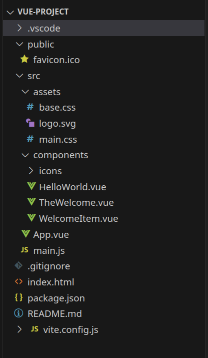
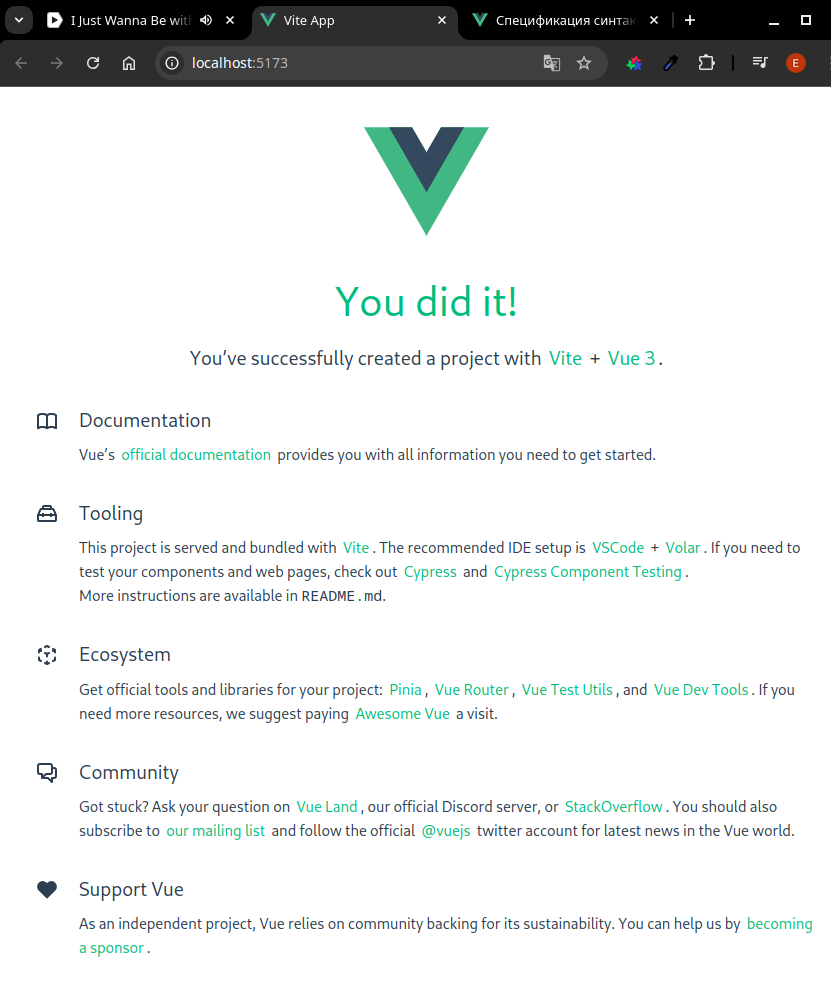

[К содержанию](../readme.md#введение-в-web-разработку)

# Vue.js: концепции

<!-- 18 минут -->

## Зачем нужен Vue.js?

* [Оригинальное видео на YouTube](https://www.youtube.com/watch?v=4xyb_tA-uw0&list=PLvTBThJr861yMBhpKafII3HZLAYujuNWw&index=2)
* [Копия на РуТубе](https://rutube.ru/video/5813a6f4551d7579b32dae1527769256/)

<!-- https://s3.timeweb.com/5fea8834-pub/Зачем_нужен_Vue.js_концепции.mp4 -->

## Структура проекта



Рассмотрим структуру вновь созданного проекта (чтобы понимать что откуда растет)

* `package.json` - главный файл в проекте на **node.js**. В нем хранятся основные параметры проекта и зависимости:

    ```json
    {
        "name": "vue-project",
        "version": "0.0.0",
        "private": true,
        "type": "module",
        "scripts": {
            "dev": "vite",
            "build": "vite build",
            "preview": "vite preview"
        },
        "dependencies": {
            "vue": "^3.5.12"
        },
        "devDependencies": {
            "@vitejs/plugin-vue": "^5.1.4",
            "vite": "^5.4.8"
        }
    }
    ```

    В объекте **scripts** хранится набор команд, которые можно выполнить с помошью команды `npm run`. Например команда `npm run dev` запустит локальный веб сервер.

    В объектах **dependencies** и **devDependencies** хранятся зависимости (названия и версии внешних библиотек). Отличия в том, что в **dependencies** хранятся только те пакеты, которые нужны для сборки "прода", а в **devDependencies** и те, которые нужны при разработке.

* `index.html` - "рыба" для загрузки сайта. Мы в него ничего писать скорее всего не будем, но в реальных проектах может понадобиться добавить какой то код в заголовок для аналитики или загрузить js-скрипт

    ```html
    <!DOCTYPE html>
    <html lang="en">
        <head>
            <meta charset="UTF-8">
            <link rel="icon" href="/favicon.ico">
            <meta name="viewport" content="width=device-width, initial-scale=1.0">
            <title>Vite App</title>
        </head>
        <body>
            <div id="app"></div>
            <script 
                type="module" 
                src="/src/main.js"></script>
        </body>
    </html>
    ```

* Каталог `public` - место для статического контента (картинки и т.п.)

* Каталог `src` - исходный код приложения

    * `main.js` - стартовый скрипт, который создаёт приложение **VUE** при запуске в браузере

        ```js
        import './assets/main.css'

        import { createApp } from 'vue'
        import App from './App.vue'

        createApp(App).mount('#app')
        ```

        где:

        * `import { createApp } from 'vue'` - импортирует функцию _createApp_ из фреймворка 

        * `createApp(App)` - собственно создает приложение (в параметрах основной vue-файл приложения)

        * `.mount('#app')` - указывает место в **html** файле, в которое будет внедрён сгенерированный контент (DOM)

    * `App.vue` - Точка входа в приложение. **VUE** использует  HTML-подобный синтаксис для описания компонента. Синтаксически Vue SFC совместим с HTML.

        >[Тут подробнее](https://ru.vuejs.org/api/sfc-spec.html)

        Каждый файл *.vue состоит из трёх типов языковых секций верхнего уровня: `<template>`, `<script>`, и `<style>`, а также может содержать дополнительные пользовательские секции.

        * `<template>​` - В каждом файле *.vue может быть не более одной секции `<template>` верхнего уровня.        

            ```vue
            <template>
                <header>
                    

                    <div class="wrapper">
                        <HelloWorld 
                            msg="You did it!" />
                    </div>
                </header>

                <main>
                    <TheWelcome />
                </main>
            </template>
            ```

            В шаблоне объявлено два блока (**header** и **main**).

            В блоке **header** выводится изображение и **компонент** `HelloWorld` (в прошлой лекции упоминали, что стандартные блоки состоят из одного слова, а компоненты из двух и более)

            В блоке **main** выводится компонент `TheWelcome`

        * `<script setup>​` - В каждом файле *.vue может быть не более одной секции `<script setup> (не считая обычной секции <script>)`.

            Секция предварительно обрабатывается и используется в качестве функции компонента `setup()`, то есть он будет выполняться для каждого экземпляра компонента. 

            ```vue
            <script setup>
            import HelloWorld from './components/HelloWorld.vue'
            import TheWelcome from './components/TheWelcome.vue'
            </script>
            ```

            В скрипте просто импортируются компоненты, которые используются на странице

        * `<style>` - css стили компонента (ключевое слово **scoped** означает, что стили действуют только в этом компоненте)

            ```css
            <style scoped>
            header {
                line-height: 1.5;
            }

            .logo {
                display: block;
                margin: 0 auto 2rem;
            }

            @media (min-width: 1024px) {
                header {
                    display: flex;
                    place-items: center;
                    padding-right: calc(var(--section-gap) / 2);
                }

                .logo {
                    margin: 0 2rem 0 0;
                }

                header .wrapper {
                    display: flex;
                    place-items: flex-start;
                    flex-wrap: wrap;
                }
            }
            </style>
            ```

    * Каталог `assets` - в него можно положить ресурсы, которые скомпилируются в итоговый js-файл

    * Каталог `components` содержит самописанные компоненты (можно создать и другие каталоги)

По коду видно, что вновь созданное приложение не пустое, а уже содержит какую-то "рыбу". Давайте её запустим:

Сначала нужно скачать зависимости (один раз после создания приложения или при клонировании репозитория)

Выполните в каталоге приложения команду `npm install`

Зависимости записываются в каталог `node_modules` (этот каталог должен быть в `.gitignore`)

Теперь можно запустить сервер командой `npm run dev`

```
VITE v5.4.9  ready in 264 ms

➜  Local:   http://localhost:5173/
➜  Network: use --host to expose
➜  press h + enter to show help
```

Можно перейти по ссылке и посмотреть на "рыбу"



---

**Задание**

Изучите структуру проекта, поиграйтесь с содержимым компонентов **HelloWorld** и **TheWelcome**

[Назад](./web_01.md) | [Дальше](./web_03.md)