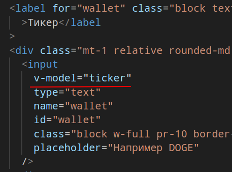

[К содержанию](../readme.md#введение-в-web-разработку)

# Vue.js: концепции

## #8 Бизнес логика или детали реализации?

> 10 минут

* [YouTube](https://www.youtube.com/watch?v=U2ZJCMiQuo8)
* [RuTube](https://rutube.ru/video/dd892631a12710bea4ef59c5dc40eeef/)

## #9 Учимся учиться

> 5 минут

* [YouTube](https://www.youtube.com/watch?v=ekrzshM4AHI)
* [RuTube](https://rutube.ru/video/100ab08808ebc706fe69ff9e8d9a132a/)


## #10 Криптономикон-1 - Vue.js: практика

> 39 минут 

Ниже приведен вольный пересказ этого скринкаста с переписыванием под `Vue3 + script setup`. Т.е. сначала просмотрите видео, чтобы понять о чём идет речь, а потом по пересказу попробуйте реализовать пример.

* [YouTube](https://www.youtube.com/watch?v=0MEpPU3rWCk)
* [RuTube](https://rutube.ru/video/5a7fa691b1fae3c7fa0d0dbf47dbfbdd/)

### Материалы к заданию

1. [Исходный HTML/CSS для самостоятельного повторения](https://gitlab.com/vuejs-club/youtube-course/cryptonomicon-html)
1. Материалы к изучению: под роликом на ютубе куча ссылок, но в принципе там раздел "Основы" от [Синтаксиса шаблонов](https://v3.ru.vuejs.org/ru/guide/template-syntax.html) до "Работы с формами"
1. [API для получения ключа:](https://www.cryptocompare.com/)

**Расшифровка скринкаста** (вольный пересказ своими словами)

>**Внимание**, сегодня мы с вами напишем очень и очень плохой код почему так и зачем мы это сделаем мы это сделаем потому что когда вас учат писать сразу хороший код вас учат решать задачу одним способом рано или поздно вы сталкиваетесь задач и решения которые вы не знаете и оказываетесь ситуации когда не понимаете хорошие ваше решение или плохое мы с вами вначале напишем плохой но к сожалению распространенный код и шаг за шагом в рамках этой серии видео будем его улучшать у нас как и в реальной жизни будут появляться новые требования заказчика мы будем находить какие-то баги сами уже у себя и сами героический фиксить и так далее таким образом на выходе вы не только получите хороший код для решения этой задачи но и понимание как глядя на код понять что он действительно плохой 

>В рамках расшифровки скринкаста я сразу буду переписывать его на Vue3, используя `vite` + `script setup`

### Описание проекта

Чем же мы с вами займемся? Мы с вами напишем небольшое приложение, которое позволяет добавлять в список отслеживания криптовалюты, используя **api** `cryptocompare.com`.

Соответственно мы будем иметь возможность добавить криптовалютные пары "имя валюты - USD" в наблюдение и, когда мы выбираем конкретную валюту, у нас внизу появляется график отслеживания. Мы можем убрать выбрать другую пару и вот сейчас постепенно шаг обновления 1 5 секунд у нас будут появляться собственно данные о изменение вот соответственно график автоматически адаптируется под минимальные и максимальные значения поэтому в начале он может выглядеть странно но со временем он нормализуется. 

График нам не очень интересно всем мы можем что-то удалить мы можем добавить криптовалюту мы можем так далее ну и когда мы обновляем страницу у нас очевидно встречает пустой экран вот мы добавляем в начале черточка когда нету данных и потом когда данные приезжают кто у нас там еще есть bitcoin кэш допустим у нас будут вот обновляться что у нас есть на входе на входе дизайнер нам выдал вот такой вот завершены html с него мы и будем начинать и он и ставит станет нашей отправной точкой 

### Создание нового проекта, удаление лишего

В домашнем задании [первой лекции](./web_01.md) вы должны были научится создавать приложене **Vue**. Откроем его и удаляем "рыбу": 

* нам не нужны директории `src/assets` и `src/components` (весь код пока будем писать в `App.vue`)
* в `App.vue` удаляем всё из скрипта и шаблона (стили вообще удаляем)

    ```vue
    <script setup>
    </script>

    <template>
    empty
    </template>
    ```

* в `main.js` комментируем строчку с импортом `./main.css`

Можем запустить проект командой `npm run dev` и посмотреть на пустое окно, убедившись заодно, что нет ошибок

### Добавление вёрстки и стилей

В [материалах](#материалы-к-заданию) есть ссылка на файлы с вёрсткой. 

1. Скопируйте содержимое `<body>` из файла `index.htm` в ваш шаблон (внутрь тега `<template>` вместо слова **empty**)

    Все сработало. Как видите все подключилось но выглядит как-то криво 
    
    
    
    Очевидно нам нужны стили. Как можно подключить `css`? В рамках скринкаста стили добавлены прямо в файл `App.vue`, но мы сделаем более правильно: скопируйте файл `app.css` в каталог `src/assets` и в файле `main.js` раскомментируйте и поправьте строчку с импортом файла стилей

    ```js
    import './assets/app.css'
    ```

    Почему-то в проекте на `vite` показывает крутилку на весь экран, удалите из вёрстки первый `<div>` с этим спиннером (у меня он закомментирован)

        

    Теперь всё выглядит "красиво"

    

### Начинаем работу с App.vue

Сегодня все наше внимание будет приковано к файлику `App.vue`. 

Итак, что нам надо? Будем двигаться сверху вниз, оживляя эту страницу. Первое что нам надо это научиться заполнять поле "Тикер" и, когда нажимается кнопка "добавить", реагировать на нажатие.

Как мы помним, сильной стороной **Vue** является так называемое **двухстороннее связывание**, когда мы можем определить что-то в данных java-скрипта и вывести это что-то на экран. И когда что-то на экране поменяется оно автоматически изменится в приложении. 

Ну что же давайте учиться это делать. Как вы помните **vue** декларативен. Что это означает? Это означает, что нам надо будет выучить по сути язык описания компонентов, благо он не сложный. То есть у нас есть несколько заранее зарезервированных слов, с помощью которых мы будем объявлять те или иные не побоюсь этого слова особенности компонент.

>Дальше в скринкасте расписывается функция `data()`, которая возвращает реактивные данные, доступные в шаблоне. Но это устаревший синтаксис `Option API` из **Vue2**, во **Vue3** стандартом является `Setup API`, причем имеющий два варианта написания: функция `setup()` и `script setup`. Мы будем использовать `<script setup>`.

Просто определим [реактивную](https://ru.vuejs.org/guide/essentials/reactivity-fundamentals.html) переменную:

```vue
const ticker = ref('default')
```

Задав ей значение по умолчанию (`'default'`) просто чтобы мы увидели как же осуществляется "двухстороннее связывание". Как вы помните, **vue** это **html-first** фреймворк, это означает что мы пишем html, а дальше с помощью специальных атрибутов и интерполяций подсказываем как связать наш html с данными и первый атрибут (все атрибуты которые используют **vue** начинаются c `v-`) это `v-model`.

`v-model` как раз говорит "свяжи мне в две стороны вот этот вот input с данными (переменной _ticker_)"




И вот у нас в поле ввода появилось значение `default`, но перед тем как что то делать я бы хотел убедиться что связь работает в обе стороны, т.е. когда правим поле ввода меняется и значение переменной.

#### [Интерполяция](https://ru.vuejs.org/guide/essentials/template-syntax.html#text-interpolation)

Мы используем так называемый синтаксис интерполяции...  это вот такие две фигурные скобки. Обратите внимание их можно использовать только в тех местах где вы вводите текст просто на странице. То есть я не могу его использовать где-то внутри атрибута, только там где просто обычный текст. И я пишу точно также `ticker` и смотрите видите вот она магически обновляется мы научились с вами связывать переменные в две стороны это работает c инпутами, чекбоксами, с радио батонами. Потом мы научимся писать наши собственные компоненты которые умеют работать с `v-model` 

```vue
<label 
    for="wallet" 
    class="block 
        text-sm 
        font-medium 
        text-gray-700"
>
    Тикер {{ ticker }}
</label>    
```

Давайте что-нибудь с этим сделаем а что мы можем с этим сделать? мы теперь знаем как выводить как же вот я нажимаю "добавить" я хочу чтобы что-то произошло.

Как бы мы это делали в обычном java-скрипте? Мы нашли бы элемент на страничке через query-селектор, добавили слушатель на события клик и после этого сказали бы
какую функцию вызывать.

Во вью все работает похожим образом. Мы пишем `v-on:click="..."` (мы говорили что все атрибуты **vue** начинаются с `v-`), дальше имя события клик. Мы здесь можем написать к примеру обычный java-скрипт код (`"ticker = 123"`) и смотрите нажимаю кнопку "добавить", видите в переменную `ticker` записалась значение `123` и она автоматически изменилась.

Но согласитесь писать код прямо в верстке как то супер странно, поэтому мы хотим чтобы код можно было писать рядом с вёрсткой (вспоминаем про **SFC**)

>В оригинальном видео рассказывается про ключевое слово `method`, но это тоже устаревший синтаксис.

Мы просто в `<script setup>` пишем функцию (напомню, что в шаблоне видны все имена, описанные в скрипте, а название функции это тоже имя)

```js
<script setup>
import { ref } from "vue";

const ticker = ref('default')

function add () {
  alert('Я работаю!')
}
</script>
```

Обратите внимание здесь можно будет потом передавать аргументы, то есть в 99% случаях надпись `add` и `add()` абсолютно одинаковы, то есть если **vue** видит надпись, что при событий клик вызов функции `add`, он понимает что это функцию надо вызвать а если он видит вот так `add()` "о, это же выражение я вот беру и вызываю функцию add".

Итак пробуем: выводится алерт

Хорошо, но нам же хочется в скрипте дотянуться до значения, введенного в input. Как же нам это делать?

>...`this` используется только во **Vue2**, во **Vue3** используется ЗНАЧЕНИЕ реактивной переменной

```js
function add () {
  alert(ticker.value)
}
```

Проверяем, действительно вывелось ровно то значение которое введено в `input`.

Подождите, я хочу ещё, чтобы это событие срабатывало, когда я нажимаю кнопку `Enter` (дальше я пропустил полет мысли и привожу финальный результат: `v-on:keydown.enter` - при возникновении события нажатия клавиши `Enter` выполнить функцию `add`)

```js
<input
    v-model="ticker"
    v-on:keydown.enter="add"
    ...
```

Дальше реализуем список тикеров. Очевидно что нам надо как-то научиться повторять какие-то вещи. Очевидно что повторять нам надо что то, что то это скорее всего будет массивом.

Создадим в скрипте массив тикеров: просто объявляем переменную

```js
const tickers = ref([1, 2, 3, 4])
```

#### [Отрисовка списков](https://ru.vuejs.org/guide/essentials/list.html)

Как сказать **vue** "повтори какую-то вещь несколько раз"?

Во-первых, что за вещь мне надо повторять? Нужно в верстке найтие место, которое повторяется, удалить лишние повторы и использовать так называемую структурную директиву (директивами называются атрибуты которые обрабатываются **vue** опять же существенное упрощение но пока сойдет и так) `v-for`. У нас есть две ключевые структурные
директивы мы потом поговорим почему они являются структурными но пока запомнить `v-for` и `v-if` они настолько суровы что даже друг с другом не дружат.

`v-for` работает точно также как цикл `for of` (или `for in`)...

```vue
<div
    v-for="t in tickers"
    v-bind:key="t"
    ...
```

>Я много раз повторял, что название переменных должно быть самоочевидным и, по идее, переменная цикла должна называться `ticker`, но в этом случае она будет "перекрывать" одноименную переменную из скрипта. Нужно либо переименовать в скрипте переменную `tiker` в `tickerName` (мы не будем этого делать, чтобы не рассинхронизироваться со скринкастом), либо использовать переменную цикла `t` (для циклов и лямбда функций допускается использование однобуквенных переменных цикла)

Этот код говорит "для всех tickers повтори пожалуйста вот этот блок". Дальше нам выдаст ошибку про `key`.

Для циклов нужно использовать констукцию `v-bind:key="уникальное значение"`. В нашем случае мы можем использовать просто значение `t`, но есть синтаксис `v-for` c индексом:

```vue
<div
    v-for="(t, index) in tickers"
    v-bind:key="index"
    ...
>
    <div 
        class="px-4 py-5 sm:p-6 text-center">
        <dt 
            class="text-sm font-medium text-gray-500 truncate"
        >
            {{ t }}
        </dt>
```

Давайте чуть-чуть доведем до ума, но перед этим сделаем маленький шаг назад дело в том что в мире **vue** огромное количество раз вы будете писать в `v-bind` и `v-on`.

Писать вот так очень многословно поэтому придумали так называемую короткую запись отдельные люди называют их ярлыками, когда вместо `v-on` мы пишем собаку `@`, а вместо `v-bind` просто ничего не пишут, оставляют только  `:`.

Хорошо уже похоже на правду давайте мы сделаем еще что-то а что ещё нам же надо выводить у нас тут какой-то глупый массив только со строками. 

Нам надо выводить будет явное имя валюты и значение соответственно наш массив будет выглядеть как то так:

```vue
const tickers = ref([
    { name: 'DEMO', price: '-' },
    { name: 'DEMO', price: '-' },
    { name: 'DEMO', price: '-' }
])  
```


Видите, теперь он начал выводить переменную `t` которая содержит весь объект и радостно нарисовал строковое представление объекта. Нам надо вывести поля `name` и `price`:

```vue
<dt class="text-sm font-medium text-gray-500 truncate">
    {{ t.name }}
</dt>
<dd class="mt-1 text-3xl font-semibold text-gray-900">
    {{ t.price }}
</dd>
```

#### Добавление элементов

Давайте научимся для начала добавлять такие элементы плюс давайте приведем это всё в тот дизайн который был а именно добавим `USD` в пару:

```vue
<dt class="text-sm font-medium text-gray-500 truncate">
    {{ t.name }} - USD  
</dt>
```    

Берём "рыбу" объекта и реализуем добавление её в массив `tickers` в функции `add`

```js
function add () {
  const newTicker = { 
    name: 'DEMO', 
    price: '-' 
  }
  tickers.value.push(newTicker)
}
```

>Не забываем, что обращение к значению реактивной переменной происходит через свойство `.value`

Хорошо теперь только нам осталось вместо имени подставить название нового тикера:

```js
function add () {
  const newTicker = { 
    name: ticker.value,
          ^^^^^^^^^^^^^ 
    price: '-' 
  }
  tickers.value.push(newTicker)
}
```

Теперь хочется очищать тикер когда он добавился в массив. Вспомним что у нас связь и двухсторонняя и просто запишем в тикер пустую строку нажимаем "добавить" и вот все испарилось

```js
function add () { 
    const newTicker = { 
      name: ticker.value, 
      price: '-' 
    }
    tickers.value.push(newTicker)
    ticker.value = ''
}
```

Обратите внимание это фундаментальный акцент на том как вообще работает **vue** мы хотим и умеем работать с данными html декларативно мы же теперь с вами знаем это слово описываем как к этим данным привязываемся мы никогда не меняем html напрямую 

#### Удаление пар

Хорошо давайте двигаться дальше мы берем и хотим удалять прекрасно давайте найдем эту кнопочку удалить вот она мы с вами уже знаем что мы вешаем события клик и назовем `handleDelete` а теперь смотрите если мы вот так напишем как мы поймем какой элемент надо удалять да черт его знает она же просто клонируется и все эти кнопочки будут вызывать один и тот же метод. очевидно нам надо как-то передать туда параметры помните рассказал что там скобочки и без скобочек это одно и то же. а почему да потому что мы здесь можем писать java-script поэтому мы можем написать `@click="handleDelete(t)"

```vue
<button
    @click="handleDelete(t)"
    ^^^^^^^^^^^^^^^^^^^^^^^^
```

"Пожалуйста удали наш тикер, который лежит в массиве tickers". Звучит круто ну что давайте напишем этот `handleDelete`  

```js
function handleDelete (tickerToRemove) {
  tickers.value = tickers.value.filter(
    t => t != tickerToRemove
  )
}
```

#### v-if

Удаление работает, только вот видите некрасивый вот эти две полосочки 


Мы бы хотели, чтобы их не было, чтобы этот кусок вообще не отображался, когда у меня нет данных.

1. Находим (с помощью инспектора) тег, который хотим скрыть.
1. Добавляем структурный атрибут `v-if`
1. Если хотим скрыть несколько не вложенных тегов, то можем завернуть их в тег `template`

```vue
<template
    v-if="tickers.length > 0">   
```

## Итоги

Сегодня мы с вами:

* познакомились со структурой **vue** файла (скрипт и шаблон)
* научились добавлять в скрипт функции и реактивные переменные
* научились двухстороннему связыванию с помощью директивы `v-model`
* научились подписываться на события через `v-on` или краткую запись `@`
* научились выводить данные в шаблон через скобочки то что называется интерполяцией
* научились двум ключевым структурным директивам `v-for` и `v-if`
* научились добавлять элементики, удалять, передавать в
обработчике события аргументы

---

**Задание**

Повторите практическое задание (Криптономикон)

[Назад](./web_03.md) | [Дальше](./web_05.md)