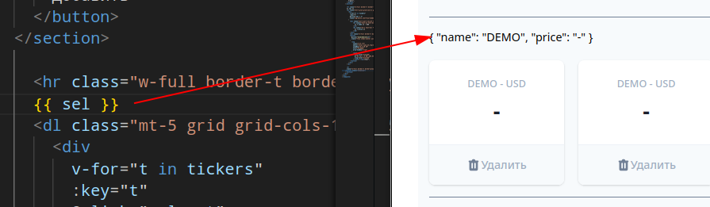

[К содержанию](../readme.md#введение-в-web-разработку)

# Vue.js

## #11 Криптономикон-2

* [YouTube](https://www.youtube.com/watch?v=Xzx8SCzrfXU)
* [RuTube](https://rutube.ru/video/416aafd2b46e27b5abfe7afb542393f1/)

**Материалы к скринкасту:**

* [Исходный HTML/CSS для самостоятельного повторения](https://gitlab.com/vuejs-club/youtube-course/cryptonomicon-html)
* [реактивность во Vue3:](https://ru.vuejs.org/guide/essentials/reactivity-fundamentals.html)
* [API для получения ключа:](https://www.cryptocompare.com/)

**Расшифровка скринкаста:**

>**Дисклеймер** Код который мы пишем в рамках этого урока все еще является недостаточно хорошим для продакшена. Прежде чем пытаться нести эту практику в реальные проекты пожалуйста посмотрите серию видео с разработкой этого приложения до конца.

Мы с вами освоили _добавление_ и _удаление_ элементов. Давайте добавим еще и выбор, потому что при выбранном элементе должен отображаться график.

С этим достаточно просто мы берем и говорим "выбранный элемент изменяется с течением времени". Когда мы слышим что что-то меняется с течением времени мы говорим это "состояние". Назову его _sel_. Первоначально ничего не выбрано поэтому `null`:

```js
    const sel = ref(null)
```

И очевидно, что при клике по элементу я хочу записывать в _sel_ то что было выбрано.

```vue
<div  
    v-for="t in tickers"
    :key="t"
    @click="sel = t"
```    

Заодно демонстрируя, что здесь можно писать js-выражения, а не только вызовы функций.

Как мы проверим что что-то выбралось? Давайте для теста выведем `sel` на страничке (вспоминаем про интерполяцию)



Теперь можно дописать логику чтобы график отображался только когда у меня есть `sel`

```vue
<section 
    v-if="sel"
    ^^^^^^^^^^
    class="relative">
    <h3 class="text-lg leading-6 font-medium text-gray-900 my-8">
        VUE - USD
```

А при клике на кнопочку "закрыть" устанавливаем `sel = null`

```vue
<button
    @click="sel = null"
    ^^^^^^^^^^^^^^^^^^^
    type="button"
    class="absolute top-0 right-0"
>
    <svg
```    

Хорошо двигаемся дальше. В нашем случае мы хотим чтобы у нас выделялись цветом выбранная пара.
Для этого нужно добавить css класс, который указывает толщину бордера.


Для того чтобы прицепить атрибут к классу мы можем написать `:class` и здесь мы можем js-выражение

```vue
<div  
    v-for="t in tickers"
    :key="t"
    @click="sel = t"
    :class="sel == t ? 'border-4' : ''"
    class="bg-white overflow-hidden shadow rounded-lg border-purple-800 border-solid cursor-pointer"
>
```

Здесь я хочу обратить ваше внимание на то что это абсолютно нормально совмещать в одном определении
атрибут **class** через равно и через двоеточие. Это означает что вот первая часть статическая, а вторая динамическая.

Но согласитесь, выглядит дико уродливо поэтому для классов **vue** предлагает несколько вариантов синтаксиса.

* синтаксис массивов. с ним можете ознакомиться сами он менее распространен
* объектный синтаксис, когда мы пишем объект в котором ключами являются имена классов (в моем случае `border-4`), а значением логическое выражение которое
отвечает надо ли добавлять этот класс или нет

    ```vue
    :class="{
        'border-4': sel == t
    }
    ```

    это читается: "добавь класс border-4, если _sel_ равен `t`"

    обратите внимание, в качестве логического выражения также может быть вызов метода 
    
    
Вот мы добились желаемого. Давайте поправим заголовок графика, чтобы здесь было название валюты: `sel.name`


```vue
<h3 
    class="text-lg 
        leading-6 
        font-medium 
        text-gray-900 
        my-8"
>
    {{ sel.name }} - USD
</h3>
```    

Жмем удалить, ой а как так получилось что нажал кнопку удалить а выбралась пара? Происходит это потому что так работает java-скрипт. 

Когда вы кликаете на кнопочку "удалить", генерируется события и это событие, как вы прекрасно знаете начинает "всплывать". 

Что означает всплытия события для нас? Оно означает, что все элементы в которые вложены это а это в том числе и наш элемент тоже получат события клик и соответственно сработает выбор элемента

Что мы можем сделать? Мы можем вспомнить что в "удалить" приходит событие `@click` и сделать ему что
мы делаем в java скрипте: **stopPropagation**.

**vue** и здесь нам помогает и поэтому у нас для клика
где наша кнопочка "удалить" есть модификатор `.stop` -  прекратить всплытие

```vue
<button
    @click.stop="handleDelete(t)"
          ^^^^^
```

Это не единственный модификатор. Со списком модификаторов рекомендую ознакомиться самостоятельно

Хорошо теперь пора начинать ходить за реальными данными... 

>Видео посмотрите сами, я здесь привожу финальный результат:
>
>При добавлении новой валюты (функция **add**) запускаем таймер, который раз в 3 секунды будет запрашивать данные от АПИ (ключ из видео пока работает, но если что - зарегистрируйтесь). При получении данных они записываются в подходящий элемент массива (ищет по имени валюты). Тут возник вопрос к реактивности, который отложили на потом

```js
function add () { 
  const newTicker = { 
    name: ticker.value, 
    price: '-' 
  }
  tickers.value.push(newTicker)
  setInterval(async () => {
    const f = await fetch(
      `https://min-api.cryptocompare.com/data/price?fsym=${newTicker.name}&tsyms=USD&api_key=ce3fd966e7a1d10d65f907b20bf000552158fd3ed1bd614110baa0ac6cb57a7e`
    )
    const data = await f.json()

    tickers.value.find(t => t.name === newTicker.name).price = data.USD  > 1 ? data.USD.toFixed(2) : data.USD.toPrecision(2)
  }, 3000)
  ...
```

Хорошо самое время добавить график торговли

1. Добавляем реактивную переменную _graph_
1. В таймер получения данных добавим код для добавления значений в массив 

    ```js
    if (sel.value?.name === newTicker.name) {
      graph.value.push(data.USD)
    }
    ```

    Если есть выбранный тикер и его имя равно текущему тикеру, то добавляем значение в массив

1. Находим в шаблоне место, где рисуется график. Удаляем ненужные дубли и добавляем цикл в одну оставшуюся полоску

    ```vue
    <div
        v-for="(bar, idx) in normalizeGraph()"
        :key="idx"
        :style="{ height: `${bar}%` }"
        class="bg-purple-800 border w-10"
    ></div> 
    ```

    Тут сразу финальный варинант с нормализацией, про неё ниже

1. Реализуем функцию нормализации, которая вычисляеи минимум и максимум по всему массиву и нормализует выходные данные

    ```js
    const graph = ref([])

    function normalizeGraph () {
        const maxValue = Math.max(...graph.value)
        const minValue = Math.min(...graph.value)
        return graph.value.map(
            price => 5 + ((price - minValue) * 95) / (maxValue - minValue)
        )
    }
    ```

1. При выборе другой валюты нам нужно чистить график, поэтому вместо выражения `sel = t` пишем вызов функции `select(t)` и реализуем её

    ```js
    function select (ticker) {
        sel.value = ticker
        graph.value = []
    }
    ```        

Что мы узнали сегодня? Сегодня мы узнали, что:

* с реактивностью все не так очевидно.
* вспомнили, что в `v-for`, когда нет уникальных данных для `:key`, за которые можно прицепиться, то можно использовать индекс (синтаксис `v-for="(item, index) in list"`)
* вспомнили, что в качестве источника данных для цикла можно использовать выражение (функцию, возвращающую массив)
* чуть чуть поигрались с реальным api, сходили на сервер начали
отправлять реальные запрос 

Теперь нам предстоит двигаться дальше. Наш злобный ТЗ-шник, ну то есть виртуальный человек который ставит технические задания перед нами, будет требовать все новых и новых фич и мы с вами будем их добавлять и смотреть во что превращается наш код и разговаривать что такое хорошо и что такое плохо

---

**Задание**

Повторите практическое задание из этого занятия

[Назад](./web_04.md) | [Дальше](./web_06.md)