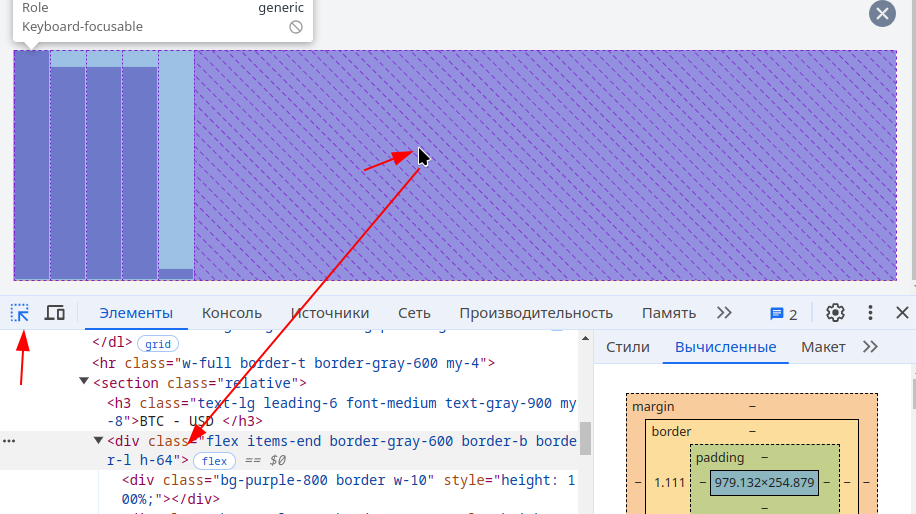

[К содержанию](../readme.md#введение-в-web-разработку)

# Vue.js

## #22 Криптономикон: refs

>22 минуты

* [YouTube](https://www.youtube.com/watch?v=uWDmfA7WE5Q&list=PLvTBThJr861yMBhpKafII3HZLAYujuNWw&index=23)
* [RuTube](https://rutube.ru/video/d1acbb9d381bcfb42412be7cfc31a742/)

<!-- https://gitlab.com/vuejs-club/youtube-course/cryptonomicon/-/blob/lesson9/src/App.vue?ref_type=heads -->

**Расшифровка скринкаста**

Сегодня будем решать проблему с графиком


Если размер становится очень большим, то ширина столбцов уменьшается до какого-то предела, а потом вообще выходит за размеры блока

Первый вариант, который приходит в голову, ограничить количество записей в массиве цен (метод _shift_ удаляет первый элемент массива):

```js
graph.value.push(t.price)
if (graph.value.length > 5) {
    graph.value.shift()
}
```

Но такой вариант не учитывает размер блока и выглядит плохо

Самое время познакомиться с [ref](https://ru.vuejs.org/guide/essentials/template-refs.html)

**Ref**, это возможность получить (в коде) ссылку на объект, который мы отрисовали в шаблоне.

Очевидно, что количество элементов в графике должно зависеть от размера блока, в котором этот график рисуется.

Чтобы найти нужный блок, можно воспользоваться панелью разработчика в браузере

1. Кликаем правой кнопкой мыши в окне бразуера и выбираем пункт "посмотреть код"
1. Выбираем закладку "Элементы"
1. Активируем кнопку "Выбрать элемент", кликаем мышкой на элемент, который нам интересен (блок с графиком) и в окне элементов будет выделен элемент вёрстки, который соответствует "картинке"

    

1. Находим этот блок в шаблоне и добавляем в него атрибут `ref="graphRef"`

    ```html
    <h3 class="text-lg leading-6 font-medium text-gray-900 my-8">
        {{ sel.name }} - USD
    </h3>
    <div
        ref="graphRef" 
        ^^^^^^^^^^^
        class="flex items-end border-gray-600 border-b border-l h-64">
        <div
            v-for="(bar, idx) in normalizedGraph"
    ```

    Обратите внимание, во **vue3** ссылка должна иметь уникальное имя (в оригинальном видео имя _graph_ конфликтует с именем массива с данными для графика)

1. Затем опишем переменную, в которую при монтировании DOM будет записана ссылка на визуальный элемент

    В текущей версии документации выглядит так:

    ```js
    const graphRef = useTemplateRef('graph')
    ```

    Хотя можно и так (при монтировании DOM значение записывается в одноименную переменную):

    ```js
    const graphRef = ref(null)
    ```

    Во **vue3** реализация **ref** отличается. Во **vue2**, как видно из видео, все **ref** ссылки собираются в объект **$ref**, а во **vue3** каждая ссылка записывается в одноимённую переменную. 

    Мы можем добавить логи вывода значения этой переменной при формировании графика

    ```js
    graph.value.push(t.price)
    if (graph.value.length > 5) {
        graph.value.shift()
    }
    console.log('graphRef:', graphRef.value)
    ```

    

    Пока не выбран тикер, значение равно `null`, а после выбора содержит ссылку на визуальный элемент

1. Теперь, имея ссылку на визуальный элемент и зная **js** и **css**, можем получить его ширину (сразу заворачиваем в вычисляемое свойство)

    ```js
    const maxGraphElements = computed(() => {
        if (graphRef.value == null) return 0
        return graphRef.value.clientWidth / 38
    })
    ```

    И используем это свойство при формировании графика

    ```js
    if (graph.value.length > maxGraphElements.value) {
        graph.value.shift()
    }
    ```

    Работает!!!

    Но при изменении размеров экрана количество не пересчитывается. **Ref не реактивен.**

1. Учёт изменения размеров браузера

    * Сначала переделываем метод расчета количества элементов (вместо **computed**)

        ```js
        function calculateMaxGraphElements () {
            // реализована защита от null (когда график не отображается)
            maxGraphElements.value = (graphRef.value?.clientWidth ?? 0) / 38
        }
        ```

        >Не забываем описать переменную _maxGraphElements_

    * Используем подписку на события окна (в видео записано в метод **onMounted**)

        ```js
        window.addEventListener(
            'resize', 
            calculateMaxGraphElements)
        ```

    * Не забываем отписаться от события в методе **onBeforeUnmount**

        ```js
        onBeforeUnmount(() => {
            window.removeEventListener(
                'resize', 
                calculateMaxGraphElements)
        })
        ```

    >В текущей реализации размер графика равен `0`, пока мы не поменяем размер окна. Пока считаем это фичей и исправим на следующем занятии

**Заключение**

1. **ref** стоит использовать только тогда, когда задачу невозможно выполнить средствами **vue** (т.е. не надо его использовать для изменения классов или обработчиков событий)
1. **ref** не реактивен, т.е. не имеет смысла использовать его в вычисляемых свойствах

---

**Задание**

1. Реализовать задачи из скринкаста
1. Исправить баг, когда при уменьшении размера окна элементы графика становятся узкими, пока не обновится валюта 
1. Исправить баг с переполнением (мы удаляем по одному элементу)
1. На дополнительную оценку: исправить привязку к магическому числу `38` (размер элемента графика) используя дополнительный **ref** для элемента графика

[Назад](./web_11.md) | [Дальше](./web_13.md)
