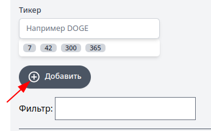
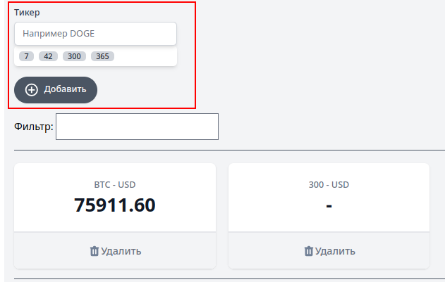
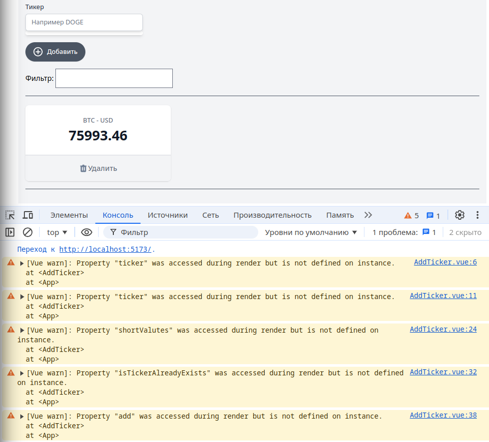

[К содержанию](../readme.md#введение-в-web-разработку)

# Vue.js: компоненты

## #24 Криптономикон: компоненты

>30 минут

* [YouTube](https://www.youtube.com/watch?v=Ql5nV-G-nOs&list=PLvTBThJr861yMBhpKafII3HZLAYujuNWw&index=25)
* [RuTube](https://rutube.ru/video/e6045a3ec72b655e9bfac5c77b40a9a9/)

Документация по [основам компонентов](https://ru.vuejs.org/guide/essentials/component-basics.html)


**Расшифровка скринкаста**

Идея компонетов проста: каждый компонент может содержать в себе несколько других компонентов, в которые мы можем передать данные (**props**) и которые наружу могут генерировать события (**event**)

Причин для использования компонентов несколько:

* вынесение повторяющихся элементов (имеется в виду не `v-for`, а то что один компонент может быть использован в разных родительских компонентах)
* просто выделение отдельных элементов бизнес-логики

### Первая итерация

Для примера можем вынести **svg** со знаком `+` в отдельный компонент (если вы внимательно исследовали структуру "рыбы" в первом уроке, то там также вынесены **svg** в отдельные компоненты)



1. Создаём новый файл `src/components/PlusSingIcon.vue` 

1. Пишем корневой тег `<template>`, а в него помещаем содержимое **svg**

    ```html
    <template>
        <svg
            class="-ml-0.5 mr-2 h-6 w-6"
            xmlns="http://www.w3.org/2000/svg"
            width="30"
            height="30"
            viewBox="0 0 24 24"
            fill="#ffffff"
        >
            <path
                d="M13 7h-2v4H7v2h4v4h2v-4h4v-2h-4V7zm-1-5C6.48 2 2 6.48 2 12s4.48 10 10 10 10-4.48 10-10S17.52 2 12 2zm0 18c-4.41 0-8-3.59-8-8s3.59-8 8-8 8 3.59 8 8-3.59 8-8 8z"
            ></path>
        </svg>
    </template>
    ```

    Наш компонент пока не содержит ни кода ни стилей, это нормально.

1. В основном компоненте (`App.vue`):

    - импортируем компонент

        ```js
        import PlusSignIcon from './components/PlusSingIcon.vue'
        ```

        Во **vue3** ничего дополнительно писать не надо, всё что объявлено (а импорт это как раз объявление) в `script setup` доступно в шаблоне.

    - вставляем его вместо **svg**

        ```html
        <plus-sign-icon />
        Добавить
        ```

        >Можно писать как `PlusSignIcon`, так и `plus-sign-icon` (этот вариант предпочтительнее - соглашение)

### Вторая итерация

Решили спрятать всю кнопку в компонент:

1. Переименовываем компонент в `AddButton.vue`

1. Переносим кнопку в компонент (убирая обработчик клика)

    ```html
    <template>
        <button
            type="button"
            class="inline-flex items-center py-2 px-4 border border-transparent shadow-sm text-sm leading-4 font-medium rounded-full text-white bg-gray-600 hover:bg-gray-700 transition-colors duration-300 focus:outline-none focus:ring-2 focus:ring-offset-2 focus:ring-gray-500"
        >
            <svg
                class="-ml-0.5 mr-2 h-6 w-6"
                xmlns="http://www.w3.org/2000/svg"
                width="30"
                height="30"
                viewBox="0 0 24 24"
                fill="#ffffff"
            >
                <path
                    d="M13 7h-2v4H7v2h4v4h2v-4h4v-2h-4V7zm-1-5C6.48 2 2 6.48 2 12s4.48 10 10 10 10-4.48 10-10S17.52 2 12 2zm0 18c-4.41 0-8-3.59-8-8s3.59-8 8-8 8 3.59 8 8-3.59 8-8 8z"
                ></path>
            </svg>
            Добавить
        </button>
    </template>
    ```
1. В основном компоненте правим импорт и шаблон
 
1. Переносим класс `my-4` из компонента в `App.vue` (для демонстрации "слияния" классов)

    ```html
    <add-button
        @click="add"
        class="my-4"
    />
    ```

### Третья итерация

Решили, что надо выделить в компонет выделенный блок, т.к. его бизнес-задача добавлять тикер




1. Создаём новый компонент `scr/components/AddTicker.vue` (для демонстрации вложенных компонентов)

1. Переносим в него весь тег `<section>`

1. Т.к. у нас в этом компоненте используется внешний компонент (**AddButton**), то нужно обеспечить импорт, добавив секцию `script setup`

    ```vue
    <script setup>
        import AddButton from "./AddButton.vue";
    </script>
    ```

1. В основном компоненте (`App.vue`) вместо **AddButton** импортируем **AddTicker** и правим шаблон (вместо `<section>...` вставляем компонент `<add-ticker/>`)

Если сейчас запустить приложение, то визуально всё будет нормально, но в консоли мы увидим ошибки:



Дело в том, что шаблон мы перенесли, но вся логика осталась в основном компоненте.

1. Добавляем в компонент AddTicker недостающие переменные и методы

    * переменная _ticker_
    * переменная _isTickerAlreadyExists_ (используется только в этом компоненте)
    * переменная _valutes_ (в видео этого  нет, это было дополнительным заданием)
    * получение списка валют в хуке **onMounted**
    * вычисляемое свойство _shortValutes_
    * метод **onTickerChange** (используется только в этом компоненте)
    * метод **add**

    ```js
    const ticker = ref('')
    const isTickerAlreadyExists = ref(false)
    const valutes = ref([])

    onMounted(async () => {
        const f = await fetch(
            'https://min-api.cryptocompare.com/data/all/coinlist?summary=true'
        )
        const data = await f.json()
        if (data.Response == 'Success') {
            valutes.value = Object.keys(data.Data)
        }
    })

    const shortValutes = computed(() => {
        return valutes.value.filter(v => v.includes(ticker.value.toUpperCase())).slice(0,4)
    })

    function onTickerChange () {
        isTickerAlreadyExists.value = false
    }

    function add () {
        const tickerName = ticker.value.toUpperCase()
        if (tickers.value.findIndex(item => item.name == tickerName) >= 0) {
            isTickerAlreadyExists.value = true
            return
        }
        
        const newTicker = { 
            name: tickerName, 
            price: '-',
            exists: valutes.value.includes(tickerName)
        }
        // tickers.value = [...tickers.value, newTicker]
        ticker.value = ''
        // filter.value = ''
    }
    ```

    Переменные _tickers_ и _filter_ пока не трогаем, они относятся к родительскому компоненту

    Визуально никаких ошибок нет, но добавление тикеров не происходит. Дело в том, что массив тикеров находится в родительском компоненте, а наш компонент ничего не возвращает.
    
1. Реализация генерации событий (event)

    Для передачи событий "наверх" используется метод **emit**

    >При геренации событий в шаблоне используется глобальная функция **$emit**

    Для декларации событий, который может генерировать компонент (и для получения экземпляра метода **emit**) используется метод **defineEmits**

    Объявляем событие `add-ticker`:

    ```js
    const emit = defineEmits(['add-ticker'])
    ```

    И, зная теперь как передать событие наверх, генерируем событие в методе **add** (там где было добавление в массив _tickers_)

    ```js
    function add () {
        const tickerName = ticker.value.toUpperCase()
        //   if (tickers.value.findIndex(item => item.name == tickerName) >= 0) {
        //     isTickerAlreadyExists.value = true
        //     return
        //   }
        
        ticker.value = ''
        emit('add-ticker', {
            tickerName,
            tickerExists: valutes.value.includes(tickerName)
        })
    }
    ```

    Логику проверки дублей я пока закомментировал, т.к. у нас в компоненте нет массива тикеров (но логика должна быть как раз тут). 

    Логику добавления тикера мы меренесём в родительский компонент.

    Таким образом в методе **add** пока остаётся только очистка тикера и генерация события `add-ticker` с объектом с параметрами "название тикера" и "тикер существует" (здесь реализация отличается от видео, в нём не реализована проверка наличия тикеров в списке валют, а у нас более продвинутый вариант для раскраски невалидных тикеров)

1. Обработка пользовательского события

    В компоненте `App.vue` мы теперь можем поймать это событие

    ```html
    <add-ticker 
        @add-ticker="add"
    />
    ```

    Только нужно переписать метод **add**. Название тикера мы теперь вытаскиваем из параметров.

    ```js
    function add (tickerInfo) {
        const newTicker = { 
            name: tickerInfo.tickerName, 
            price: '-',
            exists: tickerInfo.tickerExists
        }
        tickers.value = [...tickers.value, newTicker]
        filter.value = ''
    }
    ```

    Переменная _ticker_ в основном компоненте теперь не используется и её можно удалить

Всё работает (без учёта проверки на дубли) - мы выделили часть шаблона и кода в отдельный компонент и успешно его задействовали.

### Передача параметров в компонент

Возвращать какие-то данные из компонента мы научились, теперь надо научиться передавать данные в него

Блокировку компонента вы сделаете самостоятельно, а мы решим проблему с массивом тикеров

Напоминаю, что у нас пока отключена проверка на дубли, т.к. в компоненте **AddTicker** нет массива _tickers_

Вариантов решения два:

* передать массив тикеров в компонент **AddTicker**
* проверку на дубли делать в основном компоненте

Второй вариант усложняется тем, что нам надо показывать сообщение об ошибке при дубле. Можно было бы передавать в параметрах текст ошибки, но у нас очищается имя тикера, т.е. теряется контекст ошибки.

Реализуем первый вариант

1. Передача параметров в компонент

    Используется знакомый уже синтаксис `v-bind:<название параметра>`, сокращаемый просто до `:<название параметра>="<переменная>"`

    ```html
    <add-ticker 
        :tickers="tickers"
        @add-ticker="add"
    />
    ```

1. [Получение параметров в компоненте](https://ru.vuejs.org/guide/components/props.html)

    Все параметры собираются в объект **props**. Получение этого объекта выглядит так:

    ```js
    const props = defineProps(['tickers'])
    ```

    Обратите внимание, в массиве имена строковые (мы пока рассматриваем простой синтаксис, но вообще в описании пропсов [можно указать](https://ru.vuejs.org/guide/components/props.html#prop-validation) и тип и значение по-умолчанию для параметра)

    Для обращения к значениям пропсов (в коде) используется объектный синтаксис (в нашем примере `props.tickers`), в шаблоне можно обращаться только пи имени свойства. Причём нужно помнить, что теперь это не реактивная переменная, а свойство объекта, поэтому `.value` убираем:

    ```js
    function add () {
        const tickerName = ticker.value.toUpperCase()

        if (props.tickers.findIndex(item => item.name == tickerName) >= 0) {
            isTickerAlreadyExists.value = true
            return
        }
        
        ticker.value = ''
        emit('add-ticker', {
            tickerName,
            tickerExists: valutes.value.includes(tickerName)
        })
    }
    ```

**Резюме**

Компоненты позволяют "есть слона по кусочкам" - выделять повторяющиеся блоки или логически независимые.

---

**Задание**

1. Реализовать доработки из скринкаста
1. Реализовать блокировку компонента **AddTicker** по количеству тикеров (как в видео).
1. Вынести в отдельный компонент график

[Назад](./web_13.md) | [Дальше](./web_15.md)
