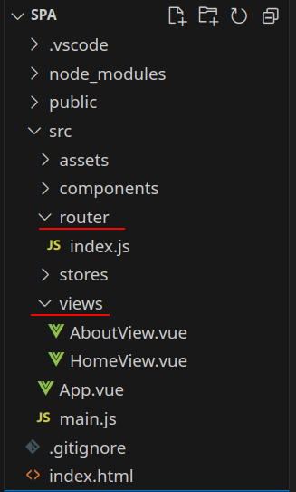

[К содержанию](../readme.md#введение-в-web-разработку)

# Single-page application

Обычный сайт состоит из множества HTML-страниц. Вы кликаете по ссылкам, браузер загружает новые страницы по этим ссылкам, у вас появляется ощущение движения от одной страницы к другой. Страницы могут лежать как файлы на каком-то сервере или генерироваться под ваш запрос какой-то серверной программой. Но, условно говоря, каждый «экран» сайта — это отдельная техническая сущность, отдельный документ. И мы между ними перемещаемся.

В начале 2010-х появилась новая концепция: **SPA — Single Page Application**.

**SPA** работает так: когда пользователь открывает страницу, браузер загружает сразу весь код приложения. Но показывает только конкретный модуль — часть сайта, которая нужна пользователю. Когда пользователь переходит в другую часть приложения, браузер берёт уже загруженные данные и показывает ему. И, если нужно, динамически подгружает с сервера нужный контент без обновления страницы.

С одной стороны, такие приложения работают быстро и меньше нагружают сервер. С другой стороны, они требуют большей загрузки на старте.

JavaScript на стороне клиента перехватывает навигацию, динамически получает новые данные и обновляет текущую страницу без полной перезагрузки страницы. Это, как правило, обеспечивает более быстрое взаимодействие с пользователем, особенно в тех случаях, когда речь идёт о реальных "приложениях", в которых пользователь должен выполнять множество взаимодействий в течение длительного времени.

В таких **SPA** "маршрутизация" осуществляется на стороне клиента, в браузере.

**Преимущества SPA**

**SPA быстрые**. Переход между модулями в приложении происходит быстрее: нужные ресурсы уже загружены, нужно просто подставить данные, которые запросил пользователь. Часто при этом сервер возвращает не тяжеловесный HTML, а лёгкий JSON или XML.

Ещё использование JSON упрощает разработку приложения для разных платформ. Если для веб-версии разработать обычный сайт, который принимает от сервера HTML, то для мобильного приложения придётся писать доработку, так как там HTML не подойдёт. JSON делает ответ сервера универсальным.

**SPA гибкие**. Раз пользователь всё время работает с одной страницей, проще делать интересные переходы и анимацию элементов. Можно работать с состоянием кнопок, вкладок и переключателей. Таким образом, интерфейс SPA может быть похож скорее на полноценное приложение, а не на простой сайт.

**SPA работают везде**. Всё, что нужно для SPA — поддержка JavaScript. Такие сайты хорошо работают и на десктопе, и в вебе, могут отчасти заменить полноценные мобильные приложения.

**Недостатки SPA**

**Проблемы с SEO**. По умолчанию у приложений напряжённые отношения с поисковыми машинами: те натренированы индексировать отдельные страницы, у каждой из которых есть заголовок, описание и остальные метатеги. В SPA приходится выкручиваться.

Похожая проблема с некоторыми системами аналитики. Вот что про SPA говорит Google-аналитика: «Стандартный тег Google Аналитики хорошо подходит для обычных сайтов, поскольку его код выполняется при каждой загрузке новой страницы. Однако при работе с одностраничным приложением такой код будет выполнен лишь один раз». То есть чтобы корректно собирать аналитику, придётся самостоятельно настроить отслеживание нужных событий.

**Зависимость от интернета**. Для запуска веб-приложения нужна связь с сервером, так что в большинстве случаев без интернета не обойтись, как и с обычными сайтами. Этим SPA проигрывают обычным приложениям.

Хотя здесь есть исключение — если во время первой загрузки браузер получает все данные и больше ничего подгружать не нужно, то можно работать и без интернета.

**SPA не для новичков**. Написать такое приложение на простом HTML и CSS не получится, нужно знать JS. Часто для этого используют фреймворки — React, Angular, Vue, Ember и другие. В любом случая для проекта нужны более компетентные разработчики.

## Создание SPA приложения.

**Vue** хорошо подходит для создания **SPA**. Для большинства **SPA** рекомендуется использовать официально поддерживаемую [библиотеку Vue Router](https://github.com/vuejs/router). Более подробную информацию по Vue Router можно найти в [документации](https://vue-router-ru.netlify.app/).

Создадим новое приложение **Vue** командой

```
npm create vue@latest
```

При установке разрешите следующие пункты:

```
✔ Add Vue Router for Single Page Application development? … No / Yes
✔ Add Pinia for state management? … No / Yes
```

>**Pinia** - это библиотека управления состояниями. С ней мы познакомимся позже

## Структура проекта

    

В каталоге `src` добивились два каталога: `router` и `view` (на `stores` пока не обращаем внимания, там **Pinia**)

### Маршрутизация

Все доступные маршруты (роуты, пути) прописаны в файле `src/router/index.js`

```js
import { createRouter, createWebHistory } from 'vue-router'
import HomeView from '../views/HomeView.vue'

const router = createRouter({
  history: createWebHistory(import.meta.env.BASE_URL),
  routes: [
    {
      path: '/',
      name: 'home',
      component: HomeView,
    },
    {
      path: '/about',
      name: 'about',
      // route level code-splitting
      // this generates a separate chunk (About.[hash].js) for this route
      // which is lazy-loaded when the route is visited.
      component: () => import('../views/AboutView.vue'),
    },
  ],
})

export default router
```

В массиве **routes** описаны маршруты, в которых указывается путь, название маршрута и компонент с содержимым для страницы

### Условная маршрутизация

Если нужно ограничить доступ к каким-то страницам только авторизованным пользователям, то можно настроить условную маршрутизацию.

Для начала в [глобальном хранилище](./web_17.md) нужно описать переменные для хранения данных об авторизации, например:

```js
export const useApiStore = defineStore('api', () => {
  const authData = ref(null)
  const isAuthenticated = computed(() => authData.value != null)

  return { authData, isAuthenticated }
})
```

* В **authData** после успешной авторизации нужно записать данные пользователя.
* Вычисляемое свойство **isAuthenticated** возвращает истину, если пользователь авторизован

Затем в файле `src/router/index.js` реализуем метод _beforeEach_ экземпляра роутера:

```js
...

const router = createRouter(...)

router.beforeEach((to, from, next) => {
  const api = useApiStore()
  if (api.isAuthenticated) {
    next()
  } else if (to.path !== '/login') {
    next({ path: '/login' })
  } else {
    next()
  }
})

...
```

В параметрах этого метода:

* **to** - целевой роут (куда пытаются перейти)
* **from** - исходный роут (откуда переходят)
* **next** - метод для продолжения обработки маршрута

В приведённом варианте, если пользователь авторизован, то продолжаем процесс маршрутизации ничего не меняя.

Если пользователь не авторизован и путь назначения не равен `/login`, то меняем маршрут на `/login` (`next({ path: '/login' })`)

## Использование маршрутизации в шаблоне

В "рыбе" приведены два разных варианта описания компонента для маршрута, но делают они одно и то же.

В основном файле приложения (`App.vue`) тоже произошли изменения:

```vue
<template>
  <header>
    

    <div class="wrapper">
      <HelloWorld msg="You did it!" />

      <nav>
        <RouterLink to="/">Home</RouterLink>
        <RouterLink to="/about">About</RouterLink>
      </nav>
    </div>
  </header>

  <RouterView />
</template>
```

Нам здесь интересны два компонента:

* **RouterLink** добавляет ссылку на другой роут (путь). Аттрибут `to` содержит путь (которому должен соответствовать маршрут в файле `routes/index.js`)

* **RouterView** "рисует" компонент, соответствующий текушему роуту (для `/` **HomeView**, для `/about` **AboutView**).  

В "рыбе" компоненты рисуются рядом с заголовком (в принципе это достаточно распространённый вариант, когда в приложении есть общее для всех страниц главное меню и/или подвал), но никто не запрещает выводить только **RouterView**, например

```vue
<template>
    <RouterView />
</template>
```

Такой вариант подходит, если общих элементов на страницах нет.

## Программное управление маршрутами

Для управления маршрутизацией есть несколько методов:

* _back_ - возвращает на предыдущую страницу
* _forward_ - переход на следующую страницу (естественно если в истории браузера есть следующая страница)
* _push_ - переходит на новую страницу, добавляя её в историю браузера
* _replace_ - открывает новую страницу не меняя историю браузера (т.е. нельзя будет вернуться на предыдущую страницу)
* _go(int)_ - переход вперед или назад на указанное количество страниц (в параметрах передаётся целое число)

При создании роутера в глобальные параметры добавляется переменная `$router`, а также метод _useRouter()_ 

Переменную `$router` можно использовать в шаблонах, например на странице **AboutView** добавить возврат по клику на кнопку:

```html
<button 
    @click="$router.back()"
>
    назад
</button>
```

Если перед переходом нужно выполнить какие-то действия, то можно вызвать из кода:

```html
<button 
    @click="someFun"
>
    при клике будет вызвана функция someFun
</button>
```

```js
const router = useRouter()

async function someFun() {
    // делаем что нужно
    await someApiFun()
    // переходим куда нужно
    router.back()
}
```

---

**Задание**

1. Удалить лишнее из "рыбы"
1. Добавить новые маршрут и страницу
1. Нарисовать разные варианты переходов между страницами (в шаблоне, в коде разными методами)

[Назад](./web_15.md) | [Дальше](./web_17.md)

