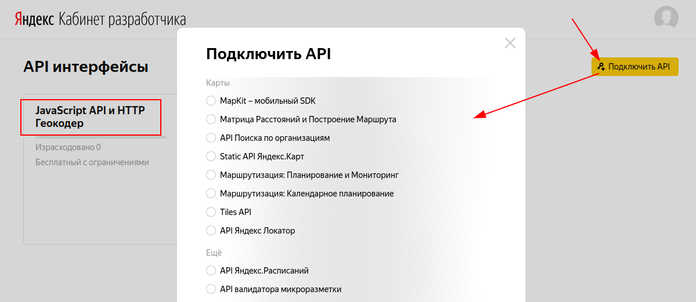
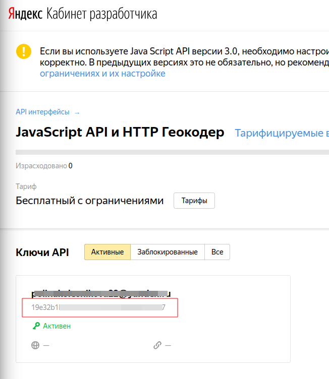
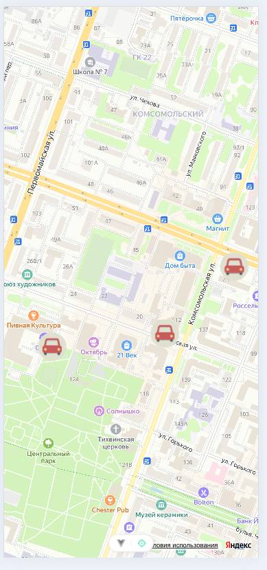

[К содержанию](../readme.md#введение-в-web-разработку)

# Vue.js: Работа с Яндекс картами

Для работы с яндекс картами будем использовать пакет [vue-yandex-maps](https://yandex-maps-unofficial.github.io/vue-yandex-maps/guide/about.html)

## Установка пакета

```bash
npm install vue-yandex-maps
```

## Подключение

В `src/main.js` добавьте импорт и использование пакета:

```js
import './assets/main.css'

import { createApp } from 'vue'
import { createPinia } from 'pinia'
import { createYmaps } from 'vue-yandex-maps'
//^^^^^^^^^^^^^^^^^^^^^^^^^^^^^^^^^^^^^^^^^^^

import App from './App.vue'
import router from './router'

const app = createApp(App)

app.use(createPinia())
app.use(router)

app.use(createYmaps({apikey: 'your-api-key'}))
//^^^^^^^^^^^^^^^^^^^^^^^^^^^^^^^^^^^^^^^^^^^^

app.mount('#app')
```

Для работы с яндекс-картами нужно получить `api key`.

1. Перейдите в [кабинет разработчика Яндекс](https://developer.tech.yandex.ru/services)

    

    * кликните кнопку "Подключить АПИ"
    * выберите из списка "JavaScript API и HTTP Геокодер" (у меня он уже выбран, поэтому в списке его нет) и нажмите продолжить. Насколько я помню там нужны ещё какие-то действия - пройдите до конца

1. После подключения "API интерфейса" скопируйте ключ:

    


## Начало работы

Для запуска вам потребуется:

* Настроить карту
* Прописать `location` с `center/zoom` в `settings`
* Указать компоненты `<yandex-map-default-features-layer />` (нужен для маркеров и пр.) и `<yandex-map-default-scheme-layer />` в теле `<yandex-map />`
* Опционально указать width/height у `<yandex-map />` (по умолчанию: `100%`)

```vue
<script setup>
import { ref } from 'vue'
import { YandexMap, YandexMapDefaultSchemeLayer } from 'vue-yandex-maps'
const map = ref(null)
</script>

<template>
  <yandex-map
      v-model="map"
      :settings="{
        location: {
          center: [37.617644, 55.755819],
          zoom: 9,
        },
      }"
      width="100%"
      height="100vh"
  >
    <yandex-map-default-scheme-layer/>
  </yandex-map>
</template>
```

## Отображение своих маркеров на карте

Для добавления маркеров на карту необходимо добавить компоненты `<yandex-map-marker>`. В компоненте есть [примеры](https://yandex-maps-unofficial.github.io/vue-yandex-maps/examples/objects/marker-custom-icon.html)

Например, отображение маркеров со своим изображением:

```vue
import { 
    YandexMap, 
    YandexMapDefaultSchemeLayer, 
    YandexMapMarker, 
    YandexMapDefaultFeaturesLayer 
} from 'vue-yandex-maps'

...

const cars = [
{
    "lat": 56.639053,
    "lon": 47.893739,
    "model": "Лада Гранта",
    "number": "A100AA12",
    "tarif": 8.99,
    "km_left": 600,
    "kreslo": true,
    "kpp": "manual",
    "photo": "granta.webp"
},
...
]
</script>

<template>
    <yandex-map
        v-model="map"
        :settings="{
            location: {
                center: [47.889641, 56.639053],
                zoom: 16,
            },
        }"
        width="100%"
        height="100vh"
    >
        <yandex-map-default-scheme-layer/>
        <yandex-map-default-features-layer/>
        <yandex-map-marker
            v-for="(car, index) in cars"
            :key="index"
            position="top-center left-center"
            :settings="{ coordinates: [car.lon, car.lat] }"
        >
            
        </yandex-map-marker>
    </yandex-map>
</template>
```



Обратите внимание:

* должен быть объявлен компонент `<yandex-map-default-features-layer/>`
* у маркера должен быть аттрибут `settings`, в котором заданы координаты маркера


[Назад](./web_18.md) | [Дальше](./web_20.md)
