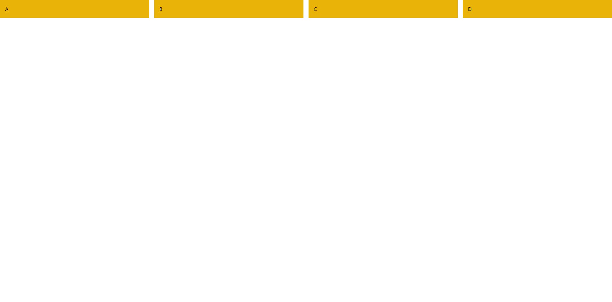

# Tailwind CSS, примеры

## Flexbox

>Немного взято [отсюда](https://developer.mozilla.org/ru/docs/Learn/CSS/CSS_layout/Flexbox)

Это новая технология, которая уже имеет достаточно широкую поддержку браузеров. Flexbox предоставляет инструменты для быстрого создания сложных, гибких макетов, и функции, которые были сложны в традиционных методах CSS. В этой статье объясняются все основы данной технологии.

### Почему Flexbox?

Долгое время единственными надёжными инструментами CSS вёрстки были такие способы как Float (обтекание) и позиционирование.

С их помощью сложно или невозможно достичь следующих простых требований к макету:

* Вертикального выравнивания блока внутри родителя.
* Оформления всех детей контейнера так, чтобы они распределили между собой доступную ширину/высоту, независимо от того, сколько ширины/высоты доступно.
* Сделать все колонки в макете одинаковой высоты, даже если наполнение в них различно.

Flexbox значительно облегчает работу с макетами.

>Дальше курсовой от Валеры Иванова

## Горизонтальное выравнивание

```html
<div class="flex 
            justify-center 
            items-center 
            h-screen">
    <div class="bg-blue-500 
                text-white p-4">
            Центрировано
    </div>
</div>
```


## Пространство между элементами

```html
<div class="flex 
            space-x-4">
    <div class="bg-red-500 
                p-4">Элемент 1</div>
    <div class="bg-green-500 
                p-4">Элемент 2</div>
    <div class="bg-blue-500 
                p-4">Элемент 3</div>
</div>
```


## Grid

### Простая сетка

```html
<div class="grid 
            grid-cols-3 
            gap-4">
    <div class="bg-gray-500 p-4">1</div>
    <div class="bg-gray-500 p-4">2</div>
    <div class="bg-gray-500 p-4">3</div>
</div>
```


### Сетка с кастомными колонками

```html
<div class="grid 
            grid-cols-2 
            md:grid-cols-4 
            gap-4">
    <div class="bg-yellow-500 p-4">A</div>
    <div class="bg-yellow-500 p-4">B</div>
    <div class="bg-yellow-500 p-4">C</div>
    <div class="bg-yellow-500 p-4">D</div>
</div>
```



## Выравнивание элементов

### Выравнивание по центру

```html
<div class="flex 
            justify-center 
            items-center 
            h-screen">
    <div class="bg-indigo-500 
                text-white 
                p-4">
        Центр</div>
</div>
```


### Выравнивание текста

```html
<div class="text-center">
    <h1 class="text-3xl 
               font-bold">
        Заголовок</h1>
    <p>Этот текст выровнен по центру.</p>
</div>
```


## Подробное описание классов Tailwind CSS

### **Flexbox**

1. `flex` Активирует режим flexbox.

1. `justify-<value>` Управляет выравниванием элементов вдоль главной оси (горизонтально).  

   Возможные значения: `start`, `center`, `end`, `between`, `around`.

1. `items-<value>` Управляет выравниванием элементов вдоль поперечной оси (вертикально).  

   Возможные значения: `start`, `center`, `end`, `stretch`.

1. `space-x-<value>` Устанавливает горизонтальное пространство между дочерними элементами.

1. `space-y-<value>` Устанавливает вертикальное пространство между дочерними элементами.

## Grid

1. `grid` Активирует режим сетки.

1. `grid-cols-<value>` Определяет количество колонок. Например, `grid-cols-3` создаст три колонки.

1. `gap-<value>` Устанавливает расстояние между элементами сетки.

## Текст

1. `text-<value>` Определяет размер текста.  
   Например: `text-sm`, `text-lg`, `text-2xl`.

1. `text-center` Центрирует текст.

1. `font-<value>` Устанавливает толщину шрифта, например: `font-light`, `font-bold`.

1. `text-<color>` Задает цвет текста, например: `text-red-500`, `text-blue-700`.

## Реализация страницы авторизации

```html
<template>
    <div class="min-h-screen 
                flex 
                items-center 
                justify-center 
                bg-gray-100">
        <div class="w-full 
                    max-w-md 
                    bg-white 
                    shadow-md 
                    rounded-lg 
                    p-6">
            <h2 class="text-2xl 
                       font-semibold
                       text-center
                       text-gray-700">
                Авторизация</h2>
            <form 
                @submit.prevent="handleSubmit"
                class="mt-6">
                <div class="mb-4">
                    <label 
                        for="email"
                        class="block
                               text-sm
                               font-medium
                               text-gray-600">
                        Электронная почта</label>
                    <input
                        id="email"
                        type="email"
                        v-model="email"
                        required
                        class="w-full 
                               mt-2 
                               px-4 
                               py-2 
                               border
                               rounded-lg
                               focus:outline-none 
                               focus:ring 
                               focus:ring-blue-300"
                    />
                </div>
                <div class="mb-6">
                    <label 
                        for="password" class="block 
                               text-sm
                               font-medium
                               text-gray-600">
                        Пароль</label>
                    <input
                        id="password"
                        type="password"
                        v-model="password"
                        required
                        class="w-full 
                               mt-2 
                               px-4 
                               py-2 
                               border
                               rounded-lg
                               focus:outline-none
                               focus:ring 
                               focus:ring-blue-300"
                    />
                </div>
                <button
                    type="submit"
                    class="w-full 
                           bg-blue-500 
                           text-white 
                           py-2 
                           px-4 
                           rounded-lg 
                           hover:bg-blue-600 
                           transition"
                >
                    Войти
                </button>
            </form>
        </div>
    </div>
</template>
```


## Основная структура

```html
<div 
    class="min-h-screen 
           flex 
           items-center 
           justify-center 
           bg-gray-100">
```

- `min-h-screen`: Устанавливает минимальную высоту контейнера равной высоте экрана.
- `flex`: Делает контейнер гибким (flexbox), чтобы элементы внутри него могли выравниваться.
- `items-center`: Вертикальное центрирование содержимого.
- `justify-center`: Горизонтальное центрирование содержимого.
- `bg-gray-100`: Устанавливает светло-серый фон.

```html
<div 
    class="w-full 
           max-w-md 
           bg-white 
           shadow-md 
           rounded-lg 
           p-6">
```

- `w-full`: Устанавливает ширину контейнера на 100% от родительского элемента.
- `max-w-md`: Ограничивает максимальную ширину контейнера до `md` (medium: около `28rem`, или `448px`).
- `bg-white`: Устанавливает белый фон.
- `shadow-md`: Добавляет среднюю тень для создания эффекта приподнятости.
- `rounded-lg`: Скругляет углы контейнера.
- `p-6`: Устанавливает внутренние отступы (padding) по `1.5rem` (`24px`) со всех сторон.

## Заголовок

```html
<h2 
    class="text-2xl 
           font-semibold 
           text-center
           text-gray-700">
    Авторизация</h2>
```

- `text-2xl`: Устанавливает размер шрифта на 24px.
- `font-semibold`: Делает текст полужирным.
- `text-center`: Выравнивает текст по центру.
- `text-gray-700`: Устанавливает цвет текста темно-серым.

## Форма

### Внешняя структура формы

```html
<form 
    @submit.prevent="handleSubmit" 
    class="mt-6">
```

- `@submit.prevent="handleSubmit"`: Вызов обработчика отправки формы (`handleSubmit`), при возникновении события `@submit`. `prevent` предотвращает перезагрузку страницы.
- `class="mt-6"`: Добавляет верхний отступ (Margin Top) `1.5rem` (`24px`).

### Поле "Электронная почта"

```html
<div class="mb-4">
    <label 
        for="email" 
        class="block 
               text-sm 
               font-medium 
               text-gray-600">
        Электронная почта</label>
    <input
        id="email"
        type="email"
        v-model="email"
        required
        class="w-full 
               mt-2 
               px-4 
               py-2 
               border 
               rounded-lg 
               focus:outline-none 
               focus:ring 
               focus:ring-blue-300"
    />
</div>
```

- `mb-4`: Устанавливает нижнюю границу `1rem` (`16px`).
- Метка `label`:
    - `block`: Заставляет метку занимать всю строку.
    - `text-sm`: Устанавливает размер текста маленьким.
    - `font-medium`: Делает текст средней жирности.
    - `text-gray-600`: Устанавливает светло-серый цвет текста.

- Поле ввода `input`:
    - `w-full`: Устанавливает ширину на 100% родителя.
    - `mt-2`: Добавляет верхнюю границу `0.5rem` (`8px`).
    - `px-4 py-2`: Устанавливает горизонтальные и вертикальные внутренние отступы.
    - `border`: Добавляет рамку.
    - `rounded-lg`: Скругляет углы поля.
    - `focus:outline-none`: Убирает стандартное выделение при фокусе.
    - `focus:ring focus:ring-blue-300`: Добавляет синий эффект подсветки при фокусе.

### Поле "Пароль"

Код аналогичен полю "Электронная почта", за исключением `type="password"`, что скрывает вводимые символы.

### Кнопка "Войти"

```html
<button
    type="submit"
    class="w-full 
           bg-blue-500 
           text-white 
           py-2 
           px-4 
           rounded-lg 
           hover:bg-blue-600 
           transition"
>
  Войти
</button>
```

- `type="submit"`: Указывает, что кнопка отправляет форму (генерирует событие **submit**).
- `w-full`: Устанавливает ширину на 100% родителя.
- `bg-blue-500`: Устанавливает синий фон.
- `text-white`: Делает текст белым.
- `py-2 px-4`: Добавляет вертикальные и горизонтальные внутренние отступы.
- `rounded-lg`: Скругляет углы.
- `hover:bg-blue-600`: Меняет фон на более темный при наведении.
- `transition`: Добавляет анимацию смены состояний.
