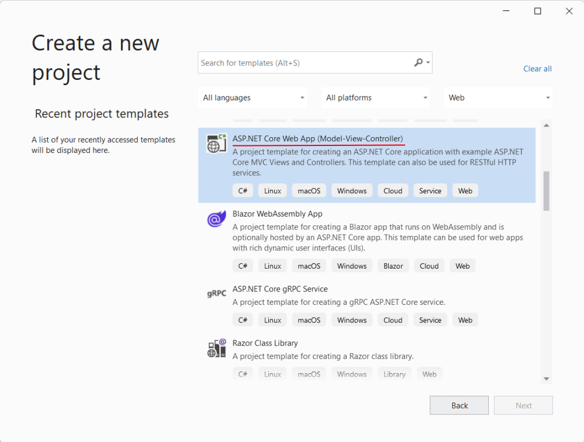
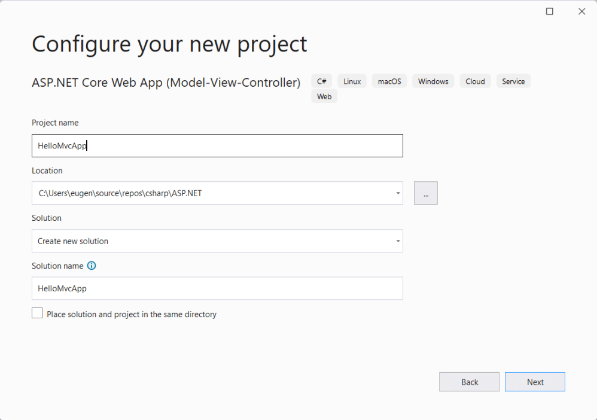
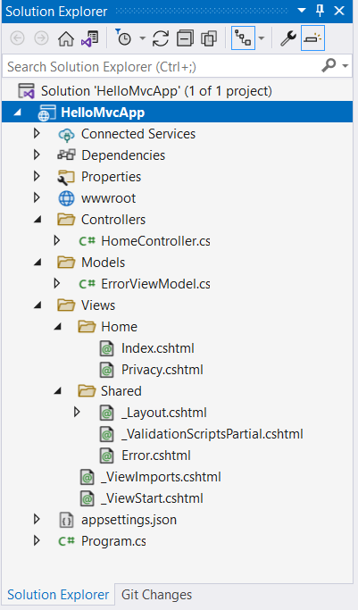
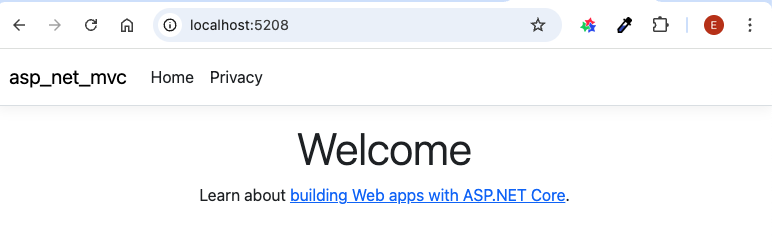
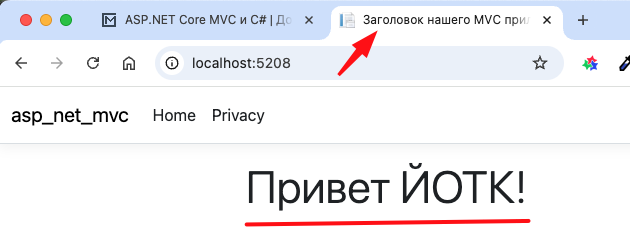
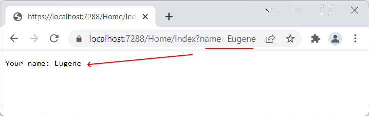

# Введение в ASP.NET Core MVC. Создание веб-приложения, структура проекта, контроллеры

>Эта и следующие лекции взяты [отсюда](https://metanit.com/sharp/aspnetmvc/)

Фреймворк ASP.NET Core MVC является частью платформы ASP.NET Core, его отличительная особенность - применение паттерна MVC. Преимуществом использования фрейморка ASP.NET Core MVC по сравнению с "чистым" ASP.NET Core является то, что он упрощает в ряде ситуаций и сценариев организацию и создание приложений, особенно это относится к большим приложениям.

Стоит отметить, чам паттерн MVC не является исключительной особенностью ASP.NET Core MVC, данный паттерн появился еще в конце 1970-х годов в компании Xerox как способ организации компонентов в графическом приложение на языке Smalltalk и в настоящее время применяется во многих платформах и для различных языках программирования. Особенно популярен паттерн MVC в веб-приложениях.

Концепция паттерна MVC предполагает разделение приложения на три компонента:

- __Модель__ (model): описывает используемые в приложении данные, а также логику, которая связана непосредственно с данными, например, логику валидации данных. Как правило, объекты моделей хранятся в базе данных.

    В MVC модели представлены двумя основными типами: модели представлений, которые используются представлениями для отображения и передачи данных, и модели домена, которые описывают логику управления данными.

    Модель может содержать данные, хранить логику управления этими данными. В то же время модель не должна содержать логику взаимодействия с пользователем и не должна определять механизм обработки запроса. Кроме того, модель не должна содержать логику отображения данных в представлении.

- __Представление__ (view): отвечают за визуальную часть или пользовательский интерфейс, нередко html-страница, через который пользователь взаимодействует с приложением. Также представление может содержать логику, связанную с отображением данных. В то же время представление не должно содержать логику обработки запроса пользователя или управления данными.

- __Контроллер__ (controller): представляет центральный компонент MVC, который обеспечивает связь между пользователем и приложением, представлением и хранилищем данных. Он содержит логику обработки запроса пользователя. Контроллер получает вводимые пользователем данные и обрабатывает их. И в зависимости от результатов обработки отправляет пользователю определенный вывод, например, в виде представления, наполненного данными моделей.

Отношения между компонентами паттерна можно описать следующей схемой:


В этой схеме модель является независимым компонентом - любые изменения контроллера или представления никак не влияют на модель. Контроллер и представление являются относительно независимыми компонентами. Так, из представления можно обращаться к определенному контроллеру, а из контроллера генерировать представления, но при этом нередко их можно изменять независимо друг от друга.

Такое разграничение компонентов приложения позволяет реализовать концепцию разделение ответственности, при которой каждый компонент отвечает за свою строго очерченную сферу. В связи с чем легче построить работу над отдельными компонентами. И благодаря этому приложение легче разрабатывать, поддерживать и тестировать отдельные компоненты. Допустим, если нам важна визуальная часть или фронтэнд, то мы можем тестировать представление независимо от контроллера. Либо мы можем сосредоточиться на бэкэнде и тестировать контроллер.

## Первый проект на ASP.NET Core MVC

Для создания проекта на ASP.NET Core MVC мы можем выбрать любой тип проекта на ASP.NET Core и в нем уже добавлять необходимые компоненты. Однако для упрощения Visual Studio уже по умолчанию предоставляет для этого шаблон ASP.NET Core Web App (Model-View-Controller):



Выберем данный шаблон для создания проекта. Дальше нам откроется окно для установки имени проекта. Допустим, проект будет называться asp_net_mvc:



Можно создать проект используя командную строку:

```
dotnet new mvc
```

## Структура проекта



- __wwwroot__: этот узел (на жестком диске ему соответствует одноименная папка) предназначен для хранения статических файлов - изображений, скриптов javascript, файлов css и т.д., которые используются приложением.
- __Controllers__: папка для хранения контроллеров, используемых приложением. По умолчанию здесь уже есть один контроллер - Homecontroller
- __Models__: каталог для хранения моделей. По умолчанию здесь создается модель ErrorviewModel
- __Views__: каталог для хранения представлений. Здесь также по умолчанию добавляются ряд файлов - представлений
- __appsettings.json__: хранит конфигурацию приложения
- __Program.cs__: файл, который определяет входную точку в приложение ASP.NET Core

Можно запустить созданный проект (я делаю через консоль, но можно и в GUI)

```
dotnet run
Используются параметры запуска из /Users/kei/Projects/asp_net_mvc/Properties/launchSettings.json...
Сборка…
info: Microsoft.Hosting.Lifetime[14]
      Now listening on: http://localhost:5208
info: Microsoft.Hosting.Lifetime[0]
      Application started. Press Ctrl+C to shut down.
info: Microsoft.Hosting.Lifetime[0]
      Hosting environment: Development
info: Microsoft.Hosting.Lifetime[0]
      Content root path: /Users/kei/Projects/asp_net_mvc
```

При запуске консоль отобразит адрес, по которому доступен проект. В моем случае это "http://localhost:5208". И если мы откроем в браузере этот адрес, то сработает запрос к контроллеру по умолчанию - классу __HomeController__, который выберет для генерации ответа нужное представление. И в итоге из представления будет создана html-страница:



Посмотрим что происходит в `Program.cs`:

```cs
var builder = WebApplication.CreateBuilder(args);

/**
в приложение добавляются сервисы MVC 
(поддержка контроллеров и представлений)
*/
builder.Services.AddControllersWithViews();

var app = builder.Build();

/**
HSTS (HTTP Strict Transport Security) — это стандарт безопасности, который принуждает браузеры подключаться к веб-сайту только по защищенному протоколу HTTPS, даже если пользователь вводит ссылку с HTTP. 
*/
if (!app.Environment.IsDevelopment())
{
    app.UseExceptionHandler("/Home/Error");
    app.UseHsts();
}

// middleware 
app.UseHttpsRedirection();
app.UseRouting();
app.UseAuthorization();

// подключает статические ресурсы
app.MapStaticAssets();

/**
Вместо конечных точек (как в минималистичном АПИ)
подключается маршрутизация через контроллер
 */
app.MapControllerRoute(
    name: "default",
    pattern: "{controller=Home}/{action=Index}/{id?}")
    .WithStaticAssets();

app.Run();
```

Прежде всего надо отметить, что функциональность MVC, в частности, поддержка контроллеров и представлений, подключается в приложение в виде сервиса - в данном случае с помощью вызова `services.AddControllersWithViews()`. После этого мы можем использовать функциональность фреймворка MVC.

Кроме того, чтобы связать приходящие от пользователей запросы с контроллерами применяется метод `MapControllerRoute()`. Через первый параметр - _name_ в метод передается название маршрута - в данном случае "default". Через второй параметр - параметр _pattern_ передается шаблон маршрута, которому должен соответствовать запрос. В качестве шаблона маршрута применяется шаблон "`{controller=Home}/{action=Index}/{id?}`", который представляет трехсегментный запрос. В нем первый сегмент представляет контроллер, второй сегмент - метод контроллера, а третий - необязательный параметр. При этом если в запросе не указаны сегменты (например, обращение идет к корню веб-приложения), то в качестве контроллера по умолчанию применяется `HomeController`, а в качестве его метода - метод `Index`.

Посмотрим что находится в `HomeController.cs`

```cs
namespace asp_net_mvc.Controllers;

public class HomeController : Controller
{
    private readonly ILogger<HomeController> _logger;

    // конструктор
    public HomeController(ILogger<HomeController> logger)
    {
        _logger = logger;
    }

    // точка входа по-умолчанию
    // реальный путь /home/index
    public IActionResult Index()
    {
        return View();
    }

    // точка входа /home/privacy
    public IActionResult Privacy()
    {
        return View();
    }

    [ResponseCache(Duration = 0, Location = ResponseCacheLocation.None, NoStore = true)]
    public IActionResult Error()
    {
        return View(new ErrorViewModel { RequestId = Activity.Current?.Id ?? HttpContext.TraceIdentifier });
    }
}
```

Контроллер имеет __конструктор__, через который посредством механизма dependency injection передается сервис ILogger, используемый для логгирования. Также контроллер определяет три __метода__ - _Index_, _Privacy_ и _Error_.

Как видим все методы в итоге возвращают представление (`return View()`). Представления лежат в каталоге `/Views/<Название контроллера>` - в нашем случае `/Views/Home`, называются так же как методы и имеют расширение `*.cshtml`

Рассмотрим файл `/Views/Home/Index.cshtml`:

```html
<!-- тут задается название страницы -->
@{ViewData["Title"] = "Home Page";}

<div class="text-center">
    <h1 class="display-4">
        Welcome
    </h1>
    <p>Learn about 
        <a href="https://learn.microsoft.com/aspnet/core">
            building Web apps with ASP.NET Core
        </a>.
    </p>
</div>
```

В принципе это обычный HTML файл, кроме первой строки. Немного поправим его:

```html
<!-- тут задается название страницы -->
@{ViewData["Title"] = "Заголовок нашего MVC приложения";}
<div class="text-center">
    <h1 class="display-4">
        Привет ЙОТК!
    </h1>
</div>
```



## Сервисы MVC

Функциональность MVC и ее работа в приложении зависит от добавляемых сервисов. В примере выше мы использовали метод `AddControllersWithViews()` для добавления сервисов MVC, благодаря чему система маршрутизации смогла связать запрос с контроллером. 

Есть и другие сервисы:

- `AddMvc()`: добавляет все сервисы фреймворка MVC (в том числе сервисы для работы с аутентификацией и авторизацией, валидацией и т.д.)

- `AddMvcCore()`: добавляет только основные сервисы фреймворка MVC, а всю дополнительную функциональность, типа аутентификацией и авторизацией, валидацией и т.д., необходимо добавлять самостоятельно

- `AddControllersWithViews()`: добавляет только те сервисы фреймворка MVC, которые позволяют использовать контроллеры и представления и связанную функциональность. При создании проекта по типу ASP.NET Core Web App (Model-View-Controller) используется именно этот метод

- `AddControllers()`: позволяет использовать контроллеры, но без представлений.

И в зависимости от того, насколько широко нам надо использовать возможности фреймворка MVC, выбирается соответствующий метод. Например, мы могли бы использовать вместо вызова `AddControllersWithViews()` метод `AddMvc()`.

## Контроллеры

### Контроллеры и их действия

Основным элементом в архитектуре ASP.NET Core MVC является __контроллер__. При получении запроса система маршрутизации выбирает для обработки запроса нужный контроллер и передает ему данные запроса. Контроллер обрабатывает эти данные и посылает обратно результат обработки.

Например, проект, создаваемый по шаблону ASP.NET Core Web App (Model-View-Controller), по умолчанию содержит как минимум один контроллер - класс _HomeController_ (его содержимое мы уже посмотрели выше)

В ASP.NET Core MVC контроллер представляет обычный класс на языке C#, который обычно наследуется от абстрактного базового класса Microsoft.AspNetCore.Mvc.Controller и который, как и любой класс на языке C#, может иметь поля, свойства, методы. Согласно соглашениям об именовании названия контроллеров обычно оканчиваются на суффикс "Controller", остальная же часть до этого суффикса считается именем контроллера, например, HomeController. Но в принципе эти условности также необязательны.

Но есть также и обязательные условности, которые предъявляются к контроллерам. В частности, класс контроллера должен удовлетворять как минимум одному из следующих условий:

- Класс контроллера имеет суффикс "Controller"

    ```cs
    public class HomeController
    {  
        //............  
    }
    ```

- Класс контроллера наследуется от класса, который имеет суффикс "Controller"

    ```cs
    public class Home : Controller
    {
        //.............
    }
    ```

- К классу контроллера применяется атрибут [Controller]

    ```cs
    [Controller]
    public class Home
    {
        //..................
    }
    ```

### Действия контроллера

Ключевым элементом контроллера являются его __действия__. Действия контроллера - это публичные методы, которые могут сопоставляться с запросами. Например, контроллер _HomeController_ и его метод _Index_.

В общем случае метод может возвращать просто текст и возможна такая релизация

```cs
public string Index()
{
    return "Привет ЙОТК!";
}
```

Естественно, в этом случае нет ни заголовка ни тела HTML и текст выводится "как есть":


### Обращение к действиям контроллера

Сопоставление запроса с контроллером и его действием происходит благодаря системе маршрутизации. 

```cs
app.MapControllerRoute(
    name: "default",
    pattern: "{controller=Home}/{action=Index}/{id?}")
    .WithStaticAssets();
```

Метод `app.MapControllerRoute` добавляет один маршрут с именем __default__ и шаблоном "`{controller=Home}/{action=Index}/{id?}`". Данный шаблон устанавливает трехсегментную структуру строки запроса: `controller/action/id`. То есть в начале идет название контроллера, затем название действия, и далее может идти необязательный параметр `id`.

Собственно поэтому система может соотнести запрос типа `localhost:xxxx/Home/Index` с контроллером и его действием.

Чтобы обратиться к контроллеру из веб-браузера, нам надо в адресной строке набрать `адрес_сайта/Имя_контроллера/Действие_контроллера`. Так, по запросу `адрес_сайта/Home/Index` система маршрутизации по умолчанию вызовет метод _Index_ контроллера __HomeController__ для обработки входящего запроса. 

### Методы, которые не являются действиями

Однако не все методы контроллера являются действиями. Контроллер также может иметь непубличные методы - такие методы не рассматриваются как действия и соответственно не могут соотноситься с запросами. Например, определим в контроллере следующий метод:

```cs
public class HomeController : Controller
{
    protected internal string Hello() => "Hello ASP.NET";
}
```

Метод _Hello_ не является действием, поскольку его модификатор отличается от __public__. Соответственно мы не сможем обратиться к этому методу с запросом `localhost:xxxx/Home/Hello`. Хотя такие не публичные методы также могут быть полезными - в них можно определять какие-нибудь промежуточные вычисления и затем использовать в действиях контроллера. При этом если мы изменим модификатор метода на `public`, то метод _Hello_ станет полноценным действием.

### Атрибуты NonController, ActionName и NonAction

Возможно, сопоставление по умолчанию бывает не всегда удобно. Например, у нас есть класс в папке `Controllers`, но мы не хотим, чтобы он мог обрабатывать запрос и использоваться как контроллер. Чтобы указать, что этот класс не является контроллером, нам надо использовать над ним атрибут `[NonController]`:

```cs
[NonController]
public class HomeController : Controller
{
    //...........
}
```

Аналогично, если мы хотим, чтобы какой-либо публичный метод контроллера не рассматривался как действие, то мы можем использовать над ним атрибут `[NonAction]`:

```cs
[NonAction]
public string Hello()
{
    return "Hello ASP.NET";
}
```

Атрибут `[ActionName]` позволяет для метода задать другое имя действия. Например:

```cs
[ActionName("Welcome")]
public string Hello()
{
    return "Hello ASP.NET";
}
```

В этом случае чтобы обратиться к этому методу, надо отправить запрос `localhost:xxxx/Home/Welcome`. А запрос `localhost:xxxx/Home/Hello` работать не будет.

### Типы запросов

Кроме того, методы могут обслуживать разные типы запросов. Для указания типа запроса HTTP нам надо применить к методу один из атрибутов: `[HttpGet]`, `[HttpPost]`, `[HttpPut]`, `[HttpPatch]`, `[HttpDelete]` и `[HttpHead]`. Если атрибут явным образом не указан, то метод может обрабатывать все типы запросов: `GET`, `POST`, `PUT`, `DELETE`.

Например:

```cs
public class HomeController : Controller
{
    [HttpGet]
    public string Index() => "Hello METANIT.COM";

    [HttpPost]
    public string Hello() => "Hello ASP.NET";
}
```

Так, в данном случае метод _Index_ обрабатывает только запросы типа `GET`, а метод _Hello_ - запросы типа `POST`.

### Контекст контроллера

При обращении к контроллеру среда ASP.NET создает для этого контроллера контекст, который содержит различные связанные с контроллером данные. Для получения контекста в классе контроллера нам доступно свойство _ControllerContext_, которое представляет одноименный класс __ControllerContext__. Этот класс определяет ряд важный свойств:

- __HttpContext__: содержит информацию о контексте запроса
- __ActionDescriptor__: возвращает дескриптор действия - объект ActionDescriptor, который описывает вызываемое действие контроллера
- __ModelState__: возвращает словарь _ModelStateDictionary_, который используется для валидации данных, отправленных пользователем
- __RouteData__: возвращает данные маршрута

Для получения информации о запросе нас прежде всего будет интересовать свойство _HttpContext_, которое представляет объект `Microsoft.AspNetCore.Http.HttpContext`. В принципе это тот же самый объект, который нам доступен в любом компоненте __middleware__ в ASP.NET Core. Этот объект также доступен через свойство _HttpContext_ класса контроллера. То есть следующие вызовы будут обращаться к одному и тому же объекту:

```cs
var ctx1 = ControllerContext.HttpContext;
var ctx2 = HttpContext;
```

Объект __HttpContext__ инкапсулирует всю информацию о запросе. В частности, он определяет следующие свойства:

- __Request__: содержит собственно информацию о текущем запросе.
- __Response__: управляет ответом
- __User__: представляет текущего пользователя, который обращается к приложению
- __Session__: объект для работы с сессиями

#### Response

Свойство `HttpContext.Response` представляет объект __HttpResponse__ и позволяет управлять ответом на запрос, в частности, устанавливать заголовки ответа, куки, отправлять в выходной поток некоторый ответ. Этот же объект доступен через свойство _Response_ класса __Conroller__. Среди свойств объекта __Response__ можно выделить следующие:

- __Body__: объект Stream, который применяется для отправки данных в ответ пользователю
- __Cookies__: куки, отправляемые в ответе
- __ContentType__: MIME-тип ответа
- __Headers__: коллекция заголовков ответа
- __StatusCode__: статусный код ответа

С помощью объекта __Response__ мы можем настроить параметры ответа и отправить его клиенту. Например, отправим из действия контроллера данные клиенту:

```cs
public class HomeController : Controller
{
    public async Task Index() 
    {
        Response.ContentType = "text/html;charset=utf-8";
        await Response.WriteAsync("<h2>Hello METANIT.COM</h2>");
    }
}
```

Здесь в методе _Index_ вначале устанавливается заголовок `Content-Type`, а затем с помощью метода _WriteAsync_ отправляется некоторое простейшее содержимое в виде строки с кодом html. Поскольку метод _WriteAsync_ - асинхронный, то к нему можно применить оператор __await__, а метод-действие _Index_ определен как асинхронный.

#### Request

Свойство `HttpContext.Request` представляет объект __HttpRequest__ и предоставляет разнообразную информацию о запросе. Этот же объект доступен через свойство _Request_ класса контроллера. Среди свойств объекта __Request__ можно выделить следующие:

- __Body__: объект Stream, который используетя для чтения данных запроса
- __Cookies__: куки, полученные в запросе
- __Form__: коллекция значений отправленных форм
- __Headers__: коллекция заголовков запроса
- __Path__: возвращает запрошенный путь - строка запроса без домена и порта
- __Query__: возвращает коллекцию переданных через строку запроса параметров
- __QueryString__: возвращает ту часть запроса, которая содержит параметры. Например, в запросе `http://localhost:52682/Home/Index?alt=4` это будет `?alt=4`

Вся основная информация нам доступна из заголовков. Например, получим из запроса все заголовки и выведем их в браузере:

```cs
public class HomeController : Controller
{
    public async Task Index() 
    {
        Response.ContentType = "text/html;charset=utf-8";
        System.Text.StringBuilder tableBuilder = new("<h2>Request headers</h2><table>");
        foreach (var header in Request.Headers)
        {
            tableBuilder.Append(
                $"<tr><td>{header.Key}</td><td>{header.Value}</td></tr>");
        }
        tableBuilder.Append("</table>");
        await Response.WriteAsync(tableBuilder.ToString());
    }
}
```

### Передача данных в контроллер через строку запроса

#### Получение данных через строку запроса

Вместе с запросом приложению могут приходить различные данные. И чтобы получить эти данные, мы можем использовать разные способы. Самым распространенным способом считается применение параметров.

Определение в методах контроллера параметров ничем не отличается от определения параметров в языке C#. Например, определим в контроллере следующий метод:

```cs
public string Index(string name) => $"Your name: {name}";
```

В данном случае метод _Index_ из вне получает некоторую строку через параметр _name_.

Передавать значения для параметров можно различными способами. При отправке GET-запроса значения можно передать через строку запроса. Строка запроса представляет ту часть адреса, которая идет после знака вопроса `?` и представляет набор параметров, где каждый параметр отделен от другого с помощью амперсанда:

```
название_ресурса?параметр1=значение1&параметр2=значение2
```

Например, в адресе:

```
https://localhost:7288/Home/Index?name=Tom&age=37
```

часть `?name=Tom&age=37` представляет строку запроса, которая содержит два параметра: _name_ и _age_. Значение параметра _name_ - "Tom", а значение параметра _age_ - 37.

Например, передадим в выше определенный метод _Index_ через строку запроса данные для параметра _name_:



То есть в данном случае при обращении к методу _Index_ с запросом `https://localhost:7288/Home/Index?name=Eugene` параметру _name_ будет передаваться значение "Eugene".

Система привязки MVC, которую мы позже рассмотрим, по умолчанию сопоставляет параметры запроса и параметры метода по имени. То есть, если в строке запроса идет параметр _name_, то его значение будет передаваться именно параметру метода, который также называется _name_. При этом должно быть также соответствие по типу, то есть если параметр метода принимает числовое значение, то и через строку запроса надо передавать для этого параметра число, а не строку.

Подобным образом можно передать значения для нескольких параметров. Например, изменим метод _Index_ следующим образом:

```cs
public string Index(string name, int age)
{
    return $"Name: {name}  Age: {age}";
}
```

В этом случае мы можем обратиться к действию, набрав в адресной строке `https://localhost:7288/Home/Index?name=Tom&age=37`.

Если же мы не используем параметры в строке запроса, то для параметров можно задать значения по умолчанию. Например, при отправке запроса `https://localhost:7288/Home/Index` параметры _name_ и _age_ будут иметь значения по умолчанию. 

```cs
public string Index(string name = "Bob", int age = 33)
{
    return $"Name: {name}  Age: {age}";
}
```

### Объект Request.Query

Параметры представляют самый простой способ получения данных, но в действительности нам необязательно их использовать. В контроллере доступен объект __Request__, у которого можно получить как данные строки запроса через свойство _Request.Query_. Это свойство представляет объект __IQueryCollection__, где по ключу - названию параметра можно получить его значение. Например:

```cs
public string Index()
{
    string name = Request.Query["name"];
    string age = Request.Query["age"];
    return $"Name: {name}  Age: {age}";
}
```

В данном случае мы можем передать методу _Index_ данные через запрос типа `https://localhost:7288/Home/Index?name=Tom&age=37`.

### Передача данных в контроллер через формы

#### Передача данных через формы в запросе POST

Кроме GET-запросов также широко применяются POST-запросы. Как правило, такие запросы отправляются с помощью форм на веб-странице. Но основные принципы передачи данных будут теми же, что и в GET-запросах.

Для передачи POST-запросов определим два метода:

```cs
[HttpGet]
public async Task Index()
{
    string content = @"<form method='post'>
        <label>Name:</label><br />
        <input name='name' /><br />
        <label>Age:</label><br />
        <input type='number' name='age' /><br />
        <input type='submit' value='Send' />
    </form>";
    Response.ContentType = "text/html;charset=utf-8";
    await Response.WriteAsync(content);
}

[HttpPost]
public string Index(string name, int age) => $"{name}: {age}";
```

Первый метод _Index_ имеет атрибут [HttpGet], поэтому данный метод будет обрабатывать только запросы GET. Для упрощения примера в ответ метод будет возвращать html-код с формой ввода (хотя естественно, для формы html можно было бы определить представление)

Эта форма содержит два поля ввода. Что важно, первое поле имеет имя "name", которое задается с помощью атрибута "name":

```html
<input name='name' />
```

Второе поле имеет имя "age":

```htlm
<input type='number' name='age' />
```

Таким образом, при обращении к методу пользователь увидит в браузере форму ввода. При нажатии на кнопку "Send" введенные данные будут отправляться на сервер методом POST (`<form method='post'>`).

Поскольку у элемента `<form>` не задан атрибут _action_, который устанавливает адрес, то введенные данные отправляются на тот же адрес (то есть по сути методу с тем же именем - методу _Index_). Но поскольку у формы установлен атрибут method='post', то данные будут отправлять в запросе типа POST. А запросы данного типа обрабатывает второй метод _Index_:

```cs
[HttpPost]
public string Index(string name, int age) => $"{name}: {age}";
```

Чтобы система могла связать параметры метода и данные формы, необходимо, чтобы атрибуты _name_ у полей формы соответствовали названиям параметров. То есть в данном случае параметры метода _Index_ называются так же, как и поля формы - _name_ и _age_.

#### Получение данных из контекста запроса

Для получения данных отправленных форм можно использовать свойство _Request.Form_. Это свойство представляет коллекцию __IFormsCollection__, где каждый элемент имеет ключ и значение. В качестве ключа элемента выступает название поля формы, а в качестве значения - введенные в это поле данные:

```cs
public async Task Index()
{
    string content = @"<form method='post' action='/Home/PersonData'>
        <label>Name:</label><br />
        <input name='name' /><br />
        <label>Age:</label><br />
        <input type='number' name='age' /><br />
        <input type='submit' value='Send' />
    </form>";
    Response.ContentType = "text/html;charset=utf-8";
    await Response.WriteAsync(content);
}

[HttpPost]
public string PersonData()
{
    string name = Request.Form["name"];
    string age = Request.Form["age"];
    return $"{name}: {age}";
}
```

Обратите внимание, у формы определен атрибут `action`, который содержит урл. То есть при нажатии кнопки "Send" запрос будет послан не на метод _Index_, а на урл `/Home/PersonData`, которому соответствует одноименный метод контроллера

## Задание на дом

Сделать репозиторий - конспект, то есть создать приложение и в конспекте привести блоки кода и скриншоты для всех примеров из лекции.
