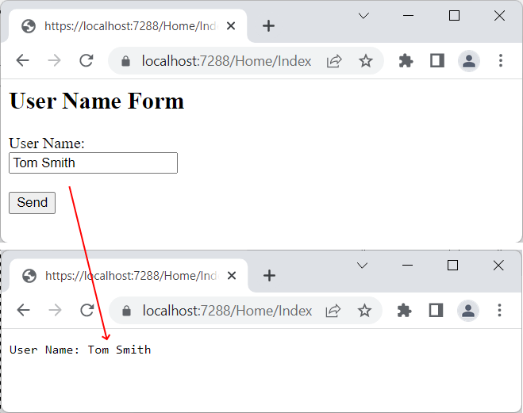

# Представления

## Введение в представления

Обычно при обращении к веб-приложению пользователь ожидает получить веб-страницу с какими-нибудь данными. В MVC для этого, как правило, используются __представления__, которые определяют внешний вид приложения и на основе которых потом формируется веб-страница. В ASP.NET MVC Core представления - это файлы с расширением `cshtml`, которые содержат код пользовательского интерфейса в основном на языке html, а также конструкции Razor - специального движка представлений, который позволяет переходить от кода html к коду на языке C#.

Для хранения представлений в проекте ASP.NET Core предназначена папка `Views`. Например, если мы возьмем проект по типу ASP.NET Core Web App (Model-View-Controller), то мы увидим, что он содержит ряд представлений.

Структура каталога `Views`:

- Во-первых, как правило, для каждого контроллера в проекте создается подкаталог в папке Views, который называется по имени контроллера и который хранит представления, используемые методами данного контроллера. Так, по умолчанию имеется контроллер __HomeController__ и для него в папке `Views` есть подкаталог `Home` с представлениями для методов контроллера HomeController - в нашем случае это файлы `Index.cshtml` и `Privacy.cshtml`.

- Также здесь есть папка `Shared`, которая хранит общие представления для всех контроллеров. По умолчанию это файлы `_Layout.cshtml` (используется в качестве мастер-страницы), `Error.cshtml` (использутся для отображения ошибок) и `_ValidationScripsPartial.cshtml` (частичное представление, которое подключает скрипты валидации формы).

- И в корне каталога `Views` также можно найти два файла `_ViewImports.cshtml` и `_ViewStart.cshtml`. Эти файлы содержат код, который автоматически добавляется ко всем представлениям. `_ViewImports.cshtml` устанавливает некоторые общие для всех представлений пространства имен, а `_ViewStart.cshtml` устанавливает общую мастер-страницу.

## Вызов представления. ViewResult

Вспомним, как выглядел метод, реализующий действие в контроллере

```cs
public class HomeController : Controller
{
    public IActionResult Index()
    {
        return View();
    }
}
```

За работу с представлениями отвечает объект __ViewResult__. Он производит рендеринг представления в веб-страницу и возвращает ее в виде ответа клиенту. Чтобы возвратить объект __ViewResult__, в методе контроллера вызывается метод _View_.

Вызов метода _View_ возвращает объект __ViewResult__. Затем уже __ViewResult__ производит рендеринг определенного представления в ответ. По умолчанию контроллер производит поиск представления в проекте по следующим путям:

```
/Views/Имя_контроллера/Имя_представления.cshtml
/Views/Shared/Имя_представления.cshtml
```

Согласно настройкам по умолчанию, если название представления не указано явным образом, то в качестве представления будет использоваться то, имя которого совпадает с именем действия контроллера. Например, вышеопределенное действие __Index__ по умолчанию будет производить поиск представления `Index.cshtml` в папке `/Views/Home/`.

Метод View() имеет четыре перегруженных версии:

- __View()__: для генерации ответа используется представление, которое по имени совпадает с вызывающим методом
- __View(string? viewName)__: в метод передается имя представления, что позволяет переопределить используемое по умолчанию представление
- __View(object? model)__: передает в представление данные в виде объекта model
- __View(string? viewName, object? model)__: переопределяет имя представления и передает в него данные в виде объекта model

Вторая версия метода позволяет переопределить используемое представление. Если представление находится в той же папке, которая предназначена для данного контроллера, то в метод _View()_ достаточно передать название представления без расширения:

```cs
public IActionResult Index()
{
    return View("About");
}
```

В этом случае метод _Index_ будет использовать представление по пути `Views/Home/About.cshtml`. Если же представление находится в другой папке, то нам надо передать полный путь к представлению:

```cs
public IActionResult Index()
{
    return View("~/Views/Some/About.cshtml");
}
```

В данном случае предполагается, что представление располагается по пути `Views/Some/About.cshtml`

Напомню как выглядит представление `Index.cshtml`:

```html
@{ViewData["Title"] = "Заголовок нашего MVC приложения";}

<div class="text-center">
    <h1 class="display-4">Привет ЙОТК!</h1>
</div>
```

А где же теги `<head>` и `<body>`? Внимательно перечитываем текущий параграф и видим, что есть еще какая-то мастер-страница `_ViewStart.cshtml` - посмотрим что в ней:

```cshtml
@{
    Layout = "_Layout";
}
```

Блок кода `@{}` содержит вставку кода C#, в которой задается `Layout`. `_Layout` это название файла, который лежит в каталоге `Shared` (не привязан к какому-то контроллеру, так как используется во всех контроллерах приложения) и содержит шаблон для верстки:

```html
<!DOCTYPE html>
<html lang="en">
<head>
    <meta charset="utf-8" />
    <meta name="viewport" content="width=device-width, initial-scale=1.0" />
    <title>@ViewData["Title"] - asp_net_mvc</title>
    <script type="importmap"></script>
    <link rel="stylesheet" href="~/lib/bootstrap/dist/css/bootstrap.min.css" />
    <link rel="stylesheet" href="~/css/site.css" asp-append-version="true" />
    <link rel="stylesheet" href="~/asp_net_mvc.styles.css" asp-append-version="true" />
</head>
<body>
    <header>
        <nav class="navbar navbar-expand-sm navbar-toggleable-sm navbar-light bg-white border-bottom box-shadow mb-3">
            <div class="container-fluid">
                <a class="navbar-brand" asp-area="" asp-controller="Home" asp-action="Index">asp_net_mvc</a>
                <button class="navbar-toggler" type="button" data-bs-toggle="collapse" data-bs-target=".navbar-collapse" aria-controls="navbarSupportedContent"
                        aria-expanded="false" aria-label="Toggle navigation">
                    <span class="navbar-toggler-icon"></span>
                </button>
                <div class="navbar-collapse collapse d-sm-inline-flex justify-content-between">
                    <ul class="navbar-nav flex-grow-1">
                        <li class="nav-item">
                            <a class="nav-link text-dark" asp-area="" asp-controller="Home" asp-action="Index">Home</a>
                        </li>
                        <li class="nav-item">
                            <a class="nav-link text-dark" asp-area="" asp-controller="Home" asp-action="Privacy">Privacy</a>
                        </li>
                    </ul>
                </div>
            </div>
        </nav>
    </header>
    <div class="container">
        <main role="main" class="pb-3">
            <!-- метод RenderBody вернет текстовое представление текущего представления -->
            @RenderBody()
        </main>
    </div>

    <footer class="border-top footer text-muted">
        <div class="container">
            &copy; 2025 - asp_net_mvc - <a asp-area="" asp-controller="Home" asp-action="Privacy">Privacy</a>
        </div>
    </footer>
    <script src="~/lib/jquery/dist/jquery.min.js"></script>
    <script src="~/lib/bootstrap/dist/js/bootstrap.bundle.min.js"></script>
    <script src="~/js/site.js" asp-append-version="true"></script>
    @await RenderSectionAsync("Scripts", required: false)
</body>
</html>
```

Это уже похоже на нормальный html. Содержимое представления вставляется вместо вызова `@RenderBody()`.

## Движок представлений Razor

Представления в ASP.NET Core MVC может содержать не только стандартный код html, но и также вставки кода на языке C#. Для обработки кода, который содержит как элементы html, так и конструкции языка C#, применяется движок представлений.

В действительности при вызове метода _View_ контроллер не производит рендеринг представления и не генерирует разметку html. Контроллер только готовит данные и выбирает, какое представление надо возвратить в качестве объекта __ViewResult__. Затем уже объект __ViewResult__ обращается к движку представления для рендеринга представления в выходной ответ.

По умолчанию в ASP.NET Core MVC применяется один движок представлений - __Razor__. Хотя при желании мы можем также использовать какие-то другие сторонние движки или создать свой движок представлений самостоятельно. Цель движка представлений __Razor__ - определить переход от разметки html к коду C#.

Синтаксис __Razor__ довольно прост - все его конструкции предваряются символом `@`, после которого происходит переход к коду C#.

Например, в файле `_Layout.cshtml` есть такие вставки:

```cshtml
тут в тег title вставляется содержимое словаря ViewData (мы это значение заполняли в файле Index.cshtml)
<title>@ViewData["Title"] - asp_net_mvc</title>

а тут вызывается функция RenderBody
<main role="main" class="pb-3">
    @RenderBody()
</main>
```

## Типы конструкций Razor

Все конструкции Razor можно условно разделить на два вида: однострочные выражения и блоки кода.

Пример применения однострочных выражений:

```
<p>Date: @DateTime.Now.ToLongDateString()</p>
```

В данном случае используется объект __DateTime__ и его метод _ToLongDateString()_

Или еще один пример:

```
<p>@(20 + 30)</p>
```

Так как перед скобками стоит знак `@`, то выражение в скобках будет интерпретироваться как выражение на языке C#. Поэтому браузер выведет число `50`, а не строку "20 + 30".

Но если вдруг мы создаем код html, в котором присутствует символ `@` не как часть синтаксиса Razor, а сам по себе, то, чтобы его отобразить, нам надо его дублировать:

```
<p>@@DateTime.Now = @DateTime.Now.ToLongDateString()</p>
```

Блоки кода могут иметь несколько выражений. Блок кода заключается в фигурные скобки, а каждое выражение завершается точкой с запятой аналогично блокам кода и выражениям на C#:

```
@{
    ViewData["Title"] = "Home Page";
}
```

В блоках кода мы можем определить обычные переменные и потом их использовать в представлении.

В Razor могут использоваться комментарии. Они располагаются между символами `@*  *@`:

```
@* текст комментария *@
```

### Условные конструкции

Также мы можем использовать условные конструкции:

```
@{
    string morning = "Good Morning";
    string evening = "Good Evening";
    string hello = "Hello";
    int hour = DateTime.Now.Hour;
}
@if (hour < 12)
{
    <h2>@morning</h2>
}
else if (hour > 17)
{
    <h2>@evening</h2>
}
else
{
    <h2>@hello</h2>
}
```

Конструкция switch:

```
@{
    string language = "german";
}
@switch(language)
{
    case "russian":
        <h3>Привет мир!</h3>
        break;
    case "german":
        <h3>Hallo Welt!</h3>
        break;
    default:
        <h3>Hello World!</h3>
        break;
}
```

### Циклы

Кроме того, мы можем использовать все возможные циклы. Цикл __for__:

```
@{
    string[] people = { "Tom", "Sam", "Bob" };
}
<ul>
    @for (var i = 0; i < people.Length; i++)
    {
        <li>@people[i]</li>
    }
</ul>
```

Цикл __foreach__:

```
@{
    string[] people = { "Tom", "Sam", "Bob" };
}
<ul>
    @foreach (var person in people)
    {
        <li>@person</li>
    }
</ul>
```

Цикл __while__:

```
@{
    string[] people = { "Tom", "Sam", "Bob" };
    var i = 0;
}
<ul>
    @while ( i < people.Length)
    {
        <li>@people[i++]</li>
    }
</ul>
```

Цикл __do..while__:

```
@{
    var i = 0;
}
<ul>
    @do
    {
        <li>@(i * i)</li>
    }
    while ( i++ < 5);
</ul>
```

### try...catch

Конструкция __try...catch...finally__, как и в C#, позволяет обработать исключение, которое может возникнуть при выполнение кода:

```
@try
{
    throw new InvalidOperationException("Something wrong");
}
catch (Exception ex)
{
    <p>Exception: @ex.Message</p>
}
finally
{
    <p>finally</p>
}
```

Если в блоке __try__ выбрасывается исключение, то выполняется блок __catch__. И в любом случае в конце блока try и catch выполняется блок __finaly__.

### Вывод текста в блоке кода

Обычный текст в блоке кода мы не сможем вывести:

```
@{
    bool isEnabled = true;
}
@if (isEnabled)
{
    Hello World
}
```

В этом случае Razor будет рассматривать строку "Hello World" как набор операторов языка C#, которых, естественно в C# нет, поэтому мы получим ошибку. И чтобы вывести текст как есть в блоке кода, нам надо использовать выражение `@:`:

```
@{
    bool isEnabled = true;
}
@if (isEnabled)
{
    @: Hello
}
```

### Функции

Директива `@functions` позволяет определить функции, которые могут применяться в представлении. Например:

```
@functions
{
    public int Sum(int a, int b) 
    {
        return a + b;
    }
    public int Square(int n) => n * n;
}
<p>Sum of 5 and 4: <b> @Sum(5, 4)</b></p>
<p>Square of 4: <b>@Square(4)</b></p>
```

## Передача данных в представление

Существуют различные способы передачи данных из контроллера в представление:

- ViewData
- ViewBag
- Модель представления

### ViewData

ViewData представляет словарь из пар ключ-значение:

```cs
public IActionResult Index()
{
    ViewData["Message"] = "Hello METANIT.COM";
    return View();
}
```

Здесь динамически определяется во ViewData объект с ключом "Message" и значением "Hello METANIT.COM". При этом в качестве значения может выступать любой объект. И после этому мы можем его использовать в представлении:

```
@{
    ViewData["Title"] = "ASP.NET Core MVC";
}
 
<h2>@ViewData["Title"]</h2>
<h3>@ViewData["Message"]</h3>
```

Причем не обязательно устанавливать все объекты во ViewData в контроллере. Так, в данном случае объект с ключом "Title" устанавливается непосредственно в представлении.

### ViewBag

ViewBag во многом подобен ViewData. Он позволяет определить различные свойства и присвоить им любое значение. Так, мы могли бы переписать предыдущий пример следующим образом:

```cs
public IActionResult Index()
{
    ViewBag.Message = "Hello METANIT.COM";
 
    return View();
}
```

И таким же образом нам надо было бы изменить представление:

```cshtml
@{
    ViewBag.Title = "ASP.NET Core MVC";
}
<h2>@ViewBag.Title.</h2>
<h3>@ViewBag.Message</h3>
```

И не важно, что изначально объект ViewBag не содержит никакого свойства Message, оно определяется динамически. При этом свойства ViewBag могут содержать не только простые объекты типа string или int, но и сложные данные. Например, передадим список:

```cs
public IActionResult Index()
{
    ViewBag.People = new List<string> { "Tom", "Sam", "Bob" };
    return View();
}
```

И также в представлении мы можем получить этот список:

```cshtml
<h2>Count: @ViewBag.People.Count</h2>
<ul>
@foreach(string person in ViewBag.People)
{
    <li>@person</li>
}
</ul>
```

### Модель представления

Модель представления является во многих случаях более предпочтительным способом для передачи данных в представление. Для передачи данных в представление используется одна из версий метода View:

```cs
public IActionResult Index()
{
    var people = new List<string> { "Tom", "Sam", "Bob" };
    return View(people);
}
```

В метод View передается список, поэтому моделью представления Index.cshtml будет тип List<string> (либо IEnumerable<string>). И теперь в представлении мы можем написать так:

```cshtml
@model List<string>
 
<h2>Count: @Model.Count</h2>
<ul>
@foreach(string person in Model)
{
    <li>@person</li>
}
</ul>
```

В самом начале представления с помощью директивы `@model` устанавливается модель представления. Тип модели должен совпадать с типом объекта, который передается в метод View() в контроллере.

Установка модели указывает, что объект __Model__ теперь будет представлять объект `List<string>` или список. И мы сможем использовать Model в качестве списка.

## Мастер-страницы (layout)

Мастер-страницы или layout позволяют задать единый шаблон для представлений и применяются для создания единообразного, унифицированного вида сайта. По сути мастер-страницы - это те же самые представления, которе могут включать в себя другие представления. Например, можно определить на мастер-странице общие для всех остальных представлений меню, а также подключить общие стили и скрипты. В итоге нам не придется на каждом отдельном представлении прописывать путь к файлам стилей, а потом при необходимости его изменять. А специальные теги позволяют вставлять в определенное место на мастер-страницах другие представления.

Код мастер-страницы напоминает полноценную веб-страницу: здесь присутствуют основные теги `<html>`, `<head>`, `<body>` и так далее. И также здесь могут использоваться конструкции Razor. Фактически это то же самое представление. Например, через выраженеи `@ViewBag.Title` из каждого отдельного представления будет передаваться значение для заголовка веб-страницы.

Главное же отличие от обычных представлений состоит в использовании метода `@RenderBody()`, который является плейсхолдером и на место которого потом будут подставляться другие представления, использующие данную мастер-страницу. В итоге мы сможем легко установить для всех представлений веб-приложения единообразный стиль оформления.

В каждом представлении через синтаксис Razor доступно свойство _Layout_, которое хранит ссылку на мастер-страницу. В качестве мастер страницы устанавливается файл `_Layout.cshtml`, но мы, при желании, можем поменять файл шаблона, переписав свойство `Layout` в контроллере или представлении.

## Переопределение мастер-страницы

Если вдруг мы хотим глобально по всему проекту поменять мастер-страницу на другой файл, который расположен в какой-то другой папке, например, в корне каталога `Views`, то нам надо использовать полный путь к файлу в `_ViewStart.cshtml`:

```cshtml
@{
    Layout = "~/Views/_Layout.cshtml";
}
```

Код из `_ViewStart.cshtml` выполняется до любого кода в представлении. И чтобы переопределить мастер-страницу, в представлении доcтаточно установить свойство _Layout_.

Естественно также мы можем переопределить мастер-страницу в каждом отдельном представлении с помощью свойства _Layout_.

```cshtml
@{
    ViewBag.Title = "Home Page";
    Layout = "~/Views/Shared/_Layout.cshtml";
}
<h2>Представление Index.cshtml</h2>
```

Мы можем вообще не использовать мастер-страницу, тогда в представлении свойству _Layout_ надо присвоить значение `null`:

```cshtml
@{
    Layout = null;
}
 
<!DOCTYPE html>
<html>
<head>
    <meta name="viewport" content="width=device-width" />
    <title>Home Page</title>
</head>
<body>
    <h2>Представление Index.cshtml</h2>
</body>
</html>
```

## Секции

Кроме метода _RenderBody()_, который вставляет основное содержимое представлений, мастер-страниц может также использовать специальный метод _RenderSection()_ для вставки секций. Мастер-страница может иметь несколько секций, куда представления могут поместить свое содержимое. Например, добавим к мастер-странице `_Layout.cshtml` секцию с именем "footer":

```html
<!DOCTYPE html>
<html>
<head>
    <meta name="viewport" content="width=device-width" />
    <title>METANIT.COM | @ViewBag.Title</title>
</head>
<body>
    <h2>@ViewBag.Title</h2>
    <div><a href="/Home/Index">Home</a> | <a href="/Home/About">About</a></div>
    <div>
        @RenderBody()
    </div>
    <footer>@RenderSection("Footer")</footer>
</body>
</html>
```

Теперь при запуске предыдущего представления __Index__ мы получим ошибку, так как секция __Footer__ не определена. По умолчанию представление должно передавать содержание для каждой секции мастер-страницы. Поэтому добавим вниз представления __Index__ секцию __footer__. Это мы можем сделать с помощью выражения `@section`:

```
@{
    ViewBag.Title = "Index";
}
</h3>Index Content</h3>
 
@section Footer {
   Copyright© Metanit.com, @DateTime.Now.Year. All rights reserved
}
```

Но при таком подходе, если у нас есть куча представлений, и мы вдруг захотели определить новую секцию на мастер-странице, нам придется изменить все имеющиеся представления, что не очень удобно. В этом случае мы можем воспользоваться одним из вариантов гибкой настройки секций.

Первый вариант заключается в использовании перегруженной версии метода _RenderSection_, которая позволяет указать, что данную секцию не обязательно определять в представлении. Чтобы отметить секцию __Footer__ в качестве необязательной, надо передать в метод в качестве второго параметра значение `false`:

```cshtml
<footer>@RenderSection("Footer", false)</footer>
```

Второй вариант позволяет задать содержание секции по умолчанию, если данная секция не определена в представлении:

```cshtml
<footer>
    @if (IsSectionDefined("Footer"))
    {
        @RenderSection("Footer")
    }
    else
    {
        <span>Содержание элемента footer по умолчанию.</span>
    }
</footer>
```

## Файл _ViewImports.cshtml

Файл `_ViewImports.cshtml` позволяет по умолчанию подключить в представления некоторый функционал. Сначала рассмотрим ситуацию, с которой мы можем столкнуться. Пусть у нас в проекте есть некоторый класс __Person__:

```cs
namespace MvcApp
{
    public record class Person(string Name, int Age);
}
```

Допустим, мы хотим использовать тип __Person__ в представлении `Index.cshtml`:

```cshtml
@using MvcApp @* Подключаем пространство имен класса Person *@
@{
    Layout = null;
    Person tom = new Person("Tom", 37);
}
<h2>Person Data</h2>
<h3>Name: @tom.Name</h3>
<h3>Age: @tom.Age</h3>
```

Чтобы использовать тип __Person__ в представлении, мы вынуждены импортировать с помощью директивы __using__ пространство имен, где этот тип определен. В данном случае ничего сложного нет, однако если у нас куча представлений, где мы хотим использовать этот же тип __Person__, то мы будем вынуждены определить то же самое выражение импорта во всех представлениях. Это может создавать некоторые неудобства. Во-первых, мы повторяем один и тот же код. Во-вторых, если пространство имен изменится, то мы вынуждены будем менять все представления. В-третьих, возможно, мы захотим подключить еще какие-то пространства имен, что увеличит работу, если будут какие-то изменения. Файл `_ViewImports.cshtml` решает эту проблему

Содержимое файла `_ViewImports.cshtml` в моем проекте:

```cshtml
@using asp_net_mvc
@using asp_net_mvc.Models
@addTagHelper *, Microsoft.AspNetCore.Mvc.TagHelpers
```

Для каждой группы представлений в одной папке мы можем определить свой файл `_ViewImports.cshtml`. Например, если мы хотим отдельно подключать ряд пространств имен в только в представления контроллера __HomeController__, тогда нам надо добавить файл `_ViewImports.cshtml` в каталог `Views/Home`

## Частичные представления

Кроме обычных представлений и мастер-страниц в ASP.NET Core MVC также можно использовать частичные представления или __partial views__. Их отличительной особенностью является то, что их можно встраивать в другие обычные представления. Частичные представления могут использоваться также как и обычные, однако наиболее удобной областью их использования является рендеринг результатов AJAX-запроса. По своему действию частичные представления похожи на секции, которые использовались в прошлой теме, только их код выносится в отдельные файлы.

Частичные представления полезны для создания различных панелей веб-страницы, например, панели меню, блока входа на сайт, каких-то других блоков.

За рендеринг частичных представлений отвечает объект __PartialViewResult__, который возвращается методом _PartialView()_. Этот метод имеет четыре версии:

- PartialView(): для генерации ответа используется представление, которое по имени совпадает с вызывающим методом
- PartialView(string? viewName): в метод передается имя представления, что позволяет переопределить используемое по умолчанию представление
- PartialView(object? model): передает в представление данные в виде объекта model
- PartialView(string? viewName, object? model): переопределяет имя представления и передает в него данные в виде объекта model

Итак, определим в контроллере __HomeController__ действие _Hello_, которое будет использовать частичное представление:

```cs
public class HomeController : Controller
{
    public IActionResult Index()
    {
        return View();
    }
    public IActionResult Hello()
    {
        return PartialView();
    }
}
```

Теперь добавим в папку `Views/Home` новое представление `Hello.cshtml`, в котором будет простенькое содержимое:

```html
<h2>Hello View</h2>
```

Теперь обратимся к методу Hello как к обычному действию контроллера, и оно нам вернет частичное представление

По своему действию частичное представление похоже на обычное, только для него по умолчанию не определяется мастер-страница (то есть в ответе на запрос не будет ни заголовков ни шаблона, а только тот html, который есть в частичном представлении).

### Встраивание частичного представления в обычное

Теперь рассмотрим, как мы можем встраивать частичные представления в обычные. Для этого изменим представление `Index.cshtml`:

```cshtml
<h1>Index View</h1>
 
@await Html.PartialAsync("Hello")
```

Метод _Html.PartialAsync()_ встраивает код частичного представления в обычное. Он является асинхронным и возвращает объект __IHtmlContent__, который представляет html-содержимое и который обернут в объект `Task<TResult>`.

Обращения к методу _Hello()_ в контроллере при этом не происходит.

Кроме метода _Html.PartialAsync()_ частичное представление можно встроить с помощью другого метода - _Html.RenderPartialAsync_. Этот метод также принимает имя представления, только он используется не в строчных выражениях кода Razor, а в блоке кода, то есть обрамляется фигурными скобками:

```cshtml
@{
    await Html.RenderPartialAsync("Hello");
}
```

_Html.RenderPartialAsync_ напрямую пишет вывод в выходной поток в асинхронном режиме, поэтому может работать чуть быстрее, чем _Html.PartialAsync_.

### Передача данных в частичное представление

Одна из перегруженных версий методов _Html.PartialAsync_ / _Html.RenderPartialAsync_ позволяет передать модель в частичное представление. В итоге у нас получится стандартное строго типизированное представление. Например, в качестве второго параметра список строк:

```cshtml
<h1>Welcome</h1>
 
@await Html.PartialAsync("Hello", new List<string>{"Hello", "Привет", "Hallo", "Salut"})
```

Поскольку здесь в частичное представление передается список строк, то мы можем использовать модель `List<string>`, чтобы получить этот список. Теперь изменим частичное представление `Hello.cshtml`:

```cshtml
@model IEnumerable<string>
<ul>
    @foreach(string s in Model)
    {
        <li>@s</li>
    }
</ul>
```

## Работа с формами

Формы html представляют одну из форм передачи наборов данных на сервер. Обычно для создания форм и их элементов в MVC применяются либо html-хелперы, либо tag-хелперы, которые рассматриваются далее. Однако в данном случае мы рассмотрим взаимодействие на примере стандартных тегов html, которые создают элементы формы.

В одной из прошлых тем было рассмотрено, как MVC связывает отправленные значения формы с параметрами метода. Например, у нас есть действие Index:

```cs
public class HomeController : Controller
{
    [HttpGet]
    public IActionResult Index() => View();

    [HttpPost]
    public string Index(string username) => $"User Name: {username}";
}
```

Одно действие разделено на два метода: GET-версию, которая отдает представление с формой ввода, и POST-версию, которая принимает введенные в эту форму данные.

Теперь создадим само представление. Создайье в папке `Views/Home` представление `Index.cshtml` со следующим кодом:

```cshtml
<h2>User Name Form</h2>
<form method="post">
    <label>User Name:</label><br />
    <input type="text" name="username" /><br />
    <input type="submit" value="Send" />
</form>
```

Чтобы инфраструктура MVC могла автоматически связать данные из формы с параметрами метода, значения атрибутов `name` у полей формы совпадают с именами параметров.

Таким образом, когда форма отправится на сервер, при обработке запроса фреймворк MVC автоматически свяжет значения полей формы с параметрами:



В HTML мы можем использовать ряд встроенных элементов. Для ввода строк используется элементы `<input type="text" />` (для однострочного текста) и `textarea` (для многострочного текста).

Для ввода парольной информации можно применять элемент `<input type="password" />`

Для ввода чисел (которые соответствуют типа int, short, byte, long, float, double) используется элемент `<input type="number" />`

Например, метод принимает ряд значений:

```cs
public class HomeController : Controller
{
    [HttpGet]
    public IActionResult Index() => View();

    [HttpPost]
    public string Index(string username, string password, int age, string comment)
    {
        return $"User Name: {username}   Password: {password}   Age: {age}  Comment: {comment}";
    }
}
```

Тогда форма в представлении могла бы выглядеть следующим образом:

```cshtml
<h2>User Form</h2>
<form method="post">
    <p>
        <label>User Name:</label><br />
        <input type="text" name="username" />
    </p>
    <p>
        <label>Password:</label><br />
        <input type="password" name="password" />
    </p>
    <p>
        <label>Age:</label><br />
        <input type="number" name="age" />
    </p>
    <p>
        <label>Comment:</label><br />
        <textarea name="comment"></textarea>
    </p>
    <p>
        <input type="submit" value="Send" />
    </p>
</form>
```

### Элемент checkbox и тип bool

Для передачи логических значений `true` или `false` удобно использовать элемент `<input type="checkbox" />`. Например, пусть метод принимает объект типа __bool__:

```cs
public class HomeController : Controller
{
    [HttpGet]
    public IActionResult Index() => View();

    [HttpPost]
    public string Index(bool isMarried) => $"isMarried: {isMarried}";
}

Тогда мы могли бы определить следующий элемент input:

```cshtml
<form method="post">
    <label>Is Married:</label>
    <input type="checkbox" name="isMarried" value="true"/><br /><br />
    <input type="submit" value="Send" />
</form>
```

Для связи с параметром метода элемент __input__ называется по имени параметра - __isMarried__. И, кроме того, это поле имеет по умолчанию значение `true`.

### Радиокнопки

Радиокнопки или переключатели позволяют выбрать один из нескольких вариантов. Для их создания используется элемент `<input type="radio" />`:

```html
<form method="post">
 
    <input name="color" type="radio" value="red" />
    <span>red</span> <br />
    <input name="color" type="radio" value="blue" />
    <span>blue</span> <br />
    <input checked="checked" name="color" type="radio" value="green" />
    <span>green</span>
     
    <p>
        <input type="submit" value="Send" />
    </p>
</form>
```

Все радиокнопки имеют одинаковое имя - __color__ и отличаются только значением, которое хранится в атрибуте `value`. В контроллере мы могли бы получить выбранное значение в виде обычной строки:

```cs
public class HomeController : Controller
{
    [HttpGet]
    public IActionResult Index() => View();

    [HttpPost]
    public string Index(string color) => $"color: {color}";
}
```

### Список select

Элемент __select__ предназначен для создания двух видов списков - выпадающих и развернутых.

В выпадающем списке мы можем выбрать один элемент:

```html
<form method="post">
    <p>
        <label for="language">Выберите язык:</label>
        <select name="language">
            <option value="csharp">C#</option>
            <option value="vbnet">Visual Basic.NET</option>
            <option value="fsharp">F#</option>
            <option value="typescript">TypeScript</option>
        </select>
    </p>
    <p>
        <input type="submit" value="Отправить" />
    </p>
</form>
```

При этом отображаемый текст элемента списка необязательно должен совпадать с его значением. Например:

```html
<option value="csharp">C#</option>
```

Здесь текст "C#" - это то, что мы увидим в списке, а "csharp" - это значение, которое при выборе данного элемента отправится на сервер.

Чтобы получить выбранный в этом списке элемент, параметр метода контроллера должен называться также, как и элемент __select__:

```cs
[HttpPost]
public string Index(string language) => $"Language: {language}";
```

Для создания списка со множественным выбором к элементу __select__ добавляется атрибут `multiple`:

```html
<form method="post">
    <p>
        <label for="language">Выберите язык:</label>
        <select 
            multiple  
            ^^^^^^^^
            name="languages"
        >
            <option value="csharp">C#</option>
            <option value="vbnet">Visual Basic.NET</option>
            <option value="fsharp">F#</option>
            <option value="typescript">TypeScript</option>
        </select>
    </p>
    <p>
        <input type="submit" value="Отправить" />
    </p>
</form>
```

Но теперь, чтобы получить все выбранные значения в этом списке, метод контроллера должен в качестве параметра принимать массив или список:

```cs
public class HomeController : Controller
{
    [HttpGet]
    public IActionResult Index() => View();
    [HttpPost]
    public string Index(string[] languages)
    {
        string result = "Вы выбрали:";
        foreach (string lang in languages)
        {
            result = $"{result} {lang};";
        }
        return result;
    }
}
```

## Задание на дом

Сделать репозиторий - конспект, то есть создать приложение и в конспекте привести блоки кода и скриншоты для всех примеров из лекции.
