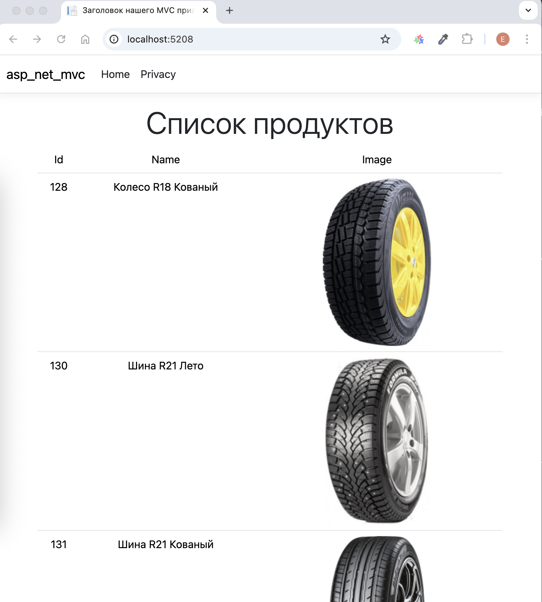
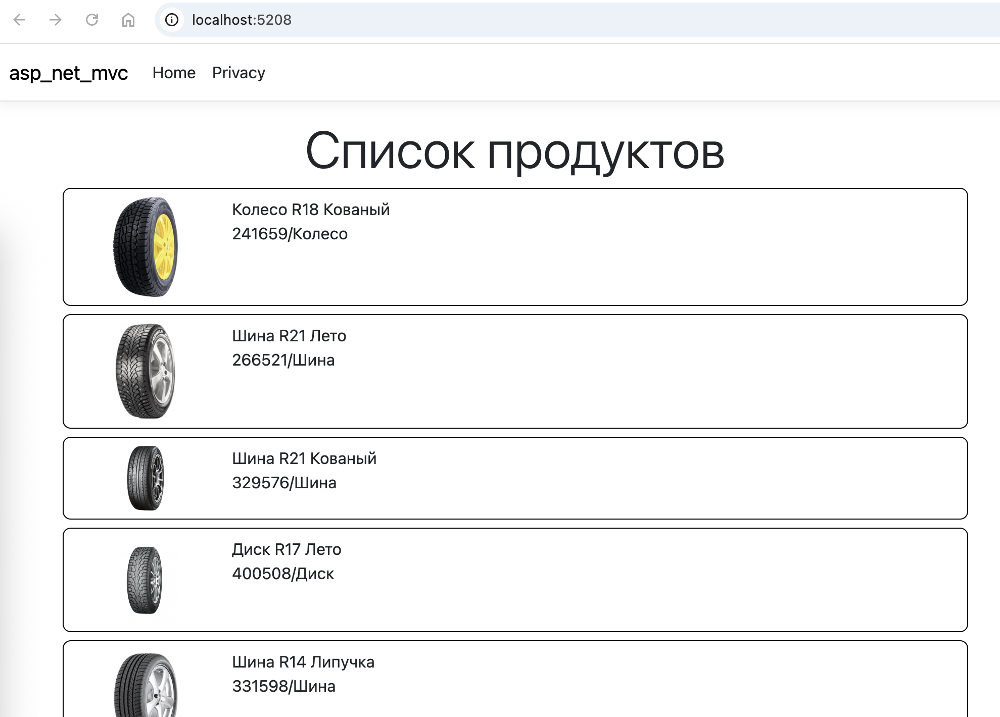

# Модели

## Введение в определение и применение моделей

Одним из ключевых компонентов паттерна MVC являются __модели__. Ключевая задача моделей - описание структуры и логики используемых данных.

Как правило, все используемые сущности в приложении выделяются в отдельные модели, которые и описывают структуру каждой сущности. В зависимости от задач и предметной области мы можем выделить различное количество моделей в приложении.

Все модели оформляются как обычные POCO-классы (plain-old CRL objects), то есть обычные классы на языке C#. Например, если мы работаем с данными пользователей, то мы могли бы определить в проекте следующую модель, которая представляет пользователя:

```cs
public class Person
{
    public int Id { get; set; }
    public string Name { get; set; } = "";
    public int Age { get; set; }
}
```

Модель Person определяет ряд свойств: уникальный идентификатор _Id_, _имя_ и _возраст_ пользователя. Это классическая анемичная модель. Анемичная модель не имеет поведения и хранит только состояние в виде свойств.

В языке C# для представления подобных моделей удобно использовать классы __record__:

```cs
public record class Person(int Id, string Name, int Age);
```

Однако модель необязательно должна состоять только из свойств. Кроме того, она может иметь конструктор, какие-нибудь методы, поля, вообщем предствлять стандартный класс на языке C#. Модели, которые также определяют поведение, в противоположность анемичным моделям называют "толстыми" моделями (Rich Domain Model / Fat Model / Thick Model). Например, мы можем уйти от анемичной модели, добавив к ней какое-нибудь поведение:

```cs
public class Person
{
    public int Id { get; set; }
    public string Name { get; set; }
    public int Age { get; set; }
    public Person(int id, string name, int age)
    {
        Id = id;
        Name = name;    
        Age = age;
    }
    public string PrintInfo() => $"{Id}. {Name} ({Age})";
}
```

В приложении ASP.NET MVC Core модели можно разделить по степени применения на несколько групп:

- Модели, объекты которых хранятся в специальных хранилищах данных (например, в базах данных, файлах xml и т.д.)
- Модели, которые используются для передачи данных представление или наоборот, для получения данных из представления. Такие модели еще называтся моделями представления
- Вспомогательные модели для промежуточных вычислений

Как правило, для хранения моделей создается в проекте отдельная папка `Models`. Модели представления нередко помещаются в отдельную папку, которая нередко называется `ViewModels`. В реальности, это могут быть каталоги с любыми называниями, можно помещать модели хоть в корень проекта, но более распространенным стилем являются названия `Models` и `ViewModels`.

Например, создадим новый проект ASP.NET Core. Добавим в него папку `Models`, в которую добавим новый класс __Person__

```cs
namespace MvcApp.Models
{
    public record class Person(int Id, string Name, int Age);
}
```

Эта модель будет описывать данные, которые мы будем использовать. Эти данные могли бы храниться в базе данных, но для простоты мы определим их в контроллере.

Далее добавим в проект папку ``Controllers``, а в нее новый класс - __HomeController__ со следующим кодом:

```cs
using Microsoft.AspNetCore.Mvc;
using MvcApp.Models; // пространство имен модели Person
 
namespace MvcApp.Controllers
{
    public class HomeController : Controller
    {
        List<Person> people = new List<Person>
        {
            new Person(1, "Tom", 37),
            new Person(2, "Bob", 41),
            new Person(3, "Sam", 28)
        };
        public IActionResult Index()
        {
            return View(people);
        }
    }
}
```

Список объектов модели __Person__ передается в представление с помощью метода _View()_.

И в конце добавим в проект папку `Views`, а в нее - каталог `Home`. Далее в папку `Views/Home` добавим представление `Index.cshtml`, которое будет выводить все объекты:

```cshtml
@using MvcApp.Models
@model IEnumerable<Person>
 
<h2>People</h2>
<table class="table">
    <th>
        <td>Id</td>
        <td>Name</td>
        <td>Age</td>
    </th>
    @foreach (var p in Model)
    {
        <tr>
            <td>@p.Id</td>
            <td>@p.Name</td>
            <td>@p.Age</td>
        </tr>
    }
</table>
```

## Модели представления View Model

В зависимости от сложности проекта можно использовать одну и ту же модель для хранения данных в базе данных, для передачи данных в представление и получения данных из представления. Однако нередко все же модели могут не совпадать. Например, нам не надо передавать в представление все данные определенной модели или надо передать в представление объекты сразу двух моделей. И в этом случае мы можем воспользоваться моделями представления.

Рассмотрим простейший пример работы с моделями. Допустим, в проекте в папке `Model` у нас есть следующие модели __Person__ и __Company__.

```cs
namespace MvcApp.Models
{
    public record class Person(int Id, string Name, int Age, Company Work);
    public record class Company(int Id, string Name, string Country);
}
```

Модель __Person__ представляет пользователей, а модель __Company__ - компанию, где они работают.

И, допустим, нам надо выводить на страницу список пользователей и фильтровать их по компаниям. 

Очевидно, что этих двух моделей - __Person__ и __Company__ для решения поставленной задачи нам недостаточно. И нам надо создать специальную модель для передачи данных в представление или модель представления (иными словами View Model). Для этого вначале добавим в проект новую папку `ViewModels`. В принципе модели представлений не обязательно определять именно в папке `ViewModels`, это может быть любая папка, в том числе и имеющаяся по умолчанию папка `Models`. Далее в каталог `ViewModels` поместим модель __CompanyModel__:

```cs
namespace MvcApp.ViewModels
{
    public record class CompanyModel(int Id, string Name);
}
```

Эта модель упрощает передачу списка компаний в представление.

И также добавим в папку `ViewModels` собственно модель представления, которую назовем __IndexViewModel__:

```cs
using MvcApp.Models; // пространство имен модели Person
 
namespace MvcApp.ViewModels
{
    public class IndexViewModel
    {
        public IEnumerable<Person> People { get; set; } = new List<Person>();
        public IEnumerable<CompanyModel> Companies { get; set; } = new List<CompanyModel>();
    }
}
```

С помощью этой модели мы сможем передать в представление сразу и список компаний, и список пользователей.

Далее в проекте в папке `Controllers` определим следующий контроллер __HomeController__:

```cs
using Microsoft.AspNetCore.Mvc;
using MvcApp.Models; // пространство имен модели Person и Company
using MvcApp.ViewModels;    // пространство имен модели IndexViewModel и CompanyModel
 
namespace MvcApp.Controllers
{
    public class HomeController : Controller
    {
        List<Person> people;
        List<Company> companies;

        public HomeController()
        {
            Company microsoft = new Company(1, "Microsoft", "USA");
            Company google = new Company(2, "Google", "USA");
            Company jetbrains = new Company(3, "JetBrains", "Czech Republic");

            companies = new List<Company> { microsoft, google, jetbrains};
 
            people = new List<Person>
            {
                new Person(1, "Tom", 37, microsoft),
                new Person(2, "Bob", 41, microsoft),
                new Person(3, "Sam", 28, google),
                new Person(4, "Bill", 32, google),
                new Person(5, "Kate", 33, jetbrains),
                new Person(6, "Alex", 25, jetbrains),
            };
        }

        public IActionResult Index(int? companyId)
        {
            // формируем список компаний для передачи в представление
            List<CompanyModel> compModels = companies
                .Select(c => new CompanyModel(c.Id, c.Name))
                .ToList();

            // добавляем на первое место
            compModels.Insert(0, new CompanyModel(0, "Все"));
 
            IndexViewModel viewModel = new() { Companies = compModels, People = people };
 
            // если передан id компании, фильтруем список
            if (companyId != null && companyId > 0)
                viewModel.People = people.Where(p => p.Work.Id == companyId);
 
            return View(viewModel);
        }
    }
}
```

В метод _Index_ передается опциональный параметр `companyId`, который передает идентификатор выбранной компании. Если он не равен `0` и определен, то производим фильтрацию по компаниям.

И в конце определим в проекте в папке `Views/Home` представление `Index.cshtml`, которое будет выводить все объекты:

```cshtml
@using MvcApp.ViewModels
@using MvcApp.Models
@model IndexViewModel
 
<style>
td{padding:5px;}
tr:nth-child(even) {background: #CCC}
tr:nth-child(odd) {background: #FFF}
</style>
 
<form>
    <label>Выберите компанию:</label>
    <select name="companyId" >
        @foreach(CompanyModel comp in Model.Companies)
        {
            <option value="@comp.Id">@comp.Name</option>
        }
    </select>
    <input type="submit" />
</form>
<br />
<table>
    <th>
        <td>Name</td>
        <td>Company</td>
        <td>Age</td>
    </th>
    @foreach (Person p in Model.People)
    {
        <tr>
            <td>@p.Name</td>
            <td>@p.Work.Name</td>
            <td>@p.Age</td>
        </tr>
    }
</table>
```

## Привязка модели

Привязка модели или __Model binding__ представляет механизм сопоставления значений из HTTP-запроса с параметрами метода контроллера. При этом параметры могут представлять как простые типы (int, float и т.д.), так и более сложные типы данных, например, объекты классов.

Чтобы понять смысл привязки, посмотрим на примере. Пусть у нас есть следующий метод:

```cs
public class HomeController : Controller
{
    public string Index(string name) => $"Name: {name}";
}
```

Допустим, на сервер приходит запрос `https://localhost:7288/Home/Index?name=Tom`.

При использовании стандартного маршрута для обслуживания данного запроса будет выбран метод _Index_ контроллера __Home__. Поскольку данный метод принимает параметр с именем `name`, то механизм привязки по этому имени будет искать в среди пришедших данных значение с ключом `name`.

Чтобы найти и сопоставить данные из запроса с параметрами метода используется привязчик модели (model binder), который представляет объект интерфейса __IModelBinder__.

Для поиска значений привязчик модели просматривает следующие источники в порядке приоритета:

- Данные форм. Хранятся в объекте __Request.Form__
- Данные маршрута, то есть те данные, которые формируются в процессе сопоставления строки запроса маршруту. Хранятся в объекте __RouteData.Values__
- Данные строки запроса. Хранятся в объекте __Request.Query__

Причем все эти источники данных представляют словари, в которых по ключу мы можем получить значение.

То есть в нашем случае, когда на сервер придет запрос `https://localhost:7288/Home/Index?name=Tom`, привязчик модели последовательно будет просматривать в поиске значения для параметра name следующие пути:

- Request.Form["name"]
- RouteData.Values["name"]
- Request.Query["name"]

В случае, если параметры метода представляют сложные данные, например, класс, привязчик модели будет действовать подобным образом. Он использует рефлексию и рекурсию для прохода по всем свойствам параметра сложного типа для сопоставления свойств со значениями из запроса. В частности, привязки модели ищет значения с ключами наподобие `[имя_параметра].[имя_свойства]`. Если подобных значений не будет найдено, то привязчик ищет значения просто по имени свойства.

То есть, к примеру, пусть у нас есть следующая модель:

```cs
public record class Person(string Name, int Age, Company? Company);
public record class Company(string Name);
```

И пусть метод принимает в качестве параметра объект данной модели:

```cs
public class HomeController : Controller
{
    public string Index(Person person)
    {
        return $"{person.Name}({person.Age}) - {person.Company?.Name}";
    }
}
```

В этом случае привязчик модели последовательно будет просматривать те же источники в поиске значений для свойств объекта __person__. Например, чтобы найти значение для свойства _Name_, привязчик будет искать значение по следующим ключам:

- Request.Form["person.Name"]
- RouteData.Values["person.Name"]
- Request.Query["person.Name"]

В случае если параметр сам хранит объект сложного типа, как выше класс __Person__ ссылается на класс __Company__, то привязчик с помощью рекурсии спускается на уровень ниже - на уровень класса __Company__ и пытается получить его свойства и найти для них значения.

Для таких типов как коллекции привязчик модели ищет значения с ключами `имя_параметра[index]` или просто по индексу `[index]`. Если параметр представляет объект __Dictionary__, то привязчик модели также ищет в источниках запроса значения с ключами `имя_параметра[ключ]` или просто ищет по ключу: `[ключ]`.

При этом свойства, к которым осуществляется привязка, должны быть объявлены с модификатором __public__ и быть доступными для записи.

Кроме того, если класс не представляет тип __record__, то он должен иметь конструктор без параметров. Поскольку в примере выше применются классы __record__, то конструктор без параметров можно не определять.

Когда значение для параметра метода найдено, привязчик модели прекращает поиск значений для этого параметра и переходит к поиску значений для следующего параметра. Вполне возможна ситуация, когда привязчик не найдет требуемое значение или найденное значение не сможет быть сконвертировано в нужный тип. Если параметр представляет ссылочный тип, свойство _ModelState.IsValid_ в этом случае возвратит `false`. Это будет значить, что привязка завершилась с ошибкой, и полноценно параметры метода мы использовать не сможем.

Однако если же параметр представляет значимый (скалярный) тип (например, __int__), то ему присваивается значение по умолчанию. И даже если ему явным образом не передано значение, то _ModelState.IsValid_ возвратит `true`

## Реализация web-приложения для предметной области "Продукты и материалы"

С разработкой web-приложений мы более менее разобрались, попробуем реализовать вывод продукции по аналогии с WPF приложением.

Скопируйте в web-приложение необходимые классы (__IDataProvider__, __DBDataProvider__, __Product__)

В каталог `wwwroot` скопируйте каталог `product` (с картинками)

В контроллер __HomeController__ добавьте переменную для поставщика данных и ее инициализацию в конструкторе

```cs
private IDataProvider dataProvider;

public HomeController(ILogger<HomeController> logger)
{
    _logger = logger;
    dataProvider = new DBDataProvider();
}
```

В действии _Index_ добавьте получение данных и передачу их в представление

```cs
public IActionResult Index()
{
    var products = dataProvider.getProduct();
    return View(products);
}
```

И реализуйте вывод данных о продукции в представлении (пока просто в таблицу)

```cshtml
@{ViewData["Title"] = "Заголовок нашего MVC приложения";}

@using asp_net_mvc
@model IEnumerable<Product>

<div class="text-center">
    <h1 class="display-4">Список продуктов</h1>

    <table class="table">
        <tr>
            <td>Id</td>
            <td>Name</td>
            <td>Image</td>
        </tr>
        @foreach (var p in Model)
        {
            <tr>
                <td>@p.ID</td>
                <td>@p.Title</td>
                <td></td>
            </tr>
        }
    </table>
</div>
```

Должно получиться примерно такое:



## Попробуем сверстать внешний вид по ТЗ

По-умолчанию в web-приложениях MVC используется __bootstrap__

>Bootstrap — это популярный бесплатный фреймворк для веб-разработки, который предоставляет разработчикам готовые компоненты (HTML, CSS и JavaScript) для быстрого создания адаптивных сайтов.

Для вывода данных воспользуемся [сеткой](https://getbootstrap.su/docs/5.0/layout/grid/)

```cshtml
@{ViewData["Title"] = "Заголовок нашего MVC приложения";}

@using asp_net_mvc
@model IEnumerable<Product>

<div class="text-center">
    <h1 class="display-4">Список продуктов</h1>

    <div class="container ">
        @foreach (var p in Model)
        {
            <!-- для элемента списка задаем CSS-класс product -->
            <div class="row product">
                <div class="col-2">
                    
                </div>
                <div class="col-8 text-start">
                    @p.Title<br />
                    @p.ArticleNumber/@p.ProductTypeTitle<br />
                    @p.MaterialString
                </div>
                <div class="col-2">
                    @p.MaterialCost 
                </div>
            </div>
        }
    </div>
</div>

<style>
.product {
    border: 1px solid black;
    border-radius: 8px;
    padding: 8px;
    margin: 8px;
}
</style>
```



---

## Домашнее задание 

Реализовать веб-приложение с выводом списка продукции