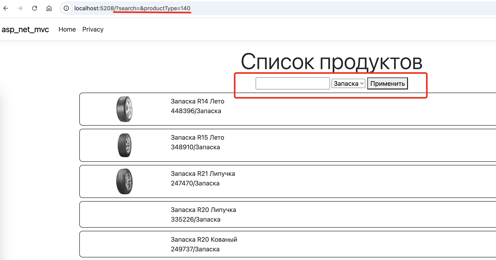

# ASP.NET Core MVC. Формы, фильтрация, поиск

Добавим в наше приложение фильтрацию и поиск (попытаемся повторить функционал WPFприложения).

## Добавление формы

Поля ввода на странице обычно заворачиваются в форму (тег `<form>`) и передаются в контроллер при клике на кнопку с типом `submit`. Можно сделать и автоматическую отправку формы при изменении данных в полях ввода ("живой" ввод), но такой вариант не рекомендую использовать, так как получается повышенная нагрузка на сервер (ведь каждый раз запрашивается страница целиком).

Итак, добавим на страницу со списком продуктов форму с полями:

```cshtml
<h1 class="display-4">Список продуктов</h1>

<div class="row">
    <form method="get">
        <input type="text" name="search" value="@Context.Request.Query["search"]"/>
        <select name="productType">
            @foreach (ProductType pt in @ViewBag.productTypes)
            {
                <option 
                    value="@pt.ID" 
                    selected="@(pt.ID.ToString() == Context.Request.Query["productType"])"
                >
                    @pt.TitleType
                </option>
            }
        </select>
        <button type="submit">Применить</button>
    </form>
</div>

...
```

Должно получиться примерно такое окно:



Что тут происходит?

1. Добавляем форму и задаем метод `GET`

    ```html
    <form method="get">
        ...
    </form>
    ```

    По умолчанию для отправки форм используется метод `POST`, в таком варианте данные формы передаются в теле запроса. Для формирования представления это не принципиально, но если перезагрузить получившееся окно в браузере, то мы потеряем контекст (введенные ранее данные для фильтрации). Используя метод `GET` мы передаем данные в _queryString_ и страница открывается с использованием этой строки и сохранением контекста (я подчеркнул эту строку на скриншоте).

    Еще в форме можно задать атрибут `action`, который задает альтернативный __URL__ для отправки формы, по умолчанию форма отправляется на __URL__ текущей страницы.

1. Добавляем на форму поле ввода для фильтрации по названию

    ```cshtml
    <input 
        type="text" 
        name="search" 
        value="@Context.Request.Query["search"]"/>
    ```

    - `name` - название переменной (ключа в _queryString_)
    - `value` - содержимое поля ввода (при первом запуске оно пустое, но если мы применим фильтрацию, то в содержимое запишется текущее значение фильтра, полученное из _queryString_)
    - __Context__ - про это свойстао было упоминание в лекциях, оно содержит все параметры запроса. Мы в данном случае вытаскиваем значение фильтра

1. Добавляем выпадающий список с типами продукции

    ```cshtml
    <select name="productType">
        @foreach (ProductType pt in @ViewBag.productTypes)
        {
            <option 
                value="@pt.ID" 
                selected="@(pt.ID.ToString() == Context.Request.Query["productType"])"
            >
                @pt.TitleType
            </option>
        }
    </select>
    ```

    - тег `<select>` как раз объявляет выпадающий список, внутри него мы в цикле добавляем `<option>` - элементы выпадающего списка
    - атрибут `selected` устанавливаем `true` для выбранного элемента
    - `ViewBag.productTypes` - типы продукции из БД, заполняем их в контроллере (покажу ниже)

## Доработка модели и поставщика данных

Нам нужно добавить в модель список типов продукции (я делаю пустой проект - у вас, если вы делали все лабы, такая модель уже должна быть) и предусмотреть фильтрацию при получении списка продукции.

### Интерфейс поставщика данных, использованный в этом проекте

```cs
public interface IDataProvider
{
    // В метод получения списка продукции добавил номер страницы для пагинатора
    IEnumerable<Product> getProduct(int pageNum = 1);

    // Объявляем метод получения списка типов продукции
    IEnumerable<ProductType> getProductTypes();

    // Объявляем методы для задания фильтрации
    void setSearchFilter(string? searchString);
    void setProductTypeFilter(string? productTypeFilter);
}
```

### Реализация поставщика данных

Объявляем приватные переменные для хранения значений фильтров и методы для их инициализации:

```cs
private string? searchFilter;
private string? productTypeFilter; 

public void setSearchFilter(string? searchString)
{
    this.searchFilter = searchString;
}

public void setProductTypeFilter(string? productTypeFilter)
{
    this.productTypeFilter = productTypeFilter;
}
```

Реализуем метод для получения списка типов продукции:

```cs
public IEnumerable<ProductType> getProductTypes()
{
    using (MySqlConnection db = new MySqlConnection(connectionString))
    {
        return db.Query<ProductType>("SELECT * FROM ProductType").ToList();
    }
}
```

Переписываем метод получения списка продукции с учетом фильтрации и пагинации:

>Для формирования условий используется пакет `Dapper.SqlBuilder`

```cs
public IEnumerable<Product> getProduct(int pageNum = 1)
{
    using (MySqlConnection db = new MySqlConnection(connectionString))
    {
        var builder = new SqlBuilder();

        // если задан фильтр по названию
        if (!String.IsNullOrEmpty(this.searchFilter))
            // то добавляем условие с LIKE 
            builder.Where(
                "Title LIKE @tt", 
                // обратите внимание как задается шаблон поиска
                new { tt = '%' + this.searchFilter + '%' });

        // если задан фильтр по типу продукции
        if (!String.IsNullOrEmpty(this.productTypeFilter))
            builder.Where(
                "ProductTypeID = @id", 
                new { id = this.productTypeFilter });

        // шаблон запроса с пагинацией
        // (запрос не полный)
        var template = builder.AddTemplate(
            "SELECT p.ID, p.Title, p.ProductTypeID, p.ArticleNumber, p.Image, pt.TitleType AS ProductTypeTitle " +
            "FROM Product p " +
            "JOIN ProductType pt ON p.ProductTypeID=pt.ID " +
            "/**where**/ " +
            "LIMIT @pageLen OFFSET @offset",
            new
            {
                pageLen = 20,
                offset = (pageNum - 1) * 20
            }
        );

        return db.Query<Product>(
            template.RawSql,
            template.Parameters).ToList();
    }
}
```

## Финал

На этом знакомство с разработкой веб-приложений на C# мы закончим. Для дальнейшей работы с классическими веб-приложениями нужно копать __JavaScript__ и __AJAX__-запросы, но мне лень с этим разбираться.

На демо-экзамене вам веб-разработка вообще не понадобится, но если будете учавствовать в чемпионате, то этих основ должно хватить.

--- 

## Домашнее задание

1. Реализовать код из лекции
1. Самостоятельно реализовать сортировку
    - в форму добавить радиокнопки для выбора типа сортировки (по возрастанию или убыванию)
    - предусмотреть в интерфейсе поставщика и реализовать в поставщике метод для сохранения типа сортировки
    - в методе формирования списка продукции в __builder__ добавить сортировку

        Пример был в лекции про [пагинацию](./cs_pagination2.md#сортировка) в WPF

        ```cs
        builder.OrderBy(orderCondition);
        ```
