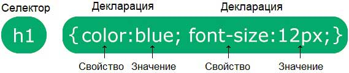
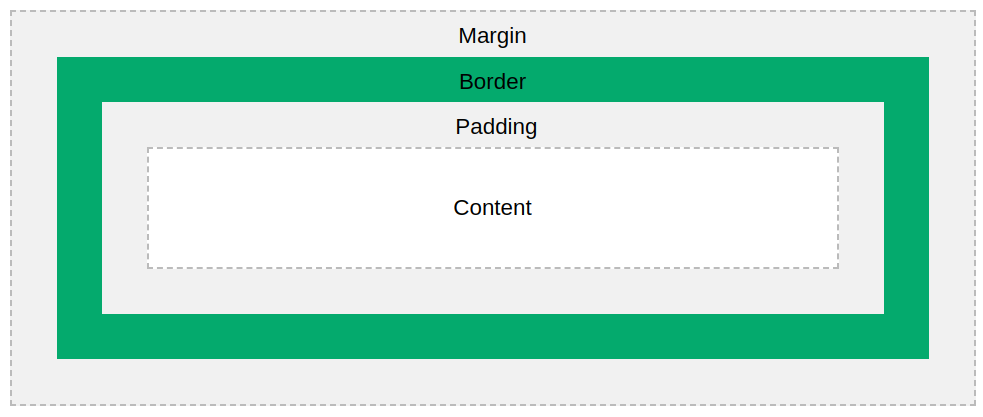

# Введение в CSS

Содрано [отсюда](https://msiter.ru/tutorials/css-nachalnogo-urovnya)

**CSS** (Cascading Styles Sheet) или Каскадные таблицы стилей – это технология, позволяющая определять стили для документов HTML. В связи с тем, что HTML – это содержимое или контент, каскадные стили – это его визуальное представление.

## Для чего используется CSS?

CSS используется для определения визуальных стилей веб-страниц. Сюда входят дизайн элементов, макет или раскладка, а также варианты внешнего вида страницы при отображении на разных устройствах и при разных размерах экрана.

Пример CSS

```css
body {
  position: relative;
  font-family: arial, serif;
}

p {
  padding-top: 10px;
}

h1 {
   font-weight: bolder;
}
```

## CSS решил одну Большую Проблему

HTML изначально НИКОГДА не предназначался для визуального оформления веб-страницы!

HTML создавался для описания содержимого веб-страницы:

```html
<h1>Большой заголовок</h1>
<p>Параграф или абзац.</p>
```

Когда в спецификацию HTML были введены такие теги как `<font>` для определения шрифтов и атрибуты вроде color для определения цвета, веб-разработчики погрузились в сплошной кошмар. Разрабатывать большие проекты, где данные о шрифтах и цветах добавлялись на каждую страницу, стало долго и дорого.

Для решения данной проблемы Консорциум W3C и создал язык CSS.

CSS убрал определение стилей из кода веб-страницы!

Если вы не знакомы с языком HTML, то мы советуем сначала изучить наш Учебник HTML для начинающих.

## CSS значительно экономит время!

Обычно стили хранятся во внешних файлах с расширением `.css`.

Внешние каскадные таблицы стилей позволяют изменить оформление целого сайта внося изменения только в один файл!

## Подключение CSS

Прочитав каскадную таблицу стилей, браузер форматирует HTML документ в соответствии с правилами, заданными в этой таблице стилей.

**Существует три способа подключения CSS к документу HTML**:

* Внутриэлементный или строчный
* Внутридокументный или встроенный
* Внешний

### Внутриэлементные стили

При внутриэлементном или строчном подключении стиля, он задается непосредственно внутри определения HTML тега при помощи атрибута *style*. Атрибут *style* принимает любое CSS свойство. Данный способ используется для подключения уникального стиля к одному отдельно взятому элементу.

Это выглядит следующим образом:

```html
<body>
    <h1 
        style="color:blue;text-align:center;"
    >
        Заголовок
    </h1>
    <p 
        style="color:red;"
    >
        Текст. И еще текст.
    </p>
</body>
```

Однако, как вы, наверное, помните, лучший подход – это когда HTML документ полностью свободен от элементов и атрибутов визуального представления. Разделение содержимого и его визуального представления - это то, ради чего, собственно, и создавался CSS. Поэтому внутриэлементный способ определения стилей следует стараться избегать и использовать только при крайней необходимости.

### Внутридокументные стили

Встроенные или внутридокументые стили используются для определения стилей элементов целой веб-страницы, если эта страница имеет свои уникальные стили. Для этого в теге `<head>` определяется тег `<style>`, в котором задаются все стили для данной веб-страницы.

Такое определение выглядит следующим образом:

```html
<html>
<head>
<title>Пример CSS</title>
<style>
  h1 {
    color: red;
  }

  p {
    color: blue;
  }
</style>
</head>
<body>

<h1>Заголовок</h1>
<p>Текст. И еще текст.</p>

</body>
</html>
```

Это определение сделает все параграфы страницы синими, а все ссылки заголовки первого уровня красными.

Помня о разделении файлов HTML и CSS, внутриэлементные стили также нужно стараться избегать. Хотя иногда подобные стили бывают полезными. Например, для ускорения загрузки страницы.

### Внешние стили

Внешние стили используются для подключения одновременно ко многим страницам сайта. Благодаря этому, изменив всего один файл CSS можно изменить внешний вид всего сайта!

Для определения таблицы стилей в любом текстовом редакторе создается отдельный CSS файл с определениями стилей. Содержимое такого файла может быть, например, таким:

```css
p {
   color: red;
}

a {
   color: blue;
}
```

Если сохранить такой файл под именем `web.css` (расширение должно быть `.css`), то его подключают к HTML документу при помощи тега `<link>`:

```html
<head>
    <title>Пример CSS</title>
    <link rel="stylesheet" href="web.css">
</head>
<body>
    <h1>Заголовок</h1>
    <p>Текст. Еще текст.</p>
</body>
```

Далее вы увидите, что есть еще и другие способы подключения внешних стилей, но в данный момент упомянутых способов будет вполне достаточно.

### Несколько таблиц стилей на одной странице

Если какое-то свойство определяется для одного и того же селектора (элемента) в нескольких разных таблицах стилей, то использоваться будет значение того свойства, которое определяется в последней по подключению таблице стилей.

Допустим, что во внешней таблице стилей определен такой стиль для элемента `<h1>`:

```css
h1 {
  color: navy;
}
```

Теперь допустим, что во внутридокументной таблице стилей также определен стиль для элемента `<h1>`:

```css
h1 {
  color: orange;   
}
```

Если внутридокументная таблица подключается после внешней таблицы стилей, то цвет элемента `<h1>` будет "orange":

```html
<head>
<link rel="stylesheet" type="text/css" href="mystyle.css">
<style>
h1 {
  color: orange;
}
</style>
</head>
```

Однако, если внутридокументная таблица подключается до внешней таблицы стилей, то цвет элемента `<h1>` будет "navy":

```html
<head>
<style>
h1 {
  color: orange;
}
</style>
<link rel="stylesheet" type="text/css" href="mystyle.css">
</head>
```

### Каскадный порядок

А какой стиль будет использоваться, если для HTML элемента задано больше одного стиля?

Все стили на веб-странице будут "каскадно" транслированы в новую "виртуальную" таблицу стилей в следующем порядке (цифра 1 имеет наивысший приоритет):

1. Внутриэлементный стиль (внутри HTML элемента)
1. Внешние и внутридокументные таблицы стилей (в секции head)
1. Стили браузера по умолчанию

Таким образом, у внутриэлементных стилей самый высокий приоритет, и они будут переопределять внешние и внутридокументные стили, а также стили, заданные браузером по умолчанию.

## CSS селекторы, свойства, значения

Каскадная таблица стилей состоит из CSS правил. Каждое CSS правило состоит из селектора и блока декларации.



### Синтаксис CSS селектора

CSS селекторы очень похожи на HTML теги. Селектор указывает на HTML элемент, для которого вы определяете визуальный стиль.

Блок декларации содержит одну или несколько деклараций свойств, разделенных точкой с запятой. Блок деклараций заключают в фигурные скобки.

Каждая декларация состоит из имени свойства и его значения, разделенных двоеточием.

Свойства – это ключевые слова, такие как color, font-weight или background-color, которым присвоены определенные значения:

```css
body {
   font-size: 0.8em;
   color: navy;
}
```

В данном примере создается CSS селектор body, который соотносится с HTML тегом `<body>`. В этом селекторе определяется два свойства – font-size и color, которым присваиваются соответствующие значения. Таким образом, если этот стиль подключить к HTML документу, то текст внутри элемента `<body>` (что на самом деле весь контент в основном окне браузера) будет отображаться шрифтом размером 0.8em и темно-синим цветом.

### Категории CSS селекторов

CSS селекторы можно разделить на пять категорий:

* Простые селекторы (элементы отбираются по имени, идентификатору или классу)
* Комбинированные селекторы (элементы отбираются по специфическим отношениям между ними)
* Селекторы псевдоклассов (элементы отбираются по определенному состоянию)
* Селекторы псевдоэлементов (отбирается и стилизуется часть элемента)
* Селекторы атрибутов (элементы отбираются по атрибутам или значениям атрибутов)

### CSS селектор элемента

Селектор элемента или HTML селектор - это простой селектор, который отбирает HTML элементы по их имени.

В следующем примере отбираются все существующие на странице элементы `<p>`. Их текст будет красного цвета и выровнен по центру:

```css
p {
  text-align: center;
  color: red;
}
```

В данном учебнике основное внимание будет уделяться так называемым HTML селекторам, т.е. обычным именам тегов, которые используются в качестве селекторов стилей для изменения внешнего представления соответствующих HTML элементов.

### CSS селектор идентификатора

Селектор идентификатора для отбора заданного элемента использует атрибут id HTML элемента.

Идентификатор элемента уникален в пределах веб-страницы, таким образом селектор идентификатора используется для выбора одного уникального элемента!

Чтобы определить селектор идентификатора, нужно написать символ решетки (#) и имя идентификатора элемента.

В следующем примере определяются стили для HTML элемента с идентификатором `id="para1"`:

```css
#para1 {
  text-align: center;
  color: red;
}
```

Внимание! Имя идентификатора не может начинаться с цифры!

### CSS селектор класса

Селектор класса для отбора заданного элемента использует атрибут *class* HTML элемента.

Чтобы определить селектор класса, нужно написать символ точки (.) и имя класса элемента.

В следующем примере все HTML элементы с классом `class="center"` будут отображать текст красного цвета, который выровнен по центру:

```css
.center {
  text-align: center;
  color: red;
}
```

Так как один и тот же класс может присваиваться нескольким элементам, вы можете указать на какой именно HTML элемент должен влиять селектор класса.

В следующем примере только элементы `<p>` с классом class="center" будут отображать текст красного цвета, который выровнен по центру:

```css
p.center {
  text-align: center;
  color: red;
}
```

Также, HTML элементы могут иметь больше одного класса.

В следующем примере элемент `<p>` будет принимать стили, соответствующие селекторам класса `class="center"` и `class="large"`:

```css
<style>
p.center {
  text-align: center;
  color: red;
}

p.large {
  font-size: 300%;
}
</style>
```

```html
<p class="center large">Этот параграф определен по двум классам.</p>
```

>Внимание! Имя класса не может начинаться с цифры!

### Универсальный селектор

Универсальный селектор (*) отбирает абсолютно все HTML элементы на странице.

Следующее CSS правило окажет воздействие на каждый HTML элемент на странице:

```css
* {
  text-align: center;
  color: red;
}
```

### Группирование селекторов

Группирование селекторов позволяет объединить одно и то же определение стиля для нескольких HTML элементов в одну декларацию.

Посмотрите на следующий код CSS (для элементов h1, h2 и p заданы одинаковые стили):

```css
h1 {
  text-align: center;
  color: red;
}

h2 {
  text-align: center;
  color: red;
}

p {
  text-align: center;
  color: red;
}
```

Чтобы уменьшить количество кода, мы можем сгруппировать эти селекторы в одну декларацию.

Чтобы сгруппировать селекторы, нужно в головной части перечислить их через запятую.

В следующем примере мы группируем селекторы из предыдущего примера:

```css
h1, h2, p {
  text-align: center;
  color: red;
}
```

### Селекторы классов и идентификаторов

Ранее мы уже рассматривали HTML селекторы, которые представляют теги HTML. Однако кроме этого есть возможность также определять селекторы классов и идентификаторов. Преимущества подобных селекторов состоит в том, что можно иметь одни и те же элементы HTML, но применять к ним разные стили в зависимости от их класса или идентификатора.

CSS селектор класса определяется при помощи произвольного имени, перед которым ставится точка (.), а селектор идентификатора - при помощи произвольного имени, перед которым ставится символ решетки (#).

Таким образом, декларация CSS может выглядеть следующим образом:

```css
#top {
   background-color: #ccc;
   padding: 1em
}

.intro {
   color: red;
   font-weight: bold;
}
```

HTML элементы связываются с такими селекторами CSS при помощи атрибутов class и id. Выглядит это следующим образом:

```html
<div id="top">
   <h1>Шоколадное карри</h1>
   <p class="intro">Это мой рецепт карри из одного шоколада</p>
   <p class="intro">Ммм мм ммммм</p>
</div>
```

Разница между идентификатором и классом состоит в том, что идентификатор может присваиваться только одному элементу, а класс – скольким угодно элементам.

Также можно определять селектор CSS для конкретного элемента HTML поместив перед именем класса HTML селектор, так p.jam { что-нибудь } определит стиль для элементов параграфов, у которых класс "jam".

## Единицы измерения

В CSS cуществуют разные единицы измерения длины, специфичные для конкретных свойств CSS, однако некоторые из них универсальны и могут использоваться со многими свойствами, такими как width, margin, padding, font-size и др., поэтому с ними стоит познакомиться поближе.

Длина - это числовое значение с указанием единицы измерения, например, 10px, 2em.

Пример
Определим различные значения длины, используя единицы измерения px (пиксели):

```css
h1 {
  font-size: 60px;
}

p {
  font-size: 25px;
  line-height: 50px;
}
```

Пробелы между числовым значением и символами единиц измерения не допустимы. Если значение равно нулю, то нет необходимости указывать единицы измерения. Например, если вы хотите полностью убрать рамку вкруг элемента, то можно просто определить border: 0;.

Для некоторых свойств CSS допустимо использование отрицательных значений длины.

Существует два типа единиц измерения длины: абсолютные и относительные.

### Абсолютные единицы

Абсолютные единицы являются фиксированными и элементы со значениями длины, заданными в этих единицах, будут всегда иметь указанный размер.

Абсолютные единицы измерения использовать не рекомендуется, так как размеры экранов устройств очень сильно различаются. Тем не менее, если размеры устройства вывода известны заранее, то данные значения длины вполне допустимы.

Единицы<br/>измерения | Описание
:----------------:|---------
cm | сантиметры
mm | миллиметры
in | дюймы (1in = 96px = 2.54cm)
px | пиксели (1px = 1/96 от 1in)
pt | пункты (1pt = 1/72 от 1in)
pc | пики (1pc = 12 pt)

Пиксели (px) являются относительными единицами измерения по отношению к устройству вывода. Для устройств с низким разрешением 1px равен одному пикселю вывода (точка) на дисплей. Для принтеров и экранов с большим разрешением 1px соотносится с несколькими пикселями-точками вывода.

### Относительные единицы

Относительные единицы определяют значения длины, которые динамически соотносятся с другими свойствами измерения длины. Относительные единицы измерения гораздо лучше масштабируются на разных устройствах вывода.

Единицы<br/>измерения | Описание
:--------------------:|----------
em | Значение относительно размера шрифта элемента (2em означает, что размер в 2 раза больше размера текущего шрифта)
ex | Значение относительно высоты текущего шрифта (используется редко)
ch | Значение относительно ширины символа "0" (ноль)
rem | Значение относительно размера шрифта корневого элемента
vw | Эквивалентно 1% от ширины окна просмотра
vh | Эквивалентно 1% от высоты окна просмотра
vmin | Эквивалентно 1% от меньшего размера ширины или высоты окна просмотра
vmax | Эквивалентно 1% от большего размера ширины или высоты окна просмотра
% | Значение относительно родительского элемента

Единицы em и rem хорошо подходят для создания отлично масштабируемого макета веб-страницы.

Окно просмотра - это фактически окно браузера. Если окно просмотра в ширину 50cm, то 1vw = 0.5cm.

Веб-страница не должна быть статичной и абсолютно усредненной. Она должна быть гибкой. Это означает, что пользователь должен иметь возможность смотреть ее, как ему заблагорассудится, что особенно касается размеров шрифтов и экрана.

В связи с этим считается, что гораздо более правильно использовать em, rem или % в качестве единиц измерения размеров шрифтов (и может быть даже высоты и ширины), чем px, которые означают неизменяемый размер текста в большинстве браузеров и должны использоваться достаточно редко (например, для определения размера рамок элементов).

## Как использовать цвета

CSS позволяет использовать почти 16.777.216 цветов. Они могут быть представлены либо предопределенным именем, либо функциональным значением RGB, RGBA, HSL, HSLA, либо шестнадцатеричным кодом (HEX).

### Предопределенные имена цветов

В CSS цвет можно определить при помощи предопределенного имени цвета:

* Tomato
* Orange
* DodgerBlue
* MediumSeaGreen
* Gray
* SlateBlue
* Violet
* LightGray

CSS/HTML поддерживает 140 стандартных имен цвета. Плюс еще один – transparent, который обозначает прозрачный цвет.

### CSS свойство background-color. Фоновый цвет элемента

<h1 style="background-color: dodgerblue;">Привет всем</h1>

<p style="background-color: tomato;">Разнообразный и богатый...</p>

Чтобы определить фоновый цвет HTML элемента, используется CSS свойство background-color со значением цвета:

```html
<h1 style="background-color: dodgerblue;">Привет всем</h1>
<p style="background-color: tomato;">Разнообразный и богатый...</p>
```

### CSS свойство color. Цвет текста элемента

Чтобы определить цвет текста HTML элемента, используется CSS свойство color со значением цвета:

```html
<h1 style="color: tomato;">Привет всем</h1>
<p style="color: dodgerblue;">Разнообразный и богатый...</p>
<p style="color: mediumseagreen;">Господа, высокотехнологичная...</p>
```

Следующим образом можно определить синий фон и желтый текст:

```css
h1 {
   color: yellow;
   background-color: blue;
}
```

Цвета в этом случае могут выглядеть немного грубовато, поэтому можно изменить их следующим образом:

```css
body {
   font-size: 0.8em;
   color: navy;
}

h1 {
   color: #ffc;
   background-color: #009;
}
```

Сохраните данный код в созданном ранее файле CSS и обновите веб-страницу в окне браузера. Цвет первого заголовка (элемент `<h1>`) изменится на синий.

Свойства color и background-color могут использоваться с большинством элементов HTML, включая тег `<body>`, что позволяет задавать цвета для всей веб-страницы и любой ее части.

### Цветовые значения в CSS

В CSS цвета также можно определять при помощи RGB/RGBA значений, HSL/HSLA значений, а также шестнадцатеричных или HEX значений.

То же самое, что и цвет с именем "Tomato":

```
rgb(255, 99, 71)
#ff6347
hsl(9, 100%, 64%)
```

То же самое, что и цвет с именем "Tomato", но на 50% прозрачнее:

```
rgba(255, 99, 71, 0.5)
hsla(9, 100%, 64%, 0.5)
```

Пример:

```html
<h1 style="background-color: rgb(255, 99, 71);">...</h1>
<h1 style="background-color: #ff6347;">...</h1>
<h1 style="background-color: hsl(9, 100%, 64%);">...</h1>

<h1 style="background-color: rgba(255, 99, 71, 0.5);">...</h1>
<h1 style="background-color: hsla(9, 100%, 64%, 0.5);">...</h1>
```

## RGB цвета

Цветовое значение RGB представляют смешение составных цветов - КРАСНЫЙ (R), ЗЕЛЕНЫЙ (G), СИНИЙ (B).

### RGB значения

Для определения цветового значения RGB используется CSS функция:

```css
rgb(red, green, blue)
```

Каждый параметр этой функции (red, green и blue) определяет уровень интенсивности соответствующего составного цвета (красный, зеленый и синий), который выражается числом в диапазоне 0-255. Также этот уровень можно определять в процентах.

Например, rgb(255, 0, 0) отображается как красный цвет, потому что уровень красного здесь установлен в максимальное значение (255), а уровень остальных составных цветов установлен на 0.

Чтобы получить черный цвет, установите все цветовые параметры на 0 - rgb(0, 0, 0).

Чтобы получить белый цвет, установите все цветовые параметры на 255 - rgb(255, 255, 255).

### RGBA значения

Цветовые значения RGBA это расширение цветовых значений RGB. К ним добавляется альфа-канал, который определяет прозрачность для цвета.

Для определения цветового значения RGBA используется CSS функция:

rgba(red, green, blue, alpha)

Для параметра alpha используется число от 0.0 (полная прозрачность) до 1.0 (полная непрозрачность).

### HEX (Шестнадцатеричные) цвета

Шестнадцатеричный код основывается на шестнадцатеричной системе исчисления, в которой кроме цифр от 0 до 9 (привычным нам по десятеричной системе исчисления) также используются латинские буквы от A до F.

Перед шестнадцатеричным кодом ставится символ решетки (#), и он может состоять либо из трех, либо из шести цифр. Обычно запись из трех цифр является сокращенным вариантом записи из шести цифр (#f00 = #ff0000, #c96 = #cc9966 и т.д.). Запись из трех цифр легче расшифровать, однако шестицифровая запись предоставляет больший контроль над цветовым значением.

В CSS цвет можно задавать при помощи шестнадцатеричных значений в форме:

`#rrggbb`

Где rr (красный), gg (зеленый) и bb (синий) представляют шестнадцатеричное значение уровня интенсивности составного цвета в диапазоне от 00 до ff (что в десятичной системе будет соответствовать диапазону 0-255).

Например, #ff0000 отображается как красный цвет, потому что уровень красного здесь установлен в максимальное значение (ff), а уровень остальных составных цветов установлен в минимальное значение (00).

Чтобы получить черный цвет, установите все цветовые параметры в 00 - #000000.

Чтобы получить белый цвет, установите все цветовые параметры в ff - #ffffff.

## Отступы и поля

Чтобы различные элементы визуально отделялись друг от друга, у них есть особые параметры - отступы и поля. CSS предоставляет полный контроль над этими параметрами.

### CSS отступы

Отступы - это промежуток снаружи элемента за пределами любых установленных рамок.

В CSS есть свойства, позволяющие определять отступ для каждой стороны элемента:

* margin-top
* margin-right
* margin-bottom
* margin-left

Все свойства отступов могут принимать следующие значения:

* auto - значение отступа вычисляет браузер
* ширина - значение в единицах измерения длины (px, pt, cm и т.д.)
* % - значение в процентах от ширины содержащего элемента
* inherit - указывает на то, что значение должно наследоваться от родительского элемента

Также, можно использовать отрицательные значения.

В следующем примере установим отступы для всех четырех сторон элемента `<p>`:

```css
p {
  margin-top: 100px;
  margin-bottom: 100px;
  margin-right: 150px;
  margin-left: 80px;
}
```

### margin - Краткая форма записи

Чтобы уменьшить код, все свойства определения отступов можно объединить в одно свойство.

CSS свойство margin является короткой формой записи следующих свойств определения отступов:

* margin-top
* margin-right
* margin-bottom
* margin-left

Это работает так:

Если у свойства margin определено четыре значения:

margin: 25px 50px 75px 100px;

* верхний отступ 25px
* правый отступ 50px
* нижний отступ 75px
* левый отступ 100px

```css
p {
  margin: 25px 50px 75px 100px;
}
```

Если у свойства margin определено три значения:

```
margin: 25px 50px 75px;
```

* верхний отступ 25px
* правый и левый отступы 50px
* нижний отступ 75px

```css
p {
  margin: 25px 50px 75px;
}
```

Если у свойства margin определено два значения:

```
margin: 25px 50px;
```

* верхний и нижний отступы 25px
* правый и левый отступы 50px

```css
p {
  margin: 25px 50px;
}
```

Если у свойства margin определено одно значение:

```
margin: 25px;
```

все четыре отступа 25px

```css
p {
  margin: 25px;
}
```

### Значение auto

Чтобы горизонтально центрировать элемент внутри его контейнера, можно для свойства margin задать значение auto.

В этом случае элемент займет заданную ширину, а оставшееся пространство будет поровну поделено между левым и правым отступами.

```css
div {
  width: 300px;
  margin: auto;
  border: 1px solid red;
}
```

### Значение inherit

В следующем примере значение левого отступа элемента `<p class="ex1">` наследуется от родительского элемента (`<div>`):

```css
div {
  border: 1px solid red;
  margin-left: 100px;
}

p.ex1 {
  margin-left: inherit;
}
```

## CSS поля

Поля - это промежуток вокруг содержимого элемента внутри любых установленных рамок.

У этого элемента есть поля в 70px.
В CSS есть свойства, позволяющие определять поле для каждой стороны элемента:

* padding-top
* padding-right
* padding-bottom
* padding-left

Все свойства полей могут принимать следующие значения:

* ширина - значение в единицах измерения длины (px, pt, cm и т.д.)
* % - значение в процентах от ширины содержащего элемента
* inherit - указывает на то, что значение должно наследоваться от родительского элемента

Внимание! Отрицательные значения не допустимы.

В следующем примере установим поля для всех четырех сторон элемента <div>:

```css
div {
  padding-top: 50px;
  padding-right: 30px;
  padding-bottom: 50px;
  padding-left: 80px;
}
```

## Ширина полей и элемента

CSS свойство width определяет ширину области с содержимым элемента. Область с содержимым - это пространство внутри полей, рамок и отступов элемента (блочная модель).

Таким образом, если у элемента задана ширина, то поля будут добавляться к общей ширине элемента. Это часто приводит к нежелательным результатам.

В следующем примере для элемента `<div>` устанавливается ширина в 300px. Однако реальная ширина элемента `<div>` будет 350px (300px + 25px левого поля + 25px правого поля):

```css
div {
  width: 300px;
  padding: 25px;
}
```

Чтобы ширина была 300px без учета полей, можно использовать свойство `box-sizing`. Это будет определять реальную ширину элемента - если ширина полей будет увеличиваться, доступное пространство содержимого будет уменьшаться.

```css
div {
  width: 300px;
  padding: 25px;
  box-sizing: border-box;
}
```

В своем файле таблиц стилей измените код CSS для тега `<h2>` следующим образом:

```css
h2 {
   font-size: 1.5em;
   background-color: #ccc;
   margin: 1em;
   padding: 3em;
}
```

Вы увидите, что заголовки второго уровня отодвинутся от соседних элементов. В данном примере используется краткая форма записи свойств отступов и полей.

### Все CSS свойства определения отступов и полей

Свойство | Описание
:-------:|--------
margin | Короткое свойство, определяющее размер всех отступов элемента за одну декларацию
margin-bottom | Определяет размер нижнего отступа элемента
margin-left | Определяет размер левого отступа элемента
margin-right | Определяет размер правого отступа элемента
margin-top | Определяет размер верхнего отступа элемента
padding | Короткое свойство, определяющее размер всех полей элемента за одну декларацию
padding-bottom | Определяет размер нижнего поля элемента
padding-left | Определяет размер левого поля элемента
padding-right | Определяет размер правого поля элемента
padding-top | Определяет размер верхнего поля элемента

## Рамки элементов

CSS свойства управления рамкой позволяют определять стиль, ширину и цвет рамки HTML элемента.

Рамки можно определять для большинства элементов внутри тела веб-страницы.

### CSS свойство border-style

Свойство border-style определяет стиль рамки.

Допустимо использовать следующие значения:

* dotted - Рамка состоит из точек
* dashed - Рамка состоит из черточек
* solid - Сплошная линия
* double - Двойная сплошная линия
* groove - 3D рамка, представляющая прорезанный желоб. Эффект зависит от * значения свойства border-color
* ridge - 3D рамка, представляющая оттиснутую борозду. Эффект зависит от значения свойства border-color
* inset - 3D рамка, представляющая вдавленное углубление. Эффект зависит от значения свойства border-color
* outset - 3D рамка, представляющая выставленное возвышение. Эффект зависит от значения свойства border-color
* none - Без рамки
* hidden - Скрытая рамка

Свойство border-style может принимать от одного до четырех значений (для верхней, правой, нижней, левой рамок).

Пример

Определение различных стилей рамки:

```css
p.dotted {border-style: dotted;}
p.dashed {border-style: dashed;}
p.solid {border-style: solid;}
p.double {border-style: double;}
p.groove {border-style: groove;}
p.ridge {border-style: ridge;}
p.inset {border-style: inset;}
p.outset {border-style: outset;}
p.none {border-style: none;}
p.hidden {border-style: hidden;}
p.mix {border-style: dotted dashed solid double;}
```

>Внимание! НИКАКОЕ другое свойство управления рамками не будет работать пока не будет определено свойство border-style.

### CSS свойство border-width

Свойство border-width определяет толщину рамки для всех четырех сторон элемента.

Толщина может задаваться в единицах измерения (px, pt, cm, em, и т. д.), либо при помощи предопределенных ключевых слов: thin, medium, thick.

В следующем примере определяется различная толщина рамок:

```css
p.one {
  border-style: solid;
  border-width: 5px;
}

p.two {
  border-style: solid;
  border-width: medium;
}

p.three {
  border-style: dotted;
  border-width: 2px;
}

p.four {
  border-style: dotted;
  border-width: thick;
}
```

### Индивидуальная толщина рамки для каждой стороны элемента

Свойство border-width может принимать от одного до четырех значений (для верхней, правой, нижней и левой рамки).

```css
p.one {
  border-style: solid;
  border-width: 5px 20px; /* 5px верхняя и нижняя рамки, 20px по сторонам */
}

p.two {
  border-style: solid;
  border-width: 20px 5px; /* 20px верхняя и нижняя рамки, 5px по сторонам */
}

p.three {
  border-style: solid;
  border-width: 25px 10px 4px 35px; /* 25px верхняя, 10px правая, 4px нижняя, 35px левая */
}
```

### CSS свойство border-color

Свойство border-color используется для определения цвета четырех рамок элемента.

Цвет можно задать как

* имя цвета - например, "red",
* HEX значение - например, "#ff0000",
* RGB значение - например, "rgb(255,0,0)",
* HSL значение - например, "hsl(0,100%,50%)",
* transparent.

Подробнее о цветах рассказывается в главе нашего учебника Как использовать цвета.

Если свойство border-color не определяется, то оно наследует цвет элемента.

В следующем примере определяется различный цвет рамок:

```css
p.one {
  border-style: solid;
  border-color: red;
}

p.two {
  border-style: solid;
  border-color: green;
}

p.three {
  border-style: dotted;
  border-color: blue;
}
```

### Индивидуальный цвет рамки для каждой стороны элемента

Свойство border-color может принимать от одного до четырех значений (для верхней, правой, нижней и левой рамки).

```css
p.one {
  border-style: solid;
  border-color: red green blue yellow; /* red - верх, green - справа, blue - низ, yellow - слева */
}
```

### Определение рамки для каждой стороны индивидуально

Из приведенных ранее примеров вы видели, что можно определять разные рамки индивидуально для каждой стороны элемента.

В CSS также есть свойства, позволяющие определять индивидуально каждую рамку для конкретной стороны элемента.

Пример:

```css
p {
  border-top-style: dotted;
  border-right-style: solid;
  border-bottom-style: dotted;
  border-left-style: solid;
}
```

### CSS свойство border. Короткая форма записи

Как вы могли заметить, для определения рамок элемента приходится иметь дело с довольно большим набором CSS свойств.

Чтобы уменьшить размер кода, существует возможность все эти многочисленные свойства объединить в одном CSS свойстве.

Свойство border является короткой формой записи, объединяющей воедино следующие свойства:

* border-width
* border-style (обязательно)
* border-color

Пример:

```css
p {
  border: 5px solid red;
}
```

Также, можно определять все значения рамки для отдельной стороны элемента.

Рамка слева:

```css
p {
  border-left: 6px solid red;
}
```

### CSS свойство border-radius

Свойство border-radius используется, чтобы добавить скругленные углы у рамки вокруг HTML элемента.

Пример:

```css
p {
  border: 2px solid red;
  border-radius: 5px;
}
```

### Все CSS свойства определения рамки

Свойство | Описание
:-------:|-----------
border | Короткое свойство, определяющее все атрибуты рамки HTML элемента за одну декларацию
border-bottom | Определяет все атрибуты нижней рамки HTML элемента за одну декларацию
border-bottom-color | Определяет цвет нижней рамки HTML элемента
border-bottom-style | Определяет стиль нижней рамки HTML элемента
border-bottom-width | Определяет толщину нижней рамки HTML элемента
border-color | Определяет цвет всех четырех сторон рамки HTML элемента
border-left | Определяет все атрибуты левой рамки HTML элемента за одну декларацию
border-left-color | Определяет цвет левой рамки HTML элемента
border-left-style | Определяет стиль левой рамки HTML элемента
border-left-width | Определяет толщину левой рамки HTML элемента
border-radius | Определяет радиус скругления углов рамки
border-right | Определяет все атрибуты правой рамки HTML элемента за одну декларацию
border-right-color | Определяет цвет правой стороны рамки HTML элемента
border-right-style | Определяет стиль правой рамки HTML элемента
border-right-width | Определяет толщину правой рамки HTML элемента
border-style | Определяет стиль всей рамки вокруг элемента
border-top | Определяет все атрибуты верхней рамки HTML элемента за одну декларацию
border-top-color | Определяет цвет верхней рамки HTML элемента
border-top-style | Определяет стиль верхней рамки HTML элемента
border-top-width | Определяет толщину верхней рамки HTML элемента
border-width | Определяет толщину всех четырех сторон рамки HTML элемента

## Высота и ширина

CSS свойства height и width используются, чтобы устанавливать высоту и ширину HTML элемента.

CSS свойство max-width позволяет установить максимальную высоту HTML элемента.

### Определение высоты и ширины

Свойства height и width позволяют определить высоту и ширину HTML элемента.

Свойства height и width не учитывают поля, рамки или отступы элемента. Они устанавливают высоту/ширину области содержимого внутри полей, рамок и отступов элемента.

Свойства height и width могут принимать следующие значения:

* auto - Значение по умолчанию. Высоту и ширину вычисляет браузер
* ширина - Значение в единицах измерения длины (px, pt, cm и т.д.)
* % - Значение в процентах от содержащего блока
* initial - Устанавливает высоту/ширину в значение по умолчанию
* inherit - Значение будет наследоваться от родительского элемента

Примеры

Установим высоту и ширину элемента `<div>`:

```css
div {
  height: 200px;
  width: 50%;
  background-color: powderblue;
}
```

Установим высоту и ширину другого элемента `<div>`:

```css
div {
  height: 100px;
  width: 500px;
  background-color: powderblue;
}
```

>Внимание! Помните, что свойства height и width не включают поля, рамки или отступы элемента! Они устанавливают высоту/ширину области содержимого внутри полей, рамок и отступов элемента!

### Определение максимальной ширины

Свойство max-width позволяет определять максимальную ширину элемента.

Допустимые значения max-width

* ширина - значение в единицах измерения длины (px, pt, cm и т.д.)
* % - значение в процентах от содержащего блока
* none - значение по умолчанию, которое означает, что максимальная ширина не установлена.

Проблема с элементом `<div>` из предыдущего примера возникает тогда, когда ширина окна браузера становится меньше, чем ширина элемента (500px). В этом случае браузер добавит горизонтальную полосу прокрутки.

Если же в этом случае вместо width использовать свойство max-width, то ситуация улучшиться.

>Внимание ! Если вы по каким-либо причинам с одним и тем же элементом используете и свойство width и свойство max-width, и при этом значение width больше значения max-width, то использоваться будет свойство max-width (свойство width будет игнорироваться).

Пример

```css
div {
  max-width: 500px;
  height: 100px;
  background-color: powderblue;
}
```

Все CSS свойства определения размеров

Свойство | Описание
:-------:|------------
height | Определяет высоту элемента
max-height | Определяет максимальную высоту элемента
max-width | Определяет максимальную ширину элемента
min-height | Определяет минимальную высоту элемента
min-width | Определяет минимальную ширину элемента
width | Определяет ширину элемента

## Блоковая модель

Все HTML элементы могут считаться блоками.

### Блоковая модель CSS

В CSS термин "блоковая модель" используется, когда речь заходит о дизайне и разметке веб-страницы.

По своей сути блоковая модель CSS это блоки, в которые оборачивается каждый HTML элемент. Поля, отступы, рамки и сам контент все это части блоковой модели CSS. Блоковая модель работает следующим образом: в центре располагается область содержимого (скажем, изображение), вокруг нее находится промежуток (поле), затем идет рамка и, наконец, еще один промежуток (отступ). Визуально это можно изобразить так:



Различные части на графике это

* Content - Содержимое блока, где отображается текст, изображения и т.д.
* Padding - Поля. Пустое пространство вокруг содержимого. Поля прозрачны
* Border - Рамка. Идет вокруг полей и содержимого
* Margin - Отступы. Пустое пространство за пределами рамки. Отступы прозрачны

Блоковая модель позволяет добавлять рамку вокруг элемента и определять пространство между элементами.

Пример использования блоковой модели:

```css
div {
  width: 300px;
  border: 15px solid green;
  padding: 50px;
  margin: 20px;
}
```

### Ширина и высота элемента

Чтобы правильно установить ширину и высоту HTML элемента, необходимо знать, как работает блоковая модель.

>ВАЖНО! Когда вы определяете CSS свойства width и height, вы в действительности устанавливаете ширину и высоту только области содержимого. Чтобы вычислить полный размер элемента, вы должны добавить также размер полей, рамки и отступов.

В следующем примере полная ширина элемента `<div>` будет 350px:

```css
div {
  width: 320px;
  padding: 10px;
  border: 5px solid gray;
  margin: 0;
}
```

Вот как это считается:

```
320px (ширина width)
+ 20px (левое + правое поле padding)
+ 10px (левая + правая рамка border)
+ 0px (левый + правый отступ margin)
= 350px
```

Полная ширина элемента рассчитывается следующим образом:

Полная ширина = ширина + левое поле + правое поле + левая рамка + правая рамка + левый отступ + правый отступ

Полная высота элемента рассчитывается следующим образом:

Полная высота = высота + верхнее поле + нижнее поле + верхняя рамка + нижняя рамка + верхний отступ + нижний отступ

От вас вовсе не требуется использовать все части блоковой модели, но стоит помнить, что эта модель применяется абсолютно ко всем HTML элементам веб-страницы, и это очень мощная вещь.

https://msiter.ru/tutorials/css-nachalnogo-urovnya/izmenenie-svoistv-teksta