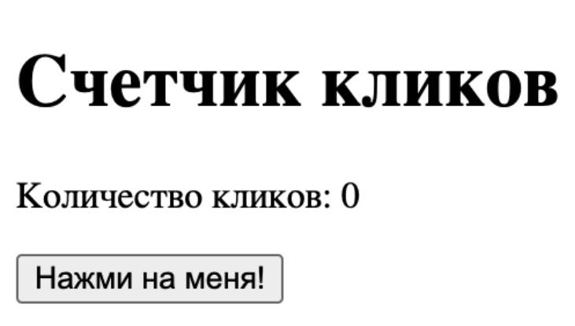
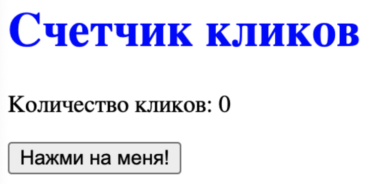
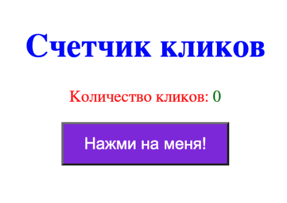
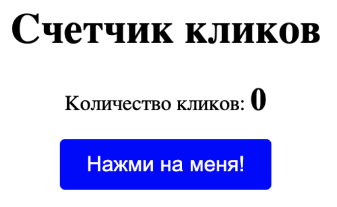
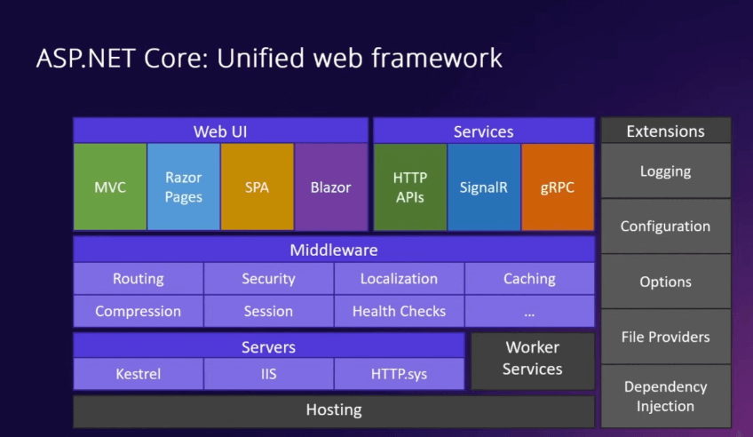
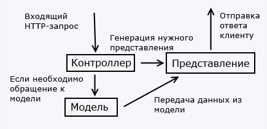

# Введение в веб-разработку: что это и зачем нужно

>Взято [отсюда](https://sky.pro/wiki/html/vvedenie-v-veb-razrabotku-chto-eto-i-zachem-nuzhno/)

## Что такое веб-разработка?

Веб-разработка — это процесс создания и поддержания веб-сайтов и веб-приложений. Она включает в себя различные аспекты, такие как веб-дизайн, веб-программирование, управление базами данных и многое другое. Веб-разработка делится на две основные категории: фронтенд и бэкенд разработка. Эти две области тесно связаны, но выполняют разные функции. Важно понимать, что веб-разработка — это не просто написание кода, но и работа над улучшением пользовательского опыта, оптимизацией производительности и обеспечением безопасности веб-приложений.

## Основные компоненты веб-разработки

Веб-разработка состоит из нескольких ключевых компонентов, которые работают вместе для создания функционального и привлекательного веб-сайта:

- __Веб-дизайн__: создание визуального интерфейса сайта. Это включает в себя выбор цветовой схемы, типографики, макета и других визуальных элементов, которые делают сайт привлекательным и удобным для пользователей.
- __Веб-программирование__: написание кода для реализации функционала сайта. Это может включать в себя как фронтенд, так и бэкенд программирование, в зависимости от задач.
- __Управление базами данных__: хранение и управление данными, которые используются на сайте. Это важный аспект, особенно для сайтов, которые работают с большим объемом данных, таких как интернет-магазины или социальные сети.
- __Тестирование и отладка__: проверка сайта на наличие ошибок и их исправление. Тестирование может быть ручным или автоматизированным и включает в себя проверку функциональности, производительности и безопасности.
- __SEO (поисковая оптимизация)__: улучшение видимости сайта в поисковых системах. Это включает в себя оптимизацию контента, структуры сайта и технических аспектов, чтобы сайт был легко найден пользователями через поисковые системы.

## Фронтенд-разработка: что это и зачем нужно

Фронтенд-разработка отвечает за внешний вид и интерактивность веб-сайта. Это та часть сайта, которую видит и с которой взаимодействует пользователь. Основные технологии, используемые во фронтенд-разработке, включают __HTML__, __CSS__ и __JavaScript__. Фронтенд-разработка также включает в себя работу с различными библиотеками и фреймворками, такими как __React__, __Angular__ и __Vue.js__, которые помогают упростить и ускорить процесс разработки.

### Основные задачи фронтенд-разработчика

- __Создание пользовательского интерфейса (UI)__: разработка визуальных элементов сайта, таких как кнопки, формы и меню. Это включает в себя не только создание отдельных элементов, но и их гармоничное сочетание для создания удобного и интуитивно понятного интерфейса.
- __Обеспечение адаптивности__: создание сайтов, которые корректно отображаются на различных устройствах и экранах. Адаптивный дизайн позволяет пользователям комфортно пользоваться сайтом как на десктопах, так и на мобильных устройствах.
- __Интерактивность__: добавление динамических элементов, таких как анимации и всплывающие окна. Это делает сайт более живым и интересным для пользователей, улучшая их опыт взаимодействия с сайтом.

### Примеры технологий и инструментов

- __HTML (HyperText Markup Language)__: основа любого веб-сайта, используется для создания структуры страниц. HTML позволяет создавать заголовки, абзацы, списки, таблицы и другие элементы, которые составляют контент страницы.
- __CSS (Cascading Style Sheets)__: отвечает за стилизацию элементов HTML, таких как цвета, шрифты и макеты. CSS позволяет изменять внешний вид элементов, делая сайт более привлекательным и удобным для пользователей.
- __JavaScript__: язык программирования, который добавляет интерактивность и динамическое поведение на сайт. JavaScript позволяет создавать сложные анимации, обрабатывать события пользователя и взаимодействовать с сервером без перезагрузки страницы.

😉 Пример: Когда вы нажимаете на кнопку "Отправить" на форме обратной связи, это действие обрабатывается с помощью JavaScript. JavaScript может проверить введенные данные на наличие ошибок, отправить их на сервер и показать пользователю сообщение об успешной отправке.

## Бэкенд-разработка: что это и зачем нужно

Бэкенд-разработка отвечает за серверную часть веб-сайта, которая включает в себя серверы, базы данных и приложения. Бэкенд обеспечивает функциональность сайта, обрабатывая запросы от клиента и отправляя обратно нужные данные. Бэкенд-разработка также включает в себя работу с различными фреймворками и библиотеками, такими как __Django__, __Ruby on Rails__ и __Express.js__, которые помогают упростить и ускорить процесс разработки.

### Основные задачи бэкенд-разработчика

- __Управление базами данных__: создание, чтение, обновление и удаление данных. Это включает в себя работу с различными типами баз данных, такими как реляционные (MySQL, PostgreSQL) и нереляционные (MongoDB).
- __Обработка запросов__: получение запросов от клиента и отправка ответов. Это может включать в себя обработку форм, выполнение бизнес-логики и генерацию динамического контента.
- __Аутентификация и авторизация__: управление доступом пользователей к различным частям сайта. Это включает в себя проверку учетных данных пользователей, управление сессиями и обеспечение безопасности данных.

### Примеры технологий и инструментов

- __Серверные языки программирования__: такие как __PHP__, __Python__, __Ruby__, __Java__ и __Node.js__. Эти языки позволяют создавать серверные приложения, которые обрабатывают запросы от клиентов и взаимодействуют с базами данных.
- __Базы данных__: __MySQL__, __PostgreSQL__, __MongoDB__ и другие. Базы данных используются для хранения и управления данными, которые используются на сайте.
- __Фреймворки__: __Django__, __Ruby on Rails__, __Express.js__ и другие. Фреймворки помогают упростить и ускорить процесс разработки, предоставляя готовые решения для типичных задач.

😉 Пример: Когда вы входите в свой аккаунт на сайте, ваши данные проверяются на сервере, и если они верны, вам предоставляется доступ к вашему профилю. Сервер обрабатывает запрос, проверяет учетные данные в базе данных и отправляет ответ обратно на фронтенд.

## Различия между фронтенд и бэкенд разработкой

Хотя фронтенд и бэкенд разработка тесно связаны, они выполняют разные функции и требуют различных навыков. Понимание этих различий поможет вам лучше ориентироваться в мире веб-разработки и выбрать направление, которое вам ближе.

### Основные различия

- __Фокус работы__: Фронтенд-разработка сосредоточена на пользовательском интерфейсе, в то время как бэкенд-разработка занимается серверной частью. Фронтенд-разработчики работают над тем, что видит и с чем взаимодействует пользователь, а бэкенд-разработчики обеспечивают функциональность и обработку данных.
- __Технологии__: Фронтенд использует __HTML__, __CSS__ и __JavaScript__, а бэкенд — серверные языки программирования и базы данных. Фронтенд-разработчики также могут использовать различные библиотеки и фреймворки, такие как React, Angular и Vue.js, а бэкенд-разработчики — Django, Ruby on Rails и Express.js.
- __Взаимодействие с пользователем__: Фронтенд-разработчики работают над тем, что видит и с чем взаимодействует пользователь, а бэкенд-разработчики обеспечивают функциональность и обработку данных. Фронтенд-разработка включает в себя создание визуальных элементов и добавление интерактивности, а бэкенд-разработка — работу с базами данных, обработку запросов и управление доступом пользователей.

### Примеры взаимодействия

- __Фронтенд__: Когда пользователь заполняет форму на сайте, фронтенд отвечает за отображение формы и валидацию данных на стороне клиента. Это может включать в себя проверку правильности введенных данных, отображение сообщений об ошибках и отправку данных на сервер.
- __Бэкенд__: После отправки формы, данные отправляются на сервер, где бэкенд обрабатывает их, сохраняет в базу данных и отправляет ответ обратно на фронтенд. Это может включать в себя выполнение бизнес-логики, взаимодействие с базой данных и генерацию динамического контента.

😉 Пример: Представьте себе интернет-магазин. Фронтенд отвечает за отображение товаров, корзины и оформления заказа, а бэкенд — за обработку заказов, управление запасами и обработку платежей. Когда пользователь добавляет товар в корзину, фронтенд обновляет интерфейс, а бэкенд сохраняет информацию о заказе в базе данных и проверяет наличие товара на складе.

Таким образом, фронтенд и бэкенд разработка работают вместе, чтобы создать полноценный и функциональный веб-сайт. Понимание различий между ними поможет вам лучше ориентироваться в мире веб-разработки и выбрать направление, которое вам ближе. Независимо от того, выберете ли вы фронтенд или бэкенд, важно помнить, что обе эти области требуют постоянного обучения и совершенствования навыков, чтобы оставаться в курсе последних тенденций и технологий.

## Фулстек-разработка

В больших компаниях за разработку фронтенда и бэкенда отвечают разные специалисты. Но в стартапах часто нет возможности нанимать много сотрудников, поэтому задачи бэкендера и фронтендера может выполнять один человек — фулстек-разработчик.

## [Основные языки фронтенда](https://purpleschool.ru/blog/HTML_CSS_JS)

HTML, CSS и JavaScript - это основные языки, используемые в веб-разработке. Начинающим может быть сложно понять, что именно делают эти языки и как они работают вместе. В данной статье мы не будем погружаться в детали работы или использования каждого из трех основных языков программирования, а рассмотрим только основные аспекты и объясним их вклад в создание интерактивных веб-сайтов на примере написания простой страницы со счетчиком кликов.

### HTML: структура страницы.

Каждый раз заходя на любой сайт вы видите веб-страницу, которая состоит из блоков текста, картинок, кнопок и других элементов. Все эти элементы называются разметкой и описываются с помощью языка HTML (HyperText Markup Language) эта аббревиатура переводится как “язык гипертекстовой разметки”. Он представляет собой набор тегов, которые объявляют и описывают каждый элемент на странице. Браузеры интерпретируют HTML-код и отображают его в виде веб-страницы. Теги могут содержать в себе другие теги, формируя таким образом структуру страницы. Тег `<html>` является контейнером, который заключает в себе все содержимое веб-страницы. Внутри него находятся еще два обязательных тега: `<head>`, который содержит метаданные страницы (описание, название, ссылки на стили CSS, скрипты и др), которые не отображаются на самой странице и `<body>` в котором описывается видимое содержимое страницы. Создадим новый файл с названием `index.html`, после чего заполним его базовыми тегами. Код “пустой” страницы выглядит так:

```
<!DOCTYPE html>//тип документа
<html lang="en">//открывающий тег страницы и указание языка
  <head>//открывающий тег head
    <meta charset="UTF-8" />//кодировка символов
    <meta name="viewport" content="width=device-width, initial-scale=1.0" />
    //описание видимой части старницы 
    <title>My document</title>//название страницы, отображаемое во вкладке браузера
  </head>//закрывающий тег head
  <body>//открывающий тег body
    //здесь будет видимое содержимое
  </body>//закрывающий тег body
</html>//закрывающий тег страницы
```

Сейчас наша страница пуста и что бы ее наполнить, познакомимся с несколькими HTML-тегами:

- `<div>` - универсальный блочный контейнер, который используется для группировки и структурирования других элементов на веб-странице.
- `<h1>` - заголовок верхнего уровня на веб-странице. Он обычно используется для наиболее важных заголовков и имеет наибольший размер шрифта среди всех доступных уровней заголовков (от `<h1>` до `<h6>`).
- `<p>` - используется для отображения отдельного параграфа текста на веб-странице. Он представляет блок текста, который обычно разделен на абзацы.
- `<button>` - представляет кнопку, которая может быть нажата пользователем для выполнения определенного действия на веб-странице.

```html
<body>
  <div>
    <h1>Счетчик кликов</h1>
    <p>Количество кликов: <span>0</span></p>
    <button>Нажми на меня!</button>
  </div>
</body>
```

Открыв нашу страничку в браузере мы увидем результат:



Наши теги расположились на странице в том порядке, в котором мы из указали в разметке, что видно по тексту, который мы поместили внутрь тегов. Текст внутри тега `<h1>` имеет больший шрифт, чем тот, что находится в `<p>` или `<span>`, наша кнопка нажимается и все это работает автоматически благодаря HTML. Каркас нашей страницы готов и следующим шагом мы сделаем ее более красивой.

### CSS: стилизация элементов страницы

Cascading Style Sheets (каскадные таблицы стилей) - это язык стилей, используемый для определения внешнего вида и оформления элементов на веб-страницах. С помощью CSS можно изменять стили текста, цвета, размеры, расположение элементов, а также добавлять анимацию и эффекты перехода.

Стили можно описать прямо внутри тега, добавив атрибут __style__ с нужным значением: `<h1 style="color: blue">Счетчик кликов</h1>`

Такой способ стилизации называется inline (инлайн) стилями потому что они описываются в строке с тегом. В данном примере мы указали для тега `<h1>` синий цвет текста и перейдя на нашу страницу мы увидем что цвет изменился только у него.



Прописывать стили внутри тегов не очень удобно потому что они могут повторяться несколько раз на одной странице и для переиспользования CSCS кода существуют правила и селекторы для применения стилей к нескольким элементам HTML. Сегодня мы познакомимся с тремя из этих селекторов:

- По тегу - выбирают элемент по названию тега.
- По классу - выбирают элемент по значению, указанному атрибуте __class__ внутри тега.
- По идентификатору - выбирают элемент по значению, указанному атрибуте __id__ внутри тега.

Селекторы можно комбинировать что бы обратиться к конкретному элементу.

Стили с селекторами можно описать прямо внутри HTML разметки в теге `<style>` или в отдельном файле с расширением css, после чего этот файл необходимо подключить внутри тега `<head>` страницы. На примере ниже мы опишем стили внутри разметки:

```html
<body>
    <div class="container">//добавляем нашему div класс "container"
        <h1 style="color: blue">Счетчик кликов</h1>//инлайн стили
        <p>Количество кликов: <span>0</span></p>
        <button id="button">//добавляем кнопке id "button"
            Нажми на меня!
        </button>
    </div>
    <style>//внутри этого тега можно описать стили
        p {                  //селектор по тегу
            color: red;      //задаем красный цвет внутри тега <p>
        }
        .container {         //селектор по классу
            text-align: center; //задаем расположение текста посередине контейнера
            margin-top: 100px;  //и отступ от верхнего края страницы в 100 пикселей
        }
        #button{             //селектор по идентификатору
            background-color: blueviolet;
            color: #fff;     //здесь мы задаем цвет текста с помощью кодировки, не словом
            font-size: 16px; //задаем размер шрифта
            padding: 10px 20px; //и внутренние отступы внутри кнопки
        }
        p span {            //комбинация селекторов
            color: green; 
        }
    </style>
</body>
```

В результате в браузере наша страничка изменит внешний вид:



На примере выше можно отследить как изменились стили элементов страницы, но теперь она выглядит не очень эстетично поэтому удалим стили из разметки и перепишем их в отдельном css файле.

```css
/* styles.css */
.container {
  text-align: center;
  margin-top: 100px;
}

p span {
  font-size: 24px;
  font-weight: bold; //задаем жирный шрифт для счетчика
}

#clickButton {
  font-size: 16px;
  padding: 10px 20px;
  background-color: blue;
  color: #fff;
  border: none; //убираем рамку у кнопки
  border-radius: 4px; //добавляем скругление краев кнопки
  cursor: pointer; //при наведении на кнопку изменится курсор
}
```

И подключим этот файл к нашей странице:

```html
<head>
  <meta charset="UTF-8" />
  <meta name="viewport" content="width=device-width, initial-scale=1.0" />
  <link rel="stylesheet" href="styles.css" /> //подключаем файл со стилями к странице
  <title>My document</title>
</head>
```

В итоге наша страница стала выглядеть намного лучше!



### JavaScript: добавляем интерактивность

HTML, как и CSS не являются языками программирования в полной мере. Они имеют множество признаков языков программирования, но оба крайне узконаправлены и не подойдут для других целей, кроме тех что описаны в их названии. JavaScript, в свою очередь является полноценным языком программирования и может использоваться практических во всех сферах разработки. Его отличительной особенностью является то, что он может исполняться прямо внутри браузера и получать доступ к элементам страницы. В этом разделе мы не будем описывать базовые концепции JavaScript, а просто продемонстрируем его работу в связке с HTML и CSS.

Для начала создадим файл `script.js` и подключим его к нашей странице с помощью тега `<script>`. Код на JavaScript так же можно полностью описать внутри этого тега.

```html
<body>
  <div class="container">
    <h1>Счетчик кликов</h1>
    <p>Количество кликов: <span>0</span></p>
    <button id="clickButton">Нажми на меня!</button>
  </div>
  <script src="./script.js"></script>//прописываем тег и указываем а атрибуте src путь до файла
</body>
```

Теперь перейдем к написанию кода на JavaScript, который оживит нашу страницу и при нажатии на кнопку наш счетчик начнет увеличиваться.

```js
// задаем начальное значение счетчика
let counter = 0; 

// получаем доступ к элементам по их идентификатору:
const clickButton = document.getElementById("clickButton"); // доступ к кнопке
const counterDisplay = document.getElementById("counter"); // доступ к span со счетчиком

// добавляем слушатель, который отработает при нажатии кнопки
clickButton.addEventListener("click", function () {
  counter++; //увеличиваем значение счетчсика на 1 при каждом нажатии
  counterDisplay.textContent = counter; //передаем это значение в наш span
});
```

Теперь при нажатии на кнопку количество кликов будет расти. Не переживайте, если будучи незнакомым с JavaScript не смогли понять что происходит в коде. Как я уже писал выше, это полноценный язык программирования и на его изучение потребуется время. Данный пример просто демонстрация совместной работы HTML, CSS и JavaScript.

Веб-разработка требует знания и умения использовать HTML, CSS и JavaScript. HTML используется для структурирования и разметки содержимого, CSS - для стилизации и оформления, а JavaScript - для добавления интерактивности и функциональности. Узнав основы каждого языка и их взаимодействие, вы будете готовы создавать красивые и функциональные веб-сайты.

## Введение в ASP.NET Core

### Что такое ASP.NET Core

ASP.NET Core представляет технологию для создания веб-приложений на платформе .NET.

### Архитектура и модели разработки

Текущую архитектуру платформы ASP.NET Core можно выразить следующим образом:



На самом верхнем уровне располагаются различные модели взаимодействия с пользователем. Это технологии построения пользовательского интерфейса и обработки ввода пользователя, как __MVC__, __Razor Pages__, __SPA__ (Single Page Application - одностраничные приложения с использованием Angular, React, Vue) и __Blazor__. Кроме того, это сервисы в виде встроенных HTTP API, библиотеки SignalR или сервисов GRPC.

Все эти технологии базируются и/или взаимодействуют с чистым ASP.NET Core, который представлен прежде всего различными встроенными компонентами __middleware__ - компонентами, которые применяются для обработки запроса. Кроме того, технологии высшего уровня также взаимодействуют с различными расширениями, которые не являются непосредственной частью ASP.NET Core, как расширения для логгирования, конфигурации и т.д.

И на самом нижнем уровне приложение ASP.NET Core работает в рамках некоторого веб-сервера, например, Kestrel, IIS, библиотеки HTTP.sys.

Это вкратце архитектура платформы, теперь рассмотрим моделей разработки приложения ASP.NET Core:

- Прежде всего это __базовый__ ASP.NET Core, который поддерживает все основные моменты, необходимые для работы соввременного веб-приложения: маршрутизация, конфигурация, логгирования, возможность работы с различными системами баз данных и т.д.. В ASP.NET Core 6 в фреймворк был добавлен так называемый __Minimal API__ - минимизированная упрощенная модель, который еще упростила процесс разработки и написания кода приложения. Все остальные модели разработки работаю поверх базового функционала ASP.NET Core
- ASP.NET Core __MVC__ представляет в общем виде построения приложения вокруг трех основных компонентов - __Model__ (модели), __View__ (представления) и __Controller__ (контроллеры), где модели отвечают за работу с данными, контроллеры представляют логику обработки запросов, а представления определяют визуальную составляющую.

    

- __Razor Pages__ представляет модель, при котором за обаботку запроса отвечают специальные сущности - страницы Razor Pages. Каждую отдельную такую сущность можно ассоциировать с отдельной веб-страницей.
- ASP.NET Core __Web API__ представляет реализацию паттерна REST, при котором для каждого типа http-запроса (GET, POST, PUT, DELETE) предназначен отдельный ресурс. Подобные ресурсы определяются в виде методов контроллера Web API. Данная модель особенно подходит для одностраничных приложений, но не только.
- __Blazor__ представляет фреймворк, который позволяет создавать интерактивные приложения как на стороне сервера, так и на стороне клиента и позволяет задействовать на уровне браузера низкоуровневый код WebAssembly.

### Особенности платформы

- ASP.NET Core работает поверх платформы .NET и, таким образом, позволяет задействовать весь ее функционал.
- В качестве языков разработки применяются языки программирования, поддерживаемые платформой .NET. Официально встроенная поддержка для проектов ASP.NET Core есть у языков C# и F#
- ASP.NET Core представляет кросс-платформенный фреймворк, приложения на котором могут быть развернуты на всех основных популярных операционных системах: Windows, Mac OS, Linux. И таким образом, с помощью ASP.NET Core мы можем как создавать кросс-платформенные приложения на Windows, на Linux и Mac OS, так и запускать на этих ОС.
- Благодаря модульности фреймворка все необходимые компоненты веб-приложения могут загружаться как отдельные модули через пакетный менеджер Nuget.
- Поддержка работы с большинством распространенных систем баз данных: MS SQL Server, MySQL, Postgres, MongoDB
- ASP.NET Core характеризуется расширяемостью. Фреймворк построен из набора относительно независимых компонентов. И мы можем либо использовать встроенную реализацию этих компонентов, либо расширить их с помощью механизма наследования, либо вовсе создать и применять свои компоненты со своим функционалом.
- Богатый инструментарий для разработки приложений. В качестве инструментария разработки мы можем использовать такую среду разработки с богатым функционалом, как Visual Studio от компании Microsoft.

  Кроме того, имеющаяся оснастка .NET CLI позволяет создавать и запускать проекты ASP.NET в консоли. И таким образом, для написания кода можно использовать обычных текстовый редактор, например, Visual Studio Code.
