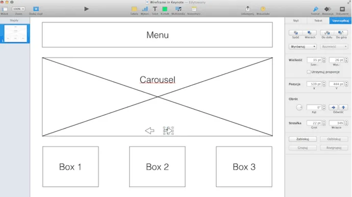
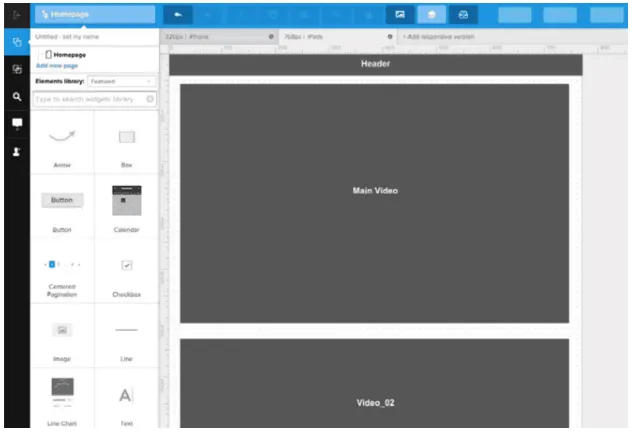
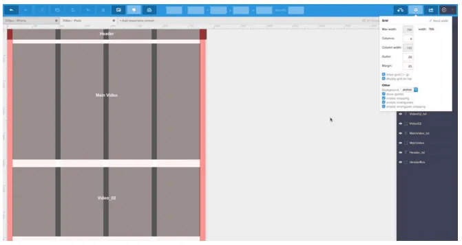
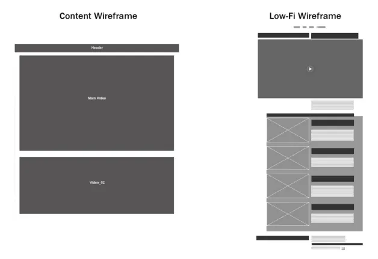
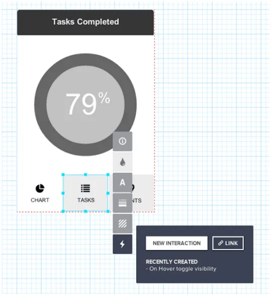
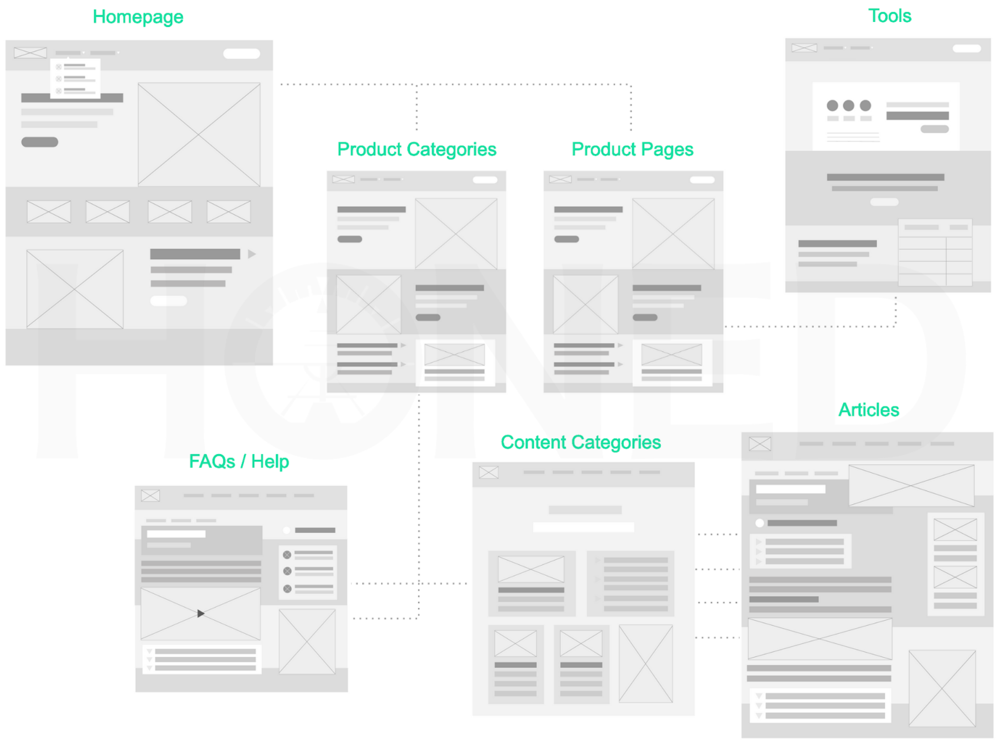
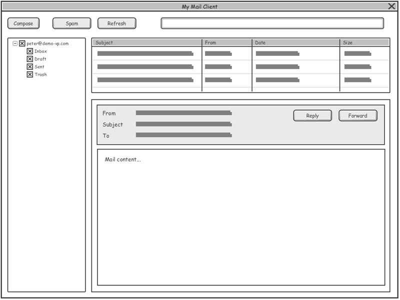

# Прототипы экранов и окон пользовательского интерфейса (wireframe)

<!-- https://www.internet-technologies.ru/articles/kak-sozdat-poleznyy-wireframe.html -->

Wireframe? Что это такое?  **Wireframe** - это основа структурированного цифрового проекта, один из самых ранних и наиболее важных этапов проектирования.

<!-- * Что дает wireframe?
* Создание wireframe
* Процесс разработки wireframe
    * Инвентаризация контента
    * Визуальная иерархия
    * Wireframe контента
    * Детальный wireframe
    * Простейший прототип -->

## Что дает wireframe?

Wireframe использует заполнители, такие как поля с метками, для представления контента, который будет добавлен позже.

Дизайнеры используют wireframe из-за следующих преимуществ:

* **Структурированный дизайн**. Вы знаете, где все будет размещаться, еще до перехода к конкретным техническим деталям.
* **Создание основы на раннем этапе**. Меню навигация и макет определяют, как будет разрабатываться остальная часть проекта. Если есть проблема, лучше выявить ее в начале, а не на этапе детализированного прототипа.
* **Дизайн сфокусирован на контенте**.
* **Больше возможностей для креатива и экспериментов**. Wireframe легко создавать. Поэтому вы можете экспериментировать, не затрачивая много времени и усилий.

**Wireframe** - это скелет дизайна.

## Создание wireframe

Wireframe могут быть созданы с помощью редактора изображений, специализированных инструментов или даже нарисованы на бумаге. Рассмотрим преимущества и недостатки каждого метода.

**Бумага** - самая простая форма wireframe. По сути это просто более продвинутый эскиз. Когда вы хотите проанализировать несколько идей, прежде чем выбрать лучшую, можно довольно быстро создать wireframe на бумаге.

Можно использовать программное обеспечение для презентаций, такое как Keynote или Powerpoint. Но при этом усложняется работа над проектом в команде, так как придется отправлять wireframe по электронной почте.

Некоторые дизайнеры предпочитают делать все в графических редакторах, таких как Sketch или Photoshop.

Выбор платформы - это только начало. Рассмотрим весь процесс создания поэтапно.

## Процесс разработки wireframe

Этапы создания:

* Инвентаризация контента.
* Визуальная иерархия.
* Wireframe контента.
* Детальный wireframe.
* Простейший прототип.

Теперь рассмотрим каждый этап более подробно.

### Инвентаризация контента

Сначала нужно создать каталог контента, который представляет собой набор всех публикаций и их организацию.

Каталог контента представляет собой таблицу, в которой перечислены все материалы, которые нужно использовать, разделенные по страницам. Каталог контента помогает разрабатывать контент-ориентированный дизайн и понять, какие элементы являются наиболее важными.

Для создания хорошего каталога контента можно следовать этой последовательности действий:

* Перечислите весь контент с помощью URL-адресов и кратких описаний.
* Организуйте элементы контента сначала по темам.
* Определите каждый элемент контента на подходящую страницу, выписав дубликаты, которые относятся к нескольким страницам.
* Проинспектируйте каталог контента на наличие ненужного материала. Удалите контент, который не нужен.
* Если нужно, назначьте ответственных за определенные разделы или категории материалов.

В дальнейшем мы будем использовать каталог контента для создания визуальной иерархии.

### Визуальная иерархия

Благодаря каталогу контента, включающему в себя все элементы, легче определить, какие из них наиболее важны для каждой страницы.

Теперь необходимо распределить каждый элемент на первичные, вторичные или третичные элементы. Это можно сделать с помощью электронной таблицы.

### Wireframe контента

Определите первую версию wireframe с блоками контента.

Wireframe контента определяет только то, где размещаются данные, а не то, как они будут представлены. Для этого подходят сетки, если используемый вами инструмент поддерживает их.

Когда сначала создаете wireframe для самого маленького экрана, вы можете расставить приоритеты. Альтернативой является одновременное проектирование всех элементов с последующим вычитанием менее важных. Но подобный подход часто приводит к необходимости отката.

После того, как вы разработаете базовый макет, можно начинать добавлять дополнительную информацию.

### Детальный wireframe

Теперь нужно указать, где размещаются отдельные ссылки, иконки и изображения. При этом wireframe должен быть «мягким». Детальный каркас по-прежнему использует заполнители, блоки и неопределенные кнопки.

Не забывайте о потоках пользователей, так как они помогают оптимизировать размещение элементов. На этом этапе можно начать использовать шаблоны сканирования и более точно определить визуальную иерархию.

### Простейший прототип

Мы настоятельно рекомендуем преобразовать wireframe в простейший прототип, чтобы можно было начать тестирование как можно скорее.

С помощью правильной платформы вы легко сможете добавлять интерактивность, иногда даже просто перетаскивая элементы. Несмотря на то, что это базовая интерактивность, на ней можно будет достаточно точно определить проблемы юзабилити. Особенно в макете и навигации. Оптимизация этих областей и является целью wireframe.

Метод быстрого прототипирования позволяет за минимальное время создавать прототипы, тестировать их, а затем использовать полученные результаты в проектировании еще до начала разработки. Это позволяет улучшать дизайн в процессе разработки, вместо того, чтобы тестировать уже готовый продукт.

Используйте простейший прототип, чтобы уточнить основные моменты проекта. Когда это будет сделано, вы сможете перейти к визуальному дизайну.

# Пример интерфейса десктопного приложения разработанного в visual paradigm

