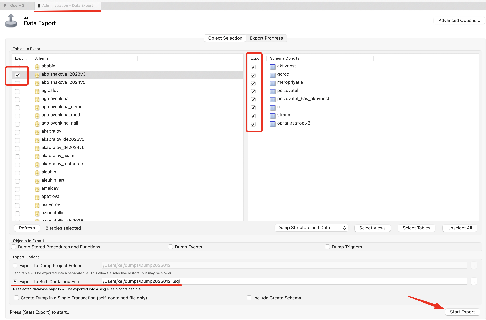
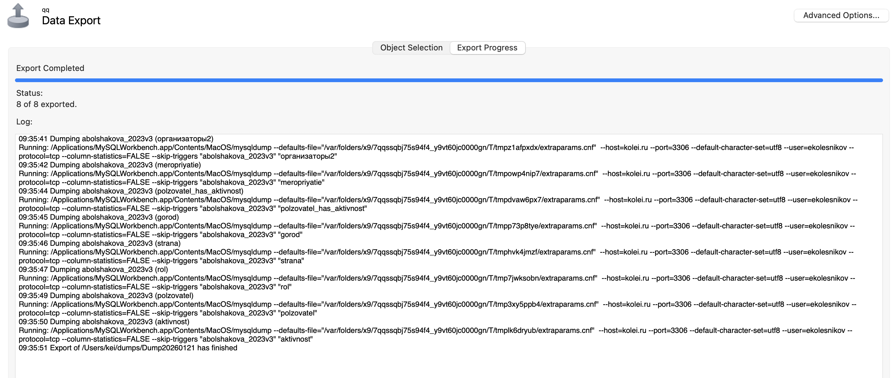

# Экспорт данных (дамп базы данных)

Экспорт данных (его еще называют дамп) можно применять для миграции данных и для резервного копирования. 

Задание по созданию дампа базы данных встречалось и на демо экзамене.

Основным способом создания дампа является использование консольной команды `mysqdump`, но для ее использования нужен доступ к консоли сервера либо экземпляр `mysql` на локальной машине. Нам такой вариант не подходит, так как доступа к консоли сервера у вас нет и на локальных компьютерах `mysql` не установлен.

К счастью __MySQL Workbench__ имеет механизм экспорта

>Я делаю под MacOS, но под Windows все примерно так же

1. Запустите __MySQL Workbench__ и откройте подключение к своей БД

1. В меню выберите _Server - Data Export_, должно открыться окно _Administration - Data Export_

    

    - В левом списке выберите базу данных для экспорта

    - В правом - таблицы

    - В _Export Options_ по умолчанию установлен _экспорт в каталог_ - в этом случае для каждой таблицы будет создан отдельный файл дампа. Лучше выбрать _Export to Self-Contained File_ - в этом случае будет создан один файл, в котором будут все таблицы. Запомните (или поменяйте) каталог в который будет сохранен дамп.

    - Можно установить галочку _Include Create Schema_, чтобы в начало дампа была добавлена команда создания базы данных

    - Жмем _Start Export_

1. Дождитесь окончания завршения дампа (_Export Progress_)

    

    В целевом каталоге появится `*.sql` файл, в котором находятся __DDL__ команды для создания структуры базы и __SQL__ команды __insert__ для восстановления данных. 

Дамп создан, теперь вы его можете сохранить и при необходимости восстановить базу данных на сервере, если вдруг что-то поломаете или переедете на другой сервер.