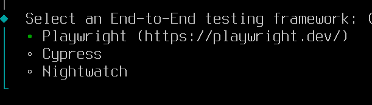

# Тестирование WEB приложений (на примере vue.js)

[Про типы тестирования можно почитать тут](https://ru.vuejs.org/guide/scaling-up/testing.html#testing-types)

На примере простенького web-приложения разберёмся как далать тестирование web-приложений.

* для реализации **модульного** тестирования вынесем расчёт стоимости корзины в отдельную функцию
* для карточки блюда сделаем компонент и реализуем тестирование **компонента** 
* протестируем АПИ (и узнаем что такое **mock**)
* Проверим основной функционал приложения (добавление блюда в корзину и проверка итога корзины) с помощью **end-to-end** тестирования

При создании проекта выбрал **фичи** _vitest_ и _end-to-end_, это библиотеки для тестирования:


Для _end-to-end_ тестирования выбрал библиотеку **Playwright**



Что будет делать приложение:

1. Получать список блюд из АПИ
1. Отображать карточки блюд
1. При клике на кнопку с ценой в карточке блюда добавлять его в корзину, при этом карточка блюда поменяет вёрстку - цена передет в описание, а вместо одной кнопки появится блок с кнопками "-", "+" и количеством блюда в корзине

## unit-тестирование

**Unit** тестирование предназначено для тестирования функций без учёта их взаимодействия с остальным проектом. То есть классический **черный ящик** - знаем что подавать на вход и что должно получиться на выходе

В файле [site/src/helpers/common.js](./site/src/helpers/common.js) реализована функция расчёта суммы корзины:

```js
export function calcItog (cartList) {
  if (Array.isArray(cartList) && cartList.length) {
    return cartList.reduce((total, item) => {
      return total + item.price * item.quantity
    }, 0)
  }
  return 0
}
```

В [./site/src/App.vue](./site/src/App.vue) используем эту функцию для расчёта итога корзины:

```js
const itog = computed(() => {
  return calcItog(cartList.value)
})
```

### Добавим тесты

Названия файлов unit-тестов должны заканчиваться на `.test.js` (для обычного JavaScript) и могут храниться в любом месте проекта, **vitest** находит их автоматически.

**Vitest** для тестов создаёт каталоги `__tests__` в каталогах с тестируемыми файлами, сделаем так же, создадим каталог [`./site/src/helpers/__tests__/`](./site/src/helpers/__tests__/) и в нём файл [`./site/src/helpers/__tests__/common.test.js`](./site/src/helpers/__tests__/common.test.js)

```js
import { describe, expect, test } from 'vitest'
// из файла common.js импортируем функцию calcItog
import { calcItog } from '../common.js'

// создаём тестовые блюда в корзине
const item100_1 = {title:'test', price:100, quantity:1}
const item50_2 = {title:'test', price:50, quantity:2}

// для группировки нескольких связанных тестов используется метод describe
// (использовать его не обязательно)
// В первом параметре пишем что тестируем, во втором лямбда функция с телом теста
describe('Расчет итога корзины', () => {
  // каждый тест завернут в метод test, в котором опять же пишем что делаем
  // и реализуем тест
  test('Вообще не корзина', () => {
    // метод expect получает в параметрах реальное значение
    // т.е. результат тестируемой функции
    // а метод toBe - ожидаемое
    expect(calcItog(null)).toBe(0)
  })

  test('Пустая корзина', () => {
    expect(calcItog([])).toBe(0)
  })

  test('В корзине одно блюдо в одном экземпляре', () => {
    const cart = [item100_1]
    expect(calcItog(cart)).toBe(100)
  })

  test('В корзине одно блюдо в двух экземплярах', () => {
    const cart = [item50_2]
    expect(calcItog(cart)).toBe(100)
  })

  test('В корзине два блюда', () => {
    const cart = [item100_1, item50_2]
    expect(calcItog(cart)).toBe(200)
  })
})
```

## Тестирование компонента

Более сложный вид тестирования - тестирование компонента, когда тестируемый компонент взаимодействует с окружением. Т.е. мы должны симулировать это окружение и взаимодействие с ним

Рассмотрим компонент [`./site/src/components/MenuItem.vue`](./site/src/components/MenuItem.vue)

Примерно так выглядит карточка блюда и корзина


"Салат" у нас уже добавлен в корзину и его вёрстка изменена в соответствии с логикой приложения. "Суп" в исходном варианте вёрстки.

В интеграционных тестах для файлов тестов используется суффикс `.spec.js`, т.к. в них тестируется не результат действия, а поведение.

Cоздадим каталог [`./site/src/components/__tests__/`](./site/src/components/__tests__/) и в нём файл [`./site/src/components/__tests__/MenuItem.spec.js`](./site/src/components/__tests__/MenuItem.spec.js)

```js
 
import { describe, it, expect, beforeEach } from 'vitest'
import { mount } from '@vue/test-utils'
import MenuItemVue from '../MenuItem.vue'
import { MenuItem } from '@/helpers/common'
import { createPinia, setActivePinia } from 'pinia'

describe('MenuItem', () => {
  let wrapper
  
  // перед выполнением каждого теста мы должны создать окружение
  // в нашем случае хранилище и экземпляр компонента
  beforeEach(() => {
    setActivePinia(createPinia())

    // метод mount монтирует компонент с параметрами
    wrapper = mount(MenuItemVue, { 
      props: { item: new MenuItem('test', 100) } 
    })
  })
  
  // в интернетах пишут, что it это просто алиас для test
  it('Элемент меню содержит название', () => {
    // здесь мы получаем текстовое представление компонента (метод text())
    // и ищем в нём название блюда (метод toContain - "содержится")
    // если находит, значит компонент смонтировался нормально
    expect(wrapper.text()).toContain('test')

    // метод test() убирает все теги и показывает только тесктовое содержимое
    // если нужно проанализировать и вёрстку, то можно использовать метод html()
  })

  it('У элемента меню есть кнопка с ценой и при клике на неё цена перезжает в описание', () => {
    // метод find ищет в компоненте элемент или класс (тема css-селекторы)
    // (поэтому полезно тестируемым сущностям задавать отдельные классы)
    // и генерирует на нём событие click
    wrapper.find('.price-button').trigger('click')

    // в название должна переехать цена
    expect(wrapper.text()).toContain('100')
  })

  // модификатор todo создаёт тест, который планируется реализовать в будущем
  it.todo('Тестирование событий', () => {
    // по идее наш компонент реализован не совсем правильно (всё обрабатывает внутри)
    // правильнее было бы события добавления и удаления блюда выбрасывать наружу компонента
    // методами $emit('add-item', item) и $emit('remove-item', item)

    // все события, генерируемые компонентом, собираются в очередь
    // и мы можем просто проверить длину очереди событий
    // expect(wrapper.emitted('add-item')).toHaveLength(1)
  })

  // модификатор skip помечает тест как пропущенный
  it.skip('Элемент меню генерирует событие click', () => {
    // тут я как раз делал более правильный вариант с пробрасыванием 
    // события наружу...

    // компонент обрабатывает клик прямо по внешнему div-у
    // поэтому можем генерировать событие прямо на нём
    wrapper.trigger('click')

    // все события, генерируемые компонентом, собираются в очередь
    // и мы просто проверяем длину очереди событий
    expect(wrapper.emitted('click')).toHaveLength(1)
  })

  // тест, наверное, должен содержать только одну проверку, но мне было лень расписывать несколько отдельных тестов
  it('При клике на кнопку с ценой должен появиться счётчик и кнопки "-" и "+", при клике на кнопку "+" счётчик должен принять значение "2"', async () => {
    // после клика перестраивается DOM, поэтому заворачиваем в await (т.е. дожидаемся, пока не отрисуются все изменения)
    await wrapper.find('.price-button').trigger('click')

    // в компоненте должен появиться счётчик (элемент с классом .qty-value)
    expect(wrapper.find('.qty-value').exists()).toBe(true)

    // кнопка "-"
    expect(wrapper.find('.qty-minus').exists()).toBe(true)

    // и кнопка "+"
    const plusButton = wrapper.find('.qty-plus')
    expect(plusButton.exists()).toBe(true)

    // генерируем клик по кнопке "+" (и тоже ожидаем перестройки DOM)
    await plusButton.trigger('click')

    // после чего в счётчике должно быть ровно "2"
    expect(wrapper.find('.qty-value').text()).toEqual('2')
  })
})
```

## Тестрование АПИ

Из АПИ мы получаем только список блюд, используя метод _getItems_ из файла [`./site/src/stores/items.js`](./site/src/stores/items.js)

```js
async function getItems () {
  if (itemList.value.length == 0) {
    const response = await fetch(`${API_URL}`);
    if (!response.ok) {
      throw new Error('Ошибка при получении списка блюд');
    }
    itemList.value = await response.json()
  }
  return itemList.value
}
```

Напишем тесты для этого метода API в файле [`./site/src/stores/__tests__/items.test.js`](./site/src/stores/__tests__/items.test.js)

Чтобы не слать реальные запросы к апи делаются "заглушки" - методы, которые перехватывают обращение к реальным вызовам функций и возвращают тестовые данные.

>Mock-тестирование — это испытание программы, при котором реальные её компоненты заменяются «дублёрами» — тестовыми объектами.

```js
import { MenuItem } from '@/helpers/common';
import { createPinia, setActivePinia } from 'pinia';
import { beforeEach, describe, expect, test, vi } from 'vitest'
import { useItemsStore, API_URL } from '../items';

// vi - это алиас к VitestUtils
// в следующих 3-х строчках мы ставим заглушку на fetch вызовы
vi.mock('node-fetch')
const mockFetch = vi.fn()

// линтер ругается, что мы переопределяем глобальную функцию (fetch)
// eslint-disable-next-line no-global-assign
fetch = mockFetch

describe('Тестирование АПИ', () => {
  beforeEach(() => {
    setActivePinia(createPinia())
  })

  test('Успешное получение списка блюд', async () => {
    // подгатавливаем фейковый объект
    const mockItems = [new MenuItem('test', 10)]
    const itemStore = useItemsStore()

    // метод mockResolvedValueOnce сработает один раз при первом вызове fetch
    // вместо реального вызова вернутся фейковые данные
    mockFetch.mockResolvedValueOnce({
      ok: true,
      json: () => Promise.resolve(mockItems)
    })

    // делаем штатный запрос к АПИ
    // запрос будет перехвачен и в ответ должны получить фейковые данные
    const items = await itemStore.getItems()

    // сравниваем полученные данные с темы, которые переданы в заглушку
    expect(items).toEqual(mockItems)

    // убеждаемся что запрос был именно на тот endpoint, который ожидался от метода getItems
    expect(mockFetch).toHaveBeenCalledWith(API_URL)
  })

  test('Ошибка при получении списка блюд', async () => {
    // симулируем response.ok == false для следующего запроса
    mockFetch.mockResolvedValueOnce({ ok: false })
    const itemStore = useItemsStore()
  
    // при ошибке получения данных метод должен сгенерировать исключение
    // которое мы и ожидаем получить
    await expect(itemStore.getItems()).rejects.toThrow('Ошибка при получении списка блюд')
  })
})
```

## e2e тестирование

E2e тесты лежат в каталоге [`./site/e2e/`](./site/e2e/)

Перед запуском тестов нужно настроить используемые браузеры в настройках [`./site/playwright.config.js`](./site/playwright.config.js)

Я отключил в секции **projects** браузеры _firefox_ и _webkit_ (нам для учебных целей хватит и одного)


## Полезные ссылки

* [С Vitest ваше тестирование в Vite станет легким и эффективным](https://proglib.io/p/s-vitest-vashe-testirovanie-stanet-legkim-i-effektivnym-v-vite-2024-09-23)