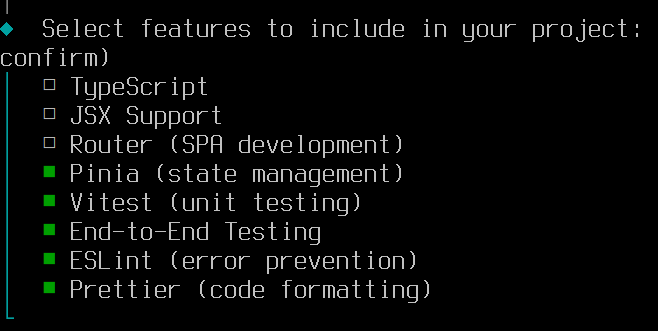
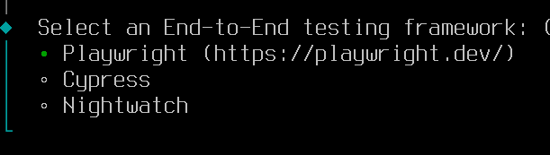

# Тестирование web-приложений (часть 1: модульное тестирование)

## [Типы тестирования​](https://ru.vuejs.org/guide/scaling-up/testing.html#testing-types)

При разработке стратегии тестирования приложения Vue следует использовать следующие типы тестирования:

* **Модульные** (unit): Проверяет, что входные данные данной функции, класса или composable дают ожидаемый результат или побочные эффекты.
* **Компонентные**: Проверяет, что ваш компонент монтируется, отображается, с ним можно взаимодействовать и он ведет себя так, как ожидается. Эти тесты содержат больше кода, чем модульные тесты, более сложны и требуют больше времени для выполнения.
* **End-to-end**: Проверяет функции, которые охватывают несколько страниц и выполняют реальные сетевые запросы, на примере вашего собранного приложения Vue. Такие тесты часто включают в себя работу с базой данных или другим бэкендом.

Каждый тип тестирования играет определенную роль в стратегии тестирования вашего приложения, и каждый из них защищает вас от различных типов проблем.

## Модульное тестирование
​
Модульные тесты пишутся для проверки того, что небольшие изолированные части кода работают так, как ожидается. Модульный тест обычно охватывает одну функцию, класс, composable или модуль. Модульные тесты фокусируются на логической корректности и касаются только небольшой части общей функциональности приложения. Они могут имитировать большие части окружения приложения (например, начальное состояние, сложные классы, модули сторонних производителей и сетевые запросы).

В целом модульные тесты позволяют выявить проблемы с бизнес-логикой и логической корректностью функции.

---

На примере простенького web-приложения разберёмся как далать тестирование web-приложений.

* для реализации **модульного** тестирования вынесем расчёт стоимости корзины в отдельную функцию
* для карточки блюда сделаем компонент и реализуем тестирование **компонента** 
* протестируем АПИ (и узнаем что такое **mock**)
* Проверим основной функционал приложения (добавление блюда в корзину и проверка итога корзины) с помощью **end-to-end** тестирования

При создании проекта выбрал **фичи** _vitest_ и _end-to-end_, это библиотеки для тестирования:



Для _end-to-end_ тестирования выбрал библиотеку **Playwright**



Что будет делать приложение:

1. Получать список блюд из АПИ
1. Отображать карточки блюд
1. При клике на кнопку с ценой в карточке блюда добавлять его в корзину, при этом карточка блюда поменяет вёрстку - цена передет в описание, а вместо одной кнопки появится блок с кнопками "-", "+" и количеством блюда в корзине

## Реализация модульного тестирования

В файле [site/src/helpers/common.js](./site/src/helpers/common.js) реализована функция расчёта суммы корзины:

```js
export function calcItog (cartList) {
  if (Array.isArray(cartList) && cartList.length) {
    return cartList.reduce((total, item) => {
      return total + item.price * item.quantity
    }, 0)
  }
  return 0
}
```

На главной странице приложения [./site/src/App.vue](./site/src/App.vue) используем эту функцию для расчёта итога корзины:

```js
<div>
  Итого: {{ itog }}
</div>

...

const itog = computed(() => {
  return calcItog(cartList.value)
})
```

### Добавим тесты

Названия файлов unit-тестов должны заканчиваться на `.test.js` (для обычного JavaScript) и могут храниться в любом месте проекта, **vitest** находит их автоматически.

**Vitest** для тестов создаёт подкаталоги `__tests__` в каталогах с тестируемыми файлами, сделаем так же, создадим каталог [`./site/src/helpers/__tests__/`](./site/src/helpers/__tests__/) и в нём файл [`./site/src/helpers/__tests__/common.test.js`](./site/src/helpers/__tests__/common.test.js)

```js
import { describe, expect, test } from 'vitest'
// из файла common.js импортируем функцию calcItog
import { calcItog } from '../common.js'

// создаём тестовые блюда
const item100_1 = {title:'test', price:100, quantity:1}
const item50_2 = {title:'test', price:50, quantity:2}

// для группировки нескольких связанных тестов используется метод describe
// (использовать его не обязательно)
// В первом параметре пишем что тестируем, во втором лямбда функция с телом теста
describe('Расчет итога корзины', () => {
  // каждый тест завёрнут в метод test, в котором опять же пишем что делаем
  // и реализуем тест
  test('Вообще не корзина', () => {
    // метод expect получает в параметрах вичисленное значение
    // т.е. результат тестируемой функции
    // а метод toBe - ожидаемое
    expect(calcItog(null)).toBe(0)
  })

  test('Пустая корзина', () => {
    expect(calcItog([])).toBe(0)
  })

  test('В корзине одно блюдо в одном экземпляре', () => {
    const cart = [item100_1]
    expect(calcItog(cart)).toBe(100)
  })

  test('В корзине одно блюдо в двух экземплярах', () => {
    const cart = [item50_2]
    expect(calcItog(cart)).toBe(100)
  })

  test('В корзине два блюда', () => {
    const cart = [item100_1, item50_2]
    expect(calcItog(cart)).toBe(200)
  })
})
```

---

## Задание

Реализовать модульное тестирование в своём проекте (можно в курсовом проекте, если делали сайт)

## Полезные ссылки

* [С Vitest ваше тестирование в Vite станет легким и эффективным](https://proglib.io/p/s-vitest-vashe-testirovanie-stanet-legkim-i-effektivnym-v-vite-2024-09-23)

<!-- TODO добавить тестирование composable -->