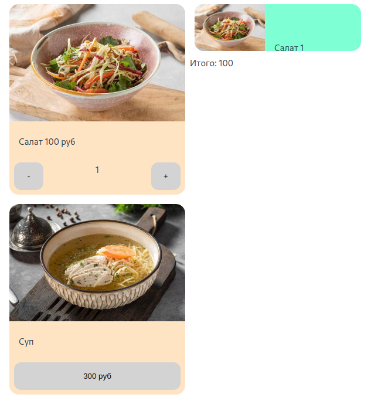

# Тестирование web-приложений (часть 2: тестирование компонентов)

## [Тестирование компонентов​](https://ru.vuejs.org/guide/scaling-up/testing.html#component-testing)

В приложениях Vue компоненты являются основными строительными блоками пользовательского интерфейса. Поэтому компоненты являются естественной единицей изоляции, когда речь идет о проверке поведения приложения. С точки зрения детализации, тестирование компонентов находится где-то выше модульного тестирования и может рассматриваться как форма интеграционного тестирования. Большая часть вашего Vue-приложения должна быть охвачена компонентным тестированием, и мы рекомендуем, чтобы каждый компонент Vue имел свой собственный файл тестов.

Тесты компонентов должны выявлять проблемы, связанные с входными данными компонента, событиями, слотами, которые он предоставляет, стилями, классами, хуками жизненного цикла и т.д.

Тесты компонентов не должны имитировать дочерние компоненты, а должны тестировать взаимодействие между компонентом и его дочерними компонентами, взаимодействуя с ними так, как это делает пользователь. Например, тест компонента должен нажимать на элемент, как это делает пользователь, а не программно взаимодействовать с компонентом.

Тесты компонентов должны быть сосредоточены на публичных интерфейсах компонента, а не на деталях его внутренней реализации. Для большинства компонентов общедоступный интерфейс ограничивается: испускаемыми событиями, входными данными и слотами. При тестировании не забывайте проверять, что делает компонент, а не как он это делает.

Рассмотрим компонент "Карточка блюда" [`./site/src/components/MenuItem.vue`](./site/src/components/MenuItem.vue)

Примерно так выглядит приложение



* "Салат" у нас уже добавлен в корзину и его вёрстка изменена в соответствии с логикой приложения. 
* "Суп" в исходном варианте вёрстки.

В интеграционных тестах для файлов тестов используется суффикс `.spec.js`, т.к. в них тестируется не результат действия, а поведение.

Cоздадим каталог [`./site/src/components/__tests__/`](./site/src/components/__tests__/) и в нём файл [`./site/src/components/__tests__/MenuItem.spec.js`](./site/src/components/__tests__/MenuItem.spec.js)

```js
 
import { describe, it, expect, beforeEach } from 'vitest'
import { mount } from '@vue/test-utils'
import MenuItemVue from '../MenuItem.vue'
import { MenuItem } from '@/helpers/common'
import { createPinia, setActivePinia } from 'pinia'

describe('Компонент MenuItem', () => {
  let wrapper
  
  // перед выполнением каждого теста мы должны создать окружение
  // в нашем случае хранилище и экземпляр компонента
  beforeEach(() => {
    setActivePinia(createPinia())

    // метод mount монтирует компонент с параметрами
    wrapper = mount(MenuItemVue, { 
      props: { item: new MenuItem('test', 100) } 
    })
  })
  
  // в интернетах пишут, что it это просто алиас для test
  it('Элемент меню содержит название блюда', () => {
    // здесь мы получаем текстовое представление компонента (метод text())
    // и ищем в нём название блюда (метод toContain - "содержится")
    // если находит, значит компонент смонтировался нормально
    expect(wrapper.text()).toContain('test')

    // метод text() убирает все теги и показывает только тесктовое содержимое
    // если нужно проанализировать и вёрстку, то можно использовать метод html()
  })

  // при клике на кнопку у нас меняется вёрстка
  // т.е. необходимо дождаться перерисовки
  // элементов
  // для ожидания отрисовки используем async/await
  it('У элемента меню есть кнопка и при клике на неё цена переезжает в описание', async () => {
    // метод find ищет в компоненте элемент или класс (тема css-селекторы)
    // и генерирует на нём событие click
    await wrapper.find('.price-button').trigger('click')

    // в название должна переехать цена
    const title = wrapper.find('.title')
    expect(title.text()).toContain('100')
  })

  // модификатор todo создаёт тест, который планируется реализовать в будущем
  it.todo('Тестирование событий', () => {
    // по идее наш компонент реализован не совсем правильно (всё обрабатывает внутри)
    // правильнее было бы события добавления и удаления блюда выбрасывать наружу компонента
    // методами $emit('add-item', item) и $emit('remove-item', item)

    // все события, генерируемые компонентом, собираются в очередь
    // и мы можем просто проверить длину очереди событий
    // expect(wrapper.emitted('add-item')).toHaveLength(1)
  })

  // модификатор skip помечает тест как пропущенный
  it.skip('Элемент меню генерирует событие click', () => {
    // тут я как раз делал более правильный вариант с пробрасыванием 
    // события наружу...

    wrapper.find('.price-button').trigger('click')

    // все события, генерируемые компонентом, собираются в очередь
    // и мы просто проверяем длину очереди событий
    expect(wrapper.emitted('click')).toHaveLength(1)
  })

  // тест, наверное, должен содержать только одну проверку, но мне было лень расписывать несколько отдельных тестов
  it('При клике на кнопку с ценой должен появиться счётчик и кнопки "-" и "+", при клике на кнопку "+" счётчик должен принять значение "2"', async () => {
    // после клика перестраивается DOM, поэтому заворачиваем в await (т.е. дожидаемся, пока отрисуются все изменения)
    await wrapper.find('.price-button').trigger('click')

    // в компоненте должен появиться счётчик (элемент с классом .qty-value)
    expect(wrapper.find('.qty-value').exists()).toBe(true)

    // кнопка "-"
    expect(wrapper.find('.qty-minus').exists()).toBe(true)

    // и кнопка "+"
    const plusButton = wrapper.find('.qty-plus')
    expect(plusButton.exists()).toBe(true)

    // генерируем клик по кнопке "+" (и тоже ожидаем перестройки DOM)
    await plusButton.trigger('click')

    // после чего в счётчике должно быть ровно "2"
    expect(wrapper.find('.qty-value').text()).toEqual('2')
  })
})
```
