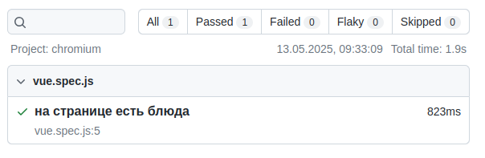

# Тестирование web-приложений (часть 4: функциональное тестирование)

## E2E тестирование​

>Хотя модульные тесты дают разработчикам определенную степень уверенности, модульные и компонентные тесты ограничены в своих возможностях по обеспечению целостного покрытия приложения при его развертывании в production. **E2E-тесты** обеспечивают покрытие, пожалуй, самого важного аспекта приложения: того, что происходит, когда пользователи используют ваши приложения. 

Простыми словами: функциональное тестирование проверяет как себя ведет приложение в браузере при эмуляции действий пользователя.

## Пишем тест

Где списать пока не нашёл, будем писать по [официальной доке](https://playwright.dev/docs/writing-tests)

E2e тесты лежат в каталоге [`./site/e2e/`](./site/e2e/) (т.к. относятся не к какому-то одному компоненту, а ко всему приложению)

Перед запуском тестов нужно настроить используемые браузеры в настройках [`./site/playwright.config.js`](./site/playwright.config.js)

Я отключил в секции **projects** браузеры _firefox_ и _webkit_ (нам для учебных целей хватит и одного)

### Первый тест

```js
import { test, expect } from '@playwright/test'

test('На странице есть блюда', async ({ page }) => {
  await page.goto('/')
  await expect(page.locator('.item')).toHaveCount(3)
})
```

1. callback-функция асинхронная и в параметрах получаем экземпляр страницы браузера
1. `await page.goto('/')` - переходим на главную страницу (у нас она одна, а в многостраничных приложениях урлы могут быть разные)
1. `await expect(page.locator('.item')).toHaveCount(3)`
    - метод `locator` аналог `find` из vitest - ищет на странице элементы (в нашем случае с классом _item_)
    - метод `toHaveCount` проверяет количество найденных элементов

Для запуска теста выполните команду `npm run test:e2e` (если Playwright был установлен при создании приложения. Если добавляете тесты в уже существующее приложение, то сначала установите Playwright, а тесты можно запустить командой `playwright test`)

```
npm run test:e2e

> site@0.0.0 test:e2e
> playwright test

Running 1 test using 1 worker
  1 passed (1.9s)

To open last HTML report run:

  npx playwright show-report
```

В консоли не очень наглядно какие тесты выполнялись, в конце написано, что для формирования HTML-отчета  нужно запустить команду `npx playwright show-report`

При запуске команды запускается http-сервер и появляется приглашение открыть страницу

```
npx playwright show-report

  Serving HTML report at http://localhost:9323. Press Ctrl+C to quit.
```



### Что ещё можно проверить?

Найдем на странице компонент с определённым блюдом и кликнем по кнопке с ценой. Убедимся, что на окне появилась корзина и итог корзины.

```js
test('На странице есть блюдо "Салат" и при клике по нему появляется корзина', async ({ page }) => {
  await page.goto('/')

  const salat = page.getByText('Салат')
  expect(salat).toBeTruthy()

  const salatButton = salat
    .locator('xpath=..')
    .getByRole('button')
  expect(salatButton).toBeTruthy()

  await salatButton.click()
  const cart = page.locator('.cart')
  expect(cart).toBeTruthy()
  expect(cart.getByText('Итого: 100')).toBeTruthy()
})
```

Разберёмся что тут понаписано:

* Первым шагом ищем элемент с текстом "Салат":

    ```js
    const salat = page.getByText('Салат')`
    ```

    И убеждаемся что он существует
    
    ```js
    expect(salat).toBeTruthy()
    ```

* Теперь мы должны кликнуть по кнопке найденного компонента, но в предыдущем шаге мы нашли не весь компонент, а только его название 

    Напомню структуру компонента:

    ```xml
    <div class="item">
        
        <div>Салат</div>
        <button>
    </div>
    ```

    Нам, чтобы найти элемент `button` нужно искать не у элемента **salat**, а у его родителя:

    ```js
    const salatButton = salat
        .locator('xpath=..')
        .getByRole('button')
    ```

    Метод _getByRole_ ищет в родительском элементе кнопку (роль это не тег, а текстовый алиас, со списком ролей можно познакомиться в доке)

* На последнем шаге кликаем по найденной кнопке (дожидаясь перерисовки)

    ```js
    await salatButton.click()
    ```

    И ищем элемент с классом _cart_ и в нём текст с итогом

    ```js
    const cart = page.locator('.cart')
    expect(cart).toBeTruthy()
    expect(cart.getByText('Итого: 100')).toBeTruthy()
    ```

### Обратная связь

По предыдущему тесту видно, что иногда для поиска элемента нужно прилагать усилия (поиск от родителя). Для упрощения поиска можно добавить в компонент аттрибут `data-testid` и искать по нему. Например:

```xml
<div 
    class="item"
    data-testid="Салат"
>
    
    <div>Салат</div>
    <button>
</div>
```

Тут я для простоты вписал просто название блюда, но в реальных проектах лучше использовать id блюда из базы.

И теперь поиск делается легло и просто:

```js
const element = page.getByTestId('Салат')
```
